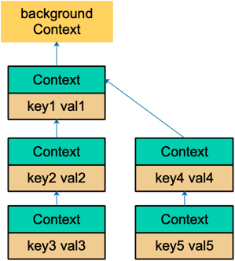

---
context详解
---

# 1 什么是 context?
Go 1.7 标准库引入 context，中文译作“上下文”，准确说它是 goroutine 的上下文，包含 goroutine 的运行状态、环境、现场等信息。
context 主要用来在 goroutine 之间传递上下文信息，包括：取消信号、超时时间、截止时间、k-v 等。
随着 context 包的引入，标准库中很多接口因此加上了 context 参数，例如 database/sql 包。context 几乎成为了并发控制和超时控制的标准做法。
context.Context 类型的值可以协调多个 goroutine 中的代码执行“取消”操作，并且可以存储键值对。最重要的是它是并发安全的。
与它协作的 API 都可以由外部控制执行“取消”操作，例如：取消一个 HTTP 请求的执行。


# 2 为什么有 context?
Go 常用来写后台服务，通常只需要几行代码，就可以搭建一个 http server。
在 Go 的 server 里，通常每来一个请求都会启动若干个 goroutine 同时工作：有些去数据库拿数据，有些调用下游接口获取相关数据……

这些 goroutine 需要共享这个请求的基本数据，例如登陆的token，处理请求的最大超时时间（如果超过此值再返回数据，请求方因为超时接收不到）
等等。当请求被取消或是处理时间太长，这有可能是使用者关闭了浏览器或是已经超过了请求方规定的超时时间，请求方直接放弃了这次请求结果。
这时，所有正在为这个请求工作的 goroutine 需要快速退出，因为它们的“工作成果”不再被需要了。在相关联的 goroutine 都退出后，系统
就可以回收相关的资源。
再多说一点，Go 语言中的 server 实际上是一个“协程模型”，也就是说一个协程处理一个请求。例如在业务的高峰期，某个下游服务的响应变慢，
而当前系统的请求又没有超时控制，或者超时时间设置地过大，那么等待下游服务返回数据的协程就会越来越多。而我们知道，协程是要消耗系统
资源的，后果就是协程数激增，内存占用飙涨，甚至导致服务不可用。更严重的会导致雪崩效应，整个服务对外表现为不可用，这肯定是 P0 级别的事故。
这时，肯定有人要背锅了。
其实前面描述的 P0 级别事故，通过设置“允许下游最长处理时间”就可以避免。例如，给下游设置的 timeout 是 50 ms，如果超过这个值
还没有接收到返回数据，就直接向客户端返回一个默认值或者错误。例如，返回商品的一个默认库存数量。注意，这里设置的超时时间和创建
一个 http client 设置的读写超时时间不一样，这里不详细展开。可以去看看参考资料 【Go在今日头条的实践】一文，有很精彩的论述。
context 包就是为了解决上面所说的这些问题而开发的：在 一组 goroutine 之间传递共享的值、取消信号、deadline……

```golang
package main

import (
	"context"
	"fmt"
	"net/http"
	"sync"
	"time"
)

// 模拟下游服务的处理
func callDownstreamService(ctx context.Context, serviceName string, wg *sync.WaitGroup, resultChan chan<- string) {
	defer wg.Done() // 确保协程退出

	// 为每个下游服务单独设置超时时间
	serviceCtx, cancel := context.WithTimeout(ctx, 50*time.Millisecond)
	defer cancel()

	select {
	case <-time.After(40 * time.Millisecond): // 模拟下游处理时间
		resultChan <- fmt.Sprintf("%s: Success", serviceName)
	case <-serviceCtx.Done(): // 如果超时或被取消
		resultChan <- fmt.Sprintf("%s: Timeout", serviceName)
	}
}

// 处理 HTTP 请求
func handler(w http.ResponseWriter, r *http.Request) {
	var wg sync.WaitGroup
	resultChan := make(chan string, 2) // 存储两个下游服务的结果

	// 为整个请求设置 100ms 的整体超时时间
	ctx, cancel := context.WithTimeout(context.Background(), 100*time.Millisecond)
	defer cancel()

	// 启动多个下游服务调用
	wg.Add(2)
	go callDownstreamService(ctx, "Service A", &wg, resultChan)
	go callDownstreamService(ctx, "Service B", &wg, resultChan)

	// 等待所有协程完成
	go func() {
		wg.Wait()
		close(resultChan)
	}()

	// 收集结果
	results := []string{}
	for res := range resultChan {
		results = append(results, res)
	}

	// 返回响应
	w.WriteHeader(http.StatusOK)
	for _, result := range results {
		fmt.Fprintln(w, result)
	}
}

func main() {
	http.HandleFunc("/", handler)
	fmt.Println("Server is running on :8080")
	http.ListenAndServe(":8080", nil)
}

```

用简练一些的话来说，在Go 里，我们不能直接杀死协程，协程的关闭一般会用 channel+select 方式来控制。但是在某些场景下，例如处理
一个请求衍生了很多协程，这些协程之间是相互关联的：需要共享一些全局变量、有共同的 deadline 等，而且可以同时被关闭。再用
channel+select 就会比较麻烦，这时就可以通过 context 来实现。
一句话：context 用来解决 goroutine 之间退出通知、 元数据传递的功能。

# 3 context 底层实现原理

下面是context包的所有函数、接口、结构体，可以纵览全局。

Context          接口            定义了Context接口的四个方法
emptyCtx         结构体          实现了Context接口，它其实是个空的context
CancelFunc       函数            取消函数
canceler         接口            context取消接口，定义了两个方法
cancelCtx        结构体          可以被取消
timerCtx         结构体          超时会被取消
valueCtx         结构体          可以存储k-v键值对
Background       函数            返回一个空的context，常作为根context
TODO             函数            返回一个空的context，常用于重构时期，没有合适的context可用
WithCancel       函数            基于父context，生成一个可以取消的context
newCancelCtx     函数            创建一个可取消的context
propagateCancel  函数            向下传递context节点间的取消关系
parentCancelCtx  函数            找到第一个可取消的父节点
removeChild      函数            去掉父节点的孩子节点
init             函数            包初始化
WithDeadline     函数            创建一个有deadline的context
WithTimeout      函数            创建一个有timeout的context
WithValue        函数            创建一个存储k-v键值对的context


## 3.1 接口
**Context**

```golang
package context

import "time"

type Context interface {
	// Done 当 context 被取消或者到了 deadline，返回一个被关闭的 channel
	Done() <-chan struct{}

	// Err 在 channel Done 关闭后，返回 context 取消原因
	Err() error

	// Deadline 返回 context 是否会被取消以及自动取消时间（即 deadline）
	Deadline() (deadline time.Time, ok bool)

	// Value 获取 key 对应的 value
	Value(key interface{}) interface{}
}
```

Context 是一个接口，定义了 4 个方法，它们都是 幂等的。也就是说连续多次调用同一个方法，得到的结果都是相同的。
Done() 返回一个 channel，可以表示 context 被取消的信号：当这个 channel 被关闭时，说明 context 被取消了。注意，这是一个
只读的channel。我们又知道，读一个关闭的 channel 会读出相应类型的零值。并且源码里没有地方会向这个 channel 里面塞入值。换句话说，
这是一个 receive-only 的 channel。因此在子协程里读这个 channel，除非被关闭，否则读不出来任何东西。也正是利用了这一点，子协程从
channel 里读出了值（零值）后，就可以做一些收尾工作，尽快退出。
Err() 返回一个错误，表示 channel 被关闭的原因。例如是被取消，还是超时。
Deadline() 返回 context 的截止时间，通过此时间，函数就可以决定是否进行接下来的操作，如果时间太短，就可以不往下做了，否则浪费
系统资源。当然，也可以用这个 deadline 来设置一个 I/O 操作的超时时间。
Value() 获取之前设置的 key 对应的 value。


**canceler**
```golang
type canceler interface {
    cancel(removeFromParent bool, err error)
    Done() <-chan struct{}
}
```

实现了上面定义的两个方法的 Context，就表明该 Context 是可取消的。源码中有两个类型实现了 canceler 接口：
*cancelCtx 和 *timerCtx。注意是加了 * 号的，是这两个结构体的指针实现了 canceler 接口。
Context 接口设计成这个样子的原因：
- “取消”操作应该是建议性，而非强制性
  caller 不应该去关心、干涉 callee 的情况，决定如何以及何时 return 是 callee 的责任。caller 只需发送“取消”信息，
- callee 根据收到的信息来做进一步的决策，因此context接口并没有定义 cancel 方法。
- “取消”操作应该可传递
  “取消”某个函数时，和它相关联的其他函数也应该“取消”。因此， Done() 方法返回一个只读的 channel，所有相关函数监听此
- channel。一旦 channel 关闭，通过 channel 的“广播机制”，所有监听者都能收到。

## 3.2 结构体
**emptyCtx**
源码中定义了 Context 接口后，并且给出了一个实现：

```golang
type emptyCtx int

func (*emptyCtx) Deadline() (deadline time.Time, ok bool) {
    return
}

func (*emptyCtx) Done() <-chan struct{} {
    return nil
}

func (*emptyCtx) Err() error {
    return nil
}

func (*emptyCtx) Value(key interface{}) interface{} {
    return nil
}
```

看这段源码，非常 happy。因为每个函数都实现的异常简单，要么是直接返回，要么是返回 nil。 所以，这实际上是一个空的
context，永远不会被 cancel，没有存储值，也没有 deadline。
它被包装成：

```golang
var (
    background = new(emptyCtx)
    todo       = new(emptyCtx)
)
```

通过下面两个导出的函数（首字母大写）对外公开：

```golang
func Background() Context {
    return background
}

func TODO() Context {
    return todo
}
```

background 通常用在 main 函数中，作为所有 context 的根节点。
todo 通常用在并不知道传递什么 context的情形。例如，调用一个需要传递 context 参数的函数，你手头并没有其他 context
可以传递，这时就可以传递 todo。这常常发生在重构进行中，给一些函数添加了一个 Context 参数，但不知道要传什么，就用
todo “占个位子”，最终要换成其他 context。

**cancelCtx**
再来看一个重要的 context：

```golang
type cancelCtx struct {
    Context

    // 保护之后的字段
    mu       sync.Mutex
    done     chan struct{}
    children map[canceler]struct{}
    err      error
}
```

这是一个可以取消的 Context，实现了 canceler 接口。它直接将接口 Context 作为它的一个匿名字段，这样，它就可以被看成一个 Context。
先来看 Done() 方法的实现：


```golang
func (c *cancelCtx) Done() <-chan struct{} {
    c.mu.Lock()
    if c.done == nil {
        c.done = make(chan struct{})
    }
    d := c.done
    c.mu.Unlock()
    return d
}
```
c.done 是“懒汉式”创建，只有调用了 Done() 方法的时候才会被创建。再次说明，函数返回的是一个只读的 channel，而且没有
地方向这个 channel 里面写数据。所以，直接调用读这个 channel，协程会被 block 住。一般通过搭配 select 来使用。一旦
关闭，就会立即读出零值。

接下来，我们重点关注 cancel() 方法的实现：

```golang
func (c *cancelCtx) cancel(removeFromParent bool, err error) {
    // 必须要传 err
    if err == nil {
        panic("context: internal error: missing cancel error")
    }
    c.mu.Lock()
    if c.err != nil {
        c.mu.Unlock()
        return // 已经被其他协程取消
    }
    // 给 err 字段赋值
    c.err = err
    // 关闭 channel，通知其他协程
    if c.done == nil {
        c.done = closedchan
    } else {
        close(c.done)
    }

    // 遍历它的所有子节点
    for child := range c.children {
        // 递归地取消所有子节点
        child.cancel(false, err)
    }
    // 将子节点置空
    c.children = nil
    c.mu.Unlock()

    if removeFromParent {
        // 从父节点中移除自己
        removeChild(c.Context, c)
    }
}
```

总体来看， cancel() 方法的功能就是关闭 channel：c.done；递归地取消它的所有子节点；从父节点中删除自己。达到的效果
是通过关闭 channel，将取消信号传递给了它的所有子节点。goroutine 接收到取消信号的方式就是 select 语句中的读c.done
被选中。
我们再来看创建一个可取消的 Context 的方法：

```golang
func WithCancel(parent Context) (ctx Context, cancel CancelFunc) {
    c := newCancelCtx(parent)
    propagateCancel(parent, &c)
    return &c, func() { c.cancel(true, Canceled) }
}

func newCancelCtx(parent Context) cancelCtx {
    return cancelCtx{Context: parent}
}
```

这是一个暴露给用户的方法，传入一个父 Context（这通常是一个 background，作为根节点），返回新建的 context，
新 context 的 done channel 是新建的（前文讲过）。
当 WithCancel 函数返回的 CancelFunc 被调用或者是父节点的 done channel 被关闭（父节点的 CancelFunc 被调用），
此 context（子节点） 的 done channel 也会被关闭。
注意传给 WithCancel 方法的参数，前者是 true，也就是说取消的时候，需要将自己从父节点里删除。第二个参数则是一个固定
的取消错误类型：

```golang
var Canceled = errors.New("context canceled")
```

还注意到一点，调用子节点 cancel 方法的时候，传入的第一个参数 removeFromParent 是 false。
两个问题需要回答：1. 什么时候会传 true？2. 为什么有时传 true，有时传 false？
当 removeFromParent 为 true 时，会将当前节点的 context 从父节点 context 中删除：

```golang
func removeChild(parent Context, child canceler) {
    p, ok := parentCancelCtx(parent)
    if !ok {
        return
    }
    p.mu.Lock()
    if p.children != nil {
        delete(p.children, child)
    }
    p.mu.Unlock()
}
```

最关键的一行:
```golang
delete(p.children, child)
```

什么时候会传 true 呢？答案是调用 WithCancel() 方法的时候，也就是新创建一个可取消的 context 节点时，返回的
cancelFunc 函数会传入 true。这样做的结果是：当调用返回的 cancelFunc 时，会将这个 context 从它的父节点里“除名”，
因为父节点可能有很多子节点，你自己取消了，所以我要和你断绝关系，对其他人没影响。
在取消函数内部，我知道，我所有的子节点都会因为我的一：c.children=nil 而化为灰烬。我自然就没有必要再多做这一步，
最后我所有的子节点都会和我断绝关系，没必要一个个做。另外，如果遍历子节点的时候，调用 child.cancel 函数传了 true，
还会造成同时遍历和删除一个 map 的境地，会有问题的。

如上左图，代表一棵 context 树。当调用左图中标红 context 的 cancel 方法后，该 context 从它的父 context 中去除掉了：实线箭头变成了虚线。且虚线圈框出来的 context 都被取消了，圈内的 context 间的父子关系都荡然无存了。
重点看 propagateCancel()：

```golang
func propagateCancel(parent Context, child canceler) {
    // 父节点是个空节点
    if parent.Done() == nil {
        return // parent is never canceled
    }
    // 找到可以取消的父 context
    if p, ok := parentCancelCtx(parent); ok {
        p.mu.Lock()
        if p.err != nil {
            // 父节点已经被取消了，本节点（子节点）也要取消
            child.cancel(false, p.err)
        } else {
            // 父节点未取消
            if p.children == nil {
                p.children = make(map[canceler]struct{})
            }
            // "挂到"父节点上
            p.children[child] = struct{}{}
        }
        p.mu.Unlock()
    } else {
        // 如果没有找到可取消的父 context。新启动一个协程监控父节点或子节点取消信号
        go func() {
            select {
            case <-parent.Done():
                child.cancel(false, parent.Err())
            case <-child.Done():
            }
        }()
    }
}
```

这个方法的作用就是向上寻找可以“挂靠”的“可取消”的 context，并且“挂靠”上去。这样，调用上层 cancel 方法的时候，
就可以层层传递，将那些挂靠的子 context 同时“取消”。
这里着重解释下为什么会有 else 描述的情况发生。else 是指当前节点 context 没有向上找到可以取消的父节点，那么就要再启动
一个协程监控父节点或者子节点的取消动作。
这里就有疑问了，既然没找到可以取消的父节点，那 case<-parent.Done() 这个 case 就永远不会发生，所以可以忽略这个 case；
而 case<-child.Done() 这个 case 又啥事不干。那这个 else 不就多余了吗？
其实不然。我们来看 parentCancelCtx 的代码：

```golang
func parentCancelCtx(parent Context) (*cancelCtx, bool) {
    for {
        switch c := parent.(type) {
        case *cancelCtx:
            return c, true
        case *timerCtx:
            return &c.cancelCtx, true
        case *valueCtx:
            parent = c.Context
        default:
            return nil, false
        }
    }
}
```

这里只会识别三种 Context 类型：cancelCtx，timerCtx，*valueCtx。若是把 Context 内嵌到一个类型里，就识别不出来了。

```golang
type MyContext struct {
    // 这里的 Context 是我 copy 出来的，所以前面不用加 context.
    Context
}

func main() {
    childCancel := true

    parentCtx, parentFunc := WithCancel(Background())
    mctx := MyContext{parentCtx}

    childCtx, childFun := WithCancel(mctx)

    if childCancel {
        childFun()
    } else {
        parentFunc()
    }

    fmt.Println(parentCtx)
    fmt.Println(mctx)
    fmt.Println(childCtx)

    // 防止主协程退出太快，子协程来不及打印
    time.Sleep(10 * time.Second)
}
```

我们看下三个 context 的打印结果：

```shell
context.Background.WithCancel
{context.Background.WithCancel}
{context.Background.WithCancel}.WithCancel
```
果然，mctx，childCtx 和正常的 parentCtx 不一样，因为它是一个自定义的结构体类型。
else 这段代码说明，如果把 ctx 强行塞进一个结构体，并用它作为父节点，调用 WithCancel 函数构建子节点 context 的时候，
Go 会新启动一个协程来监控取消信号，明显有点浪费嘛。

再来说一下，select 语句里的两个 case 其实都不能删。

```golang
select {
    case <-parent.Done():
        child.cancel(false, parent.Err())
    case <-child.Done():
}
```

第一个 case 说明当父节点取消，则取消子节点。如果去掉这个 case，那么父节点取消的信号就不能传递到子节点。
第二个 case 是说如果子节点自己取消了，那就退出这个 select，父节点的取消信号就不用管了。如果去掉这个 case，那么很可能
父节点一直不取消，这个 goroutine 就泄漏了。当然，如果父节点取消了，就会重复让子节点取消，不过，这也没什么影响嘛。

**timerCtx**
timerCtx基于cancelCtx，只是多了一个 time.Timer 和一个 deadline。Timer 会在 deadline 到来时，自动取消context。

```golang
type timerCtx struct {
    cancelCtx
    timer *time.Timer // Under cancelCtx.mu.

    deadline time.Time
}
```
timerCtx 首先是一个 cancelCtx，所以它能取消。看下 cancel() 方法：

```golang
func (c *timerCtx) cancel(removeFromParent bool, err error) {
    // 直接调用 cancelCtx 的取消方法
    c.cancelCtx.cancel(false, err)
    if removeFromParent {
        // 从父节点中删除子节点
        removeChild(c.cancelCtx.Context, c)
    }
    c.mu.Lock()
    if c.timer != nil {
        // 关掉定时器，这样，在deadline 到来时，不会再次取消
        c.timer.Stop()
        c.timer = nil
    }
    c.mu.Unlock()
}
```

创建 timerCtx 的方法：

```golang
func WithTimeout(parent Context, timeout time.Duration) (Context, CancelFunc) {
    return WithDeadline(parent, time.Now().Add(timeout))
}
```

WithTimeout 函数直接调用了 WithDeadline，传入的 deadline 是当前时间加上 timeout 的时间，也就是从现在开始再
经过 timeout 时间就算超时。也就是说， WithDeadline 需要用的是绝对时间。重点来看它：

```golang
func WithDeadline(parent Context, deadline time.Time) (Context, CancelFunc) {
    if cur, ok := parent.Deadline(); ok && cur.Before(deadline) {
        // 如果父节点 context 的 deadline 早于指定时间。直接构建一个可取消的 context。
        // 原因是一旦父节点超时，自动调用 cancel 函数，子节点也会随之取消。
        // 所以不用单独处理子节点的计时器时间到了之后，自动调用 cancel 函数
        return WithCancel(parent)
    }

    // 构建 timerCtx
    c := &timerCtx{
        cancelCtx: newCancelCtx(parent),
        deadline:  deadline,
    }
    // 挂靠到父节点上
    propagateCancel(parent, c)

    // 计算当前距离 deadline 的时间
    d := time.Until(deadline)
    if d <= 0 {
        // 直接取消
        c.cancel(true, DeadlineExceeded) // deadline has already passed
        return c, func() { c.cancel(true, Canceled) }
    }
    c.mu.Lock()
    defer c.mu.Unlock()
    if c.err == nil {
        // d 时间后，timer 会自动调用 cancel 函数。自动取消
        c.timer = time.AfterFunc(d, func() {
            c.cancel(true, DeadlineExceeded)
        })
    }
    return c, func() { c.cancel(true, Canceled) }
}
```

也就是说仍然要把子节点挂靠到父节点，一旦父节点取消了，会把取消信号向下传递到子节点，子节点随之取消。
有一个特殊情况是，如果要创建的这个子节点的 deadline 比父节点要晚，也就是说如果父节点是时间到自动取消，那么一定会取消
这个子节点，导致子节点的 deadline 根本不起作用，因为子节点在 deadline 到来之前就已经被父节点取消了。
这个函数的最核心的一句是：

```golang
c.timer = time.AfterFunc(d, func() {
    c.cancel(true, DeadlineExceeded)
})
```
c.timer 会在 d 时间间隔后，自动调用 cancel 函数，并且传入的错误就是 DeadlineExceeded：

```golang
var DeadlineExceeded error = deadlineExceededError{}

type deadlineExceededError struct{}

func (deadlineExceededError) Error() string   { return "context deadline exceeded" }
```

也就是超时错误。

**valueCtx**

```golang
type valueCtx struct {
    Context
    key, val interface{}
}
```

它实现了两个方法:
```golang
func (c *valueCtx) String() string {
    return fmt.Sprintf("%v.WithValue(%#v, %#v)", c.Context, c.key, c.val)
}

func (c *valueCtx) Value(key interface{}) interface{} {
    if c.key == key {
        return c.val
    }
    return c.Context.Value(key)
}
```
由于它直接将 Context 作为匿名字段，因此尽管它只实现了 2 个方法，其他方法继承自父 context。 但它仍然是一个 Context，这是 Go 语言的一个特点。
创建 valueCtx 的函数：

```golang
func WithValue(parent Context, key, val interface{}) Context {
    if key == nil {
        panic("nil key")
    }
    if !reflect.TypeOf(key).Comparable() {
        panic("key is not comparable")
    }
    return &valueCtx{parent, key, val}
}
```

对 key 的要求是可比较，因为之后需要通过 key 取出 context 中的值，可比较是必须的。
通过层层传递 context，最终形成这样一棵树：




和链表有点像，只是它的方向相反：Context 指向它的父节点，链表则指向下一个节点。通过 WithValue 函数，可以创建层层
的 valueCtx，存储 goroutine 间可以共享的变量。 取值的过程，实际上是一个递归查找的过程：

```golang
func (c *valueCtx) Value(key interface{}) interface{} {
    if c.key == key {
        return c.val
    }
    return c.Context.Value(key)
}
```

```golang

func value(c Context, key any) any {
	for {
		switch ctx := c.(type) {
		case *valueCtx:
			if key == ctx.key {
				return ctx.val
			}
			c = ctx.Context
		case *cancelCtx:
			if key == &cancelCtxKey {
				return c
			}
			c = ctx.Context
		case *timerCtx:
			if key == &cancelCtxKey {
				return &ctx.cancelCtx
			}
			c = ctx.Context
		case *emptyCtx:
			return nil
		default:
			return c.Value(key)
		}
	}
}
```

它会顺着链路一直往上找，比较当前节点的 key 是否是要找的 key，如果是，则直接返回 value。否则，一直顺着 context 往前，
最终找到根节点（一般是 emptyCtx），直接返回一个 nil。所以用 Value 方法的时候要判断结果是否为 nil。
因为查找方向是往上走的，所以，父节点没法获取子节点存储的值，子节点却可以获取父节点的值。
WithValue 创建 context 节点的过程实际上就是创建链表节点的过程。两个节点的 key 值是可以相等的，但它们是两个不同的
context 节点。查找的时候，会向上查找到最后一个挂载的 context 节点，也就是离得比较近的一个父节点 context。所以，
整体上而言，用 WithValue 构造的其实是一个低效率的链表。
如果你接手过项目，肯定经历过这样的窘境：在一个处理过程中，有若干子函数、子协程。各种不同的地方会向 context 里塞入各种不同
的 k-v 对，最后在某个地方使用。
你根本就不知道什么时候什么地方传了什么值？这些值会不会被“覆盖”（底层是两个不同的 context 节点，查找的时候，只会返回一个结果）？你肯定会崩溃的。
而这也是 context.Value 最受争议的地方。很多人建议尽量不要通过 context 传值。

# 4 如何使用 context?
context 使用起来非常方便。源码里对外提供了一个创建根节点 context 的函数：

```golang
func Background() Context
```

background 是一个空的 context， 它不能被取消，没有值，也没有超时时间。 有了根节点 context，又提供了四个函数
创建子节点 context：

```golang
func WithCancel(parent Context) (ctx Context, cancel CancelFunc)
func WithDeadline(parent Context, deadline time.Time) (Context, CancelFunc)
func WithTimeout(parent Context, timeout time.Duration) (Context, CancelFunc)
func WithValue(parent Context, key, val interface{}) Context
```
context 会在函数间传递。只需要在适当的时间调用 cancel 函数向 goroutines 发出取消信号或者调用 Value 函数取出 context 中的值。
在官方博客里，对于使用 context 提出了几点建议：
1. Do not store Contexts inside a struct type; instead, pass a Context explicitly to each function that needs it. The Context should be the first parameter, typically named ctx.
2. Do not pass a nil Context, even if a function permits it. Pass context.TODO if you are unsure about which Context to use.
3. Use context Values only for request-scoped data that transits processes and APIs, not for passing optional parameters to functions.
4. The same Context may be passed to functions running in different goroutines; Contexts are safe for simultaneous use by multiple goroutines.

**我翻译一下：**
1. 不要将 Context 塞到结构体里。直接将 Context 类型作为函数的第一参数，而且一般都命名为 ctx。
2. 不要向函数传入一个 nil 的 context，如果你实在不知道传什么，标准库给你准备好了一个 context：todo。
3. 不要把本应该作为函数参数的类型塞到 context 中，context 存储的应该是一些共同的数据。例如：登陆的 session、cookie 等。
4. 同一个 context 可能会被传递到多个 goroutine，别担心，context 是并发安全的。

# 4.1 传递共享的数据
对于 Web 服务端开发，往往希望将一个请求处理的整个过程串起来，这就非常依赖于 Thread Local（对于 Go 可理解为单个协程
所独有） 的变量，而在 Go 语言中并没有这个概念，因此需要在函数调用的时候传递 context。

```golang
package main

import (
    "context"
    "fmt"
)

func main() {
    ctx := context.Background()
    process(ctx)

    ctx = context.WithValue(ctx, "traceId", "qcrao-2019")
    process(ctx)
}

func process(ctx context.Context) {
    traceId, ok := ctx.Value("traceId").(string)
    if ok {
        fmt.Printf("process over. trace_id=%s\n", traceId)
    } else {
        fmt.Printf("process over. no trace_id\n")
    }
}
```

运行结果：

```shell
process over. no trace_id
process over. trace_id=qcrao-2019
```

第一次调用 process 函数时，ctx 是一个空的 context，自然取不出来 traceId。第二次，通过 WithValue 函数创建了一个
context，并赋上了 traceId 这个 key，自然就能取出来传入的 value 值。

当然，现实场景中可能是从一个 HTTP 请求中获取到的 Request-ID。所以，下面这个样例可能更适合：

```golang
const requestIDKey int = 0

func WithRequestID(next http.Handler) http.Handler {
    return http.HandlerFunc(
        func(rw http.ResponseWriter, req *http.Request) {
            // 从 header 中提取 request-id
            reqID := req.Header.Get("X-Request-ID")
            // 创建 valueCtx。使用自定义的类型，不容易冲突
            ctx := context.WithValue(
                req.Context(), requestIDKey, reqID)

            // 创建新的请求
            req = req.WithContext(ctx)

            // 调用 HTTP 处理函数
            next.ServeHTTP(rw, req)
        }
    )
}

// 获取 request-id
func GetRequestID(ctx context.Context) string {
    return ctx.Value(requestIDKey).(string)
}

func Handle(rw http.ResponseWriter, req *http.Request) {
    // 拿到 reqId，后面可以记录日志等等
    reqID := GetRequestID(req.Context())
    ...
}

func main() {
    handler := WithRequestID(http.HandlerFunc(Handle))
    http.ListenAndServe("/", handler)
}
```

# 4.2 取消 goroutine
我们先来设想一个场景：打开外卖的订单页，地图上显示外卖小哥的位置，而且是每秒更新 1 次。app 端向后台发起 websocket 
连接（现实中可能是轮询）请求后，后台启动一个协程，每隔 1 秒计算 1 次小哥的位置，并发送给 app 端。如果用户退出此页面，则
后台需要“取消”此过程，退出 goroutine，系统回收资源。

后端可能的实现如下：
```golang
func Perform() {
    for {
        calculatePos()
        sendResult()
        time.Sleep(time.Second)
    }
}
```

如果需要实现“取消”功能，并且在不了解 context 功能的前提下，可能会这样做：给函数增加一个指针型的 bool 变量，在 
for 语句的开始处判断 bool 变量是否由 true 变为 false，如果改变，则退出循环。
上面给出的简单做法，可以实现想要的效果，没有问题，但是并不优雅，并且一旦协程数量多了之后，并且各种嵌套，就会很麻烦。
优雅的做法，自然就要用到 context。

```golang
func Perform(ctx context.Context) {
    for {
        calculatePos()
        sendResult()

        select {
        case <-ctx.Done():
            // 被取消，直接返回
            return
        case <-time.After(time.Second):
            // block 1 秒钟
        }
    }
}
```

主流程可能是这样的：

```golang
ctx, cancel := context.WithTimeout(context.Background(), time.Hour)
go Perform(ctx)

// ……
// app 端返回页面，调用cancel 函数
cancel()
```

注意一个细节，WithTimeOut 函数返回的 context 和 cancelFun 是分开的。context 本身并没有取消函数，这样做的原因
是取消函数只能由外层函数调用，防止子节点 context 调用取消函数，从而严格控制信息的流向：由父节点 context 流向子节点 context。


# 4.3 防止 goroutine 泄漏

```golang
func gen() <-chan int {
    ch := make(chan int)
    go func() {
        var n int
        for {
            ch <- n
            n++
            time.Sleep(time.Second)
        }
    }()
    return ch
}
```

这是一个可以生成无限整数的协程，但如果我只需要它产生的前 5 个数，那么就会发生 goroutine 泄漏：

```golang
func main() {
    for n := range gen() {
        fmt.Println(n)
        if n == 5 {
            break
        }
    }
    // ……
}
```

当 n == 5 的时候，直接 break 掉。那么 gen 函数的协程就会执行无限循环，永远不会停下来。发生了 goroutine 泄漏。
用 context 改进这个例子：

```golang
func gen(ctx context.Context) <-chan int {
    ch := make(chan int)
    go func() {
        var n int
        for {
            select {
            case <-ctx.Done():
                return
            case ch <- n:
                n++
                time.Sleep(time.Second)
            }
        }
    }()
    return ch
}

func main() {
    ctx, cancel := context.WithCancel(context.Background())
    defer cancel() // 避免其他地方忘记 cancel，且重复调用不影响

    for n := range gen(ctx) {
        fmt.Println(n)
        if n == 5 {
            cancel()
            break
        }
    }
    // ……
}
```
增加一个 context，在 break 前调用 cancel 函数，取消 goroutine。gen 函数在接收到取消信号后，直接退出，系统回收资源。

# 5 Go 1.20+ 新增 API

Go 1.20 和 1.21 引入了几个重要的 context API，大幅增强了错误追踪和生命周期控制能力。

## 5.1 WithCancelCause 与 Cause（Go 1.20）

标准的 `WithCancel` 取消后，`ctx.Err()` 只能返回 `context.Canceled`，无法区分**为什么**被取消。`WithCancelCause` 允许传入自定义原因：

```go
ctx, cancel := context.WithCancelCause(parentCtx)

// 取消时传入具体原因
cancel(fmt.Errorf("downstream service timeout: %s", serviceName))

// 获取取消原因
err := context.Cause(ctx)
fmt.Println(err) // "downstream service timeout: payment-service"
```

与 `ctx.Err()` 的区别：

```go
ctx, cancel := context.WithCancelCause(context.Background())
cancel(errors.New("custom reason"))

fmt.Println(ctx.Err())          // "context canceled"（固定值）
fmt.Println(context.Cause(ctx)) // "custom reason"（自定义原因）
```

在微服务错误追踪中，`Cause` 可以区分"上游超时"、"本地超时"、"主动取消"、"熔断器触发"等不同原因，比单纯的 `context.Canceled` 有用得多。

`WithDeadlineCause` 和 `WithTimeoutCause` 是对应的超时版本：

```go
ctx, cancel := context.WithTimeoutCause(parentCtx, 5*time.Second,
    fmt.Errorf("payment API did not respond within 5s"))
defer cancel()
```

## 5.2 WithoutCancel（Go 1.21）

`WithoutCancel` 创建一个不随父节点取消的 context，但保留父节点的 Value：

```go
parentCtx, parentCancel := context.WithCancel(context.Background())
parentCtx = context.WithValue(parentCtx, traceIDKey{}, "abc-123")

childCtx := context.WithoutCancel(parentCtx)

parentCancel() // 取消父节点

fmt.Println(parentCtx.Err()) // "context canceled"
fmt.Println(childCtx.Err())  // nil — 子节点不受影响！

// 但 Value 仍然可用
fmt.Println(childCtx.Value(traceIDKey{})) // "abc-123"
```

典型使用场景：

- **异步日志/审计**：请求处理完毕后，仍需要用 request-scoped 的 traceID 写入审计日志，但不希望被请求取消中断
- **后台清理任务**：请求取消后启动的清理 goroutine，需要访问 Value 但不应被取消
- **发送最终响应**：gRPC/HTTP handler 返回后写 metric，不应因客户端断开而取消

```go
func handler(ctx context.Context) {
    // 请求处理...

    // 异步写入审计日志，不受请求取消影响
    auditCtx := context.WithoutCancel(ctx)
    go writeAuditLog(auditCtx, result)
}
```

## 5.3 AfterFunc（Go 1.21）

`AfterFunc` 在 context 被取消（或超时）时执行一个回调函数：

```go
ctx, cancel := context.WithCancel(parentCtx)

stop := context.AfterFunc(ctx, func() {
    // ctx 被取消时在新 goroutine 中执行
    fmt.Println("cleaning up resources...")
    cleanupConnections()
})

// 如果不再需要回调（例如正常完成），可以取消注册
// stop() 返回 true 表示成功取消注册，false 表示回调已执行或正在执行
if stop() {
    fmt.Println("cleanup cancelled, not needed")
}

defer cancel()
```

`AfterFunc` 的回调运行在新的 goroutine 中，且 `stop` 函数是并发安全的。

使用场景：

```go
// 场景1: context 取消时关闭数据库连接
conn := db.Conn()
stop := context.AfterFunc(ctx, func() {
    conn.Close()
})
defer stop()

// 场景2: 合并多个 context 的取消信号
mergedCtx, mergedCancel := context.WithCancel(context.Background())
stop1 := context.AfterFunc(ctx1, func() { mergedCancel() })
stop2 := context.AfterFunc(ctx2, func() { mergedCancel() })
defer stop1()
defer stop2()
// mergedCtx 会在 ctx1 或 ctx2 任一取消时被取消
```

# 6 context.Value 最佳实践

context.Value 是 context 包中最受争议的 API。前面提到过 Value 本质上是一个 O(n) 链表查找，容易被滥用。下面给出结构化的最佳实践。

## 6.1 key 的类型选择

```go
// 错误：string key，跨包容易冲突
ctx = context.WithValue(ctx, "user_id", 42) // 包 A
ctx = context.WithValue(ctx, "user_id", 99) // 包 B 覆盖了 A 的值

// 正确：不可导出的 struct{} 类型，其他包无法构造相同的 key
type userIDKey struct{} // 不可导出，包级别唯一
ctx = context.WithValue(ctx, userIDKey{}, 42)
```

为什么 `struct{}` 比 `int` 或 `string` 更好？

- `struct{}` 类型零大小，不额外分配内存
- 不可导出的类型无法在其他包中构造，彻底避免命名冲突
- 类型断言时提供编译期安全性

## 6.2 用结构体打包 request-scoped 数据

多次 `WithValue` 会创建多层链表，每次查找都要遍历。正确做法是将同一类数据打包到一个结构体中：

```go
// 定义 request-scoped 元数据
type RequestMeta struct {
    TraceID   string
    UserID    int64
    TenantID  string
    RequestID string
    Locale    string
}

type requestMetaKey struct{}

// middleware 中一次性设置
func WithRequestMeta(ctx context.Context, meta *RequestMeta) context.Context {
    return context.WithValue(ctx, requestMetaKey{}, meta)
}

// handler 中一次性获取
func GetRequestMeta(ctx context.Context) *RequestMeta {
    meta, _ := ctx.Value(requestMetaKey{}).(*RequestMeta)
    return meta
}
```

| 方式 | WithValue 次数 | 查找深度 | 内存分配 |
|------|--------------|---------|---------|
| 每个字段一次 WithValue | N | O(N) | N 个 valueCtx |
| 结构体打包一次 WithValue | 1 | O(1) | 1 个 valueCtx + 1 个 struct |

## 6.3 context.Value 适合放什么？

**适合**（request-scoped，跨 API 传递的元数据）：
- Trace ID / Request ID（链路追踪）
- 认证信息（token、user ID、tenant ID）
- 语言/时区偏好（国际化）
- 请求来源标识

**不适合**（应作为函数参数显式传递）：
- 业务逻辑参数（订单 ID、商品数量）
- 数据库连接、HTTP client
- 配置项、feature flags
- 日志级别

判断标准：**如果删掉这个值，程序逻辑是否改变？** 如果不改变（只影响可观测性），那就适合放 context.Value。

> 陷阱演示 → [trap/value-abuse](trap/value-abuse/main.go)

> 性能对比 → [performance/value_lookup_test.go](performance/value_lookup_test.go)

# 7 Deadline Budgeting（deadline 预算传播）

在微服务链路中（A→B→C），每一层需要从剩余 deadline 中"扣除"自身处理开销，传递给下游。这称为 deadline budgeting。

## 7.1 问题

```
Client → Service A (总超时 500ms)
              ├→ Service B (应该分多少超时？)
              │       └→ Service C (?)
              └→ Cache (?)
```

如果 A 把完整的 500ms 传给 B，B 再传给 C，那么 A 自身的后续处理就没有时间了。

## 7.2 正确的传播方式

```go
func (s *ServiceA) Handle(ctx context.Context) (*Result, error) {
    // 获取当前剩余的 deadline
    deadline, ok := ctx.Deadline()
    if !ok {
        // 没有 deadline，设一个默认值
        var cancel context.CancelFunc
        ctx, cancel = context.WithTimeout(ctx, 500*time.Millisecond)
        defer cancel()
        deadline, _ = ctx.Deadline()
    }

    remaining := time.Until(deadline)

    // 留 50ms 给自身的后续处理（聚合结果、日志等）
    selfBudget := 50 * time.Millisecond
    if remaining <= selfBudget {
        return nil, fmt.Errorf("insufficient deadline budget: %v", remaining)
    }

    downstreamBudget := remaining - selfBudget

    // 调用下游时使用扣减后的 deadline
    downstreamCtx, cancel := context.WithTimeout(ctx, downstreamBudget)
    defer cancel()

    result, err := s.callServiceB(downstreamCtx)
    if err != nil {
        return nil, err
    }

    // 后续处理（在预留的 50ms 内完成）
    return s.aggregate(result), nil
}
```

## 7.3 gRPC 的自动传播

gRPC 框架自动将 deadline 通过 metadata 在 client/server 间传播，无需手动处理：

```go
// Client 设置 deadline
ctx, cancel := context.WithTimeout(ctx, 500*time.Millisecond)
defer cancel()
resp, err := client.GetUser(ctx, &pb.GetUserRequest{Id: 42})

// Server 收到的 ctx 自动携带了剩余的 deadline
func (s *server) GetUser(ctx context.Context, req *pb.GetUserRequest) (*pb.User, error) {
    deadline, ok := ctx.Deadline() // ok == true，deadline 由 gRPC 框架自动传播
    remaining := time.Until(deadline)
    // remaining < 500ms（已扣除网络传输时间）
    // ...
}
```

这是 context.Deadline() 方法最核心的使用场景之一——让下游服务感知到上游的时间预算。

# 8 Context 性能分析

## 8.1 创建开销

| 操作 | 典型耗时 | 内存分配 | 说明 |
|------|---------|---------|------|
| `WithValue` | ~50ns | 1 alloc（valueCtx） | 最轻量 |
| `WithCancel` | ~150ns | 2 allocs（cancelCtx + done chan） | 需初始化 cancel 机制 |
| `WithCancelCause` | ~150ns | 2 allocs | 与 WithCancel 接近 |
| `WithTimeout` | ~350ns | 3 allocs | 额外创建 Timer |

## 8.2 Value 查找的 O(n) 问题

`context.Value()` 的查找是沿着 context 链线性搜索的。链越深，查找越慢：

```
深度 1:   ~3-5ns
深度 10:  ~20-40ns
深度 50:  ~100-200ns
深度 100: ~200-400ns
```

**优化策略**：将同一类数据打包成结构体，只做一次 `WithValue`。这样无论有多少个字段，查找始终只需遍历到那一层。

## 8.3 Done() channel 检查开销

```go
select {
case <-ctx.Done():
    // ...
default:
    // ...
}
```

对于 `context.Background()`，`Done()` 返回 nil，select 直接走 default，开销 ~1ns。
对于 `WithCancel` 创建的 context，`Done()` 返回一个真实的 channel，select 需要检查 channel 状态，开销 ~5-10ns。

在性能热点路径中，如果确定不需要取消（如纯计算循环），避免在每次迭代中检查 `ctx.Done()`。

## 8.4 Cancel 传播开销

调用 `cancel()` 时，runtime 需要：
1. 加锁（hchan.lock）
2. 关闭 done channel
3. 遍历 children map，递归 cancel 所有子节点
4. 将子节点 map 置 nil
5. 从父节点中移除自己

开销与子节点数量成正比。1000 个子节点的 cancel 约 100-200μs。

> 基准测试 → [performance/cancel_propagation_test.go](performance/cancel_propagation_test.go)

> Value 查找对比 → [performance/value_lookup_test.go](performance/value_lookup_test.go)

# 9 Context 与标准库集成

## 9.1 database/sql

Go 1.8 开始，`database/sql` 包全面支持 context：

```go
ctx, cancel := context.WithTimeout(ctx, 3*time.Second)
defer cancel()

// 查询
rows, err := db.QueryContext(ctx, "SELECT * FROM users WHERE id = ?", userID)

// 执行
result, err := db.ExecContext(ctx, "UPDATE users SET name = ? WHERE id = ?", name, id)

// 事务
tx, err := db.BeginTx(ctx, nil)
```

当 context 被取消或超时时，数据库驱动会：
1. 取消正在执行的 SQL 查询（发送 cancel 信号到数据库）
2. 关闭底层连接（如果查询无法及时取消）
3. 返回 `context.DeadlineExceeded` 或 `context.Canceled` 错误

**注意**：事务中的 context 取消会导致事务自动回滚。

## 9.2 net/http

HTTP 请求天然绑定了 context：

```go
func handler(w http.ResponseWriter, r *http.Request) {
    ctx := r.Context() // 获取请求绑定的 context

    // 当客户端断开连接时，ctx 会自动取消
    select {
    case <-ctx.Done():
        log.Println("client disconnected:", ctx.Err())
        return
    case result := <-doWork(ctx):
        json.NewEncoder(w).Encode(result)
    }
}
```

HTTP client 也支持 context：

```go
ctx, cancel := context.WithTimeout(ctx, 5*time.Second)
defer cancel()

req, _ := http.NewRequestWithContext(ctx, "GET", url, nil)
resp, err := http.DefaultClient.Do(req)
// 超时后自动取消请求
```

`http.Server` 提供了 `BaseContext` 和 `ConnContext` 钩子：

```go
server := &http.Server{
    // 为所有请求设置基础 context（例如注入全局依赖）
    BaseContext: func(l net.Listener) context.Context {
        return context.WithValue(context.Background(), serverKey{}, "main")
    },
    // 为每个连接设置 context（例如记录客户端 IP）
    ConnContext: func(ctx context.Context, c net.Conn) context.Context {
        return context.WithValue(ctx, clientIPKey{}, c.RemoteAddr().String())
    },
}
```

## 9.3 errgroup（golang.org/x/sync/errgroup）

`errgroup` 将 context 与一组 goroutine 的生命周期绑定。任何一个 goroutine 返回错误时，context 自动取消，其余 goroutine 可以感知到取消信号并提前退出：

```go
import "golang.org/x/sync/errgroup"

g, ctx := errgroup.WithContext(parentCtx)

g.Go(func() error {
    return fetchUserProfile(ctx, userID)   // 任务 1
})
g.Go(func() error {
    return fetchUserOrders(ctx, userID)    // 任务 2
})
g.Go(func() error {
    return fetchRecommendations(ctx, userID) // 任务 3
})

if err := g.Wait(); err != nil {
    // 某个任务失败 → ctx 被取消 → 其他任务收到信号并退出
    log.Printf("failed: %v", err)
}
```

与手动 `sync.WaitGroup` + `context.WithCancel` 相比，`errgroup` 将"错误传播"和"取消传播"统一到一起，代码更简洁、更不容易出错。

# 10 常见 Context 陷阱

## 10.1 忘记调用 cancel()

`WithTimeout` / `WithDeadline` 内部创建了 `time.Timer`。如果不调用 `cancel()`，即使 context 超时，timerCtx 仍会保留在父节点的 `children` map 中，直到 Timer 触发或父节点被取消。

```go
// 错误
func bad(ctx context.Context) {
    ctx, _ = context.WithTimeout(ctx, 5*time.Second)
    // Timer 在 5 秒内一直存在，即使函数已返回
}

// 正确
func good(ctx context.Context) {
    ctx, cancel := context.WithTimeout(ctx, 5*time.Second)
    defer cancel() // 函数退出时立即释放 Timer
}
```

> 陷阱演示 → [trap/forget-cancel](trap/forget-cancel/main.go)

## 10.2 在结构体中存储 context

Go 官方明确建议：**不要将 Context 存储在结构体中**。

```go
// 错误
type Service struct {
    ctx context.Context // 生命周期不可控
}

// 正确
type Service struct { /* 不含 ctx */ }
func (s *Service) Do(ctx context.Context) error { ... }
```

原因：
1. context 是 per-request 的，结构体可能被长期持有或跨请求复用
2. 存入结构体后，无法保证 context 在使用时仍然有效
3. 违背了"context 应该沿着调用链传递"的设计意图

唯一的例外是 `http.Request` 等本身就绑定到单个请求生命周期的类型。

> 陷阱演示 → [trap/context-in-struct](trap/context-in-struct/main.go)

## 10.3 context.Value 滥用

```go
// 错误：用 context 传递业务参数
ctx = context.WithValue(ctx, "order_id", orderID)
processOrder(ctx) // 从 ctx 中取 order_id 是隐式依赖

// 正确：业务参数显式传递
processOrder(ctx, orderID) // 依赖关系清晰
```

context.Value 的另一个问题是**类型不安全**——编译器无法检查 key-value 的类型对应关系，运行时类型断言失败会导致 panic。

> 陷阱演示 → [trap/value-abuse](trap/value-abuse/main.go)

## 10.4 context 树无限增长

在循环中反复创建子 context 而不取消，会导致 context 树不断膨胀：

```go
// 错误：每次迭代创建新 context，旧的不释放
for {
    ctx, _ := context.WithTimeout(parentCtx, time.Second)
    doWork(ctx)
    // cancel 未调用，timerCtx 累积
}

// 正确：每次迭代创建并释放
for {
    ctx, cancel := context.WithTimeout(parentCtx, time.Second)
    doWork(ctx)
    cancel() // 立即释放
}
```