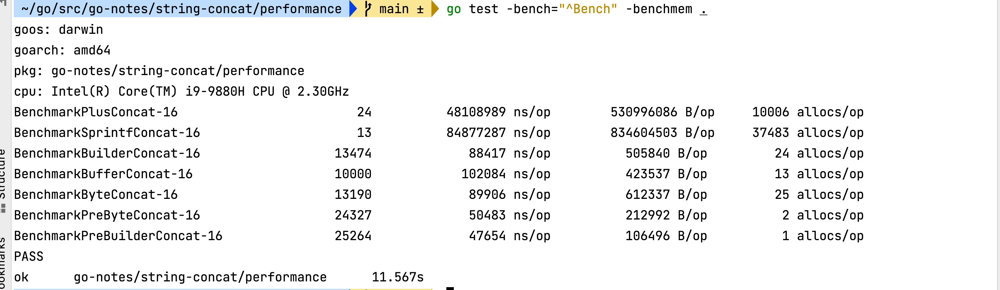

# 详解 Go 语言中的 String

## 1 string 的内部表示

Go 语言中的 `string` 本质上是一个只读的字节切片描述符，其运行时数据结构定义在 `runtime/string.go` 中：

```go
type stringStruct struct {
    str unsafe.Pointer // 指向底层字节数组的指针
    len int            // 字节长度
}
```

与之对比，`[]byte` 切片的结构为：

```go
type slice struct {
    array unsafe.Pointer // 指向底层数组的指针
    len   int            // 当前长度
    cap   int            // 容量
}
```

**关键区别**：`string` 没有 `cap` 字段，因为它是不可变的，不需要追踪剩余容量。

### 赋值语义

```go
s1 := "hello"
s2 := s1 // 仅拷贝 {指针, 长度}，不拷贝底层字节数据
```

`string` 赋值是一个 16 字节的值拷贝（64位系统上：8字节指针 + 8字节长度），代价极低。这也是 Go 中 `string` 可以安全地作为函数参数传递而无需使用指针的原因。

## 2 不可变性

### 设计初衷

Go 将 `string` 设计为不可变类型（immutable），有以下核心考量：

1. **并发安全**：多个 goroutine 可以安全地共享同一个 string，无需加锁
2. **map key 安全**：string 的哈希值在生命周期内不会变化，可安全用作 map key
3. **编译器优化**：不可变性使得编译器可以做出更多优化假设

### 与 []byte 的本质区别

| 特性 | string | []byte |
|------|--------|--------|
| 可变性 | 不可变 | 可变 |
| 是否有 cap | 无 | 有 |
| 赋值语义 | 拷贝描述符 | 拷贝描述符（共享底层） |
| 并发安全 | 天然安全 | 需要同步 |
| 可作为 map key | 是 | 否 |

### 强制修改的后果

通过 `unsafe.Pointer` 可以强制修改 string 的底层数据，但后果严重：

- 字符串字面量存储在只读数据段（`.rodata`），修改会触发 **段错误（SIGSEGV）**
- 即使修改堆上的 string，也破坏了不变性语义，可能导致 **map key 查找失败、并发数据不一致**

> 陷阱演示 → [trap/unsafe-modify](trap/unsafe-modify/main.go)

## 3 UTF-8 编码与 rune

### Go string 是 UTF-8 编码的字节序列

Go 的创始人之一 Rob Pike 同时也是 UTF-8 编码的发明者，Go 从设计之初就原生支持 UTF-8：

- `string` 存储的是 **UTF-8 编码的字节序列**，而非 Unicode 码点数组
- `byte`（`uint8`）表示单个字节
- `rune`（`int32`）表示单个 Unicode 码点

### len() vs utf8.RuneCountInString()

```go
s := "Hello, 世界"
len(s)                        // 13（字节数：7个ASCII + 2个汉字×3字节）
utf8.RuneCountInString(s)     // 9（字符数）
```

`len()` 是 O(1) 操作，直接读取 `stringStruct.len` 字段；`utf8.RuneCountInString()` 需要遍历整个字符串解码 UTF-8 序列，是 O(n) 操作。

### for range vs for i 遍历

```go
s := "Go语言"

// for i: 按字节遍历
for i := 0; i < len(s); i++ {
    fmt.Printf("byte[%d] = 0x%02x\n", i, s[i])
}
// 输出 8 个字节

// for range: 按 rune 遍历
for i, r := range s {
    fmt.Printf("rune at byte %d: %c (U+%04X)\n", i, r, r)
}
// 输出 4 个 rune: G, o, 语, 言
```

### 字符串反转的正确与错误方式

```go
// 错误：按字节反转，多字节 UTF-8 字符会被拆散成乱码
func reverseWrong(s string) string {
    b := []byte(s)
    for i, j := 0, len(b)-1; i < j; i, j = i+1, j-1 {
        b[i], b[j] = b[j], b[i]
    }
    return string(b)
}

// 正确：转换为 []rune 再反转
func reverseCorrect(s string) string {
    runes := []rune(s)
    for i, j := 0, len(runes)-1; i < j; i, j = i+1, j-1 {
        runes[i], runes[j] = runes[j], runes[i]
    }
    return string(runes)
}
```

> 性能 benchmark → [performance/utf8_operation_test.go](performance/utf8_operation_test.go)
>
> 常见陷阱 → [trap/utf8-len](trap/utf8-len/main.go)

## 4 字符串拼接性能对比

在 Go 语言中，常见的字符串拼接方式有以下几种：

| 方式 | 适用场景 | 性能 |
|------|---------|------|
| `+` | 少量、已知数量的拼接 | 差（大量拼接时） |
| `fmt.Sprintf` | 格式化输出 | 最差 |
| `strings.Builder` | 通用拼接（推荐） | 优 |
| `bytes.Buffer` | 需要与 io.Writer 交互 | 良 |
| `[]byte` append | 低级操作 | 良 |
| 预分配 `[]byte` | 已知最终长度 | 最优 |
| 预分配 `Builder` (Grow) | 已知最终长度 | 最优 |

### + 拼接的代价

字符串在 Go 语言中是不可变类型，占用内存大小是固定的，当使用 `+` 拼接 2 个字符串时，生成一个新的字符串，那么就需要开辟一段新的空间，新空间的大小是原来两个字符串的大小之和。拼接第三个字符串时，再开辟一段新空间，新空间大小是三个字符串大小之和，以此类推。假设一个字符串大小为 10 byte，拼接 1w 次，需要申请的内存大小为：

```
10 + 2×10 + 3×10 + ... + 10000×10 byte = 500 MB
```

### strings.Builder 的 Cap 增长策略

`strings.Builder`、`bytes.Buffer` 以及 `[]byte` 的内存是以倍数申请的。例如，初始大小为 0，当第一次写入大小为 10 byte 的字符串时，则会申请大小为 16 byte 的内存（恰好大于 10 byte 的 2 的指数），第二次写入 10 byte 时，内存不够，则申请 32 byte 的内存，第三次写入内存足够，则不申请新的，以此类推。

在实际过程中，超过一定大小，比如 1024 byte 后，申请策略上会有些许调整。我们可以通过打印 `builder.Cap()` 查看 `strings.Builder` 的内存申请过程：

```go
func TestBuilderConcat(t *testing.T) {
    var str = randomString(10)
    var builder strings.Builder
    cap := 0
    for i := 0; i < 10000; i++ {
        if builder.Cap() != cap {
            fmt.Print(builder.Cap(), " ")
            cap = builder.Cap()
        }
        builder.WriteString(str)
    }
}
```

运行结果：

```
16 32 64 128 256 512 1024 1280 1792 2304 3072 4096 5376 6784 9472 12288 16384 20480 27264 40960 57344 73728 98304 122880
```


1024 以前按倍数申请，1024 之后开始使用非严格倍增的策略。总共申请的内存约 0.52 MB，约为 `+` 拼接方式的千分之一。

### Grow 预分配优化

如果事先知道最终字符串的大小，可以使用 `Grow` 预分配内存，避免多次扩容：

```go
var builder strings.Builder
builder.Grow(n * len(str))
for i := 0; i < n; i++ {
    builder.WriteString(str)
}
```

使用 `Grow` 后，与预分配 `[]byte` 相比，因为省去了 `[]byte` 到 `string` 的转换，内存分配次数还减少了 1 次，内存消耗减半。

**综合易用性和性能，一般推荐使用 `strings.Builder` 来拼接字符串。**

> Go 官方对 Builder 的描述：A Builder is used to efficiently build a string using Write methods. It minimizes memory copying.

> 基准测试结果 → [performance/string_concat_contrast_test.go](performance/string_concat_contrast_test.go)
>
> 

## 5 strings.Builder vs bytes.Buffer 深度对比

`strings.Builder` 和 `bytes.Buffer` 底层都是 `[]byte` 数组，但 `strings.Builder` 性能比 `bytes.Buffer` 略快约 10%。

核心区别在于 `String()` 方法的实现：

```go
// bytes.Buffer — 需要拷贝：string() 会复制底层数据
func (b *Buffer) String() string {
    if b == nil {
        return "<nil>"
    }
    return string(b.buf[b.off:])
}

// strings.Builder — 零拷贝：直接将 []byte 转为 string
func (b *Builder) String() string {
    return unsafe.String(unsafe.SliceData(b.buf), len(b.buf))
}
```

`bytes.Buffer` 的注释中还特意提到了：

> To build strings more efficiently, see the strings.Builder type.

### 标准库中的 Builder 使用

Go 标准库中很多函数都使用 `strings.Builder` 实现，例如 `strings.Join` 和 `strings.Replace`：

```go
func Join(elems []string, sep string) string {
    n := len(sep) * (len(elems) - 1)
    for i := 0; i < len(elems); i++ {
        n += len(elems[i])
    }
    var b Builder
    b.Grow(n) // 预分配精确大小
    b.WriteString(elems[0])
    for _, s := range elems[1:] {
        b.WriteString(sep)
        b.WriteString(s)
    }
    return b.String()
}
```

注意 `Join` 的实现先计算精确大小再 `Grow`，确保只进行一次内存分配。

## 6 unsafe.Pointer 零拷贝转换

### string ↔ []byte 的零拷贝实现

由于 `stringStruct` 和 `slice` 的前两个字段（指针 + 长度）内存布局一致，可以通过 `unsafe.Pointer` 实现零拷贝转换：

```go
// []byte → string（零拷贝）
func BytesToString(b []byte) string {
    return *(*string)(unsafe.Pointer(&b))
}

// string → []byte（零拷贝，危险！）
func StringToBytes(s string) []byte {
    return *(*[]byte)(unsafe.Pointer(&struct {
        string
        int
    }{s, len(s)}))
}
```

### Go 1.20+ 更安全的替代

Go 1.20 引入了更规范的 API：

```go
// []byte → string
func BytesToString(b []byte) string {
    return unsafe.String(unsafe.SliceData(b), len(b))
}

// string → []byte（仍然危险，需保证不修改返回的切片）
func StringToBytes(s string) []byte {
    return unsafe.Slice(unsafe.StringData(s), len(s))
}
```

### 风险

零拷贝转换后的 `[]byte` **绝对不能被修改**，否则会破坏 string 的不变性：

- 如果原 string 是字面量，修改会触发段错误
- 如果原 string 被用作 map key，修改后哈希不匹配，数据丢失
- 在并发场景下，其他 goroutine 会看到不一致的数据

> 陷阱演示 → [trap/unsafe-modify](trap/unsafe-modify/main.go)

## 7 编译器优化

Go 编译器（gc）对 `string` 和 `[]byte` 之间的转换做了多项优化，在特定场景下不会产生内存分配。

### 常量拼接在编译期完成

```go
const s = "hello" + ", " + "world" // 编译期直接合并为 "hello, world"
```

### map 查找优化

```go
m := map[string]int{"hello": 1}
key := []byte("hello")
v := m[string(key)] // 编译器优化：不分配临时 string
```

编译器识别 `m[string(b)]` 模式，直接使用 `[]byte` 进行 map 查找，避免创建临时 string。

### 字符串比较优化

```go
b := []byte("hello")
if string(b) == "hello" { // 编译器优化：不分配临时 string
    // ...
}
```

### 验证方法

通过 `go test -benchmem` 观察 `allocs/op` 是否为 0：

```bash
go test -run='^$' -bench 'MapLookup|Compare' -benchmem .
```

通过逃逸分析确认：

```bash
go test -gcflags="-m" -run '^$' -bench 'MapLookup' . 2>&1 | grep "does not escape"
```

> 基准测试 → [performance/compiler_optimize_test.go](performance/compiler_optimize_test.go)

## 8 strings.Clone 与内存保留问题

### 子字符串共享底层数组

Go 中子字符串 `s[a:b]` 与原字符串共享底层字节数组，仅创建一个新的 `stringStruct` 描述符：

```go
big := strings.Repeat("x", 1<<20)  // 1 MB
sub := big[:10]                     // sub 与 big 共享底层 1MB 数据
big = ""                            // big 置空，但 1MB 数据仍被 sub 引用
runtime.GC()                        // GC 无法回收这 1MB 数据！
```

这在处理大文本（如读取文件、网络响应）时是一个常见的内存泄漏源。

### strings.Clone（Go 1.20+）

`strings.Clone` 创建字符串的独立副本，允许 GC 回收原始大字符串：

```go
sub := strings.Clone(big[:10])  // 独立拷贝 10 字节
big = ""
runtime.GC()  // 1MB 数据可以被正常回收
```

`strings.Clone` 的实现非常简洁：

```go
func Clone(s string) string {
    if len(s) == 0 {
        return ""
    }
    b := make([]byte, len(s))
    copy(b, s)
    return unsafe.String(&b[0], len(b))
}
```

### 何时使用 Clone

- 从大字符串中提取小子串并长期持有
- 处理网络/文件 I/O 返回的大缓冲区
- 解析大型 JSON/XML/CSV 后只保留部分字段

> 基准测试 → [performance/clone_memory_test.go](performance/clone_memory_test.go)
>
> 陷阱演示 → [trap/substring-memory](trap/substring-memory/main.go)

## 9 逃逸分析与 string 分配

Go 编译器通过逃逸分析（escape analysis）决定变量分配在栈上还是堆上。对于 string 相关操作，以下场景常导致逃逸到堆：

### 常见逃逸场景

```go
// 1. 返回局部 string（string 描述符拷贝，底层数据可能逃逸）
func createString() string {
    b := make([]byte, 10)   // b 逃逸到堆
    return string(b)         // 转换产生新的堆分配
}

// 2. 接口转换
func toString(v interface{}) string {
    return v.(string)        // v 的底层数据逃逸
}

// 3. 闭包捕获
func capture() func() string {
    s := "hello"
    return func() string {
        return s             // s 被闭包捕获，逃逸到堆
    }
}

// 4. fmt.Sprintf 的参数
func format(name string) string {
    return fmt.Sprintf("hello, %s", name)  // name 通过 interface{} 传递，逃逸
}
```

### 查看逃逸分析结果

```bash
go build -gcflags="-m" ./...
```

输出示例：

```
./example.go:3:15: make([]byte, 10) escapes to heap
./example.go:4:9: string(b) escapes to heap
```

### 减少逃逸的技巧

- 使用 `strconv.AppendInt` 等 Append 系列函数，在已有 `[]byte` 上操作
- 避免不必要的 `interface{}` 转换
- 对于性能热点路径，考虑使用 `[]byte` 代替 `string`

## 10 strings.Builder 的 copyCheck 与并发安全

### copyCheck 机制

`strings.Builder` 内部有一个防拷贝检测机制：

```go
type Builder struct {
    addr *Builder  // 指向自身，用于检测拷贝
    buf  []byte
}

func (b *Builder) copyCheck() {
    if b.addr == nil {
        b.addr = (*Builder)(noescape(unsafe.Pointer(b)))
    } else if b.addr != b {
        panic("strings: illegal use of non-zero Builder copied by value")
    }
}
```

**工作原理**：
1. 第一次写入时，`addr` 被设为自身地址
2. 值拷贝后，新 Builder 有新地址，但 `addr` 仍指向原始 Builder
3. 新 Builder 写入时检测到 `addr != &self`，触发 panic

### 为什么要禁止拷贝？

```go
var b1 strings.Builder
b1.WriteString("hello")

b2 := b1                    // 值拷贝：b2.buf 和 b1.buf 共享底层数组
b2.WriteString(" world")    // panic!

// 如果不 panic，b2 的写入可能破坏 b1 的数据
// 因为两者共享同一个底层 []byte
```

### 并发安全

`strings.Builder` **没有内置锁**，不是并发安全的。多个 goroutine 同时操作同一个 Builder 会导致数据竞争。如需并发使用，必须自行加锁：

```go
type SafeBuilder struct {
    mu sync.Mutex
    b  strings.Builder
}

func (sb *SafeBuilder) WriteString(s string) {
    sb.mu.Lock()
    defer sb.mu.Unlock()
    sb.b.WriteString(s)
}
```

> 陷阱演示 → [trap/builder-copy](trap/builder-copy/main.go)

## 11 String interning

### 概念

String interning（字符串驻留）是一种优化技术：对于内容相同的字符串，只在内存中保留一份副本，所有引用都指向同一个底层数据。

### Go 编译器对字面量的处理

Go 编译器会自动对字符串字面量进行 interning：

```go
s1 := "hello"
s2 := "hello"
// s1 和 s2 的底层指针指向同一地址（编译器优化）
```

但运行时动态生成的字符串不会自动 intern：

```go
s1 := "hello"
s2 := string([]byte("hello"))
// s1 和 s2 内容相同，但底层数据是独立的两份
```

### 手动实现 interning

对于大量重复的动态字符串（如解析 CSV/JSON 的字段值），可以使用 `sync.Map` 实现 interning pool：

```go
type StringInterner struct {
    pool sync.Map
}

func (si *StringInterner) Intern(s string) string {
    if v, ok := si.pool.Load(s); ok {
        return v.(string)
    }
    si.pool.Store(s, s)
    return s
}
```

### 适用场景

- 解析大量 CSV/JSON 数据中的重复字段值（如状态码、类别名称）
- HTTP header 名称的标准化
- 日志系统中的重复消息模板

> 基准测试 → [performance/interning_test.go](performance/interning_test.go)

## 12 int 转 string 性能对比

将 `int` 转换为 `string` 常见两种方式：

```go
s1 := fmt.Sprint(42)       // 通用但慢
s2 := strconv.Itoa(42)     // 专用且快
```

基准测试结果表明：

- **CPU 消耗**：`fmt.Sprint` 单次调用约 769 μs，`strconv.Itoa` 约 259 μs，节约 **66.7%** CPU
- **内存消耗**：`fmt.Sprint` 单次约 321 KB，`strconv.Itoa` 约 203 KB，节约 **37.5%** 内存

`fmt.Sprint` 性能差的原因在于它需要处理反射、格式化状态机等通用逻辑，而 `strconv.Itoa` 是专门为整数转换优化的。

> 基准测试 → [performance/int_convert_str_test.go](performance/int_convert_str_test.go)
>
> 
