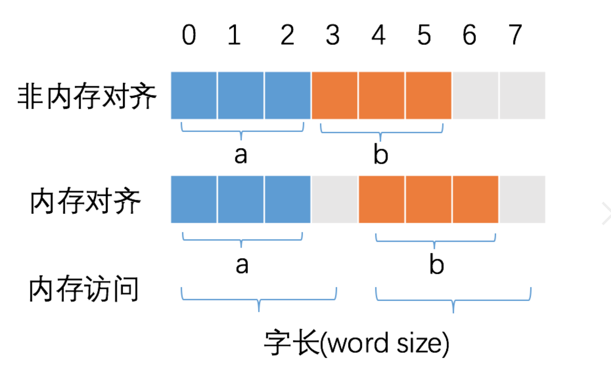
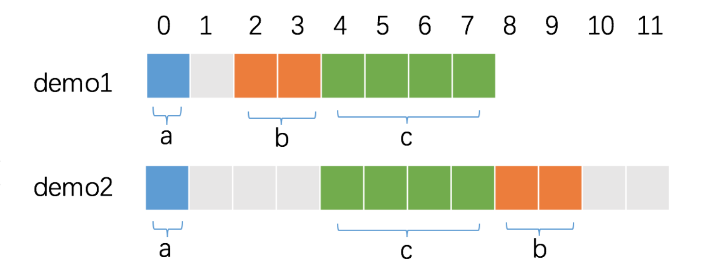

---
详解 Go 语言中的 struct
---

struct 是 Go 语言中最核心的数据组织方式，几乎所有复杂数据都通过 struct 来表达。Go 没有类（class）的概念，struct + 方法 + 接口 构成了 Go 的面向对象体系。


# 1 struct 的内部表示

## 1.1 内存布局

struct 的字段在内存中按声明顺序连续排列（可能存在 padding）：

```go
type User struct {
    Age  int32   // 偏移 0，占 4 字节
    Name string  // 偏移 8（对齐到 8），占 16 字节（指针+长度）
}
// 总大小: 24 字节（4 + 4 padding + 16）
```

可以用 `unsafe` 包的三个函数完整分析 struct 布局：

```go
import "unsafe"

var u User
unsafe.Sizeof(u)          // 整个 struct 的大小
unsafe.Alignof(u)         // 整个 struct 的对齐倍数
unsafe.Offsetof(u.Name)   // Name 字段相对于 struct 起始地址的偏移量
```

## 1.2 值类型语义

struct 是**值类型**。赋值、传参、返回值都会完整拷贝所有字段：

```go
a := User{Age: 25, Name: "Alice"}
b := a       // 完整拷贝，b 和 a 是独立的
b.Age = 30   // 不影响 a
```

这意味着：
- 函数内修改参数不影响调用者（除非传指针）
- 小 struct 可以安全地在 goroutine 间传递（天然并发安全）
- 大 struct 频繁传递时应使用指针避免拷贝开销

> 性能基准 → [performance/value-vs-pointer](performance/value-vs-pointer/value_vs_pointer_test.go)


# 2 零值可用

Go 的设计哲学之一是 **"make the zero value useful"**（让零值有意义）。声明一个 struct 变量而不初始化时，所有字段取各自类型的零值：

```go
var mu sync.Mutex    // 零值即可用，无需 init
var buf bytes.Buffer // 零值即可用，直接 Write
var wg sync.WaitGroup // 零值即可用，直接 Add/Wait
```

设计自己的 struct 时，应尽量保证零值可用：

```go
// 好的设计：零值表示"无限制"
type RateLimiter struct {
    MaxRPS int // 0 表示不限速
}

func (r *RateLimiter) Allow() bool {
    if r.MaxRPS == 0 {
        return true // 零值 = 不限速
    }
    // 限速逻辑...
    return true
}

// 不好的设计：零值无法使用，必须调用构造函数
type BadLimiter struct {
    maxRPS    int
    initialized bool
}
```

标准库中的经典零值可用案例：
- `sync.Mutex`：零值就是未锁定状态
- `bytes.Buffer`：零值就是空缓冲区
- `sync.Once`：零值就是未执行状态
- `sync.WaitGroup`：零值就是计数为 0


# 3 struct 嵌入（组合）

Go 没有继承，使用 组合（composition）代替。通过嵌入其他 struct，外层 struct 可以直接使用被嵌入 struct 的字段和方法。

## 3.1 基本嵌入

```go
type Animal struct {
    Name string
}

func (a Animal) Speak() string {
    return a.Name + " makes a sound"
}

type Dog struct {
    Animal  // 嵌入，不是字段名
    Breed string
}

d := Dog{Animal: Animal{Name: "Rex"}, Breed: "Husky"}
d.Name           // 直接访问，等价于 d.Animal.Name
d.Speak()        // 方法提升，等价于 d.Animal.Speak()
```

## 3.2 方法提升规则

嵌入的字段和方法被"提升"到外层 struct：
- 可以不写嵌入类型名直接访问
- 嵌入类型的方法会被提升，外层 struct 自动满足嵌入类型实现的接口

```go
type Writer interface {
    Write([]byte) (int, error)
}

type MyBuffer struct {
    bytes.Buffer // 嵌入 bytes.Buffer
}

// MyBuffer 自动满足 Writer 接口，无需显式实现
var w Writer = &MyBuffer{}
```

## 3.3 遮蔽（Shadowing）

当外层 struct 定义了与嵌入 struct 同名的字段或方法时，外层的定义**遮蔽**内层：

```go
type Base struct{ Name string }
func (b Base) Hello() string { return "Base: " + b.Name }

type Derived struct {
    Base
    Name string // 遮蔽 Base.Name
}

d := Derived{Base: Base{Name: "base"}, Name: "derived"}
d.Name       // "derived"（外层）
d.Base.Name  // "base"（通过显式路径访问被遮蔽的字段）
d.Hello()    // "Base: base"（注意！Hello 的 receiver 仍然是 Base）
```

**关键**：嵌入方法的 receiver 仍然是被嵌入的类型。`d.Hello()` 看到的 `Name` 是 `Base.Name`，不是 `Derived.Name`。

> 陷阱演示 → [trap/embed-shadow](trap/embed-shadow/main.go)

## 3.4 嵌入指针类型

嵌入指针类型允许多个 struct 共享同一个被嵌入对象，但指针为 nil 时调用方法会 panic：

```go
type Outer struct {
    *Inner  // 指针嵌入
}

o := Outer{} // Inner 为 nil
o.GetValue() // panic: nil pointer dereference
```

> 陷阱演示 → [trap/nil-embed-panic](trap/nil-embed-panic/main.go)


# 4 struct tag

struct tag 是附加在字段声明后的字符串元数据，通过反射在运行时读取。

## 4.1 常见 tag

```go
type User struct {
    ID        int    `json:"id" db:"user_id"`
    Name      string `json:"name" validate:"required,min=2"`
    Email     string `json:"email,omitempty" validate:"required,email"`
    Password  string `json:"-"` // json 序列化时忽略
    CreatedAt time.Time `json:"created_at" db:"created_at"`
}
```


| Tag键           | 用途   | 库    | 
|----------------|------|------|
| `json`         | JSON 序列化/反序列化   | `encoding/json`   | 
| `xml`          | XML 序列化 | `encoding/xml`   | 
| `db`           | 数据库列映射 | `sqlx` / `gorm` |
| `yaml`         | YAML 序列化 | `gopkg.in/yaml.v3` |
| `validate`     | 字段校验规则 | `go-playground/validator` |
| `mapstructure` | map 到 struct 映射 | `mapstructure` |


## 4.2 反射读取 tag

```go
t := reflect.TypeOf(User{})
field, _ := t.FieldByName("Email")
jsonTag := field.Tag.Get("json")     // "email,omitempty"
dbTag := field.Tag.Get("db")         // ""（未设置则返回空）
```

## 4.3 tag 格式规范

tag 的格式为 `key:"value"` 的空格分隔列表，**必须使用反引号包裹**：

```go
// 正确
type Good struct {
    Name string `json:"name" validate:"required"`
}

// 错误：key 和 value 之间不能有空格
type Bad struct {
    Name string `json: "name"` // go vet 会报错
}
```

`go vet` 会自动检查 tag 格式是否正确。


# 5 struct 比较语义

## 5.1 可比较 vs 不可比较

struct 是否可以用 `==` 比较，取决于所有字段是否可比较：

| 可比较类型 | 不可比较类型 |
|-----------|------------|
| int, float, string, bool | slice |
| 指针, channel | map |
| 数组（元素可比较） | func |
| struct（字段全部可比较） | struct（含不可比较字段） |

```go
// 可比较
type Point struct{ X, Y int }
Point{1, 2} == Point{1, 2} // true

// 不可比较
type Config struct{ Tags []string }
// Config{} == Config{} // 编译错误: invalid operation
```

## 5.2 运行时 panic

不可比较的 struct 如果通过 `interface{}` 进行比较，编译器不会报错，但运行时会 panic：

```go
var a, b any = Config{Tags: []string{"go"}}, Config{Tags: []string{"go"}}
_ = a == b // panic: runtime error: comparing uncomparable type Config
```

> 陷阱演示 → [trap/uncomparable](trap/uncomparable/main.go)

## 5.3 正确的比较方式

```go
// 方式1：reflect.DeepEqual（通用但较慢）
reflect.DeepEqual(a, b)

// 方式2：自定义 Equal 方法（推荐）
func (c Config) Equal(other Config) bool {
    return slices.Equal(c.Tags, other.Tags)
}
```

## 5.4 故意使 struct 不可比较

在 struct 中嵌入零大小的不可比较类型，可以禁止比较：

```go
type DoNotCompare struct {
    _    [0]func() // 零大小，不占内存，但使 struct 不可比较
    Name string
}
```

这在需要保护 struct 内部状态不被意外比较时有用（如标准库中的 `noCopy` 模式）。


# 6 指针接收者 vs 值接收者

## 6.1 选择原则

```go
// 值接收者：不修改 struct，且 struct 较小
func (p Point) Distance(other Point) float64 { ... }

// 指针接收者：需要修改 struct，或 struct 较大
func (u *User) UpdateName(name string) { u.Name = name }
```

选择指南：
1. **需要修改 struct 状态** → 必须用指针接收者
2. **struct 包含 sync.Mutex 等不可复制的字段** → 必须用指针接收者
3. **struct 很大（>64 字节）** → 建议用指针接收者（避免拷贝）
4. **struct 很小且只读** → 值接收者更合适（栈分配友好）
5. **同一类型的方法应保持一致** → 如果有一个是指针接收者，其他也用指针接收者

## 6.2 接口满足的差异

```go
type Stringer interface {
    String() string
}

type MyType struct{ Name string }
func (m *MyType) String() string { return m.Name }

var s Stringer
s = &MyType{"hello"} // 正确
// s = MyType{"hello"} // 编译错误：MyType 没有实现 Stringer，*MyType 才有
```

**规则**：
- `*T` 的方法集 = T 的值接收者方法 + T 的指针接收者方法
- `T` 的方法集 = 仅 T 的值接收者方法

因此，如果接口中有任何方法使用指针接收者定义，只有 `*T` 能满足该接口。


# 7 内存对齐

## 7.1 为什么需要内存对齐？

CPU 访问内存时以**字长（word size）**为单位，而非逐字节访问。64 位 CPU 的字长为 8 字节。

如果变量的地址不是其对齐倍数的整数倍，CPU 可能需要两次内存访问才能读取完整数据。内存对齐通过插入 padding 确保每个变量的地址是其对齐倍数的整数倍。



合理的内存对齐有两个好处：
1. **提高性能**：减少 CPU 访问内存的次数
2. **保证原子性**：对齐后的变量可以在单次内存访问中读写，便于实现原子操作

## 7.2 Go 的对齐规则

Go 官方文档 `Size and alignment guarantees` 定义了 `unsafe.Alignof` 的规则：

1. 对于任意类型的变量 x，`unsafe.Alignof(x)` 至少为 1
2. 对于 struct 类型，`unsafe.Alignof(x)` 等于所有字段的对齐倍数中的**最大值**
3. 对于 array 类型，`unsafe.Alignof(x)` 等于元素类型的对齐倍数

常见类型的对齐倍数（64 位平台）：

| 类型 | 大小 | 对齐倍数 |
|------|------|---------|
| bool | 1 | 1 |
| int8/uint8 | 1 | 1 |
| int16/uint16 | 2 | 2 |
| int32/uint32/float32 | 4 | 4 |
| int64/uint64/float64 | 8 | 8 |
| string | 16 | 8 |
| slice | 24 | 8 |
| pointer | 8 | 8 |

## 7.3 字段排列顺序影响内存占用

```go
type demo1 struct {
    a int8   // 偏移 0，占 1 字节
    b int16  // 偏移 2（对齐到 2），占 2 字节
    c int32  // 偏移 4（对齐到 4），占 4 字节
}
// 总大小: 8 字节

type demo2 struct {
    a int8   // 偏移 0，占 1 字节
    c int32  // 偏移 4（对齐到 4，浪费 3 字节），占 4 字节
    b int16  // 偏移 8（对齐到 2），占 2 字节
}
// 总大小: 12 字节（末尾还有 2 字节 padding，对齐到 4 的倍数）
```



**同样的字段类型，不同的排列顺序，内存占用从 8 字节变成 12 字节，多出 50%！**

优化技巧：**按对齐倍数从大到小排列字段**（或从小到大也可以，关键是避免交错），减少 padding 浪费。

> 性能基准 → [performance/mem-align](performance/mem-align/align_test.go)

## 7.4 空结构体的对齐特例

空 `struct{}` 大小为 0，通常不需要对齐。但当 `struct{}` 作为 struct 的**最后一个字段**时，会额外 padding：

```go
type demo3 struct {
    c int32
    a struct{} // 最后一个字段，需要 padding
}
// unsafe.Sizeof(demo3{}) = 8（多出 4 字节 padding）

type demo4 struct {
    a struct{} // 不是最后一个字段，不需要 padding
    c int32
}
// unsafe.Sizeof(demo4{}) = 4
```

原因：如果有指针指向最后一个零大小字段，返回的地址将在 struct 之外。如果该指针一直存活，会阻止 struct 内存被 GC 回收，导致内存泄漏。

## 7.5 fieldalignment 工具

Go 提供了 `fieldalignment` 工具，可以自动检测并建议最优字段排列：

```bash
# 安装
go install golang.org/x/tools/go/analysis/passes/fieldalignment/cmd/fieldalignment@latest

# 检查
fieldalignment ./...

# 自动修复
fieldalignment -fix ./...
```


# 8 空结构体的妙用

空结构体 `struct{}` 大小为 0，不占据任何内存空间：

```go
fmt.Println(unsafe.Sizeof(struct{}{})) // 0
```

## 8.1 实现 Set

Go 标准库没有 Set 类型，常用 `map[T]struct{}` 代替：

```go
type Set[T comparable] map[T]struct{}

func (s Set[T]) Add(v T)      { s[v] = struct{}{} }
func (s Set[T]) Has(v T) bool { _, ok := s[v]; return ok }
func (s Set[T]) Delete(v T)   { delete(s, v) }
```

相比 `map[T]bool`，value 从 1 字节降到 0 字节。当元素很多时内存节省可观，且语义更清晰——"只关心 key 存在性，value 无意义"。

> 性能基准 → [performance/set](performance/set/set_test.go)

## 8.2 信号通道

不需要传递数据、只传递信号的 channel，用 `chan struct{}`：

```go
done := make(chan struct{})
go func() {
    // 执行任务...
    close(done) // 发送完成信号
}()
<-done
```

## 8.3 仅包含方法的类型

```go
type Validator struct{}

func (Validator) ValidateEmail(email string) bool { ... }
func (Validator) ValidatePhone(phone string) bool { ... }
```

用 `struct{}` 而非 `int` 或 `bool` 作为底层类型，不浪费任何内存，且语义上表明"这个类型不持有状态"。

## 8.4 信号量

利用带缓冲的 `chan struct{}` 实现信号量，限制并发度：

```go
sem := make(chan struct{}, 10) // 最多 10 个并发
for _, task := range tasks {
    sem <- struct{}{} // 获取令牌
    go func(t Task) {
        defer func() { <-sem }() // 释放令牌
        process(t)
    }(task)
}
```


# 9 Cache Line 与 False Sharing

## 9.1 CPU 缓存架构

现代 CPU 在核心与主存之间有多级缓存（L1/L2/L3）。缓存以 **cache line**（通常 64 字节）为最小单位读写。当一个核心修改了某个 cache line 中的数据，其他核心中缓存该 cache line 的副本必须被**失效（invalidation）**。

## 9.2 False Sharing

当两个 goroutine 在不同核心上频繁修改**同一 cache line 中的不同变量**时，即使逻辑上没有数据竞争，硬件也必须不断使对方的缓存失效。这就是 **false sharing（伪共享）**：

```go
// 两个计数器紧挨着，很可能在同一 cache line
type NoPadCounter struct {
    A atomic.Int64 // 8 字节
    B atomic.Int64 // 8 字节，与 A 在同一 64 字节 cache line
}
```

goroutine 1 修改 A → 核心 2 的缓存失效 → goroutine 2 修改 B → 核心 1 的缓存失效 → 如此反复，性能严重下降。

## 9.3 Padding 解决方案

在两个高频修改的字段之间插入 padding，使它们各占独立的 cache line：

```go
type PaddedCounter struct {
    A atomic.Int64
    _ [56]byte     // padding: 确保 A 和 B 不在同一 cache line
    B atomic.Int64
}
```

> 性能基准 → [performance/false-sharing](performance/false-sharing/false_sharing_test.go)

## 9.4 何时需要关注 False Sharing

- 多个 goroutine 频繁修改同一 struct 中不同的原子变量
- 共享的计数器、统计信息等热点数据
- 高性能中间件（如连接池、调度器）中的并发数据结构

标准库中的实际案例：`runtime.p`（P 结构体）中使用 padding 隔离不同核心访问的字段。


# 10 逃逸分析与 struct

## 10.1 栈 vs 堆

Go 编译器通过**逃逸分析（escape analysis）**决定变量分配在栈上还是堆上：
- **栈**：分配/回收极快（仅移动栈指针），无 GC 压力
- **堆**：需要 GC 管理，分配和回收开销更大

## 10.2 常见导致逃逸的场景

```go
// 场景1：返回局部变量的指针
func NewUser() *User {
    u := User{Name: "Alice"} // u 逃逸到堆
    return &u
}

// 场景2：赋值给接口
func Log(v any) { fmt.Println(v) }
func main() {
    u := User{Name: "Alice"}
    Log(u) // u 逃逸（接口转换需要堆分配）
}

// 场景3：闭包捕获
func Counter() func() int {
    count := 0 // count 逃逸
    return func() int {
        count++
        return count
    }
}

// 场景4：发送到 channel
func Send(ch chan User) {
    u := User{Name: "Alice"} // u 逃逸
    ch <- u
}
```

## 10.3 查看逃逸分析结果

```bash
go build -gcflags="-m" ./...

# 输出示例:
# ./main.go:10:2: moved to heap: u
# ./main.go:15:6: u escapes to heap
```

`-m -m` 可以看到更详细的逃逸分析过程。

## 10.4 减少逃逸的技巧

1. **返回值而非指针**：小 struct 返回值，让编译器在调用方栈上分配
2. **避免不必要的接口转换**：直接用具体类型而非 `any`
3. **预分配缓冲区**：在栈上分配固定大小的数组，避免 `make` 逃逸
4. **sync.Pool**：复用堆上的对象，减少 GC 压力


# 11 noCopy 模式

## 11.1 问题

某些 struct 包含不能复制的内部状态（如 `sync.Mutex`、`sync.WaitGroup`），复制后两个副本使用各自独立的锁/计数器，导致并发错误。

## 11.2 go vet 的 noCopy 检查

Go 使用一个约定：在 struct 中嵌入 `noCopy` 类型，`go vet` 会检查该 struct 是否被意外复制：

```go
// 标准库的 noCopy（sync 包内部使用）
type noCopy struct{}
func (*noCopy) Lock()   {}
func (*noCopy) Unlock() {}

// 使用 noCopy
type MyStruct struct {
    noCopy noCopy
    mu     sync.Mutex
    data   map[string]int
}
```

`go vet` 会检测到通过值传递 `MyStruct` 的代码并报错。

## 11.3 标准库中的 noCopy

以下标准库类型都使用了 noCopy 或类似机制：
- `sync.Mutex` / `sync.RWMutex`
- `sync.WaitGroup`
- `sync.Cond`
- `sync.Pool`
- `strings.Builder`（copyCheck 机制）
- `bytes.Buffer`（虽然可以复制，但复制后共享底层数组）

> 相关陷阱 → [../lock/trap/no-copy-of-mutex](../lock/trap/no-copy-of-mutex/main.go)


# 12 struct 工具链

## 12.1 fieldalignment

自动优化 struct 字段排列顺序：

```bash
go install golang.org/x/tools/go/analysis/passes/fieldalignment/cmd/fieldalignment@latest

# 检查哪些 struct 可以优化
fieldalignment ./...

# 自动重排字段
fieldalignment -fix ./...
```

## 12.2 go vet

内置的静态分析工具，检查 struct 相关问题：

```bash
go vet ./...
```

检查项包括：
- struct tag 格式是否正确
- noCopy 类型是否被意外复制
- `atomic.Value` 的使用是否正确

## 12.3 unsafe 三件套

```go
import "unsafe"

type Example struct {
    a int8
    b int64
    c int16
}

var e Example
fmt.Println(unsafe.Sizeof(e))       // 整个 struct 大小: 24
fmt.Println(unsafe.Alignof(e))      // struct 对齐倍数: 8
fmt.Println(unsafe.Offsetof(e.b))   // b 字段偏移: 8
fmt.Println(unsafe.Offsetof(e.c))   // c 字段偏移: 16
```

三个函数配合使用，可以完整还原 struct 的内存布局，理解每个字节是数据还是 padding。

## 12.4 逃逸分析标志

```bash
# 查看逃逸分析
go build -gcflags="-m" ./...

# 更详细的逃逸原因
go build -gcflags="-m -m" ./...
```
