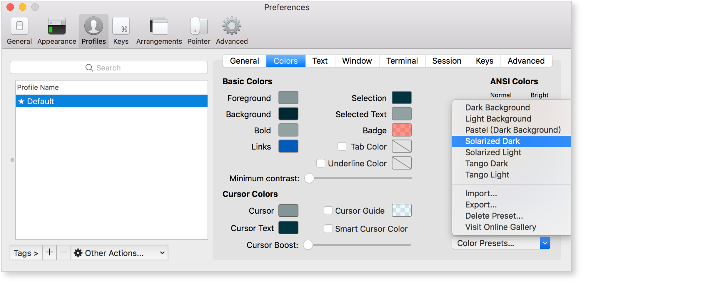
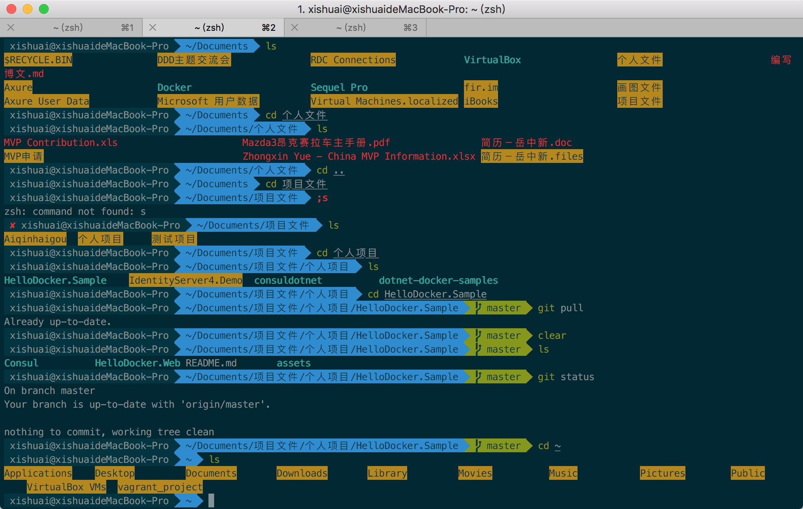
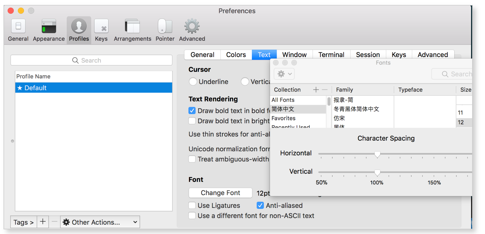
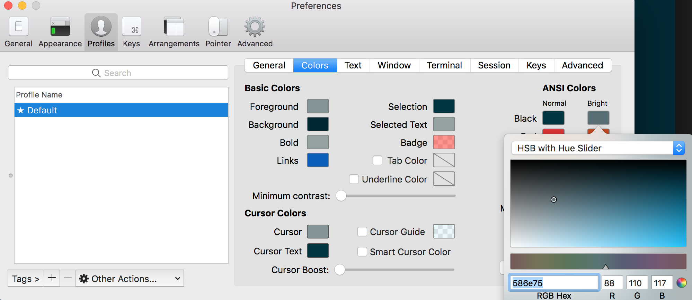
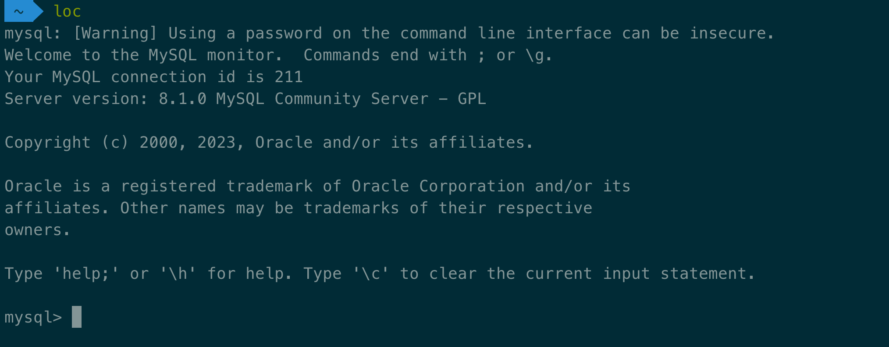

# 配置好终端，提高编码效率

**配置终端的收益来自减少重复输入、缩短验证等待、降低任务切换成本。先解决自己每天遇到的阻力，再按需加工具。**

> **适用范围**：面向熟悉基本命令行的 macOS / Go 开发者，以 **zsh 5.9 + Homebrew + iTerm2** 为例。Apple Silicon 的 Homebrew 通常在 `/opt/homebrew`，Intel 通常在 `/usr/local`；以 `brew --prefix` 为准。先确认 `command -v brew git zsh` 均能找到命令；Go 示例还需项目要求的工具链和依赖。各节的软件按需安装，安装可能需要网络和系统授权。
>
> **核实范围**：关键参数与行为已对照官方文档；不将安装流程、GUI 操作和全部组合命令统称为“实测通过”。文中的 `~/work/my-service`、`./cmd/server` 等是示例路径，需要换成自己的项目路径；标明“本仓库”的示例从 `go-notes` 根目录执行。旧教程中的硬编码路径需按本机环境调整。
>
> **配套阅读**：[如何提高搜索效率（谷歌搜索篇）](../search-efficiency/谷歌搜索.md) · [如何提高搜索效率（AI 搜索篇）](../search-efficiency/AI搜索.md)

---

## 先看这个：按收益排序

如果你时间有限，可以按这个顺序试用；优先级是经验建议，取决于你的工作习惯：

| 优先级 | 做什么 | 花费时间 | 为什么 |
|---|---|---|---|
| **先读** | [配置片段怎么写才永久生效](#0-配置片段怎么写才永久生效) | 1 分钟 | `~/.zshrc` 里哪些东西的位置不能随便放，以及改坏了怎么救回来 |
| **P0** | [记熟十来个行编辑快捷键](#3-不装任何东西就能提速) | 0 分钟安装，一周形成肌肉记忆 | **不用装任何东西**，纯赚 |
| **P0** | [装 fzf](#41-fzf如果只装一个就装它) | 5 分钟 | 单个工具里收益最大，`Ctrl+R` 从此改头换面 |
| **P1** | [语法高亮 + 自动建议](#15-语法高亮与自动建议填充) | 5 分钟 | 提前发现拼写错误，复用历史输入 |
| **P1** | [alias 与 shell 函数](#2-alias把长命令变短) | 30 分钟 | 收益取决于你重复敲什么 |
| **P1** | [缩短测试反馈](#67-先跑最小测试再扩大验证范围) / [减少任务切换](#102-用-worktree-保留任务现场) | 15 分钟试用 | 少等结果，少重建工作现场 |
| **P2** | [zoxide / ripgrep / bat / eza](#4-现代-cli-工具替换掉那些老命令) | 15 分钟 | 日常操作的常数级提速 |
| **P2** | [Go 工具链配置](#6-go-开发专属提效) | 30 分钟 | 测试/调试/热重载 |
| **P3** | [tmux](#5-tmux会话不再因为断线而丢失) | 1 小时学习 | 只在需要远程/长任务时才值 |
| **P3** | [iTerm2 高级功能](#8-iterm2-被埋没的能力) | 随用随查 | 锦上添花 |

**一个常见的误区是把时间全花在 P3 上**——把提示符调得五彩斑斓，却不知道 `Ctrl+A` 能跳到行首。P0 那两行才是真正天天在省时间的东西。

---

## 目录

- [先看这个：按收益排序](#先看这个按收益排序)
- [0 配置片段怎么写才永久生效](#0-配置片段怎么写才永久生效)
  - [0.1 顺序有讲究](#01-顺序有讲究)
  - [0.2 改坏了怎么办](#02-改坏了怎么办)
- [1 基础环境：iTerm2 + Oh My Zsh](#1-基础环境iterm2--oh-my-zsh)
  - [1.1 安装 iTerm2](#11-安装-iterm2)
  - [1.2 配色主题](#12-配色主题)
  - [1.3 安装 Oh My Zsh](#13-安装-oh-my-zsh)
  - [1.4 字体：Nerd Font](#14-字体nerd-font)
  - [1.5 语法高亮与自动建议填充](#15-语法高亮与自动建议填充)
  - [1.6 让 option + 左右键生效](#16-让-option--左右键生效)
  - [1.7 隐藏用户名和主机名](#17-隐藏用户名和主机名)
  - [1.8 提示符的性能问题](#18-提示符的性能问题)
- [2 alias：把长命令变短](#2-alias把长命令变短)
  - [2.1 别名该放在哪里](#21-别名该放在哪里)
  - [2.2 三个必须避开的坑](#22-三个必须避开的坑)
  - [2.3 比 alias 更强的：shell 函数](#23-比-alias-更强的shell-函数)
  - [2.4 常用别名参考](#24-常用别名参考)
- [3 不装任何东西就能提速](#3-不装任何东西就能提速)
  - [3.1 行编辑快捷键](#31-行编辑快捷键)
  - [3.2 历史扩展](#32-历史扩展)
  - [3.3 Ctrl+Z 与 fg](#33-ctrlz-与-fg)
  - [3.4 目录跳转](#34-目录跳转)
  - [3.5 花括号展开](#35-花括号展开)
  - [3.6 长命令交给编辑器](#36-长命令交给编辑器)
- [4 现代 CLI 工具：替换掉那些老命令](#4-现代-cli-工具替换掉那些老命令)
  - [4.1 fzf：如果只装一个，就装它](#41-fzf如果只装一个就装它)
  - [4.2 现成方案：三个成熟插件](#42-现成方案三个成熟插件)
  - [4.3 zoxide：让 cd 有记忆](#43-zoxide让-cd-有记忆)
  - [4.4 ripgrep 与 fd：搜索](#44-ripgrep-与-fd搜索)
  - [4.5 查看类工具](#45-查看类工具)
  - [4.6 其他常用工具](#46-其他常用工具)
  - [4.7 一次装完](#47-一次装完)
- [5 tmux：会话不再因为断线而丢失](#5-tmux会话不再因为断线而丢失)
  - [5.1 它解决什么问题](#51-它解决什么问题)
  - [5.2 最小可用](#52-最小可用)
  - [5.3 iTerm2 原生集成](#53-iterm2-原生集成)
- [6 Go 开发专属提效](#6-go-开发专属提效)
  - [6.1 测试与基准](#61-测试与基准)
  - [6.2 热重载](#62-热重载)
  - [6.3 调试：dlv](#63-调试dlv)
  - [6.4 静态检查](#64-静态检查)
  - [6.5 GOFLAGS 与 direnv](#65-goflags-与-direnv)
  - [6.6 一组 Go 别名与函数](#66-一组-go-别名与函数)
  - [6.7 先跑最小测试，再扩大验证范围](#67-先跑最小测试再扩大验证范围)
- [7 Git 命令行提效](#7-git-命令行提效)
  - [7.1 shell 层的 git 别名](#71-shell-层的-git-别名)
  - [7.2 fzf + git](#72-fzf--git)
  - [7.3 gh：在终端里操作 GitHub](#73-gh在终端里操作-github)
  - [7.4 lazygit：终端里的 git 图形界面](#74-lazygit终端里的-git-图形界面)
- [8 iTerm2 被埋没的能力](#8-iterm2-被埋没的能力)
  - [8.1 分屏与窗口](#81-分屏与窗口)
  - [8.2 Hotkey Window](#82-hotkey-window)
  - [8.3 Shell Integration](#83-shell-integration)
  - [8.4 Triggers：让终端自己盯着输出](#84-triggers让终端自己盯着输出)
- [9 可直接抄的 .zshrc 片段](#9-可直接抄的-zshrc-片段)
- [10 把工具串成工作流](#10-把工具串成工作流)
  - [10.1 重复操作沉淀成项目入口](#101-重复操作沉淀成项目入口)
  - [10.2 用 worktree 保留任务现场](#102-用-worktree-保留任务现场)
  - [10.3 用 Brewfile 和 dotfiles 复用环境](#103-用-brewfile-和-dotfiles-复用环境)
  - [10.4 让输出直接进入下一步](#104-让输出直接进入下一步)
  - [10.5 给 AI 明确上下文与验收条件](#105-给-ai-明确上下文与验收条件)
  - [10.6 每周只优化一个高频阻力](#106-每周只优化一个高频阻力)
- [11 速查表](#11-速查表)
- [12 小结](#12-小结)
- [13 动手练习](#13-动手练习)

---

## 0 配置片段怎么写才永久生效

**约定：本文代码块第一行写着 `# ~/.zshrc` 的，都要写进文件，不是在终端直接敲。** 写完 `source ~/.zshrc` 让当前窗口生效，新窗口启动时自动读取。

### 0.1 顺序有讲究

`~/.zshrc` 从上往下执行，这几样的位置不能随便放：

| 内容 | 位置要求 |
|---|---|
| `ZSH_THEME=` / `plugins=()` | 必须在 `source $ZSH/oh-my-zsh.sh` **之前**——它们是给 oh-my-zsh 读的参数 |
| `eval "$(xxx init zsh)"` 这类工具接入 | 必须在 oh-my-zsh **之后**，一般放文件末尾 |
| `source <(fzf --zsh)` | 同上。放前面的话，绑好的 `Ctrl+R` 会被 oh-my-zsh 覆盖回去 |
| `zsh-syntax-highlighting` | 必须是 `plugins=()` 数组里的**最后一个** |

已有的 `plugins`、主题和工具初始化在原位置改，不要把整份示例重复追加到文件末尾。

### 0.2 改坏了怎么办

语法写错会导致新终端启动报错甚至开不出来。两个保险：

```bash
cp ~/.zshrc ~/.zshrc.bak   # 改之前备份
zsh -n ~/.zshrc            # 改完检查语法，无输出即通过
```

真开不出终端了，在终端 Profile 的启动命令里指定 `/bin/zsh -f` 跳过用户配置，再 `cp ~/.zshrc.bak ~/.zshrc` 恢复。语法检查只保证没有语法错误，依赖缺失仍会在执行时报错。

## 1 基础环境：iTerm2 + Oh My Zsh

macOS 自带的 Terminal.app 够用但不好用，iTerm2 是 Mac 上事实标准的替代品。配上 Oh My Zsh，基础体验就有了。

### 1.1 安装 iTerm2

```zsh
brew install --cask iterm2
```

> **⚠️ 老教程里的 `brew cask install iterm2` 已经不能用了。** `brew cask` 这个子命令在 Homebrew 2.6（2020 年底）中被移除，统一改成了 `brew install --cask`。你如果照着老文章敲，会得到一个 `Error: Unknown command: cask`。

也可以从 [iterm2.com/downloads.html](https://iterm2.com/downloads.html) 下载压缩包，解压后拖进 `Applications` 目录。

**顺带一提**：iTerm2 不是唯一选择，也可以了解 [Ghostty](https://ghostty.org/)、WezTerm、Alacritty。是否切换应根据快捷键、远程工作流和本机体验决定；本文沿用 iTerm2，便于复用已有配置和截图。

### 1.2 配色主题

经典配色是 Solarized Dark，下载地址：[ethanschoonover.com/solarized](https://ethanschoonover.com/solarized)

解压后打开 iTerm2 → `Preferences`（`Command + ,`）→ `Profiles` → `Colors` → `Color Presets` → `Import`，选择 `solarized/iterm2-colors-solarized/Solarized Dark.itermcolors`，导入后在下拉框里选中即可。



其他流行配色可以去 [iterm2colorschemes.com](https://iterm2colorschemes.com/) 挑，有几百套预览图，同样是导入 `.itermcolors` 文件。

> **护眼提示**：配色的对比度比"好不好看"重要得多。选完之后盯着代码看十分钟，如果注释和背景需要眯眼才能分清，就换一套——这个每天要看八小时。

### 1.3 安装 Oh My Zsh

[Oh My Zsh](https://github.com/ohmyzsh/ohmyzsh) 是 zsh 的配置框架，提供主题和插件体系。

```zsh
sh -c "$(curl -fsSL https://raw.githubusercontent.com/ohmyzsh/ohmyzsh/master/tools/install.sh)"
```

> **⚠️ 老教程里的安装地址已经过时**：仓库从 `robbyrussell/oh-my-zsh` 迁移到了 `ohmyzsh/ohmyzsh`，域名也应该用 `raw.githubusercontent.com`（`raw.github.com` 只是个重定向）。

> **⚠️ `chsh -s /bin/zsh` 这一步现在通常不需要了。** 从 macOS Catalina（10.15，2019 年）起，**zsh 已经是系统默认 shell**。执行前先确认：
> ```zsh
> echo $SHELL          # 输出 /bin/zsh 就说明不用改
> ```
> 只有当你之前手动切到过 bash 或 fish，才需要切回来。

装完后编辑 `~/.zshrc`，设置主题：

```zsh
ZSH_THEME="agnoster"
```

`agnoster` 是最常用的主题之一。完整主题列表见 [ohmyzsh Themes wiki](https://github.com/ohmyzsh/ohmyzsh/wiki/themes)。效果如下（已配置语法高亮）：



> 主题的选择会影响启动速度，`agnoster` 在 git 仓库很大时会明显卡顿——原因和解法见 [1.8](#18-提示符的性能问题)。

### 1.4 字体：Nerd Font

`agnoster` 这类主题用到了特殊字形（分段箭头、git 分支图标），普通字体会显示成乱码方块，必须装带这些字形的字体。

过去的做法是手动下载 Powerline 字体文件双击安装，**现在有更省事的方式**——Nerd Fonts 已经进了 Homebrew 主仓库：

```zsh
brew install --cask font-meslo-lg-nerd-font
```

装完打开 iTerm2 → `Preferences` → `Profiles` → `Text` → `Font`，选择 **MesloLGM Nerd Font**（或 `MesloLGS Nerd Font`）。



字号可以从 14–15pt 试起。喜欢连字时再开启 `Use ligatures`，并选择支持代码连字的字体，例如 Fira Code；Nerd Font 补充图标字形，并不意味着每种字体都支持连字。

> **其他 Nerd Font 选择**：`font-jetbrains-mono-nerd-font`（JetBrains 出品，字符区分度极高，`0/O`、`1/l/I` 一眼可辨）、`font-fira-code-nerd-font`（连字最丰富）、`font-hack-nerd-font`。都是 `brew install --cask font-xxx-nerd-font` 的形式。

### 1.5 语法高亮与自动建议填充

这两个插件是 Oh My Zsh 体验的分水岭，强烈建议都装。

- **zsh-syntax-highlighting**：命令合法时显示绿色，拼错或不存在时显示红色——**在你按回车之前就知道敲错了**
- **zsh-autosuggestions**：根据历史记录，用灰字实时预测你要敲的完整命令，按 `→` 一键补全

**推荐做法：统一用 Oh My Zsh 的插件机制安装**，避免路径问题。

```zsh
git clone https://github.com/zsh-users/zsh-autosuggestions      ${ZSH_CUSTOM:-~/.oh-my-zsh/custom}/plugins/zsh-autosuggestions
git clone https://github.com/zsh-users/zsh-syntax-highlighting  ${ZSH_CUSTOM:-~/.oh-my-zsh/custom}/plugins/zsh-syntax-highlighting
```

然后编辑 `~/.zshrc` 的 `plugins` 配置：

```zsh
plugins=(git zsh-autosuggestions zsh-syntax-highlighting)
```

> **⚠️ 顺序有讲究**：`zsh-syntax-highlighting` 必须放在 `plugins` 列表的**最后**。它需要包裹住其他插件注册的按键行为，放错位置会导致高亮时灵时不灵。

> **⚠️ 如果你照着老教程用 `brew install zsh-syntax-highlighting`，请特别注意 source 路径。**
>
> 几乎所有老文章都写：
> ```zsh
> source /usr/local/share/zsh-syntax-highlighting/zsh-syntax-highlighting.zsh   # ❌ Apple Silicon 上不存在
> ```
> 这个路径是 **Intel Mac** 的 Homebrew 前缀。**Apple Silicon 的前缀是 `/opt/homebrew`**，照抄会静默失败（`source` 一个不存在的文件，zsh 只会报一行找不到文件，很容易被忽略）。
>
> 正确写法是**永远不要硬编码前缀**：
> ```zsh
> source "$(brew --prefix)/share/zsh-syntax-highlighting/zsh-syntax-highlighting.zsh"
> ```
> 这条对**所有** Homebrew 装的 zsh 插件都适用。这也是 Intel 时代的老教程在今天最高频的失效点，遇到"教程里的路径不存在"先想到它。

**自动建议的颜色如果看不清**（灰字和背景太接近），在 `~/.zshrc` 里调：

```zsh
ZSH_AUTOSUGGEST_HIGHLIGHT_STYLE="fg=#586e75"
```



### 1.6 让 option + 左右键生效

默认情况下 `option + ←/→` 按词跳转是不生效的，需要手动开启。

**正确入口是 `Presets...` 按钮，不是 `+` 号：**

```text
Preferences（Command + ,）
  → Profiles → Keys → Key Mappings
  → 左下角的 Presets... 按钮        ← 点这个
  → Natural Text Editing
```

> **⚠️ 别去点 `+` 号手动加。** `+` 打开的是"添加单条映射"对话框，需要你自己填 Action 和参数，一共要填 8 条，极易出错。`Presets...` 一次性全装好。

**这个预设到底做了什么**

它添加 8 条按键映射。下表是从 iTerm2 自带的预设文件 `/Applications/iTerm.app/Contents/Resources/PresetKeyMappings.plist` 解出来的原始定义（最后一列为 zsh 5.9 emacs 模式下的实际绑定）：

| 你按的键 | iTerm2 的 Action | 参数 | 实际发出的字节 | zsh 执行的函数 |
|---|---|---|---|---|
| `option + ←` | Send Escape Sequence | `b` | ESC b | `backward-word` |
| `option + →` | Send Escape Sequence | `f` | ESC f | `forward-word` |
| `option + delete` | Send Hex Code | `0x1b 0x7f` | ESC DEL | `backward-kill-word` |
| `option + fn+delete` | Send Escape Sequence | `d` | ESC d | `kill-word`（向后删词） |
| `command + ←` | Send Hex Code | `0x1` | Ctrl+A | `beginning-of-line` |
| `command + →` | Send Hex Code | `0x5` | Ctrl+E | `end-of-line` |
| `command + delete` | Send Hex Code | `0x15` | Ctrl+U | `kill-whole-line` |
| `fn + delete` | Send Hex Code | `0x4` | Ctrl+D | `delete-char-or-list` |

**理解这张表的关键：iTerm2 根本不做行编辑，行编辑是 zsh 干的。**

iTerm2 的唯一职责是把按键翻译成**字节流**发给 shell，"往左跳一个词"是 zsh 的 ZLE 收到那串字节后自己执行的。所以你在 Action 下拉框里**永远找不到** `Move Cursor One Word Left` 这种选项——能用的只有两个，它们在下拉列表的最上方（容易被滚过去，在搜索框输 `send` 就能找到）：

- **`Send Escape Sequence`** —— 发送 ESC + 你填的字符（**只填字母本身**，如 `b`，不要填 `\eb` 或 `ESC b`，ESC 是自动加的）
- **`Send Hex Code`** —— 发送你填的原始字节

**两个容易踩的点**

- `command + delete` 在 zsh 里是**删整行**，不是删到行首。同样是 `0x15`（Ctrl+U），bash 绑的是 `unix-line-discard`（删到行首），zsh 改成了 `kill-whole-line`
- `fn + delete` 发的是 `0x4`（Ctrl+D），**在空命令行上按它会直接关掉当前会话**。要防手滑，在 `~/.zshrc` 里加 `setopt IGNORE_EOF`

**另一条路：把 Option 变成 Meta 键**

如果你想要的不止这几个键，而是整套 readline 的 meta 快捷键，可以不用预设，改这里：

```text
Profiles → Keys → General → Left Option Key → Esc+
```

这样 `option + 任意键` 都发 ESC + 该键，于是 `option+b`/`option+f`/`option+d`/`option+t`（交换两个词）全部直接可用。**代价**是打不出 `option` 组合的特殊字符（`option+3` 的 `£`、某些输入法组合键）。保守起见建议保持 `Normal` + 用预设，这也是大多数人的选择。

**怎么确认已经生效**

```bash
# 应该输出 backward-word / forward-word / backward-kill-word
zsh -ic 'bindkey "\eb"; bindkey "\ef"; bindkey "\e^?"'
```

如果按键没反应，按这个顺序排查：① 改的是不是当前正在用的 Profile；② 是不是在 tmux 或 ssh 会话里（那取决于对端配置，与本地无关）；③ 是不是某个 zsh 插件重绑了键，用 `bindkey '\eb'` 直接查当前绑定。

> **这是全文性价比最高的单个设置**，两次点击换来永久的编辑体验提升。装完 iTerm2 第一件事就该做它。
>
> 下面 [3.1](#31-行编辑快捷键) 的 `Ctrl` 系快捷键适用于常见的 bash / zsh Emacs 键位；远程使用时仍取决于对端 shell 的模式和绑定。

### 1.7 隐藏用户名和主机名

`agnoster` 主题默认会显示 `user@hostname`，像 `john@JohndeMacBook-Pro` 这种又长又没信息量，占掉半行提示符。

在 `~/.zshrc` 中加一行，值填你自己的用户名（用 `whoami` 查）：

```zsh
DEFAULT_USER="john"
```

当当前用户等于 `DEFAULT_USER` 时，agnoster 就不再显示这一段；ssh 到别的机器时它会自动显示出来——这个设计很贴心，**恰好在你最需要"我现在在哪台机器上"的时候才提示你**。

> 注意 `DEFAULT_USER` 是 agnoster 等少数主题识别的变量，不是 zsh 的通用机制。换主题后可能失效。

### 1.8 提示符的性能问题

`agnoster` 好看，但它每次显示提示符都要跑一遍 git 状态查询。**在大仓库里（几万个文件、或者有大量未跟踪文件），你会明显感觉到按回车之后有半秒卡顿**——这个延迟每天要经历几百次。

先区分“新窗口启动慢”和“每次回车后提示符慢”。下面在当前仓库、当前交互式 zsh 中测 **10 次提示符展开的总耗时**：

```zsh
# 在平时觉得卡的仓库里执行；总耗时除以 10 才是单次近似值
time (repeat 10; do print -P "$PS1" > /dev/null; done)
```

它能覆盖 agnoster 在提示符展开时调用的 `build_prompt`，但不包含终端绘制、`precmd` 钩子和异步更新的完整成本，不能作为所有主题的通用测速。相同目录、相同配置下多测几次，再比较调整前后结果。参见 [zsh 提示符展开](https://zsh.sourceforge.io/Doc/Release/Prompt-Expansion.html)与 [agnoster 源码](https://github.com/ohmyzsh/ohmyzsh/blob/master/themes/agnoster.zsh-theme)。

如果是启动慢，可临时在 `.zshrc` 第一行加 `zmodload zsh/zprof`，最后一行加 `zprof`，打开新窗口查看函数耗时。定位后删除这两行；它用于分析 shell 函数，不是完整的启动耗时统计。[zprof 官方说明](https://zsh.sourceforge.io/Doc/Release/Zsh-Modules.html#The-zsh_002fzprof-Module)

确认瓶颈在提示符之后，再考虑替代方案，不预设固定的提速倍数：

| 方案 | 特点 | 安装 |
|---|---|---|
| **Powerlevel10k** | 有交互式配置向导和即时提示符，但官方已声明支持非常有限 | [安装与维护状态](https://github.com/romkatv/powerlevel10k) |
| **Starship** | 用 Rust 写的跨 shell 提示符，配置是一个 TOML 文件，跨机器同步方便 | `brew install starship` |

Starship 的接入方式（注意要**替换掉** `ZSH_THEME`，不是叠加）：

```zsh
# ~/.zshrc —— 在加载 Oh My Zsh 之前明确禁用其主题：
ZSH_THEME=""
# 下面这一行放在加载 Oh My Zsh 之后：
eval "$(starship init zsh)"
```

改完 `source ~/.zshrc` 生效（换提示符建议直接开个新窗口看效果）。

> 已经稳定使用 Powerlevel10k 的可以继续保留；新配置可先评估 Starship。即时提示符让内容更早显示，不等于后台初始化已经完成。没有明显卡顿时，无需为了主题迁移配置。

## 2 alias：把长命令变短

日常开发中总有些命令又长又要反复敲——连数据库、登服务器、看日志。给它们起个短名字，是最直接的提效方式。

### 2.1 别名该放在哪里

你会在很多老教程里看到"在 `~/.bash_profile` 里写 alias，然后在 `.zshrc` 里 source 它"。

**这个做法不推荐**：`.bash_profile` 是 **bash** 的配置文件，你现在用的是 zsh。虽然显式 `source` 能让它生效，但这制造了一个名不副实的文件——后来的你（或者别人）看到 `.bash_profile` 会以为它是给 bash 用的。

两个更好的选择：

**方案 A：直接写在 `~/.zshrc` 里**（别名不多时最简单）

**方案 B：单独一个文件**（别名多、或者想分类管理时）

```zsh
# ~/.zshrc 末尾
[ -f ~/.zsh_aliases ] && source ~/.zsh_aliases
```

用 `[ -f ... ] &&` 包一层的好处是：文件不存在时不会报错，方便把 `.zshrc` 同步到还没建这个文件的新机器上。

改完让配置生效：

```zsh
source ~/.zshrc      # 或者干脆开一个新标签页
```

### 2.2 三个必须避开的坑

**① 不要用别名覆盖真实存在的命令**

```zsh
alias tar="tar -cvf"      # ❌ 此后你敲的每一个 tar 都变成 tar -cvf
tar -xzf pkg.tar.gz       #    实际执行 tar -cvf -xzf pkg.tar.gz —— 语义完全变了
```

正确做法是**起一个新名字**，不占用已有命令：

```zsh
alias tarc="tar -czvf"    # ✅ 打包
alias tarx="tar -xzvf"    # ✅ 解包
alias tarls="tar -tzvf"   # ✅ 只看内容不解压
```

`rm`、`cp`、`mv`、`grep`、`ls` 同理。只加保护、不改语义的覆盖（如 `alias rm="rm -i"`）可以接受，但代价是你会习惯"删除有提示"，到没这个别名的机器上就容易误删。

> **起名前先查占用，改完再体检一遍：**
>
> ```zsh
> type tar          # 它现在到底是什么：别名 / 函数 / 内建 / 可执行文件
>
> # 列出所有「覆盖了真实命令」的别名
> for a in ${(k)aliases}; do
>   (( $+commands[$a] )) && printf "%-12s → 覆盖了 %s\n" "$a" "$commands[$a]"
> done
> ```
>
> `$commands` 只记录 PATH 上真实存在的可执行文件、不含别名，判断是精确的。`ls`、`grep` 这类只改输出样式的覆盖通常无害；被占的若是 `heap`、`rpcgen`、`gc` 这种你没意识到存在的命令，才要留神。

**② 不要把密码写进别名**

```zsh
alias loc="mysql -uroot -p我的密码"      # ❌
```

两重泄露：`~/.zsh_history` 是明文的；更糟的是命令行参数在 `ps` 里**对全机可见**，同一台机器上任何用户跑一句 `ps aux | grep mysql` 就能拿到——共享开发机和跳板机上这是实打实的泄露。

**把凭据交给客户端自己的配置文件：**

```ini
# ~/.my.cnf   记得 chmod 600 ~/.my.cnf
[client-local]
user     = root
password = 你的密码
host     = 127.0.0.1
```

```zsh
alias loc="mysql --defaults-group-suffix=-local"    # ✅ 命令行里不出现密码
```

ssh 同理，写进 `~/.ssh/config` 而不是塞进别名。配好之后 `ssh shop` 就够了，连别名都不用起，而且 `scp`、`rsync`、`git` 都能共用这个名字：

```sshconfig
# ~/.ssh/config
Host shop
    HostName 10.0.0.5
    User deploy
    Port 2222
    IdentityFile ~/.ssh/id_ed25519
```

**③ 别名不会被脚本继承**

`.zshrc` 里的别名只随交互式 zsh 加载，不会自动传给 `.sh` 脚本、Makefile 或 CI。**别名是给手指用的，不是给自动化用的**——脚本里永远写完整命令。

### 2.3 比 alias 更强的：shell 函数

别名不能接收参数（准确说，参数只能附加在末尾）。需要参数出现在中间时，用函数。

**函数和别名一样，要写进配置文件才永久生效**：把整个 `函数名() { ... }` 连大括号一起粘到 `~/.zshrc`（或 `~/.zsh_aliases`）末尾，`source ~/.zshrc` 之后就能像内置命令一样直接敲函数名调用。

```zsh
# ~/.zshrc（或 ~/.zsh_aliases）—— 函数和别名放同一个地方即可

# 建目录并立刻进去 —— mkdir -p 之后还要再 cd 一次太烦
mkcd() { mkdir -p "$1" && cd "$1"; }

# 查端口被谁占了
port() { lsof -nP -iTCP:"$1" -sTCP:LISTEN; }

# 解压任意格式 —— 再也不用记 tar 的参数组合
extract() {
  case "$1" in
    *.tar.gz|*.tgz) tar -xzvf "$1" ;;
    *.tar.bz2)      tar -xjvf "$1" ;;
    *.tar.xz)       tar -xJvf "$1" ;;
    *.tar)          tar -xvf  "$1" ;;
    *.zip)          unzip     "$1" ;;
    *.gz)           gunzip    "$1" ;;
    *)              echo "不认识的格式: $1" ;;
  esac
}

# 备份一个文件，加时间戳
bak() { cp -a "$1" "$1.$(date +%Y%m%d%H%M%S).bak"; }
```

函数和别名写在同一个地方即可（`.zshrc` 或 `.zsh_aliases`）。

### 2.4 常用别名参考

```zsh
# ---- 导航 ----
alias ..="cd .."
alias ...="cd ../.."
alias ....="cd ../../.."
alias -- -="cd -"                    # 敲一个减号回到上一个目录

# ---- 列目录 ----
alias l="ls -lh"
alias la="ls -lAh"

# ---- 安全网 ----
alias df="df -h"
alias du="du -h"

# ---- 配置文件快捷编辑 ----
alias zshrc="\${EDITOR:-vim} ~/.zshrc"
alias reload="source ~/.zshrc && echo 'zshrc reloaded'"

# ---- 网络 ----
alias myip="curl -s https://ifconfig.me && echo"
alias ports="lsof -nP -iTCP -sTCP:LISTEN"

# ---- 打包（注意：不覆盖 tar 本身）----
alias tarc="tar -czvf"
alias tarx="tar -xzvf"
```

实际使用效果——一个 `loc` 就连上了本地数据库：



> Git 相关的别名单独放在 [7.1](#71-shell-层的-git-别名)，Go 相关的放在 [6.6](#66-一组-go-别名与函数)。

## 3 不装任何东西就能提速

**这一章不需要安装额外软件。** 以下以交互式 zsh 的 Emacs 键位为准，bash 有不少相同操作；远程机器、vi 模式和自定义插件可能改变绑定。

### 3.1 行编辑快捷键

本文使用 Emacs 风格的行编辑键位。zsh 可能根据 `EDITOR` / `VISUAL` 选择 vi 模式；希望固定使用本节键位时，把 `bindkey -e` 放在 `.zshrc` 的自定义绑定和 fzf 初始化之前。可用 `bindkey -lL main` 检查，预期指向 `emacs`。[zsh 键位说明](https://zsh.sourceforge.io/Doc/Release/Zsh-Line-Editor.html#Keymaps)

**移动**

| 快捷键 | 作用 | 记忆 |
|---|---|---|
| `Ctrl + A` | 跳到行首 | **A**head |
| `Ctrl + E` | 跳到行尾 | **E**nd |
| `Ctrl + B` / `Ctrl + F` | 左移/右移一个字符 | **B**ack / **F**orward |
| `Option + ←` / `→` | 左移/右移一个单词 | 需先做 [1.6](#16-让-option--左右键生效) 的设置 |

**删除**

| 快捷键 | 作用 |
|---|---|
| `Ctrl + W` | 删除光标前的**一个单词** |
| `Ctrl + U` | zsh Emacs 默认删除**当前整行**；bash Emacs 默认删到行首 |
| `Ctrl + K` | 删除光标到**行尾** |
| `Ctrl + Y` | **粘贴**刚才删掉的内容（配合上面三个用） |

**这四个是一组。** 典型场景：命令敲了一半发现要先切目录，`Ctrl + U` 剪掉整行 → `cd ...` → `Ctrl + Y` 粘回来继续。比全选删掉重敲快得多。

**其他**

| 快捷键 | 作用 |
|---|---|
| `Ctrl + R` | **反向搜索历史命令**（最高频，见 [4.1](#41-fzf如果只装一个就装它) 的强化版） |
| `Ctrl + L` | 清屏（等价于 `clear`，但更快，且不清空当前输入） |
| `Ctrl + C` | 放弃当前输入（不执行、不留历史） |
| `Ctrl + D` | 输入为空时 = 退出 shell；有输入时 = 删除光标后一个字符 |
| `Ctrl + _` | **撤销**上一次编辑 |
| `Esc` 然后 `.` | 插入**上一条命令的最后一个参数**（极其常用） |

`Esc` `.` 值得单独说：

```zsh
mkdir -p /very/long/path/to/project
cd <Esc> <.>          # 自动补成 cd /very/long/path/to/project
```

连按多次会依次取更早命令的最后一个参数。这个键位在 macOS 上默认就是 `Esc` 松开再按 `.`（不是同时按）。

### 3.2 历史扩展

zsh 和 bash 都支持一套历史扩展语法，用 `!` 引用之前的命令：

| 写法 | 含义 | 典型场景 |
|---|---|---|
| `!!` | 上一条完整命令 | `sudo !!` —— 忘了加 sudo 时救命 |
| `!$` | 上一条命令的**最后一个参数** | `mkdir foo` → `cd !$` |
| `!*` | 上一条命令的**所有参数** | — |
| `!abc` | 最近一条以 `abc` 开头的命令 | `!go` 重跑上次的 go 命令 |
| `!?abc` | 最近一条**包含** `abc` 的命令 | — |
| `^old^new` | 把上一条命令里的 `old` 换成 `new` 再执行 | 打错字时最快的修法 |

最实用的两个：

```zsh
# 忘了 sudo
$ systemctl restart nginx
Permission denied
$ sudo !!                     # 展开成 sudo systemctl restart nginx

# 打错字
$ got status
zsh: command not found: got
$ ^got^git                    # 展开成 git status
```

> **安全习惯**：在 zsh 里可以开启 `setopt HIST_VERIFY`，这样 `!!` 展开后会**先填到命令行让你确认**，而不是直接执行。对 `sudo !!` 这种操作值得加这个保险：
> ```zsh
> setopt HIST_VERIFY
> ```

### 3.3 Ctrl+Z 与 fg

**这可能是最被低估的一个技巧。**

场景：你在 vim 里改代码，需要跑一下测试。大多数人的做法是新开一个标签页，或者退出 vim。

更好的做法：

```text
Ctrl + Z        # 把 vim 挂起到后台，立刻回到 shell
go test ./...   # 跑测试
fg              # 回到刚才的 vim，光标还在原来的位置
```

`Ctrl + Z` 挂起当前前台进程，`fg` 把它调回来。相关命令：

| 命令 | 作用 |
|---|---|
| `Ctrl + Z` | 挂起当前前台进程 |
| `fg` | 恢复最近挂起的进程到前台 |
| `bg` | 让挂起的进程在**后台继续运行** |
| `jobs` | 列出所有挂起/后台的任务 |
| `fg %2` | 恢复编号为 2 的任务 |

**一个更爽的进阶配置**——把 `Ctrl + Z` 变成开关，按一次挂起，再按一次恢复：

```zsh
# ~/.zshrc
fancy-ctrl-z() {
  if [[ $#BUFFER -eq 0 ]]; then
    BUFFER="fg"; zle accept-line
  else
    zle push-input; zle clear-screen
  fi
}
zle -N fancy-ctrl-z
bindkey '^Z' fancy-ctrl-z
```

配好之后：在 vim 里 `Ctrl+Z` 出来，在空的命令行上再 `Ctrl+Z` 就回去了，**同一个键来回切**。这个配置我用了之后就再也回不去了。

> 它还有个副作用很好用：命令敲到一半发现要先做别的事，直接 `Ctrl+Z`（此时 BUFFER 非空，走 `push-input` 分支），当前输入会被暂存起来，等你执行完别的命令，它会自动回到命令行上。

### 3.4 目录跳转

| 命令 | 作用 |
|---|---|
| `cd -` | 回到**上一个**目录（在两个目录间反复横跳时极有用） |
| `cd` | 不带参数直接回家目录 |
| `pushd <dir>` / `popd` | 目录栈：压栈跳转 / 出栈返回 |
| `dirs -v` | 查看目录栈 |

Oh My Zsh 默认开启了 **AUTO_CD**：直接输入目录名就能进去，不用敲 `cd`；裸 zsh 不应假定已经开启。

```zsh
setopt AUTO_CD        # oh-my-zsh 默认已开
/tmp                  # 等价于 cd /tmp
```

不过目录跳转的终极方案是 [4.3 zoxide](#43-zoxide让-cd-有记忆)，它会记住你去过哪，`z proj` 直接跳过去。

### 3.5 花括号展开

批量生成字符串，省掉写循环：

```zsh
# 备份文件 —— 不用把长路径写两遍
cp config.yaml{,.bak}                 # 展开成 cp config.yaml config.yaml.bak

# 批量建目录
mkdir -p src/{cmd,internal,pkg}/{a,b} # 6 个目录一次建好

# 批量重命名的一半
mv report.{txt,md}                    # mv report.txt report.md

# 序列
touch test{1..5}.go                   # test1.go ... test5.go
echo {a..e}                           # a b c d e
```

`cp file{,.bak}` 这个写法值得专门记——**备份文件时不用把长路径打两遍**，是日常最常用的一个。

### 3.6 长命令交给编辑器

多行 `curl`、JSON 请求体和复杂管道适合在编辑器里改。zsh 自带 `edit-command-line`，无需安装插件：

```zsh
# ~/.zshrc —— 放在 Oh My Zsh 之后、手动加载语法高亮之前
autoload -Uz edit-command-line
zle -N edit-command-line
zstyle :zle:edit-command-line editor vim
bindkey -M emacs '^X^E' edit-command-line
```

开新窗口输入 `printf '%s\n' hello`，先不要回车，依次按 `Ctrl+X`、`Ctrl+E`。在 Vim 里把 `hello` 改成 `world`，保存退出后，修改应回到命令行，**仍需自己按回车执行**。这也适合从 fzf 历史中选出旧命令后再修改。若无反应，查 `bindkey -M emacs '^X^E'`，预期绑定到 `edit-command-line`；不需要时删掉这四行并重开窗口。[官方说明](https://zsh.sourceforge.io/Doc/Release/User-Contributions.html#ZLE-Functions)

## 4 现代 CLI 工具：替换掉那些老命令

`ls`、`cat`、`grep`、`find` 这些命令诞生于上世纪七十年代，设计目标是在慢速终端上省字节。过去十年出现了一批用 Rust/Go 重写的替代品，**更快、默认行为更符合直觉、输出更可读**。

### 4.1 fzf：如果只装一个，就装它

[fzf](https://github.com/junegunn/fzf) 是一个通用的模糊查找器。它本身不做任何具体的事——它接收一个列表，让你模糊搜索并选中其中一项。**正是这种通用性让它能嵌进所有地方。**

> **版本基线**：本章内容按 fzf **0.48+** 编写（`source <(fzf --zsh)` 这种接入方式从 0.48 起提供）。其中两处有更高要求，用到时会再提醒：[`rfv`](#41-fzf如果只装一个就装它) 需要 **0.59+**（`change:reload` 动态重载），[forgit](#42-现成方案三个成熟插件) 需要 **0.60+**。`fzf --version` 查看当前版本，`brew upgrade fzf` 升级。

**第一步：安装**

```bash
brew install fzf
```

**第二步：接入 zsh（这一步不能省，光装完是没有任何效果的）**

装完 fzf 之后，`Ctrl+R` 还是原来的样子——因为 fzf 只是往你机器上放了一个二进制文件，**还没有告诉 zsh 去用它**。接入需要把一段代码加进 `~/.zshrc`：

```bash
# ① 打开配置文件
vim ~/.zshrc

# ② 按 Go（大写 G 然后小写 o）跳到末尾并新起一行，输入这一行
#    位置要求：必须在 source $ZSH/oh-my-zsh.sh 之后，加在文件末尾就一定满足
source <(fzf --zsh)

# ③ Esc 然后 :wq 保存退出

# ④ 让当前窗口立刻生效
source ~/.zshrc
```

嫌开编辑器麻烦，也可以一条命令搞定（注意是 `>>` 追加，不是 `>`）：

```bash
printf '\n%s\n' 'source <(fzf --zsh)' >> ~/.zshrc && source ~/.zshrc
```

> **⚠️ 只在终端里敲一次 `source <(fzf --zsh)` 是不够的**——那只对当前这个窗口有效，关掉就没了。必须写进 `~/.zshrc`。这是本文所有配置片段的通用规则，见 [第 0 章](#0-配置片段怎么写才永久生效)。

**第三步：验证**

```bash
bindkey "^R"
```

- 接入前：`"^R" history-incremental-search-backward`（zsh 原生的）
- 接入后：`"^R" fzf-history-widget` ← 看到这个就成功了

再开一个**新**终端窗口重复这条命令，确认新窗口里也是 `fzf-history-widget`——这才说明是永久生效而不是只改了当前窗口。

<details>
<summary><b>顺带解释：<code>source &lt;(fzf --zsh)</code> 这行到底什么意思</b></summary>

拆成三层看：

1. **`fzf --zsh` 往标准输出打印接入代码**，不会自行修改当前 shell 的绑定；内容包括 `bindkey -M emacs '^R' fzf-history-widget` 这类语句，具体行数随版本变化
2. **`<(...)` 是"进程替换"**，把命令的输出伪装成一个临时文件。你可以自己试：`echo <(fzf --zsh)` 会打印出 `/dev/fd/11` 之类的路径
3. **`source` 读这个文件并在当前 shell 里执行**

合起来就是：**把 fzf 现场生成的配置代码，当场执行掉。**

为什么不能用 `fzf --zsh | source`？因为 `source` 需要文件名参数，并不会默认把标准输入当作脚本。zsh 的管道末端也不一定在子 shell 中运行，不能套用 bash 的常见解释。这里使用官方推荐的进程替换写法即可。

**为什么用这种写法而不是生成一个配置文件**：`--zsh` 参数是 fzf **0.48**（2024 年初）才加的。老教程教的是跑 `$(brew --prefix)/opt/fzf/install` 脚本，它会生成一个 `~/.fzf.zsh` 快照文件再 source 它——能用，但 fzf 升级后那个文件不会自动更新，得重跑安装脚本。而 `source <(fzf --zsh)` 每次开终端都从当前的 fzf 二进制现取，永远是最新的。

**2026-09-09 精简与整改**：全文 2360 → 2240 行。§0 由 103 行压到 28 行（删去 vim 追加流程、`>>`/`>` 区别、引号展开等基础内容，保留 `.zshrc` 加载顺序约束与故障恢复）；§2.2 由 99 行压到 69 行（删铺垫，五个代码示例全留）；删去 `Ctrl+T`/`Alt+C` 作用域说明块、`option+C` 代价对照表、`fkill` 细节清单。原 §4.1 的「下一步：现成方案」提升为独立的 §4.2，旧 4.2–4.6 顺延为 4.3–4.7，全部锚点与目录同步更新。术语统一：「组合技」「自定义函数」并入「fzf 组合函数」。§9 片段补齐 fzf-tab（含 zstyle）、forgit、fzf-git.sh 与版本注释，并通过 `zsh -n`；§11 速查表补入 fzf 相关入口一览。技能自带 linter 结果：0 critical；剩余 pangu-spacing 告警经逐条核对全部落在链接锚点与文件路径内，属规则豁免项。

</details>

接入成功后立刻获得三个键位：

| 键位 | 作用 | 为什么改变体验 |
|---|---|---|
| **`Ctrl + R`** | 模糊搜索命令历史 | 原生 `Ctrl+R` 只能顺序匹配子串，fzf 版可以**乱序输入关键词**：敲 `docker rm` 能命中 `docker container rm -f $(...)` |
| `Ctrl + T` | 模糊选择文件，插入到当前命令行 | 不用记路径拼写。**作用域是当前目录往下**，不往上找 |
| `Alt + C` | 模糊选择目录并 cd 进去 | 作用域同上。**Mac 上默认不生效**，见下方 |

> ### Mac 上 `Alt + C` 为什么按了没反应
>
> **Mac 键盘上没有 Alt 键，`Alt` 就是 `option`（`⌥`）**，位于 `control` 和 `command` 之间，左右各一个：
>
> ```
> ┌────┬─────────┬────────┬─────────┬─────────┬─────────┬────────┐
> │ fn │ control │ option │ command │  space  │ command │ option │
> └────┴─────────┴────────┴─────────┴─────────┴─────────┴────────┘
>                     ↑                                      ↑
>                   就是它                                 这个也是
> ```
>
> 但**即使按对了键，默认也不会生效**。因为 iTerm2 默认把 Option 当作"输入特殊字符的修饰键"（`Option Key Sends = Normal`），按 `option+C` 只会打出一个 `ç`，不会把 `ESC c` 发给 zsh。`Ctrl+R` 和 `Ctrl+T` 不经过 Option，所以不受影响。
>
> **解法：给 `option+C` 单独加一条映射**
>
> `Preferences`（`Command + ,`）→ `Profiles` → `Keys` → `Key Mappings` → 点 `+`，填三项：
>
> | 字段 | 填什么 |
> |---|---|
> | Keyboard Shortcut | 点进输入框，**直接按 `option + C`** |
> | Action | `Send Escape Sequence`（在下拉列表最上方，搜索框输 `send` 可找到） |
> | Esc+ | 一个字母 **`c`** —— 不要填 `\ec` 或 `ESC c`，ESC 是自动加的 |
>
> 点 OK 立刻生效，不用重启 iTerm2。
>
> 原理见 [1.6](#16-让-option--左右键生效)：iTerm2 不做行编辑，它只负责把按键翻译成字节发给 zsh，"跳转目录"是 zsh 收到 `ESC c` 后触发 `fzf-cd-widget` 完成的。
>
> **代价**：在 iTerm2 里没法再用 `option+C` 打出 `ç`（法语 `français` 里的 c-cedilla）。映射是 iTerm2 Profile 级别的，其他应用不受影响。

**`Ctrl + R` 这一个就值回票价。** 命令历史里存着你过去几个月所有敲对过的复杂命令，原生 `Ctrl+R` 让它几乎不可用，fzf 把它变成了一个可检索的知识库。

**加上预览窗口**，效果更好：

```bash
# ~/.zshrc
export FZF_DEFAULT_OPTS="--height 60% --layout=reverse --border --info=inline"
# 文件选择时右侧实时预览内容（需要 bat，见 4.4）
export FZF_CTRL_T_OPTS="--preview 'bat --style=numbers --color=always {} 2>/dev/null || cat {}'"
# 目录选择时预览目录内容
export FZF_ALT_C_OPTS="--preview 'eza --tree --level=2 --color=always {} 2>/dev/null || ls {}'"
# 保持历史输入顺序（通常最近的在前），仍保留模糊匹配
export FZF_CTRL_R_OPTS="--no-sort"
```

`--sort` 按匹配相关性排序；`--no-sort` 保留输入顺序，`--exact` 则关闭模糊匹配。想优先看最相关结果时可以不设置这一项，也可以在搜索界面再按 `Ctrl+R` 切换排序。[fzf 官方说明](https://github.com/junegunn/fzf/wiki/Configuring-shell-key-bindings#sorting-and-exact-matching)

#### 先别急着造轮子：fzf 自带一套 `**` 补全

`source <(fzf --zsh)` 装的不只是那三个键位，还有一套 `**` 触发的模糊补全。**网上流传的很多"必备 fzf 组合函数"，其实是在重造它。**

在命令后敲 `**` 再按 `Tab`：

| 敲什么 | 补出什么 | 社区里对应的 fzf 组合函数 |
|---|---|---|
| `kill -9 **`⇥ | 进程列表，选中后把 PID 填进命令行 | `fkill` |
| `ssh **`⇥ / `telnet **`⇥ | 主机名，取自 `~/.ssh/config`、`~/.ssh/config.d/*`、`/etc/ssh/ssh_config`、`~/.ssh/known_hosts` | `fssh` |
| `export **`⇥ / `unset **`⇥ | 环境变量 | `fenv` |
| `unalias **`⇥ | 已定义的别名 | `falias` |
| `cd **`⇥ / `pushd` / `rmdir` | 只列目录 | 各种 `fcd` |
| 其它任意命令 `**`⇥ | 文件和目录 | — |

**内建版本往往比手写的考究。** 以 kill 为例，`fzf --zsh` 输出里的实现是：

```zsh
_fzf_complete -m --header-lines=1 --no-preview --wrap ... \
  --bind "click-header:transform:$transformer" -- "$@" < <(
    command ps -eo user,pid,ppid,start,time,command ... )
```

- `--header-lines=1` 保留 `ps` 的表头，挑的时候有列名参照
- `--wrap` 让长命令行折行，不会被右边界截断
- 点击列头可以切换按哪一列过滤
- 最要紧的一点：它把 PID **插入命令行**而不是直接执行，你能先看清楚再回车，信号也自己挑

触发符可以改，比如 `export FZF_COMPLETION_TRIGGER='~~'`；脚本里也显式允许把它设成空字符串。

> 所以下面这些手写函数，定位是**内建补全没覆盖的场景**（git 对象、项目跳转、全文搜索），以及"想搞明白这类 fzf 组合函数是怎么拼出来的"。真要杀进程，`kill -9 **`⇥ 比 `fkill` 更好用。

**自己造 fzf 组合函数**——这才是它真正强的地方，任何"从一堆东西里挑一个"的场景都能套。

> **这些函数各自有依赖，缺了会报 `command not found`。** 一览：
>
> | 函数 | 必需 | 可选 |
> |---|---|---|
> | `fkill` | `fzf` | — |
> | `frg` | `fzf` `ripgrep` | `bat`（仅预览，没有会降级成 `cat`） |
> | `rfv` | `fzf` ≥ 0.59 `ripgrep` `bat` | —（`bat` 在这里是必需，预览没有降级分支） |
> | `fgo` | `fzf` `fd` | — |
>
> 一次装齐：`brew install fzf ripgrep fd bat`
>
> **下面这些是 shell 函数，和别名一样要写进 `~/.zshrc` 才会永久生效**（流程见 [第 0 章](#0-配置片段怎么写才永久生效)）：把整个 `函数名() { ... }` 连大括号一起粘进 `~/.zshrc` 末尾，`source ~/.zshrc` 之后就能像内置命令一样直接敲函数名调用。直接在终端里粘贴只对当前窗口有效。

```zsh
# ~/.zshrc

# 模糊选择一个进程并 kill —— 你只需要知道进程【名字】，PID 由脚本自动提取
# 依赖：仅需 fzf
fkill() {
  local pid
  pid=$(ps -ef | sed 1d | fzf -m --header='输入进程名筛选，Tab 可多选，回车确认' | awk '{print $2}')
  [ -n "$pid" ] && echo "$pid" | xargs kill -${1:-15}
}

# 模糊搜索文件内容，回车用编辑器跳到那一行
# 依赖：rg（必需）、bat（可选，仅用于预览，没有会自动降级成 cat）
# 命名：社区里这个函数通常叫 fif（find in file，出自 fzf 官方 wiki 的 Examples 页）。
#       本文改叫 frg 是为了和本节其他函数的「f + 对象」构词法统一——搜资料时仍用 fif 这个关键词。
frg() {
  local selected file line
  [ -z "$1" ] && { echo "用法: frg <搜索词>"; return 1; }
  command -v rg >/dev/null || { echo "frg 需要 ripgrep，请先执行: brew install ripgrep"; return 1; }
  # --hidden 让它也搜 .zshrc 这类【以点开头】的文件。注意它只认点前缀，不认 macOS 的
  #   hidden 文件标志位——~/Library 那种没有前导点、只是在 Finder 里隐身的目录照样会被搜进去
  # --no-messages 丢掉 "Operation not permitted" 这类 stderr 报错。不加的话 rg 的报错会和
  #   fzf 的全屏界面抢同一个终端，把界面冲得七零八落
  # --glob '!.git' 排掉 .git 内部的噪音
  selected=$(rg --hidden --no-messages --glob '!.git' --line-number --no-heading --color=always -- "$1" \
    | fzf --ansi --delimiter : \
          --preview 'bat --style=numbers --color=always --highlight-line {2} -- {1} 2>/dev/null || cat -- {1}') || return 0
  [[ -n "$selected" ]] || return 0
  file=${selected%%:*}
  line=${${selected#*:}%%:*}
  vim "+$line" -- "$file"
}

# 模糊切换 Go 项目（配合 6.6 的 GOPATH 结构）
# 依赖：fd（未装的话把 fd 那段换成 find ~/go/src ~/work -maxdepth 3 -type d）
fgo() {
  local dir
  dir=$(fd --type d --max-depth 3 . ~/go/src ~/work 2>/dev/null | fzf) && cd "$dir"
}
```

`frg` 明确使用 Vim 的 `+行号` 语法，支持带空格的路径；这个简化版本用冒号分隔字段，**不支持文件名含冒号或换行符**，这类文件请在编辑器内搜索。`EDITOR` 可以是带参数的命令，不能假定任意编辑器都兼容 Vim 的定位参数。

> **`frg` 是给项目目录用的，别在 `$HOME` 里跑。** rg 的 .gitignore 过滤只在 git 仓库内部生效，而家目录通常不是仓库——这时 `--hidden` 会让它一路扫进 `~/Library`，撞上 macOS TCC 保护的 `~/Library/Mail`、`~/Library/Messages` 之类目录，刷出一片 `Operation not permitted`（上面的 `--no-messages` 就是为了让这些报错不冲花界面，但白扫几万个文件的开销还在）。真要在家目录里找东西，手动限定范围：`rg --glob '!Library' --glob '!.Trash' 关键词 ~`。

#### `frg` 的升级版：让 rg 跟着你的输入实时重跑

`frg` 有个结构性的局限：**rg 只跑一次**。它拿关键词跑出一个结果集，之后你在 fzf 里的输入只是在这个固定结果集里做模糊筛选。想换关键词，得退出重来。

fzf 支持 `change:reload`——每敲一个字符就重跑一次搜索命令。这样搜索关键词直接交给 rg，等于**真·全文正则搜索**，`--smart-case` 也生效。下面是 [fzf 官方博客](https://junegunn.github.io/fzf/tips/ripgrep-integration/)给出的完整版，原样照抄：

```zsh
# ~/.zshrc —— 需要 fzf >= 0.59
# ripgrep->fzf->vim [QUERY]
rfv() (
  RELOAD='reload:rg --column --color=always --smart-case {q} || :'
  OPENER='if [[ $FZF_SELECT_COUNT -eq 0 ]]; then
            vim {1} +{2}     # 没多选：直接打开当前行
          else
            vim +cw -q {+f}  # 有多选：把选中项灌进 Vim quickfix 列表
          fi'
  fzf --disabled --ansi --multi \
      --bind "start:$RELOAD" --bind "change:$RELOAD" \
      --bind "enter:become:$OPENER" \
      --bind "ctrl-o:execute:$OPENER" \
      --bind 'alt-a:select-all,alt-d:deselect-all,ctrl-/:toggle-preview' \
      --delimiter : \
      --preview 'bat --style=full --color=always --highlight-line {2} {1}' \
      --preview-window '~4,+{2}+4/3,<80(up)' \
      --query "$*"
)
```

几个关键点：

- `--disabled` 关掉 fzf 自己的模糊匹配，把输入框完全让给 rg——所以你输入的是**正则**，不是模糊子序列
- `{q}` 是当前查询串，`reload` 每次拿它重跑 rg；`|| :` 保证 rg 无匹配时（退出码 1）不打断 fzf
- `--multi` + `vim +cw -q {+f}`：`Tab` 勾选多处匹配，回车一次性灌进 Vim 的 quickfix 列表，`:cn`/`:cp` 逐个跳
- `ctrl-o` 打开但不退出 fzf，方便连续看几个位置

`frg` 和 `rfv` 可以并存：知道确切关键词、只想快速跳一次用 `frg`；要反复试探关键词、或者要批量改多处用 `rfv`。

**以 `fkill` 为例，拆解一下这类 fzf 组合函数是怎么工作的**——因为"用 fzf 杀进程"最容易让人误会成要先知道进程号。

> 提醒一下：日常真要杀进程，用上面说的内建 `kill -9 **`⇥ 就行，它保留表头、支持折行、而且只把 PID 填进命令行让你确认。这里留着 `fkill` 是当**教学样本**——它把"命令产出候选 → fzf 挑 → 抠字段 → 喂给下一个命令"这条流水线摊开给你看，看懂了才能照着造自己的。

```text
① ps -ef | sed 1d      列出所有进程（sed 1d 去掉表头那一行）
        ↓
② | fzf                你在这里【输入进程名】，比如敲 iTerm
   ┌──────────────────────────────────────────────────────┐
   │ > iTerm                                              │ ← 你只敲名字
   │   503  1138   1  0 14Jul26 ?? /Applications/iTerm... │ ← ↑↓ 选，Tab 多选
   │   503 45087   1  0 11:48AM ?? /Applications/iTerm... │
   └──────────────────────────────────────────────────────┘
        ↓
③ | awk '{print $2}'   从选中的那行里【自动抠出第 2 列 = PID】
        ↓
④ | xargs kill -15     kill -15 1138
```

**关键在第 ③ 步：`ps -ef` 输出的第 2 列就是 PID**（macOS 上列序为 `UID PID PPID C STIME TTY TIME CMD`），`awk` 替你把它取出来。**你全程只跟进程名字打交道，不需要、也不应该去记 PID。**

`-m` 是多选（`Tab` 勾选，一次杀一批）；`kill -${1:-15}` 默认发 SIGTERM，杀不掉时 `fkill 9` 发 SIGKILL。

### 4.2 现成方案：三个成熟插件

自己写函数的好处是看得懂、改得动；坏处是覆盖面窄、边界条件得自己踩。下面三个是社区里成熟度最高的现成方案，各自替代本文手写的一部分。**不必全上**，按你实际卡在哪儿选。

| 项目 | 它替代本文的什么 | 值不值得上 |
|---|---|---|
| **[junegunn/fzf-git.sh](https://github.com/junegunn/fzf-git.sh)** | §7.2 的 `fbr` `fshow` `fstash` `fadd` | fzf 作者本人维护，官方 Shell Integration 文档直接点名推荐。它比手写版多出 tag、remote、reflog、**worktree** 的选择器 |
| **[Aloxaf/fzf-tab](https://github.com/Aloxaf/fzf-tab)** | 不替代具体函数，**替换 zsh 的整个补全菜单** | 影响面最大的一个。装上之后普通 `Tab` 也带模糊筛选。注意它**默认没有任何预览**，要按命令逐个配 `fzf-preview`；`**` 触发符也不会失效，两套并存 |
| **[wfxr/forgit](https://github.com/wfxr/forgit)** | §7.2 全部，外加 20 多个本文没写的 git 操作 | 提供 `ga` `gd` `glo` `grh` `gcf` `gsq` `gwt` 等 28 个交互式命令。要 fzf ≥ 0.60 |

**fzf-git.sh 怎么用：它不执行 git 命令，只把对象名"粘"到命令行**

这是最容易误解的一点，先说清楚。翻它的源码（`fzf-git.sh` 里注册 widget 的那行）：

```zsh
fzf-git-$o-widget() { local result=$(_fzf_git_$o | __fzf_git_join); zle reset-prompt; LBUFFER+=$result }
```

`LBUFFER+=$result`——**把选中的东西追加到光标左边**，就这样，不跑任何 git 命令。

**它和 `Ctrl+T` 是同一个模型**：`Ctrl+T` 是"挑个文件名填进来"，`Ctrl-G b` 就是"挑个分支名填进来"。git 命令还是你自己敲。

所以实际用起来是这样：

| 你想干的事 | 操作 | 命令行的变化 |
|---|---|---|
| 切分支 | 敲 `git switch ` → `Ctrl-G` `b` → 挑 | `git switch ` → `git switch feature/login`，再回车执行 |
| 看某次提交 | 敲 `git show ` → `Ctrl-G` `h` → 挑 | `git show 7452017` |
| rebase 到某分支 | 敲 `git rebase ` → `Ctrl-G` `b` | `git rebase main` |
| 恢复几个文件 | 敲 `git checkout -- ` → `Ctrl-G` `f` → `Tab` 多选 | `git checkout -- a.go b.go` |
| 删远程分支 | 敲 `git push ` → `Ctrl-G` `r` → 补 `--delete ` → `Ctrl-G` `b` | `git push origin --delete old-feature` |
| 找回误删的提交 | 敲 `git reset --hard ` → `Ctrl-G` `l` | `git reset --hard HEAD@{3}` |

多选时选中项之间自动用空格隔开，且每项都做了 shell 转义，带空格的文件名不会散架。

**九个对象，`Ctrl-G` 起手后跟一个字母，字母就是对象英文名的首字母：**

| 按键 | 对象 | 挑出来的是什么 |
|---|---|---|
| `Ctrl-G` `f` | **f**iles | 文件路径 |
| `Ctrl-G` `b` | **b**ranches | 分支名 |
| `Ctrl-G` `t` | **t**ags | tag 名 |
| `Ctrl-G` `r` | **r**emotes | 远程名（`origin` 等） |
| `Ctrl-G` `h` | **h**ashes | 提交哈希 |
| `Ctrl-G` `s` | **s**tashes | `stash@{N}` |
| `Ctrl-G` `l` | **l**reflogs | `HEAD@{N}` |
| `Ctrl-G` `w` | **w**orktrees | worktree 路径（配 [10.2](#102-用-worktree-保留任务现场) 用） |
| `Ctrl-G` `e` | **e**ach_ref | 所有 ref（分支 + tag + 远程一锅端） |
| `Ctrl-G` `?` | — | **弹出这张表**，忘了就按它 |

框内还有：`Tab` 多选、`Ctrl-/` 换预览布局、`Ctrl-O` 在浏览器打开该对象。

**三个会让你以为"装坏了"的坑**

**1. 这是两次击键，不是同时按三个键。**

```text
Ctrl-G  ?
└──┬──┘ └┬┘
  第一步  第二步
```

按住 `Control`+`G`，松开，**再**按 `?`。`Ctrl-G Ctrl-F` 同理：按 `Ctrl+G` 松开，再按 `Ctrl+F`。全程不会同时按住三个键。

**2. 两下之间不能停顿，默认只有 0.4 秒。**

`^G` 单独也是有绑定的（`send-break`，作用是丢弃当前输入行）。所以 zsh 按下 `Ctrl+G` 后会等 `KEYTIMEOUT`（默认 40，即 0.4 秒）看后面还有没有键：

- 及时按了字母 → 走 fzf-git.sh
- 停顿超时 → 当成单独的 `Ctrl+G` 执行 `send-break`，命令行被清空，还会留下一个非零退出状态（提示符上可能显示 `✘`）——**看起来就像"什么都没发生"**

把它当成一个快速的双拍，像连打两个字母那样。嫌赶就调长：`KEYTIMEOUT=100`（1 秒）写进 `~/.zshrc`，代价是 vi 模式下按 `Esc` 切换会变迟钝（emacs 模式基本无感）。

**3. `Ctrl+G` 可能被别的程序全局劫持。**

如果按下去弹出的是别的东西（比如 Chrome 的 Gemini 面板），说明有 app 注册了**系统级全局热键**，在终端拿到按键之前就截走了。这种情况按键根本没到达 zsh，改终端配置无济于事——去那个 app 里把快捷键改掉或关掉。想确认是谁干的，退出可疑的 app 再试一次。

实在不想让路，也可以给 fzf-git.sh 换个前缀（widget 已经定义好了，重绑一次即可）：

```zsh
# ~/.zshrc —— 放在 source ~/fzf-git.sh 之后。前缀从 Ctrl+G 换成 Ctrl+X g
for _w in files:f branches:b tags:t remotes:r hashes:h stashes:s lreflogs:l each_ref:e worktrees:w; do
  bindkey "^Xg${_w#*:}" "fzf-git-${_w%:*}-widget"
done
unset _w
```

> 另外 README 提到 `Ctrl-B` 撞 tmux 默认 prefix、`Ctrl-S` 撞终端流控（需 `stty -ixon`）。但**这两个坑用单字母形式天然绕过**——脚本对每个对象同时注册了 `^g^b` 和 `^gb` 两种，用后者就行。`Ctrl-G` `e` 那个 each-ref 要求 Git ≥ 2.42。

**fzf-tab：装完还得配，否则只有一半效果**

它的定位跟另外两个不同——不提供任何 git 命令，而是**把 zsh 补全菜单整个换成 fzf**。所有命令的 `Tab` 都受益，包括 `git checkout <Tab>`、`kubectl get pod <Tab>` 这些你没写过函数的地方。

Oh My Zsh 装法（clone 到 custom 目录，再加进 `plugins`）：

```zsh
git clone https://github.com/Aloxaf/fzf-tab ${ZSH_CUSTOM:-~/.oh-my-zsh/custom}/plugins/fzf-tab
```

```zsh
# ~/.zshrc —— 顺序有硬性要求
plugins=(
   git
   fzf-tab              # ← 必须在下面两个"包装 widget"的插件之前
   zsh-autosuggestions
   zsh-syntax-highlighting
)
```

**只加进 `plugins` 是不够的，还要配 zstyle**，放在 `source $ZSH/oh-my-zsh.sh` **之后**（因为要覆盖 OMZ 设的值）：

```zsh
# ~/.zshrc
# 关掉补全菜单，让 fzf-tab 能拿到候选的公共前缀
# ⚠️ 必须用 5 个星，见下方说明
zstyle ':completion:*:*:*:*:*' menu no
# 分组标签，没有它 <  > 切组不起作用
zstyle ':completion:*:descriptions' format '[%d]'
zstyle ':fzf-tab:*' switch-group '<' '>'
# 文件名按类型着色
zstyle ':completion:*' list-colors ${(s.:.)LS_COLORS}
# 补全 git 分支时保持 git 自己的顺序，不按字母排
zstyle ':completion:*:git-checkout:*' sort false
# cd 补全时预览目录内容 —— 这是唯一带来预览的一行
zstyle ':fzf-tab:complete:cd:*' fzf-preview 'eza -1 --color=always $realpath'
# 沿用你已有的 FZF_DEFAULT_OPTS，否则 fzf-tab 用自己的外观
zstyle ':fzf-tab:*' use-fzf-default-opts yes
```

> **为什么是 5 个星：README 给的写法在 Oh My Zsh 下无效。**
>
> README 写的是 `zstyle ':completion:*' menu no`，但 OMZ 在 `lib/completion.zsh` 里已经设了 `zstyle ':completion:*:*:*:*:*' menu select`。zstyle 是**最具体的模式胜出**，5 个星比 1 个星具体：
>
> ```zsh
> $ zstyle ':completion:*:*:*:*:*' menu select   # OMZ 设的
> $ zstyle ':completion:*'         menu no       # README 的写法
> $ zstyle -a ':completion::complete:kill:argument-rest:processes' menu res
> select        ← 没盖住
>
> $ zstyle ':completion:*:*:*:*:*' menu no       # 用同样的具体度
> no            ← 这样才行
> ```
>
> 这个坑不限于 `menu`：**任何想覆盖 OMZ 补全默认值的 zstyle，都要先看 OMZ 用的是什么模式，用同样或更具体的模式去写。**

**它和 fzf 自带的 `**` 补全是并存的，不是替代关系。** fzf 的补全脚本在绑 `Tab` 之前会先把原有绑定存下来，没检测到 `**` 就回退过去：

```zsh
binding=$(bindkey '^I')
[[ $binding =~ 'undefined-key' ]] || fzf_default_completion=$binding[(s: :w)2]
bindkey '^I' fzf-completion
```

所以只要 `source <(fzf --zsh)` 在 fzf-tab 之后执行（OMZ 在前、这行在后，是默认布局），两套就都活着：

| 你敲的 | 走哪套 |
|---|---|
| `kill -9 `⇥ | fzf-tab（候选来自 zsh 补全系统） |
| `kill -9 **`⇥ | fzf 自带补全（`ps -eo user,pid,ppid,start,time,command`，带表头） |

验证：`bindkey '^I'` 输出 `fzf-completion` 是**正确**的，说明 fzf 在最外层拿着 Tab；`type fzf-tab-complete` 能查到函数，说明 fzf-tab 在回退链里。

框内键位：`Ctrl+Space` 多选、`<` `>` 切换分组、`/` 连续补全（补深路径时好用）。临时关掉用 `disable-fzf-tab`。

**forgit 的 29 个命令速查**

forgit 走的是另一条路线：不给你键位，直接把常用 git 操作做成**一个词的交互式命令**。装上即生效，无需记快捷键。

⚠️ 那一列标的是**它盖掉了 Oh My Zsh `git` 插件的哪个别名**——因为在 `plugins=()` 里 forgit 排在 `git` 后面，后定义的赢。空白表示 OMZ 原本就没这个名字，不冲突。

| 暂存与撤销 | 干什么 | ⚠️ 盖掉了 |
|---|---|---|
| `ga` | 交互式 `git add` | `git add` |
| `grh` | 交互式 `git reset HEAD <file>` | `git reset` |
| `grs` | 交互式 `git restore <file>` | `git restore` |
| `gcf` | 交互式 `git checkout <file>` | **`git config --list`** ← 语义完全不同 |
| `gcff` | 从指定提交里检出文件 | — |
| `gclean` | 交互式 `git clean` | `git clean --interactive -d` |

| 查看 | 干什么 | ⚠️ 盖掉了 |
|---|---|---|
| `glo` | 交互式 `git log` 浏览器 | `git log --oneline --decorate` |
| `gd` | 交互式 `git diff` 查看器 | `git diff` |
| `gso` | 交互式 `git show` 查看器 | — |
| `grl` | 交互式 `git reflog` 浏览器 | — |
| `gbl` | 交互式 `git blame` | `git blame -w` |

| 切换 | 干什么 | ⚠️ 盖掉了 |
|---|---|---|
| `gcb` | 交互式检出分支 | `git checkout -b` |
| `gsw` | 交互式 `git switch <branch>` | `git switch` |
| `gco` | 交互式检出提交 | `git checkout` |
| `gct` | 交互式检出 tag | — |
| `gbd` | 交互式 `git branch -D` | `git branch --delete` |

| 改写历史 | 干什么 | ⚠️ 盖掉了 |
|---|---|---|
| `grb` | 交互式 `git rebase -i` | `git rebase` |
| `gfu` | 挑一个提交做 `--fixup` 并自动 autosquash | — |
| `gsq` | 挑一个提交做 `--squash` 并自动 autosquash | — |
| `grw` | 挑一个提交改写它的 commit message | — |
| `grc` | 交互式 `git revert <commit>` | — |
| `gcp` | 从别的分支挑提交 cherry-pick | `git cherry-pick` |

| stash / worktree / 生成 | 干什么 | ⚠️ 盖掉了 |
|---|---|---|
| `gss` | 交互式 **stash 查看器** | **`git status --short`** ← 语义完全不同 |
| `gsp` | 交互式 `git stash push` | — |
| `gwt` | 交互式 `git worktree` 选择器 | `git worktree` |
| `gwa` | 交互式 `git worktree add` | — |
| `gwd` | 交互式 `git worktree remove` | — |
| `gi` | 交互式生成 `.gitignore` | — |
| `gat` | 交互式生成 `.gitattributes` | — |

> **最容易咬人的是 `gcf` 和 `gss`。** 这两个名字在 OMZ 里是"看配置"和"看状态"，装了 forgit 之后变成"检出文件"和"看 stash"——手快敲下去做的是完全不同的事。`ga` 也值得留意：`ga file.go` 不再直接暂存，而是把路径当筛选条件传给选择器。
>
> 本文 [7.1](#71-shell-层的-git-别名) 推荐的 `alias ga="git add"` 那一串同理——谁在 `~/.zshrc` 里靠后谁生效。

**三种化解冲突的办法：**

```zsh
# 1) 全部关掉别名，只用完整命令（git forgit add / git forgit log …）
#    必须在 source $ZSH/oh-my-zsh.sh 之前
FORGIT_NO_ALIASES=1

# 2) 逐个改名——forgit 每个别名都读同名环境变量，同样要在 OMZ 之前设
forgit_add=fga        # 把交互式 add 挪到 fga，ga 还给 git add
forgit_stash_show=fss # 把 stash 查看器挪到 fss，gss 还给 git status --short

# 3) 事后夺回几个——放在 source $ZSH/oh-my-zsh.sh 之后
alias ga='git add'
alias gss='git status --short'
```

第 2 种最干净：它从源头分配名字，不会出现"两个别名指向同一个词、靠加载顺序决胜负"的隐患。

**怎么选**：只想要更好的 git 交互，上 fzf-git.sh（最轻、作者背书）；嫌 `**` 触发符麻烦、想让所有补全都变模糊，上 fzf-tab；git 操作重度用户、愿意换一套命令习惯，上 forgit。三者可以共存，但 fzf-git.sh 和 forgit 功能重叠较多，一般选一个。

### 4.3 zoxide：让 cd 有记忆

[zoxide](https://github.com/ajeetdsouza/zoxide) 记录你去过的目录和频次，之后只用敲目录名的一个片段就能跳过去。

```bash
brew install zoxide
```

```bash
# ~/.zshrc —— 加到文件末尾（写入文件而非直接敲，步骤见第 0 章）
eval "$(zoxide init zsh)"
```

改完 `source ~/.zshrc` 生效。

用法：

```bash
z go-notes             # 跳到 ~/go-notes，不管你现在在哪
z notes core           # 多个关键词，匹配路径中同时含这两段的目录
zi                     # 用 fzf 交互式从历史目录里挑（需要 fzf）
z -                    # 回到上一个目录
```

**它的价值随使用时间增长**——用得越久，命中越准。用了两周之后，你会发现自己基本不再敲完整路径了。

> 想让它直接接管 `cd` 这个名字：`eval "$(zoxide init zsh --cmd cd)"`。我个人不建议——保留 `z` 和 `cd` 两个入口，脚本里和肌肉记忆里的 `cd` 行为不变（参考 [2.2](#22-三个必须避开的坑) 的"不要覆盖真实命令"）。

### 4.4 ripgrep 与 fd：搜索

```bash
brew install ripgrep fd
```

**ripgrep（`rg`）** 替代 `grep -r`：

```bash
rg "func main"                   # 递归搜索当前目录，默认就是递归
rg -t go -F "sync.Pool"          # 只搜 .go 文件，-F 按字面量匹配点号
rg -i "todo"                     # 忽略大小写
rg -w "err"                      # 全词匹配，不匹配 error/errors
rg -A3 -B3 "panic"               # 前后各显示 3 行上下文
rg --files-with-matches "TODO"   # 只列文件名
rg -l -F 'old'                   # 批量修改前先确认命中的文件
```

需要批量替换时，可以在 IDE 的替换预览中逐项确认，再看 `git diff`。不要直接把按换行输出的文件名交给默认 `xargs`：带空格或引号的路径可能被拆错。

`rg` 的并行搜索、匹配优化和**默认跳过无关文件**有助于缩短搜索时间，但具体差距取决于目录和搜索条件，不应承诺固定倍数。默认过滤也是最容易让人困惑的地方。

**rg 默认会过滤掉三类东西**——它是为"在代码仓库里搜代码"设计的：

| 被跳过的 | 例子 | 怎么放开 |
|---|---|---|
| **隐藏文件/目录**（点开头） | `.zshrc`、`.env`、`.github/` | `--hidden` |
| `.gitignore` 命中的 | `node_modules/`、`vendor/`、`dist/` | `--no-ignore` |
| 二进制文件 | 图片、可执行文件 | `--binary` |

`-u` 是这三者的快捷开关，可叠加：

```bash
rg -u   "xxx"     # = --no-ignore
rg -uu  "xxx"     # = --no-ignore --hidden
rg -uuu "xxx"     # = 上面全部 + --binary，约等于 grep -r
```

> **⚠️ 最常踩的坑：在家目录搜 dotfile 搜不到。**
>
> ```bash
> cd ~ && rg 'fkill'              # ❌ 搜不到 ~/.zshrc —— 它是隐藏文件
> cd ~ && rg --hidden 'fkill'     # ✅
> cd ~ && rg -uu 'fkill'          # ✅ 更省事
> rg 'fkill' ~/.zshrc             # ✅ 显式指定文件路径时，不受隐藏规则限制
> ```
>
> 另外 **`--hidden` 会连 `.git/` 内部一起搜**（几千个对象文件的噪音），在 git 仓库里建议加一条排除：
>
> ```bash
> rg --hidden --glob '!.git' 'xxx'
> ```
>
> 嫌每次都敲太长，可以把它设成默认——新建 `~/.ripgreprc`：
>
> ```
> --hidden
> --glob=!.git/*
> --smart-case
> ```
>
> 然后在 `~/.zshrc` 里加一行让 rg 读它（写进文件，见 [第 0 章](#0-配置片段怎么写才永久生效)）：
>
> ```bash
> export RIPGREP_CONFIG_PATH="$HOME/.ripgreprc"
> ```

**fd** 替代 `find`，语法直观得多：

```bash
# find 的写法                          # fd 的写法
find . -name "*.go"                    fd -e go
find . -type d -name "test*"           fd -t d "^test"
find . -name "*.go" -newermt "1 day"   fd -e go --changed-within 1d
find . -name "*.tmp" -delete           fd -e tmp -X rm
```

`fd` 同样默认遵守 `.gitignore`、默认忽略隐藏文件、默认正则匹配、默认彩色输出。

### 4.5 查看类工具

```bash
brew install bat eza git-delta
```

| 工具 | 替代 | 关键改进 |
|---|---|---|
| **bat** | `cat` | 语法高亮、行号、集成 git 修改标记、自动分页 |
| **eza** | `ls` | 彩色、图标、`--tree` 树形、`--git` 显示 git 状态 |
| **delta** | `git diff` 的分页器 | 并排 diff、语法高亮、行内高亮改动的字符 |

> **⚠️ 两个包名的坑**：
> - `delta` 这个命令的 Homebrew 包名是 **`git-delta`**（`brew install delta` 也能装上，是同一个 formula 的别名，但写 `git-delta` 更明确）
> - `exa` 已于 2023 年停止维护，继任者是 **`eza`**。老教程里的 `brew install exa` 装到的是废弃版本

```bash
# ~/.zshrc
alias bcat="bat --paging=never"     # 不覆盖原生 cat
alias catp="bat"                    # 需要分页时
alias ls="eza --icons --group-directories-first"
alias ll="eza -lh --icons --git --group-directories-first"
alias la="eza -lah --icons --git --group-directories-first"
alias lt="eza --tree --level=2 --icons"
```

> **⚠️ `alias cat="bat"` 要小心**——这违反了 [2.2](#22-三个必须避开的坑) 的原则。`bat` 在管道中（`cat x | grep y`）会自动退化成纯 `cat` 的行为，所以大部分情况没问题，但它仍会在某些边界情况下（比如脚本读取输出、二进制文件）表现不同。
>
> **更稳妥的做法是不覆盖 `cat`，另起一个名字**：
> ```bash
> alias bcat="bat"      # ✅ 保留原生 cat 不动
> ```
> 覆不覆盖是个取舍：覆盖了顺手，不覆盖了安全。我的建议是 `ls`/`ll` 可以覆盖（输出只给人看），`cat`/`grep`/`find` 不要覆盖（经常出现在管道和脚本里）。

delta 需要配到 git 里才生效：

```bash
git config --global core.pager delta
git config --global interactive.diffFilter "delta --color-only"
git config --global delta.navigate true        # n/N 在文件间跳转
git config --global delta.side-by-side true    # 并排显示
git config --global merge.conflictstyle zdiff3 # 冲突时显示共同祖先，更好判断
```

最后一条 `zdiff3` 和 delta 无关但值得顺手开——合并冲突时会额外显示**共同祖先版本**，判断该保留哪边会容易很多。

### 4.6 其他常用工具

```bash
brew install jq yq tldr
```

- **jq** —— JSON 处理。`curl ... | jq '.data[] | {id, name}'`。调 API 时的必备品
- **yq** —— jq 的 YAML 版本，语法基本一致。处理 K8s manifest / CI 配置时用
- **tldr** —— `man` 的实用版。`man tar` 给你 1000 行手册，`tldr tar` 给你 8 条最常用的例子

```bash
tldr tar        # 直接看例子，比 man 快十倍
tldr systemctl
```

> **查自己装了哪些**——直接看比记着靠谱：
>
> ```bash
> for t in fzf rg fd bat eza delta zoxide jq yq tldr tmux direnv starship gh lazygit btop; do
>   printf '%-10s %s\n' "$t" "$(command -v $t || echo '❌ 未装')"
> done
> ```
>
> ⚠️ **一定要在你平时用的交互式终端里跑这条命令。** 某些编辑器/AI 工具的内置终端会自带一份 `rg` 之类的二进制并挂到自己的 PATH 上，在那里查会得到"已安装"的假象，回到自己的 shell 里却 `command not found`。

### 4.7 一次装完

```bash
brew install fzf ripgrep zoxide fd bat eza git-delta jq yq tldr tmux direnv
```

对应的 `~/.zshrc` 配置见 [第 9 章](#9-可直接抄的-zshrc-片段)。

## 5 tmux：会话不再因为断线而丢失

### 5.1 它解决什么问题

三个具体场景：

1. **ssh 断线不丢工作**。远程跑一个两小时的编译/迁移脚本，网络一抖终端断开，进程被 SIGHUP 杀掉，两小时白跑。在 tmux 里跑就不会——重连后 `tmux attach` 回到原样
2. **接回仍在运行的窗口布局**。左边编辑器、右上跑服务、右下看日志——脱离后再接回，布局还在；前提是 tmux 服务端和所在机器仍在运行，重启机器不会自动恢复进程
3. **多机器统一操作方式**。你在本地 iTerm2 的分屏快捷键，ssh 到服务器上就没了；tmux 的快捷键在哪都一样

> **如果你只在本机开发、从不 ssh 到远程跑长任务，可以跳过这一章。** iTerm2 自己的分屏（[8.1](#81-分屏与窗口)）足够用。tmux 的核心价值是**会话持久化**，而不是分屏。

### 5.2 最小可用

```bash
brew install tmux
```

tmux 的所有快捷键都要先按**前缀键**（默认 `Ctrl + B`），松开后再按功能键。下面用 `C-b` 表示前缀。

| 操作 | 命令 / 快捷键 |
|---|---|
| 新建命名会话 | `tmux new -s work` |
| 列出会话 | `tmux ls` |
| 接回会话 | `tmux attach -t work`（简写 `tmux a -t work`） |
| 脱离会话（进程继续跑） | `C-b` `d` |
| 竖向分屏 | `C-b` `%` |
| 横向分屏 | `C-b` `"` |
| 在窗格间跳 | `C-b` + 方向键 |
| 关闭当前窗格 | `C-b` `x` |
| 新建窗口 | `C-b` `c` |
| 切换窗口 | `C-b` `0..9` |
| 进入滚动/复制模式 | `C-b` `[`，然后用 vim 键位移动，`q` 退出 |

一份够用的 `~/.tmux.conf`：

```bash
# 前缀键改成 Ctrl+A（比 Ctrl+B 好按，且和 screen 一致）
unbind C-b
set -g prefix C-a
bind C-a send-prefix

# 用更直观的键分屏，并让新窗格继承当前目录
bind | split-window -h -c "#{pane_current_path}"
bind - split-window -v -c "#{pane_current_path}"

# 窗口从 1 开始编号（0 在键盘最右边，反人类）
set -g base-index 1
setw -g pane-base-index 1

# 开启鼠标：可以点选窗格、拖拽边界、滚轮翻历史
set -g mouse on

# 加大历史缓冲
set -g history-limit 50000

# 复制模式用 vim 键位
setw -g mode-keys vi

# 让 Esc 不延迟（在 vim 里尤其明显）
set -sg escape-time 10

# 重载配置
bind r source-file ~/.tmux.conf \; display "已重载"
```

> `set -g mouse on` 和 `set -sg escape-time 10` 这两条是"装完就该加"的——前者让 tmux 从"必须记快捷键"变成"也能用鼠标"，后者消除在 vim 里按 Esc 的那一下卡顿。

这份配置把前缀改成了 `Ctrl+A`，所以上表的 `C-b` 都要相应换成 `C-a`。要把原本的 `Ctrl+A` 传给 shell 跳到行首，按两次 `Ctrl+A`；不想增加这层记忆负担，就保留默认前缀。已有会话中执行 `tmux source-file ~/.tmux.conf` 加载，预期新键位立即生效；回退时恢复原配置并重启测试会话。

### 5.3 iTerm2 原生集成

iTerm2 有一个几乎没人知道的杀手锏——**`tmux -CC` 控制模式**：

```bash
tmux -CC new -s work        # 新建
tmux -CC attach -t work     # 接回
```

这样启动之后，**tmux 的窗口和窗格会变成 iTerm2 原生的标签页和分屏**。你可以用鼠标拖拽调整、用 `Command + D` 分屏、用 iTerm2 自己的滚动条和搜索——但底层仍然是 tmux 会话，断线后重连一切还在。

**这解决了 tmux 最大的体验痛点**：不用再学一套快捷键，也不用忍受 tmux 里蹩脚的复制粘贴和滚动。ssh 到远程服务器时同样可用：

```bash
ssh myserver -t 'tmux -CC new -A -s main'
```

（`-A` 的意思是：会话存在就接回，不存在就新建。）

## 6 Go 开发专属提效

> 本章只讲**命令行侧**。IDE 侧的配置见 [配置 GoLand 提高编码效率](../config-goland/配置goland提高编码效率.md)。

### 6.1 测试与基准

**gotestsum** 让 `go test` 的输出可读得多——`go test ./...` 在大项目里会刷出几百行，出错时很难定位。

```bash
brew install gotestsum
```

```bash
gotestsum --format testname          # 每个测试一行，清爽
gotestsum --format pkgname           # 按包聚合，最紧凑
gotestsum --watch                    # 监听文件变化，自动重跑（TDD 神器）
gotestsum -- -race -count=1 ./...    # -- 后面透传给 go test
```

> `--watch` 配合 [3.3](#33-ctrlz-与-fg) 的 `Ctrl+Z` 用：改代码 → 自动跑测试 → 红了就改 → 自动再跑。整个循环里手不用离开编辑器。

**基准测试**按本仓库的约定跑（详见根目录 [AGENTS.md](../../AGENTS.md)），优先限定到所研究的包：

```bash
# 只跑 benchmark，不跑测试；多次采样以便统计
go test -run='^$' -bench=. -benchtime=3s -count=5 -benchmem ./gocore/channel/performance

# 用 benchstat 做统计显著性对比
go install golang.org/x/perf/cmd/benchstat@latest
go test -run='^$' -bench=. -count=10 -benchmem ./gocore/channel/performance > old.txt
# ...改代码...
go test -run='^$' -bench=. -count=10 -benchmem ./gocore/channel/performance > new.txt
benchstat old.txt new.txt
```

> **`-count=1` 和 `-count=10` 是两个不同的用途**：前者让测试重新执行，后者给基准比较提供多次采样。Go 测试缓存会跟踪测试读取的部分文件和环境变量，不能笼统说“改环境变量仍拿旧结果”；外部数据库、网络服务等状态则不在这种保证内。调试这类行为时使用 `-count=1`。[Go 官方缓存说明](https://pkg.go.dev/cmd/go#hdr-Test_packages)

### 6.2 热重载

改完代码自动重新编译并重启服务，写 Web 服务时能省掉大量的"停服务—编译—起服务"。

> **⚠️ 这里有个真实的坑：`brew install air` 装到的不是 Go 的那个 air。** Homebrew 的 `air` formula 是一个 **R 语言的代码格式化工具**（`posit-dev/air`），名字撞车了。Go 的热重载工具必须用：
>
> ```bash
> go install github.com/air-verse/air@latest
> ```
>
> （注意组织名也从旧的 `cosmtrek/air` 迁移到了 `air-verse/air`。）

包名可对照 [Homebrew 的 air](https://formulae.brew.sh/formula/air) 和 [Go Air 官方仓库](https://github.com/air-verse/air)。`go install ...@latest` 会随时间变化，最低 Go 版本以工具要求为准；团队配置应记录验证过的版本。若安装后找不到命令，用 `go env GOBIN GOPATH` 检查安装位置：非空 `GOBIN` 优先，否则通常在 `GOPATH/bin`，需加入 `PATH`。

```bash
air init          # 生成 .air.toml
air               # 启动，之后改任意 .go 文件都会自动重启
```

**更轻量的替代：`entr`**。它不专属于 Go，就是"文件变了就跑一条命令"，组合性更好：

```bash
brew install entr

fd -e go | entr -r go run ./cmd/server      # 改 .go 就重启服务（-r 表示先杀旧进程）
fd -e go | entr -c go test ./...            # 改 .go 就跑测试（-c 先清屏）
fd -e go | entr -c golangci-lint run        # 改 .go 就 lint
```

我更常用 `entr`——不用写配置文件，一行命令说清要监听什么、要做什么。

但 `fd ... | entr ...` 监听的是启动时传入的文件列表，后来新增的文件不会自动加入；新增、删除文件后重新启动监听，或使用工具的目录变化处理机制。示例中的 `./cmd/server` 需换成实际服务入口。[entr 官方用法](https://github.com/eradman/entr)

### 6.3 调试：dlv

```bash
go install github.com/go-delve/delve/cmd/dlv@latest
```

```bash
dlv debug ./cmd/server           # 编译并进入调试
dlv test ./pkg/foo               # 调试测试
dlv attach <pid>                 # 附加到运行中的进程
dlv exec ./bin/server            # 调试已编译的二进制
```

进入交互界面后的常用命令：

| 命令 | 简写 | 作用 |
|---|---|---|
| `break main.go:42` | `b` | 下断点 |
| `continue` | `c` | 继续执行 |
| `next` | `n` | 单步（不进函数） |
| `step` | `s` | 单步（进函数） |
| `print x` | `p` | 打印变量 |
| `goroutines` | `grs` | 列出所有 goroutine ← **排查死锁/泄漏的入口** |
| `goroutine 7 bt` | — | 看第 7 个 goroutine 的调用栈 |
| `stack` | `bt` | 当前调用栈 |

> `goroutines` + `goroutine N bt` 这组命令是 dlv 相对 IDE 调试器的独特价值——**排查 goroutine 泄漏和死锁时，能直接看到几千个 goroutine 分别卡在哪一行**。

### 6.4 静态检查

```bash
brew install golangci-lint      # 已安装则跳过
```

```bash
golangci-lint run                      # 检查整个项目
golangci-lint run --fix                # 能自动修的直接修
golangci-lint run ./pkg/...            # 只查某个包
golangci-lint run --new-from-rev=HEAD~1  # 只查这次改动引入的问题 ← 老项目救星
```

最后一条对存量代码很多的老项目特别有用：**只报告你这次改动引入的新问题**，不会被历史遗留的几百条警告淹没。

### 6.5 GOFLAGS 与 direnv

**GOFLAGS** 可以给所有 go 命令设默认参数：

```bash
export GOFLAGS="-mod=mod"        # 或者 -mod=vendor，看项目
```

但不同项目往往需要不同的环境变量，全局设置会互相打架。**direnv** 解决这个问题——进入目录自动加载，离开自动卸载：

```bash
brew install direnv
```

```bash
# ~/.zshrc —— 加到文件末尾（步骤见第 0 章）
eval "$(direnv hook zsh)"
```

改完 `source ~/.zshrc` 生效。

在项目根目录建 `.envrc`：

```bash
# ~/work/my-service/.envrc
export GOFLAGS="-mod=vendor"
export CGO_ENABLED=1
export DB_DSN="postgres://localhost/dev"
export LOG_LEVEL=debug
```

然后 `direnv allow`（安全机制，防止 clone 下来的仓库偷偷执行代码）。之后 `cd` 进这个目录环境变量自动生效，`cd` 出去自动清除。

> **务必把 `.envrc` 加进 `.gitignore`**——它经常装着数据库连接串这类东西。团队共享的部分放 `.envrc.example`，本地的放 `.envrc`。

### 6.6 一组 Go 别名与函数

```bash
# ~/.zshrc（或 ~/.zsh_aliases）

# ---- 构建与运行 ----
alias gob="go build ./..."
alias gor="go run ."
alias gomt="go mod tidy"
alias gomv="go mod verify"

# ---- 测试 ----
alias got="go test ./..."
alias gotr="go test -race ./..."
alias gotv="go test -v -race -count=1 ./..."
alias gotc="go test -cover ./..."
alias gots="gotestsum --format testname --"
alias gotw="gotestsum --watch --format testname"

# ---- 基准 ----
alias gob5="go test -run='^\$' -bench=. -benchtime=3s -count=5 -benchmem"

# ---- 质量 ----
alias gol="golangci-lint run"
alias golf="golangci-lint run --fix"
alias goln="golangci-lint run --new-from-rev=HEAD~1"

# ---- 覆盖率：跑完直接在浏览器里看 ----
gocov() {
  go test -coverprofile=/tmp/cover.out "${1:-./...}" && \
  go tool cover -html=/tmp/cover.out
}

# ---- 只跑一个测试函数 ----
gotf() { go test -v -race -run "^$1\$" "${2:-./...}"; }

# ---- 查看某个包的文档（比开浏览器快）----
god() { go doc "$@" | ${PAGER:-less}; }

# ---- 仅在需要时清除测试结果缓存 ----
alias gotclean="go clean -testcache"
```

不要把清空构建缓存和模块缓存当作日常清理：`go clean -cache -modcache` 会让后续构建重新编译、重新下载依赖。多数“强制重跑测试”的需求用 `-count=1` 就够了。

> `god` 这个函数值得强调：**`go doc` 是判断"某个类型到底有没有某个方法"最快、最可靠的手段**，本地执行、不用联网、不会骗你。相关讨论见 [AI 搜索篇 5.2](../search-efficiency/AI搜索.md#52-一个真实的幻觉现场)。

### 6.7 先跑最小测试，再扩大验证范围

终端按键省下的是输入时间，缩小验证范围往往能省下更多等待时间。修改一个函数时，先跑能覆盖这次行为的测试，再逐步扩大；提交前仍需满足项目规定的检查。

下面的包和测试均存在于本仓库，从仓库根目录执行：

```zsh
# ① 修改期间：只验证流水线平方计算
go test ./gocore/concurrency/pattern -run '^TestPipelineSquare$' -count=1

# ② 局部通过后：验证同包其他行为
go test ./gocore/concurrency/pattern

# ③ 涉及并发改动：对相关包检查数据竞争
go test -race ./gocore/concurrency/pattern
```

成功应输出 `ok`；`[no tests to run]` 不是验证了目标行为，先用 `go test ./gocore/concurrency/pattern -list 'Pipeline'` 核对测试名称。`-race` 只能检查这次执行覆盖到的路径，不能证明所有调度都安全。

装了 gotestsum 后，可开一个专用窗格：

```zsh
gotestsum --watch --packages='./gocore/concurrency/pattern' -- -count=1
```

保存该包的 Go 文件后应自动出现新一轮测试结果，`Ctrl+C` 停止。不要在 `--` 后顺手补 `./...`：watch 模式会把显式列出的包也加入每次重跑，可能又退回全仓库测试。它也不保证自动测遍所有反向依赖，扩大验证仍由你决定。[gotestsum watch 说明](https://github.com/gotestyourself/gotestsum#run-tests-when-a-file-is-saved)

在 IDE 里把同一条局部测试配置绑定到“重跑上次测试”，保存时运行格式化，也能减少来回切终端的次数。共享库或跨包接口变更，需要把调用方加入验证范围。

## 7 Git 命令行提效

> Git 本身的用法在本仓库已有完整的七章系列，**本章只补终端侧的东西**，不重复造轮子：
> - **git alias 配置** → [Git 原理与配置 §6](../git/01-git原理与配置/Git原理与配置.md#6-git-alias-提效配置)
> - **git worktree** → [Git 进阶技巧 §4](../git/07-进阶技巧/Git进阶技巧.md#4-git-worktree)
> - **提交规范 / PR / CI 门禁** → [Git 工作流与提交规范](../git/06-工作流与规范/Git工作流与提交规范.md)

### 7.1 shell 层的 git 别名

git 自己的 alias（`git st`）和 shell 的 alias（`gst`）是两层，各有用处——shell 层能少敲 `git` 这四个字母。

```bash
alias g="git"
alias gs="git status -sb"
alias ga="git add"
alias gaa="git add -A"
alias gc="git commit"
alias gca="git commit --amend"
alias gd="git diff"
alias gds="git diff --staged"
alias gl="git log --oneline --graph --decorate -20"
alias gp="git push"
alias gpl="git pull --rebase"
alias gco="git checkout"
alias gsw="git switch"
alias gb="git branch"
```

> Oh My Zsh 的 `git` 插件（你的 `plugins` 里已经有了）自带了一百多个这类别名。用 `alias | grep '^g'` 看看已有哪些，别重复定义。

> ⚠️ **装了 [forgit](#42-现成方案三个成熟插件) 的话，上面这些名字会被抢走。** forgit 把 `ga` `gd` `glo` `gco` `gsw` 等 29 个 `g*` 别名重定义成交互式命令，**谁在 `~/.zshrc` 里靠后谁生效**：写在 `source $ZSH/oh-my-zsh.sh` 之后的这一串会盖过 forgit，反之则被 forgit 盖掉。最容易出事的是 `gcf`（OMZ 是"看配置"，forgit 是"检出文件"）和 `gss`（OMZ 是"看状态"，forgit 是"看 stash"）。完整对照表和三种化解办法见 [4.2 现成方案](#42-现成方案三个成熟插件)。

### 7.2 fzf + git

这是把 [fzf](#41-fzf如果只装一个就装它) 用在 git 上的几个组合，都是全仓库其他文档没覆盖的：

```zsh
# ~/.zshrc

# 模糊选择本地分支并切换
fbr() {
  local branch
  branch=$(git for-each-ref --sort=-committerdate --format='%(refname:short)' refs/heads \
    | fzf --preview 'git log --oneline --color=always -20 {1} --') || return 0
  [[ -n "$branch" ]] && git switch -- "$branch"
}

# 模糊浏览提交历史，回车看完整 diff
fshow() {
  git log --oneline --color=always \
    | fzf --ansi --preview 'git show --color=always {1}' \
          --bind 'enter:execute(git show --color=always {1} | less -R)'
}

# 从仓库根目录选择未暂存的改动、删除项和未跟踪文件
# NUL 分隔保留带空格、引号、换行的文件名；Tab 多选，Esc 取消
fadd() {
  local file
  local -a files=()
  git rev-parse --show-toplevel >/dev/null 2>&1 || return 1
  # 末尾的 -- :/ 不能省。git ls-files 默认只列【当前目录往下】，在子目录里执行会漏掉
  #   仓库其它地方的改动；:/ 是 Git 的魔法 pathspec，表示"工作树根"。
  #   （下一行 git add 用了 --literal-pathspecs，那是给文件名里的 * [ 兜底的，
  #     只作用于 add 自己，不影响这里的 :/）
  while IFS= read -r -d '' file; do
    files+=("$file")
  done < <(git ls-files --modified --deleted --others --exclude-standard --deduplicate -z -- :/ \
    | fzf --read0 --print0 -m)
  (( ${#files[@]} )) || return 0
  git --literal-pathspecs add -- "${files[@]}" && git status -sb
}

# 模糊恢复一个 stash
fstash() {
  local st
  st=$(git stash list | fzf --preview 'git stash show -p --color=always {1}' | cut -d: -f1)
  [ -n "$st" ] && git stash pop "$st"
}
```

`fbr` 和 `fadd` 是我用得最多的两个——分支多了之后靠 `git branch` 肉眼找非常慢，而 `git add` 逐个敲文件名更慢。

这里的 `fbr` 只列本地分支；远程分支首次检出时明确指定远程与跟踪关系。`fadd` 按整个文件暂存，先用 `git diff` 看内容，执行后用 `git diff --cached` 检查；需要拆分同一文件中的改动时改用 `git add -p`。重命名可能表现为旧路径删除、新路径未跟踪，需一并选择。路径按字面量传递，避免文件名中的 `*`、`[` 被解释成 Git 路径匹配规则。[Git add 文档](https://git-scm.com/docs/git-add)

> **不想自己维护这几个函数的话**，`fzf-git.sh` 和 `forgit` 是社区里成熟的现成替代，覆盖面比这里宽（多出 tag、remote、reflog、worktree 等选择器）。对比和安装注意事项见 [4.2 现成方案](#42-现成方案三个成熟插件)。

### 7.3 gh：在终端里操作 GitHub

`gh` 是 GitHub 官方 CLI，能把"切到浏览器点几下"的操作留在终端里。

```bash
brew install gh      # 已安装则跳过
gh auth login        # 首次需要认证
```

```bash
gh pr create --fill                 # 用最近的 commit 信息创建 PR
gh pr list                          # 列出 PR
gh pr checkout 123                  # 把别人的 PR 拉到本地检出 ← 极其常用
gh pr view --web                    # 在浏览器打开当前分支的 PR
gh pr diff                          # 在终端看 PR 的 diff
gh pr merge --squash --delete-branch

gh run list                         # 看 GitHub Actions 运行记录
gh run watch                        # 实时盯着当前的 CI ← 不用切浏览器刷新
gh run view --log-failed            # 只看失败步骤的日志

gh issue create
gh repo clone owner/repo
gh browse                           # 在浏览器打开当前仓库
```

**`gh pr checkout` 和 `gh run watch` 这两条最省事**：前者省掉手动 `git fetch origin pull/123/head:pr-123` 那串东西，后者让你不用为了看 CI 结果反复切浏览器。

配合 fzf：

```bash
# ~/.zshrc

# 模糊选择一个 PR 检出到本地
fpr() {
  local pr
  pr=$(gh pr list --limit 50 | fzf --preview 'gh pr view {1}' | awk '{print $1}')
  [ -n "$pr" ] && gh pr checkout "$pr"
}
```

### 7.4 lazygit：终端里的 git 图形界面

```bash
brew install lazygit
```

`lazygit` 是一个 TUI（终端图形界面）。敲 `lazygit` 进去之后，用键盘就能完成暂存单个代码块、交互式 rebase、解决冲突、浏览分支树这些操作。

**它最适合两种场景**：
1. **逐块暂存（`git add -p` 的可视化版）**——把一次大改动拆成几个语义清晰的提交时，比 `add -p` 的 y/n/s/e 交互直观太多
2. **交互式 rebase**——上下移动提交、squash、reword，在 TUI 里拖一下就行，不用在 vim 里编辑那个 todo 列表

```bash
alias lg="lazygit"
```

> 日常用命令行别名（[7.1](#71-shell-层的-git-别名)），碰到"要精细操作历史"的时候切 lazygit——这个分工比较顺手。

## 8 iTerm2 被埋没的能力

大部分人装完 iTerm2 只用了它 10% 的功能。下面几个是真正影响日常效率的。

### 8.1 分屏与窗口

| 快捷键 | 作用 |
|---|---|
| `Command + D` | **垂直**分屏（左右） |
| `Command + Shift + D` | **水平**分屏（上下） |
| `Command + Option + 方向键` | 在窗格间移动 |
| `Command + T` / `Command + W` | 新建 / 关闭标签页 |
| `Command + 数字` | 跳到第 N 个标签页 |
| `Command + Shift + Enter` | **临时最大化当前窗格**（再按一次还原）← 分屏后看长输出时必备 |
| `Command + Option + E` | **搜索所有标签页**，模糊过滤后跳过去 ← 开了十几个标签时的救命键 |

### 8.2 Hotkey Window

一个全局快捷键，在任何应用里按下都能唤出一个悬浮终端，再按一次收起。**不需要切换到 iTerm2，不打断当前工作。**

配置：`Preferences` → `Keys` → `Hotkey` → `Create a Dedicated Hotkey Window`，设一个顺手的键（比如 `Option + Space`）。

用途：写文档时临时查个命令、跑一句 `curl`、看一眼 `git status`——所有"打断三秒"的需求都归它。

### 8.3 Shell Integration

这是 iTerm2 最被低估的功能。**它其实是两个独立的包，装的时候容易搞混：**

| 命令 | 装了什么 | 解锁的能力 |
|---|---|---|
| `curl -L https://iterm2.com/shell_integration/install_shell_integration.sh \| bash` | 仅 `~/.iterm2_shell_integration.zsh` 这一个脚本 | 命令间跳转、命令状态标记 |
| `curl -L https://iterm2.com/misc/install_shell_integration_and_utilities.sh \| bash` | 上面这个 + `~/.iterm2/imgcat`、`~/.iterm2/it2dl` 两个脚本 | 上面这些 + `imgcat`、`it2dl` |

**只跑第一条命令是拿不到 `imgcat` 和 `it2dl` 的**——这是这两个工具最常见的"按文档装了却提示 command not found"的原因。要用它们，装第二条：

```bash
curl -L https://iterm2.com/misc/install_shell_integration_and_utilities.sh | bash
```

装完解锁：

| 能力 | 说明 |
|---|---|
| **命令间跳转** | `Command + Shift + ↑/↓` 在**上一条/下一条命令**的输出之间跳。刷了几屏日志后想回到某条命令的开头，一键到位 |
| **命令状态标记** | 每条命令左侧出现小三角，**失败的命令显示红色**，一眼看出哪条挂了 |
| **`imgcat`** | 在终端里**直接显示图片**：`imgcat chart.png`。看 pprof 生成的火焰图不用切文件管理器 |
| **`it2dl`** | 把**执行这条命令的那台机器**上的文件传到本地 Downloads 目录：`it2dl server.log` |
| **自动 profile 切换** | ssh 到生产机时自动换成红色背景——防手滑的物理级保险 |

**`imgcat` / `it2dl` 有三个容易踩坑的前提，缺一个就是"装了但用不了"：**

1. **要装在文件所在的那台机器上，装在本地不代表远程也有。** 它们本质是脚本 + 别名（别名追加在 `~/.iterm2_shell_integration.zsh` 末尾），要下载远程服务器上的 `server.log`，就要**在远程服务器上也跑一遍**上面的安装命令——本地装多少遍都没用。反过来，如果在本地终端敲 `it2dl dev.json`，它是在本地文件系统里找 `dev.json`，跟远程服务器上有没有这个文件无关，找不到就是 `File or directory dev.json does not exist`。
2. **装完要开一个新终端标签，或手动 `source ~/.zshrc`。** 别名要等 shell 重新加载配置文件才生效，同一个还没 reload 的会话里立刻敲命令，一样会 `command not found`。
3. **必须在交互式 shell 的提示符下手动敲，不能塞进 `ssh host 'it2dl file'` 这种一次性命令。** 别名只在交互式 shell 里存在；`ssh` 后面直接带命令执行的是非交互式 shell，不会加载 `.zshrc`。正确用法是先 `ssh` 进远程服务器，等提示符出现后，再手动输入 `it2dl server.log`。

> `imgcat` 对 Go 开发特别顺手：`go tool pprof -png cpu.out > cpu.png && imgcat cpu.png`，性能分析的图直接出现在终端里。

### 8.4 Triggers：让终端自己盯着输出

`Preferences` → `Profiles` → `Advanced` → `Triggers` → `Edit`

Trigger 用正则匹配终端输出，命中后自动执行动作。几个实用配置：

| 正则 | 动作 | 用途 |
|---|---|---|
| `(?i)\b(error\|panic\|fatal)\b` | Highlight Text（红底） | 刷日志时错误自动变红，不用眯着眼找 |
| `(?i)warn` | Highlight Text（黄底） | — |
| `--- FAIL` | Highlight Text + Post Notification | Go 测试失败时弹系统通知 ← 长测试时可以去干别的 |
| `Password:` | Send Text（配合密码管理器） | 慎用，不建议存明文 |

`--- FAIL` 那条配合 `gotestsum --watch` 特别好用：**改完代码切去看文档，测试挂了系统会主动通知你。**

## 9 可直接抄的 .zshrc 片段

把下面这段与已有 `~/.zshrc` 合并，按注释取舍，避免重复追加初始化——**是写进文件，不是在终端直接敲**（完整流程见 [第 0 章](#0-配置片段怎么写才永久生效)）。前提是已按第 1 章安装 Oh My Zsh 和两个插件；工具初始化放在框架之后。

改完记得 `zsh -n ~/.zshrc` 检查语法，再 `source ~/.zshrc` 生效。

```zsh
# ============ Oh My Zsh ============
export ZSH="$HOME/.oh-my-zsh"
ZSH_THEME="agnoster"
# 顺序要求：fzf-tab 必须在包装 widget 的插件（zsh-autosuggestions）之前，见 0.1
# 语法高亮本片段改为末尾手动加载，不放进 plugins，避免重复加载
# forgit 会接管 29 个 g* 别名并覆盖 OMZ git 插件的同名项，取舍见 4.2；要用就取消注释
plugins=(git fzf-tab zsh-autosuggestions)
# plugins=(git fzf-tab forgit zsh-autosuggestions)
source "$ZSH/oh-my-zsh.sh"

DEFAULT_USER="$(whoami)"                       # agnoster：隐藏 user@host
ZSH_AUTOSUGGEST_HIGHLIGHT_STYLE="fg=#586e75"   # 自动建议的灰度

# ============ 历史 ============
HISTFILE="${ZDOTDIR:-$HOME}/.zsh_history"
HISTSIZE=50000
SAVEHIST=50000
setopt HIST_IGNORE_ALL_DUPS      # 重复命令只留最后一条
setopt HIST_REDUCE_BLANKS        # 去掉多余空格
setopt HIST_VERIFY               # !! 展开后先让我确认再执行
setopt SHARE_HISTORY             # 多个标签页共享历史
setopt EXTENDED_HISTORY          # 记录时间戳
setopt HIST_IGNORE_SPACE         # 减少不想持久保存的历史，不用于保护密码

# ============ 按键 ============
bindkey -e                       # 本文采用 Emacs 键位
# Ctrl+Z 开关式挂起/恢复
fancy-ctrl-z() {
  if [[ $#BUFFER -eq 0 ]]; then BUFFER="fg"; zle accept-line
  else zle push-input; zle clear-screen; fi
}
zle -N fancy-ctrl-z
bindkey '^Z' fancy-ctrl-z

# ============ 工具接入（必须靠后）============
if (( $+commands[fzf] )); then source <(fzf --zsh); fi  # fzf 0.48+（rfv 需 0.59+，forgit 需 0.60+）
# [ -f ~/fzf-git.sh ] && source ~/fzf-git.sh    # Ctrl-G 系列 git 对象选择器，见 4.2
if (( $+commands[zoxide] )); then eval "$(zoxide init zsh)"; fi
if (( $+commands[direnv] )); then eval "$(direnv hook zsh)"; fi
# eval "$(starship init zsh)"       # 启用前把上面的 ZSH_THEME 设为 ""

export FZF_DEFAULT_OPTS="--height 60% --layout=reverse --border --info=inline"
export FZF_CTRL_T_OPTS="--preview 'bat --style=numbers --color=always {} 2>/dev/null || cat {}'"
export FZF_ALT_C_OPTS="--preview 'eza --tree --level=2 --color=always {} 2>/dev/null || ls {}'"
export FZF_CTRL_R_OPTS="--no-sort"

# ============ fzf-tab（装了才需要，见 4.2）============
# 注意 5 个星：OMZ 设的是 ':completion:*:*:*:*:*'，一个星的模式盖不住它
zstyle ':completion:*:*:*:*:*' menu no
zstyle ':completion:*:descriptions' format '[%d]'
zstyle ':completion:*' list-colors ${(s.:.)LS_COLORS}
zstyle ':completion:*:git-checkout:*' sort false
zstyle ':fzf-tab:*' switch-group '<' '>'
zstyle ':fzf-tab:*' use-fzf-default-opts yes
zstyle ':fzf-tab:complete:cd:*' fzf-preview 'eza -1 --color=always $realpath'

# ============ 别名与函数 ============
# 别名见 2.4 / 6.6 / 7.1；fzf 组合函数（frg rfv fkill fgo fbr fadd …）见 4.1 与 7.2
[ -f ~/.zsh_aliases ] && source ~/.zsh_aliases
[ -f ~/.zsh_functions ] && source ~/.zsh_functions

# ============ 语法高亮：放在其他插件与 ZLE 定义之后 ============
source "${ZSH_CUSTOM:-$ZSH/custom}/plugins/zsh-syntax-highlighting/zsh-syntax-highlighting.zsh"
```

> `HIST_IGNORE_SPACE` 不能保护命令参数里的密码：命令仍可能出现在进程参数、终端记录中，并会短暂保留在内部历史直到下一条命令。凭据继续按 [2.2](#22-三个必须避开的坑) 交给客户端管理。[zsh 历史选项说明](https://zsh.sourceforge.io/Doc/Release/Options.html#History)

## 10 把工具串成工作流

前面解决单次操作，这一章解决每天重复发生的工作。按自己的阻力选一项落地即可。

### 10.1 重复操作沉淀成项目入口

同一条复杂命令每周出现多次，就值得判断它该放在哪里：

| 内容 | 放在哪里 | 原因 |
|---|---|---|
| 个人偏好，如目录跳转、显示样式 | `.zshrc` / `.zsh_aliases` | 跟随使用者 |
| 团队需要的构建、测试、代码生成 | 仓库的 Makefile 或脚本 | 参数和顺序可评审，CI 也能复用 |
| 项目特有环境 | `.envrc.example` 与本地 `.envrc` | 减少进错环境和漏配变量 |
| 一次性排查记录 | issue 或简短工作笔记 | 保存观察结果和下一步，便于接续 |

例如服务项目已有 Makefile，就沿用它的测试和检查入口，并补齐帮助、必要参数及失败提示，不再让每个人维护不同的私有长别名。入口应在未加载个人 `.zshrc` 的 shell 中也能执行，并在失败时返回非零状态。具体写法见 [Makefile：本地开发与 CI 分层](../../goengineering/makefile/Makefile详解.md#本地开发-vs-ci-分层-target推荐)。**本仓库没有根 Makefile，不能直接照抄其他项目的 `make test`。**

### 10.2 用 worktree 保留任务现场

功能写到一半需要看另一版本，除了切分支和 stash，也可以增加一个工作目录。本仓库的完整说明见 [Git Worktree](../git/07-进阶技巧/Git进阶技巧.md#4-git-worktree)，这里给出终端侧的最小用法。

在仓库根目录执行；假定相邻的 `../go-notes-review` 不存在：

```zsh
git worktree add --detach ../go-notes-review HEAD
git worktree list
```

预期出现两个工作目录，新增目录标记为 detached HEAD；当前目录中尚未提交的修改仍留在原处。新目录检出的是最近提交，**不包含当前未提交的改动**。打开新终端进入该目录查代码；如果需要保留修改，先用 `git switch -c review-notes` 创建一个未使用的分支名。

```zsh
# 查完后，回原仓库执行；先检查有没有需要保留的文件
git -C ../go-notes-review status --short
# 仅在确认干净且工作已保存后移除；不加 --force
git worktree remove ../go-notes-review
git worktree list
```

最后列表应不再包含 review 目录。路径或分支已被占用就换名，目录有修改则先保存再移除。worktree 分开工作文件，但共享 Git 对象和分支引用；端口、数据库、`.envrc` 等也不会自动隔离，同时启动两套服务需单独配置。[Git 官方说明](https://git-scm.com/docs/git-worktree)

### 10.3 用 Brewfile 和 dotfiles 复用环境

换机器时重新翻教程，是另一种重复劳动。把“装什么”和“怎么配”都保存下来，但分别维护。

在自己选定的配置目录创建 `Brewfile`，先写每天需要的最小集合：

```ruby
# Brewfile
brew "fzf"
brew "ripgrep"
brew "fd"
brew "zoxide"
brew "bat"
brew "jq"
cask "iterm2"
```

在该目录执行：

```zsh
brew bundle check --file=Brewfile
brew bundle install --file=Brewfile --no-upgrade
brew bundle check --file=Brewfile
```

第一次检查可能列出缺失依赖；安装后应显示依赖满足。`--no-upgrade` 避免顺手升级已有软件，但 **Brewfile 不是版本锁文件**，不能保证不同日期装到相同版本。不要为复用少数工具导出整台机器后直接全量安装。[Homebrew Bundle 官方说明](https://docs.brew.sh/Brew-Bundle-and-Brewfile)

另建个人 dotfiles 仓库，只纳入审查过的 `.zshrc`、`.zsh_aliases`、`.tmux.conf` 和提示符配置。机器专属内容留在 `~/.zshrc.local`，在 `.zshrc` 中按需加载：

```zsh
# ~/.zshrc —— 放在末尾的语法高亮加载之前
[[ -f ~/.zshrc.local ]] && source ~/.zshrc.local
```

同步前保留原文件备份，用 `diff` 审查，再开新窗口验证 `bindkey '^R'` 和常用函数。配置有问题就恢复备份；不要提交 shell 历史、私钥或含凭据的本地文件。Brewfile 只负责列出的软件，不会替你安装 Oh My Zsh 插件或迁移 iTerm2 Profile，这些仍按前文操作。

### 10.4 让输出直接进入下一步

macOS 自带 `pbcopy` / `pbpaste`，可以把终端输出接到剪贴板，减少鼠标框选：

```zsh
git rev-parse --short HEAD | pbcopy   # 粘到工作笔记中应是当前提交的短哈希
pbpaste | jq .                      # 剪贴板是 JSON 时校验并格式化；无效 JSON 会报错
```

长任务需要保留日志时，用 `tee` 同时显示和保存，并保留失败状态。下面仍从本仓库根目录执行：

```zsh
(
  set -o pipefail
  terminal_log=$(mktemp -t go-notes-test) || exit 1
  printf '日志文件：%s\n' "$terminal_log"
  go test -v ./gocore/concurrency/pattern 2>&1 | tee "$terminal_log"
)
echo $?  # 紧接上一条执行；0 为成功，非 0 为测试或写日志失败
```

子 shell 把 `pipefail` 限定在本次操作中；没有它时，管道可能只反映 `tee` 的成功，掩盖前面测试失败。日志保留在输出的临时路径，排查完再按需删除。把日志中的错误、执行命令和提交哈希一起记下来，比只留一句“测试失败”更容易恢复现场。

### 10.5 给 AI 明确上下文与验收条件

AI 辅助编码也可以纳入这个流程。给它具体范围、观察结果和通过标准，会比只说“帮我优化”更容易检查产出。下面是可按实际任务改写的请求模板：

```text
目标：修复某个可复现的行为，描述预期与实际结果。
范围：限定相关目录；列出不能改变的接口或行为。
证据：复现命令、失败日志、相关代码位置。
验收：给出应通过的测试；要求说明新增测试验证了什么边界。
交付：解释原因、列出改动和已执行的验证；未运行的检查明确标注。
```

例如分析 `gocore/concurrency/pattern` 时，明确要求保留取消语义，并用相关测试验证。把 AI 建议当作待检查的改动：读 diff、跑验收，不因“解释听起来合理”就接受结果。不熟悉的标识符先用 `rg`、`go doc` 查证；具体检索方法见 [AI 搜索篇](../search-efficiency/AI搜索.md)。

### 10.6 每周只优化一个高频阻力

可以试行一周：前两天记录最常发生的三种等待或重复操作，选一个修改，后几天观察是否减少。以“找到目标代码花多久”“保存到看到测试结果等多久”“中断后恢复任务要几步”衡量，不以装了多少插件衡量。

只在停下工作时留三行笔记也很有效：**当前结论、下一步的具体命令、尚未确认的问题**。每个任务保留一个命名终端窗口，输出能回查；如果配置维护开始超过省下的时间，就撤回最近那项调整。

## 11 速查表

**行编辑（以 zsh Emacs 键位为准，bash 差异已标出）**

| 键 | 作用 | 键 | 作用 |
|---|---|---|---|
| `Ctrl+A` / `Ctrl+E` | 行首 / 行尾 | `Ctrl+R` | 搜索历史 |
| `Ctrl+W` | 删前一个词 | `Ctrl+L` | 清屏 |
| `Ctrl+U` / `Ctrl+K` | zsh 删整行 / 删到行尾；bash 的 `Ctrl+U` 删到行首 | `Ctrl+Z` / `fg` | 挂起 / 恢复 |
| `Ctrl+Y` | 粘回删掉的内容 | `Esc` `.` | 插入上条命令最后一个参数 |
| `Ctrl+_` | 撤销 | `!!` / `!$` / `^a^b` | 上条命令 / 其末参 / 替换重跑 |

**命令替换对照**

| 老命令 | 新工具 | 一句话理由 |
|---|---|---|
| `grep -r` | `rg` | 递归搜索代码，默认守 .gitignore |
| `find` | `fd` | 语法直观，默认守 .gitignore |
| `cat` | `bat` | 语法高亮 + 行号 |
| `ls` | `eza` | 彩色 + git 状态 + 树形 |
| `cd` | `z`（zoxide） | 记住你去过哪 |
| `Ctrl+R` | fzf 版 | 关键词可乱序 |
| `git diff` | `delta` | 并排 + 行内高亮 |
| `man` | `tldr` | 直接给例子 |
| `top` | `btop` | 好看且能交互 |

**fzf 相关（本文重点）**

| 入口 | 是什么 | 出处 |
|---|---|---|
| `Ctrl+R` / `Ctrl+T` / `Alt+C` | 历史 / 文件 / 目录，装完 fzf 即有 | [4.1](#41-fzf如果只装一个就装它) |
| `**`⇥ | fzf 自带的模糊补全（`kill` `ssh` `export` `unalias` `cd`） | [4.1](#41-fzf如果只装一个就装它) |
| `frg` | 全文搜索并跳到那一行 | [4.1](#41-fzf如果只装一个就装它) |
| `rfv` | `frg` 升级版，每敲一字重跑 rg（需 fzf 0.59+） | [4.1](#41-fzf如果只装一个就装它) |
| `fkill` / `fgo` | 挑进程杀 / 跳 Go 项目 | [4.1](#41-fzf如果只装一个就装它) |
| `fbr` `fshow` `fadd` `fstash` | git 分支 / 历史 / 暂存 / stash | [7.2](#72-fzf--git) |
| **fzf-tab** | 把 zsh 整个补全菜单换成 fzf | [4.2](#42-现成方案三个成熟插件) |
| **fzf-git.sh** | `Ctrl-G` + 单字母，把 git 对象名粘到命令行 | [4.2](#42-现成方案三个成熟插件) |
| **forgit** | 29 个一个词的交互式 git 命令（会覆盖 `g*` 别名） | [4.2](#42-现成方案三个成熟插件) |

**落地顺序**：`Ctrl+A/E/W/U` 肌肉记忆 → fzf → 语法高亮/自动建议 → alias 与函数 → zoxide/rg/fd/bat/eza →（想让所有补全都模糊）fzf-tab →（git 重度用户）fzf-git.sh 或 forgit → Go 工具链 →（需要才上）tmux → iTerm2 高级功能。

## 12 小结

1. **先练不需要安装的操作**。`Ctrl+A/E/W/U/R`、`Ctrl+Z`/`fg`、`!!`/`!$` 是常见交互式 shell 中的高频操作，使用前确认键位和模式。
2. **`fzf` 是单项收益最高的工具**。它把命令历史从"翻不动的流水账"变成了"可检索的知识库"，并且能嵌进 git、进程管理、文件搜索等一切"从列表里挑一个"的场景。
3. **别名要起新名字，不要覆盖已有命令**。`alias tar="tar -cvf"` 会改变当前终端里后续命令的含义；起别名前先 `type` 一下。
4. **密码不进命令行**。`~/.my.cnf`、`~/.ssh/config` 才是放凭据的地方——命令行参数在 `ps` 里对全机可见。
5. **Apple Silicon 的 Homebrew 前缀是 `/opt/homebrew`**。所有老教程里的 `/usr/local/...` 路径都要换成 `$(brew --prefix)`，这是 macOS 老文章最高频的失效点。
6. **不确定包名就先查**。`brew install air` 装到的是 R 语言工具，不是 Go 的热重载工具——照抄命令之前 `brew info` 一下。
7. **让配置服务于工作流**。先跑局部测试，用 worktree 保留任务现场，把团队命令和个人配置分别保存；用实际等待时间判断是否值得继续投入。

## 13 动手练习

1. 打开一个终端，**只用键盘快捷键**（不许用方向键）完成：输入一条长命令 → 跳到行首加上 `sudo ` → 跳到行尾 → 删掉最后一个单词 → 撤销。
2. 装上 fzf，用 `Ctrl+R` 找出你一个月前敲过的某条 `docker` 或 `go test` 命令。
3. 用 [2.2](#22-三个必须避开的坑) 里的体检命令扫一遍自己的别名，看看有几个覆盖了 PATH 上真实存在的命令，逐个判断是否需要改名。
4. 在 vim 里打开一个文件，用 `Ctrl+Z` 挂起 → 跑 `go test ./...` → `fg` 回到 vim，确认光标位置没变。
5. 给本仓库配一个 `.envrc`，让进入目录时自动设置 `GOFLAGS`，离开时自动清除。
6. 配置一条 iTerm2 Trigger，让 `--- FAIL` 出现时弹系统通知，然后故意写一个失败的测试验证它。
7. 按 [3.6](#36-长命令交给编辑器) 用编辑器修改一条尚未执行的命令，确认保存后仍需自己按回车。
8. 跑 [6.7](#67-先跑最小测试再扩大验证范围) 的单测试、包测试和 race 检查，记录各自等待时间。
9. 按 [10.2](#102-用-worktree-保留任务现场) 创建临时 review 目录，确认原目录的未提交改动没有被带过去，再检查并移除临时 worktree。
10. 选出每天必用的工具写成 Brewfile，先运行 `brew bundle check`；没有缺失项时无需重复安装。

---

> **维护约定**：每季度复查一次；工具参数、默认行为、安装路径变化，或有人反馈“照做失败”时及时更新。关键命令优先核对官方文档，界面名称按实际版本确认。

<details>
<summary><b>校验记录</b>（逐条列出结论的取证方式与未实测项，供维护者核对）</summary>

**2026-09-07 校验记录**：本地链接与目录锚点检查通过；相关 zsh 片段语法检查通过。使用真实 fzf 的非交互筛选，配合模拟 Git / 编辑器调用，验证了 `fadd` 的特殊文件名与取消行为、`fbr` 的分支选择、`frg`（当时名为 `fif`）的带空格路径及行号传递。第 6.7 节的单测试、包测试和 race 检查均通过；执行时用 `GOROOT=/usr/local/go` 匹配本机 Go 1.24.0，避免环境中另一工具链路径造成版本混用。安装流程、GUI 按键体验和 watch 模式未逐项实测。

**2026-09-09 校验记录**：函数 `fif` 更名为 `frg`（理由见函数内注释）。以下结论均在本机 fzf 0.74.3 / ripgrep 上实测得出——

- `Ctrl+T` 的作用域：fzf 手册 `--walker-root` 默认值为当前工作目录。在 `~/Downloads` 下查询 `.zshrc` 只命中一条模糊子序列路径（`…/Solarized Light xterm-256color.terminal`），在 `$HOME` 下立即命中 `.zshrc` 本身。
- `Alt+C` 同样受限于当前工作目录：在 `~/Downloads` 下用 `Alt+C` 的 walker 设置查询 `go-notes`，结果全是 `~/Downloads` 子树内的模糊匹配项，`go-notes/` 从未出现；切到 `$HOME` 后 `go-notes/` 即为首条。两个键位都没有覆盖 `--walker-root`。
- 两个键位各自写死的 walker 取自 `$(brew --prefix fzf)/shell/key-bindings.zsh`：`Ctrl+T` 为 `--walker=file,dir,follow,hidden`（注意含 `dir`，所以它也列目录），`Alt+C` 为 `--walker=dir,follow,hidden`。二者都含 `hidden`，故隐藏项从来不是搜不到的原因；构造测试目录后 `fzf -f dotfile` 能搜出 `.dotfile.txt` 佐证。
- `--walker-root` 支持传入多个根目录，实测可同时返回两个根下的结果。
- macOS 的 `hidden` 是 BSD 文件标志位而非点前缀：`stat -f '%Sf' ~/Library` 输出 `hidden`，但 rg 不加 `--hidden` 时仍会走进 `Library/`；真正的点文件（`.dotfile.txt`、`.dotdir/`）则只有加了 `--hidden` 才会被搜到。
- `rg --no-messages` 可抑制 `~/Library/Mail` 等 TCC 保护目录产生的 `Operation not permitted`（同一命令去掉该参数会打印两行报错，加上后无输出且退出码 0）。

上述验证使用 `rg`/`fzf` 的非交互模式（`-f` 过滤 + `script` 伪终端），交互界面的实际渲染效果未逐帧比对。

**同日补充**：新增「先别急着造轮子」「`frg` 的升级版 `rfv`」「下一步：现成方案」三节。

- `**` 补全清单取自本机 `fzf --zsh` 的实际输出（683 行）：内建补全函数为 `_fzf_complete_kill` / `_ssh` / `_telnet` / `_export` / `_unset` / `_unalias`，目录类命令列表为 `${FZF_COMPLETION_DIR_COMMANDS-cd pushd rmdir}`，触发符为 `${FZF_COMPLETION_TRIGGER-'**'}`（脚本注释显式说明允许空值）。kill 补全的参数（`--header-lines=1 --wrap -m`、`click-header:transform`、`ps -eo user,pid,ppid,start,time,command`）均照抄该输出。
- `rfv` 代码原样引自 fzf 官方博客的 ripgrep 集成一文，未改动。已通过 `zsh -n` 语法检查并成功 `source` 定义；其全部 fzf 参数（`--disabled`、`change:reload`、`become`、`--preview-window '~4,+{2}+4/3,<80(up)'`）在本机 fzf 0.74.3 上解析通过。**但交互行为（实时重跑、quickfix 灌入）未实际操作验证。**
- fzf-git.sh 的键位表、两处键位冲突（`Ctrl-B` 撞 tmux prefix、`Ctrl-S` 撞流控）和 Git ≥ 2.42 的要求，均取自其 README。fzf-git.sh / fzf-tab / forgit **三者本机均未安装，功能与冲突情况未实测**，star 数为 2026-09-09 的单点快照。
- 本机工具盘点：`man -k .` 可用（15344 条，`fman` 类函数在 macOS 上常因该库缺失而失效）；`make` 为 Apple 捆绑的 GNU Make 3.81，网上假设 GNU Make 4.x 的 target 抓取片段在此不适用；Docker daemon 未运行，docker 类 fzf 组合函数未实测。
- fzf-git.sh 部分改为实测：本机已安装并 `source`，`bindkey` 确认脚本对每个对象同时注册了 `^G^X` 与 `^GX` 两种形式（如 `"^G^B"` 与 `"^Gb"` 均指向 `fzf-git-branches-widget`），故双 `Ctrl` 组合的两处冲突可用单字母形式绕过。「只粘贴对象名、不执行 git 命令」的结论取自脚本内 `LBUFFER+=$result` 一行；多选拼接与转义取自 `__fzf_git_join` 的 `${(q)}`。换前缀的重绑片段已实测生效并通过 `zsh -n`。
- 键位序列的三个坑均在本机复现：`bindkey` 显示 `"^G" send-break` 与 `"^G?"` 并存，`KEYTIMEOUT` 实测为 40（0.4 秒）；`Ctrl+G` 被 Chrome 的 Gemini 启动器全局劫持一例已确认（`Local State` 中 `glic.launcher_enabled = true`），属应用层全局热键，与终端配置无关。
- `fadd` 补上了 `-- :/`：此前注释写"从仓库根目录选择"，但 `git ls-files` 默认只列当前目录往下。在 `productivetools/config-terminal/` 下实测，加 `-- :/` 前只列出本目录 1 个文件，加之后正确列出 `../../plugins.png`、`../config-goland/…` 等全仓库改动。函数通过 `zsh -n`。
- fzf-tab 的 zstyle 块通过 `zsh -n`。"5 星模式"结论为实测：先后设 `':completion:*:*:*:*:*' menu select`（OMZ 在 `lib/completion.zsh` 中的实际写法）与 `':completion:*' menu no`（README 写法），查询 `:completion::complete:kill:argument-rest:processes` 仍返回 `select`；改用同样具体的 5 星模式后返回 `no`。两套补全并存的回退机制取自 `fzf --zsh` 输出中保存 `^I` 原绑定的那段代码。
- forgit 速查表取自本机安装的该插件：29 个别名及其默认名来自 `forgit.plugin.zsh` 第 198 行起的 `builtin export forgit_*` 与 `builtin alias` 段落（因此每个别名都可用同名变量在加载前改名，`FORGIT_NO_ALIASES` 判断也在同一处），功能描述取自其 README 的命令表。「盖掉了哪个 OMZ 别名」一列由逐个比对 `~/.oh-my-zsh/plugins/git/git.plugin.zsh` 得出，并在交互式 shell 里实测确认覆盖确实生效（如 `ga -> forgit::add`、`gss -> forgit::stash::show`）。forgit 全仓库无 `bindkey` 与 `zle -N`，故不参与 `^I` 竞争，在 `plugins=()` 中的位置只影响别名覆盖顺序。

**2026-09-09 精简与整改**：全文 2360 → 2240 行。§0 由 103 行压到 28 行（删去 vim 追加流程、`>>`/`>` 区别、引号展开等基础内容，保留 `.zshrc` 加载顺序约束与故障恢复）；§2.2 由 99 行压到 69 行（删铺垫，五个代码示例全留）；删去 `Ctrl+T`/`Alt+C` 作用域说明块、`option+C` 代价对照表、`fkill` 细节清单。原 §4.1 的「下一步：现成方案」提升为独立的 §4.2，旧 4.2–4.6 顺延为 4.3–4.7，全部锚点与目录同步更新。术语统一：「组合技」「自定义函数」并入「fzf 组合函数」。§9 片段补齐 fzf-tab（含 zstyle）、forgit、fzf-git.sh 与版本注释，并通过 `zsh -n`；§11 速查表补入 fzf 相关入口一览。技能自带 linter 结果：0 critical；剩余 pangu-spacing 告警经逐条核对全部落在链接锚点与文件路径内，属规则豁免项。

</details>

> **相关阅读**：[配置 GoLand 提高编码效率](../config-goland/配置goland提高编码效率.md) · [Vim 从入门到精通](../vim/vim从入门到精通.md) · [Git 原理与配置](../git/01-git原理与配置/Git原理与配置.md) · [如何提高搜索效率（谷歌搜索篇）](../search-efficiency/谷歌搜索.md) · [如何提高搜索效率（AI 搜索篇）](../search-efficiency/AI搜索.md)
