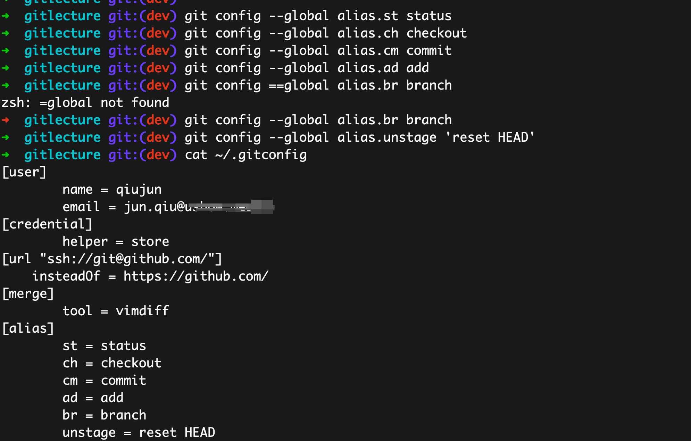

# Git 原理与配置

> 本文是「Git 系统学习指南」系列的第 01 章，从底层原理出发，帮助开发者建立对 Git 内部机制的系统认知，并给出一套开箱即用的配置方案。

---

## 目录

- [1 Git 的设计哲学](#1-git-的设计哲学)
  - [1.1 分布式 vs 集中式](#11-分布式-vs-集中式)
  - [1.2 快照而非差异](#12-快照而非差异)
- [2 Git 对象模型](#2-git-对象模型)
  - [2.1 四种核心对象](#21-四种核心对象)
  - [2.2 SHA-1 哈希](#22-sha-1-哈希)
  - [2.3 引用（refs）](#23-引用refs)
- [3 三个区域](#3-三个区域)
  - [3.1 工作区（Working Directory）](#31-工作区working-directory)
  - [3.2 暂存区（Staging Area / Index）](#32-暂存区staging-area--index)
  - [3.3 版本库（Repository / .git）](#33-版本库repository--git)
- [4 配置体系](#4-配置体系)
  - [4.1 三级配置与优先级](#41-三级配置与优先级)
  - [4.2 基础配置](#42-基础配置)
  - [4.3 配置的增删改查](#43-配置的增删改查)
  - [4.4 获取帮助](#44-获取帮助)
- [5 .gitignore 规则](#5-gitignore-规则)
  - [5.1 语法规则](#51-语法规则)
  - [5.2 常见 Go 项目 .gitignore](#52-常见-go-项目-gitignore)
  - [5.3 全局 gitignore](#53-全局-gitignore)
- [6 Git Alias 提效配置](#6-git-alias-提效配置)
  - [6.1 常用别名配置](#61-常用别名配置)
  - [6.2 验证配置](#62-验证配置)
- [7 小结](#7-小结)
- [8 动手练习](#8-动手练习)

## 1 Git 的设计哲学

### 1.1 分布式 vs 集中式

传统的版本控制系统（SVN、CVS）采用**集中式**模型：所有版本历史存储在中央服务器上，开发者只持有某一时刻的工作副本。一旦服务器不可用，团队将无法提交、查看历史或进行分支操作。

Git 采用**分布式**模型：每个开发者在本地都拥有仓库的**完整克隆**，包括全部提交历史和分支信息。

| 特性 | 集中式（SVN/CVS） | 分布式（Git） |
|------|-------------------|---------------|
| 历史存储 | 仅在中央服务器 | 每个节点都有完整历史 |
| 离线工作 | 不支持 | 完全支持 commit / branch / log |
| 单点故障 | 服务器挂即瘫痪 | 任意节点可恢复仓库 |
| 分支代价 | 目录级拷贝，代价高 | 仅创建一个 41 字节的指针文件 |

### 1.2 快照而非差异

传统 VCS 以 **delta（差异）** 方式存储版本——只记录每次变更相对于前一版本的差异。

Git 则在每次提交时为所有文件生成一份**快照（snapshot）**。如果文件未修改，Git 不会重复存储，而是保留一个指向上一版本的引用。

```
传统 VCS（delta 模型）:
  v1 ──Δ──> v2 ──Δ──> v3 ──Δ──> v4

Git（snapshot 模型）:
  v1: [A1] [B1] [C1]
  v2: [A1] [B2] [C1]   ← A1、C1 是引用，未重复存储
  v3: [A2] [B2] [C2]
```

这一设计使得分支切换和历史回溯极快——Git 不需要逐个应用 delta 来重建文件，直接读取快照即可。

## 2 Git 对象模型

### 2.1 四种核心对象

Git 的版本数据库由四种对象构成：

| 对象类型 | 存储内容 | 说明 |
|---------|---------|------|
| **blob** | 文件内容 | 不含文件名，纯内容 |
| **tree** | 目录结构 | 文件名 → blob/tree 的映射表 |
| **commit** | 一次提交 | 指向根 tree + parent commit + author + message |
| **tag** | 带注解的标签 | 指向某个 commit，附带签名/说明 |

它们之间的关系如下：

```
commit: 8a3f2c1
├── tree: 9b4d7e2  (根目录)
│   ├── blob: a1b2c3d  "main.go"
│   ├── blob: e4f5g6h  "go.mod"
│   └── tree: 7i8j9k0  "pkg/"
│       ├── blob: m1n2o3p  "handler.go"
│       └── blob: q4r5s6t  "handler_test.go"
├── parent: 5fc89ab  (上一次 commit)
├── author: John <john@example.com>
└── message: "feat: add handler"
```

可以用 `git cat-file` 亲自验证：

```bash
# 查看对象类型
git cat-file -t HEAD

# 查看 commit 内容
git cat-file -p HEAD

# 查看根 tree
git cat-file -p HEAD^{tree}
```

### 2.2 SHA-1 哈希

每个 Git 对象由其内容经 **SHA-1** 运算后产生的 40 位十六进制字符串唯一标识。

核心特性：

- **内容寻址（content-addressable）**：相同内容永远产生相同哈希，不同内容几乎不可能碰撞
- **完整性保证**：任何一个字节的篡改都会导致哈希值改变，Git 可立即检测到数据损坏
- **天然去重**：两个文件内容相同时，在对象库中只存储一份 blob

### 2.3 引用（refs）

引用是对 commit 哈希的**人类可读别名**，存储在 `.git/refs/` 目录下：

```
.git/refs/
├── heads/          ← 本地分支
│   ├── main        ← 内容: 某个 commit 的 SHA-1
│   └── feature-x
├── tags/           ← 标签
│   └── v1.0.0
└── remotes/        ← 远程跟踪分支
    └── origin/
        └── main
```

- **分支（branch）**：指向某个 commit 的**可移动**指针，每次 commit 后自动前移
- **HEAD**：特殊指针，通常指向当前分支（`ref: refs/heads/main`），决定下次 commit 的 parent
- **tag**：指向某个 commit 的**固定**指针，常用于标记发布版本

## 3 三个区域

Git 的文件流转涉及三个核心区域：

```
  ┌─────────────┐   git add    ┌─────────────┐  git commit  ┌─────────────┐
  │             │ ───────────> │             │ ──────────-> │             │
  │   工作区     │              │   暂存区     │              │   版本库     │
  │  Working    │              │  Staging    │              │ Repository  │
  │  Directory  │              │  Area/Index │              │   (.git)    │
  │             │ <─────────── │             │              │             │
  └─────────────┘  git restore └─────────────┘              └─────────────┘
         ↑                                                        │
         └────────────── git checkout / git restore ──────────────┘
```

### 3.1 工作区（Working Directory）

项目目录中实际可见和编辑的文件。执行 `git status` 时显示为 "Changes not staged for commit" 的部分。

### 3.2 暂存区（Staging Area / Index）

位于 `.git/index`，是一个二进制文件，记录了下次 commit 将要包含的文件快照。`git add` 将工作区的修改写入暂存区。

暂存区的存在使得你可以**精细控制每次提交的内容**——只提交部分修改，而非整个工作区的变化。

### 3.3 版本库（Repository / .git）

`.git` 目录是 Git 仓库的核心，包含对象数据库、引用、配置等所有信息。`git commit` 将暂存区的快照写入版本库，生成新的 commit 对象。

## 4 配置体系

### 4.1 三级配置与优先级

Git 配置分三个层级，**优先级由低到高**：

```
/etc/gitconfig      ← --system  对所有用户生效
~/.gitconfig        ← --global  对当前用户生效
.git/config         ← --local   对当前仓库生效（最高优先级）
```

低优先级的配置会被高优先级**覆盖**。例如 `--global` 中设置了 `user.name`，但某个仓库的 `--local` 中也设置了，则该仓库使用 local 值。

### 4.2 基础配置

安装 Git 后首先完成以下配置：

```bash
# 身份信息（必须）
git config --global user.name "Your Name"
git config --global user.email "you@example.com"

# 默认编辑器
git config --global core.editor vim

# 合并工具
git config --global merge.tool vimdiff

# 默认分支名（推荐 main）
git config --global init.defaultBranch main

# 处理换行符（macOS / Linux）
git config --global core.autocrlf input
```

### 4.3 配置的增删改查

```bash
# 查看所有生效配置（含来源文件）
git config --list --show-origin

# 查看某项配置
git config --global --get user.name

# 新增配置
git config --global --add core.excludesFile ~/.gitignore_global

# 修改配置（直接 set）
git config --global user.email "new@example.com"

# 删除配置
git config --global --unset core.editor
```

### 4.4 获取帮助

```bash
# 打开完整手册页
git help config

# 等价写法
git config --help

# 快速参考（-h 只输出到终端）
git config -h
```

## 5 .gitignore 规则

### 5.1 语法规则

| 语法 | 含义 | 示例 |
|------|------|------|
| `*` | 匹配任意字符（不含 `/`） | `*.log` |
| `?` | 匹配单个字符 | `debug?.log` |
| `[abc]` | 匹配方括号内任一字符 | `*.[oa]` |
| `**` | 匹配任意层级目录 | `**/logs` |
| `/dir/` | 仅匹配根目录下的 dir | `/build/` |
| `!` | 否定规则（取消忽略） | `!important.log` |
| `#` | 注释 | `# 临时文件` |

规则从上到下匹配，后面的规则可以覆盖前面的。已经被 `git add` 追踪的文件不受 `.gitignore` 影响，需要先 `git rm --cached` 取消追踪。

### 5.2 常见 Go 项目 .gitignore

```bash
# 编译产物
*.exe
*.exe~
*.dll
*.so
*.dylib
/bin/
/dist/

# 测试产物
*.test
*.out
coverage.html
*.prof

# 依赖（通常提交 go.sum，但忽略 vendor 可选）
# vendor/

# IDE
.idea/
.vscode/
*.swp
*.swo

# 系统文件
.DS_Store
Thumbs.db
```

### 5.3 全局 gitignore

对所有仓库生效的忽略规则，适合放 IDE 和系统文件：

```bash
# 设置全局忽略文件
git config --global core.excludesFile ~/.config/git/ignore
```

`~/.config/git/ignore` 内容示例：

```bash
.DS_Store
.idea/
*.swp
```

## 6 Git Alias 提效配置

### 6.1 常用别名配置

```bash
git config --global alias.st status
git config --global alias.co checkout
git config --global alias.br branch
git config --global alias.ci commit
git config --global alias.unstage "reset HEAD --"
git config --global alias.last "log -1 HEAD"
git config --global alias.lg "log --oneline --graph --all --decorate"
git config --global alias.df "diff --stat"
```

配置后即可使用简写：

```bash
git st            # 等价于 git status
git lg            # 漂亮的分支图
git unstage file  # 撤销暂存
```

### 6.2 验证配置

配置完成后，通过 `git config --global --list` 查看所有别名是否生效：



## 7 小结

本章核心要点：

1. **分布式架构**：每个节点都有完整仓库，支持离线工作，无单点故障
2. **快照模型**：Git 存储快照而非差异，使分支切换和历史回溯极快
3. **对象模型**：blob / tree / commit / tag 四种对象构成 Git 的数据基础，由 SHA-1 哈希唯一标识
4. **三个区域**：工作区 → 暂存区 → 版本库，理解文件在三者间的流转是掌握 Git 的关键
5. **配置体系**：system < global < local 三级覆盖，优先完成身份和编辑器配置
6. **.gitignore**：掌握通配符语法，为项目和全局分别配置忽略规则
7. **Alias**：高频命令配置别名，减少重复输入

## 8 动手练习

1. **验证对象模型**：在任意 Git 仓库中执行以下命令，画出当前 HEAD 的 commit → tree → blob 关系链：
   ```bash
   git cat-file -p HEAD
   git cat-file -p HEAD^{tree}
   # 选一个 blob hash，查看其内容
   git cat-file -p <blob-hash>
   ```

2. **配置覆盖实验**：在某个仓库中分别设置 `--global` 和 `--local` 的 `user.name` 为不同值，然后用 `git config --list --show-origin` 确认最终生效的是哪个。

3. **编写 .gitignore**：创建一个规则文件，要求忽略所有 `.log` 文件，但保留 `error.log`。提示：需要用到 `!` 否定规则。验证方法：创建 `debug.log` 和 `error.log`，执行 `git status` 确认只有 `error.log` 出现。

4. **Alias 效率体验**：配置 `git lg` 别名（见 6.1 节），在一个有多分支的仓库中运行，对比 `git log` 和 `git lg` 的输出效果。

> 下一章：[02 - Git 日常操作命令详解](../02-日常操作命令/Git日常操作命令详解.md)
