# Git 分支与合并详解

> 本文是「Git 系统学习指南」系列第三章，聚焦分支模型与合并策略。
> 掌握分支与合并是高效协作的基石。

---

## 目录

- [1 分支的本质](#1-分支的本质)
- [2 分支操作](#2-分支操作)
  - [2.1 创建与切换](#21-创建与切换)
  - [2.2 删除与重命名](#22-删除与重命名)
- [3 合并策略](#3-合并策略)
  - [3.1 Fast-forward 合并](#31-fast-forward-合并)
  - [3.2 三方合并（3-way merge）](#32-三方合并3-way-merge)
  - [3.3 git merge 实操](#33-git-merge-实操)
- [4 冲突解决](#4-冲突解决)
  - [4.1 冲突产生的原因](#41-冲突产生的原因)
  - [4.2 冲突解决实战](#42-冲突解决实战)
  - [4.3 冲突标记解读](#43-冲突标记解读)
  - [4.4 使用工具辅助解决冲突](#44-使用工具辅助解决冲突)
- [5 Rebase 详解](#5-rebase-详解)
  - [5.1 rebase 与 merge 的区别](#51-rebase-与-merge-的区别)
  - [5.2 基本用法](#52-基本用法)
  - [5.3 处理 rebase 冲突](#53-处理-rebase-冲突)
  - [5.4 交互式 rebase（git rebase -i）](#54-交互式-rebasegit-rebase--i)
  - [5.5 rebase 黄金法则](#55-rebase-黄金法则)
- [6 merge vs rebase 选型指南](#6-merge-vs-rebase-选型指南)
- [7 小结](#7-小结)
- [8 常见问题排查](#8-常见问题排查)
  - [8.1 detached HEAD（HEAD 分离状态）](#81-detached-headhead-分离状态)
  - [8.2 merge 后发现合并错误](#82-merge-后发现合并错误)
  - [8.3 rebase 过程中冲突太多想放弃](#83-rebase-过程中冲突太多想放弃)
- [9 动手练习](#9-动手练习)

---

## 1 分支的本质

在 Git 中，**分支（branch）本质上是一个指向某个 commit 对象的可移动指针**。

当我们执行 `git branch feature-login` 时，Git 只是在 `.git/refs/heads/` 目录下创建了一个 41 字节的文件（40 位 SHA-1 哈希值 + 1 个换行符），文件名即分支名，内容即该分支指向的 commit SHA-1。

```bash
# 验证分支文件
cat .git/refs/heads/main
# 输出类似: a1b2c3d4e5f6...
```

这就是 Git 分支如此轻量的根本原因——**创建分支的成本几乎为零**。相比之下，SVN 创建分支需要拷贝整个目录树，成本随项目规模线性增长。

当我们基于某个分支（如 main）创建新分支（如 dev）时，两个分支最初指向同一个 commit。随着各自的提交，指针会分别前移，分支开始分叉：

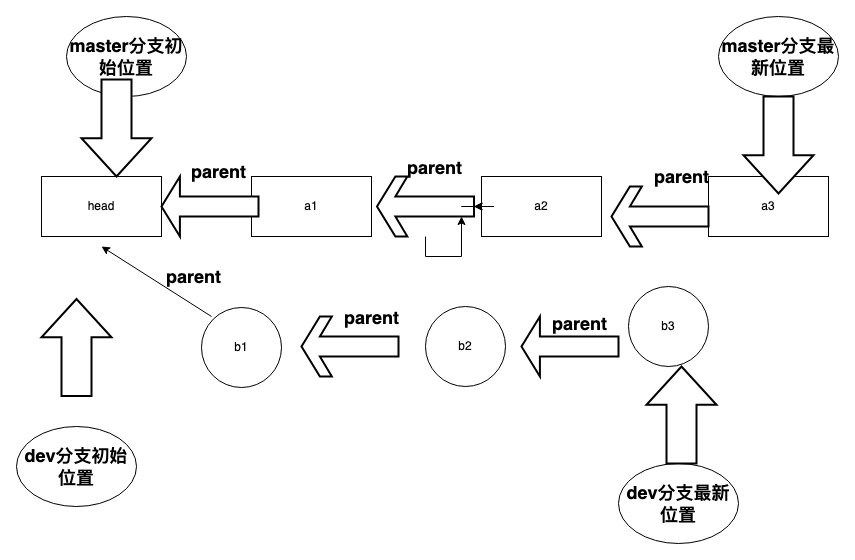

新提交的 parent 指针指向上一次提交，类似链表结构。通过 parent 指针将分支上的所有提交记录连接起来，这也是 `git log` 能追溯完整历史的基础。

另外，Git 用一个特殊的 `HEAD` 指针标识"当前所在的分支"。`HEAD` 通常指向一个分支引用（而非直接指向 commit），切换分支就是改变 `HEAD` 的指向。

---

## 2 分支操作

### 2.1 创建与切换

```bash
# 查看所有分支（含远程）
git branch -a

# 查看分支及最新提交信息
git branch -av

# 创建分支（不切换）
git branch feature-login

# 切换分支（推荐 Git 2.23+ 的 switch 命令，语义更清晰）
git switch feature-login
# 传统方式
git checkout feature-login

# 创建并切换（一步到位）
git switch -c feature-login
# 传统方式
git checkout -b feature-login

# 基于指定 commit 创建分支
git switch -c hotfix-001 a1b2c3d
```

> **为什么推荐 `git switch`？** `checkout` 身兼数职（切换分支、恢复文件、分离 HEAD），容易混淆。Git 2.23 将分支切换拆分为 `switch`，文件恢复拆分为 `restore`，职责更单一。

### 2.2 删除与重命名

```bash
# 安全删除（如果分支有未合并的提交，会拒绝删除）
git branch -d feature-login

# 强制删除（无论是否合并，慎用）
git branch -D feature-login

# 重命名当前分支
git branch -m new-name

# 重命名指定分支
git branch -m old-name new-name

# 删除远程分支
git push origin --delete feature-login
```

> ⚠️ **注意**：删除分支前必须先切换到其他分支，无法在当前分支上删除自身。

---

## 3 合并策略

Git 提供了多种合并策略，理解它们的区别对于维护清晰的提交历史至关重要。

### 3.1 Fast-forward 合并

当目标分支（如 main）在分支创建后没有产生新的提交时，Git 会执行 fast-forward 合并——直接将 main 指针前移到 feature 分支的最新 commit，不会产生额外的合并提交。

```
合并前:
main
 ↓
 A --- B --- C --- D --- E
                         ↑
                      feature

合并后 (fast-forward):
                         main
                          ↓
 A --- B --- C --- D --- E
                         ↑
                      feature
```

```bash
# 强制 fast-forward，如果不能 fast-forward 则合并失败
git merge --ff-only feature-login
```

**优点**：历史干净，没有多余的合并提交。
**缺点**：丢失了"曾经存在一个 feature 分支"的信息。

### 3.2 三方合并（3-way merge）

当两个分支各自都有新的提交时，Git 无法简单地移动指针，会执行三方合并：找到两个分支的**共同祖先（merge base）**，结合三方的差异生成一个新的**合并提交（merge commit）**，该提交有两个 parent。

```
合并前:
          D --- E  (feature)
         /
 A --- B --- C --- F  (main)

合并后 (3-way merge):
          D --- E
         /       \
 A --- B --- C --- F --- G  (main, merge commit)
```

合并提交 `G` 同时指向 `E` 和 `F`，完整保留了分支的开发历史。

```bash
# 强制产生合并提交，即使可以 fast-forward
git merge --no-ff feature-login
```

**优点**：保留完整的分支历史，方便追溯。
**缺点**：频繁合并会使 `git log --graph` 变得复杂。

### 3.3 git merge 实操

```bash
# 标准流程：将 feature 合并到 main
git switch main
git merge feature-login

# 推荐：强制产生合并提交，保留分支历史
git merge --no-ff feature-login

# 合并后删除已合并的分支
git branch -d feature-login
```

合并完成后，可以用 `git log --oneline --graph` 查看分支合并图，确认合并结果符合预期。

---

## 4 冲突解决

### 4.1 冲突产生的原因

冲突发生在 Git 无法自动判断该保留哪个版本时，常见场景：

- **同一文件同一行**：两个分支对同一文件的同一行做了不同修改
- **修改 vs 删除**：一个分支修改了文件，另一个分支删除了该文件
- **二进制文件冲突**：二进制文件无法按行合并，只能选择一个版本

### 4.2 冲突解决实战

下面通过一个真实场景，演示两个开发人员在同一分支上协作时遇到冲突并解决的完整过程。

**t1：开发人员 A 提交修改**

开发人员 A 在 dev 分支对 `test.txt` 增加了第三行 `"How old are you?"`，并 commit 但尚未 push。

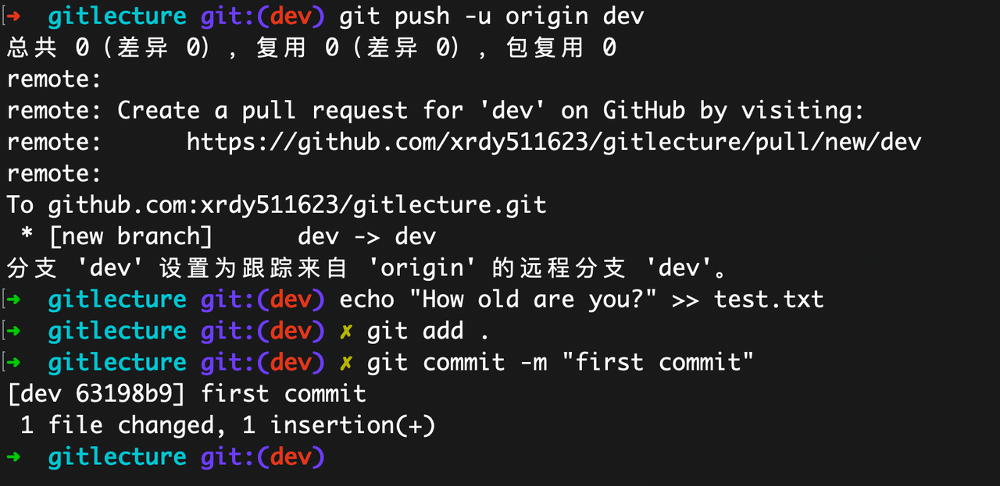

**t2：开发人员 B 做了不同修改**

与此同时，开发人员 B 也在 dev 分支对 `test.txt` 的同一位置做了不同的修改。

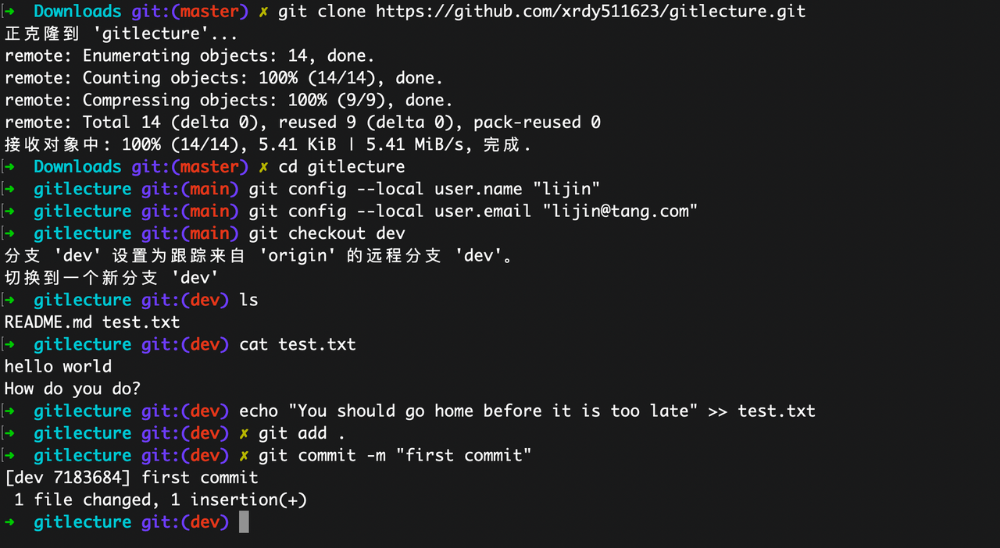

**t3：A 先 push 成功**

开发人员 A 率先执行 push，成功将修改推送到远程。

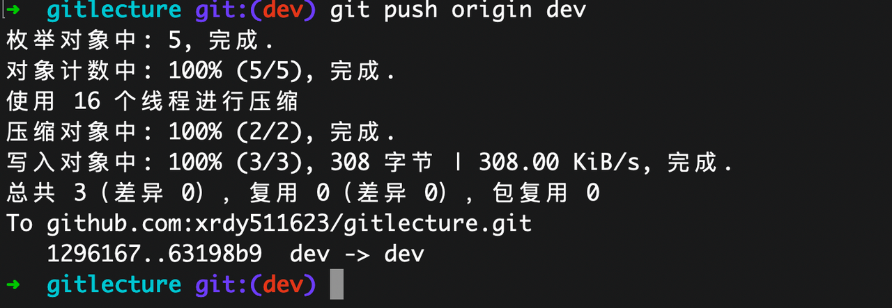

**t4：B push 失败，pull 时产生冲突**

开发人员 B 尝试 push 时被拒绝（远程已有新提交）。执行 `git pull` 后，Git 发现同一行有不同修改，产生合并冲突。

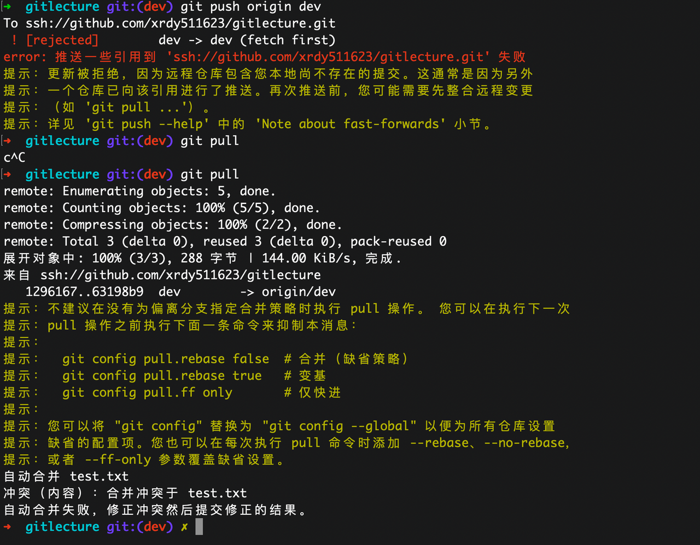

**t5：手动编辑文件解决冲突**

开发人员 B 打开冲突文件，看到冲突标记，手动编辑保留需要的内容，移除冲突标记。

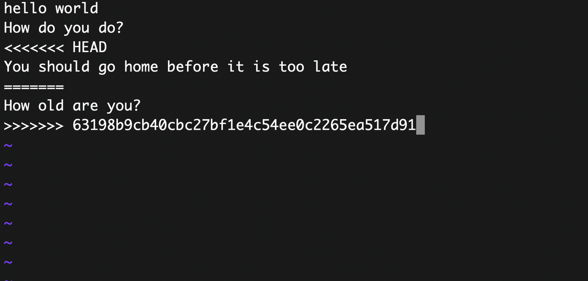

**t6：解决后提交推送**

冲突解决后，执行 `git add` → `git commit` → `git push` 完成合并提交。

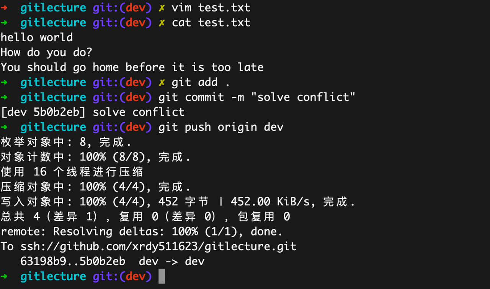

**t7：A pull 后看到合并结果**

开发人员 A 执行 `git pull`，拉取到 B 解决冲突后的合并提交，双方代码同步完成。

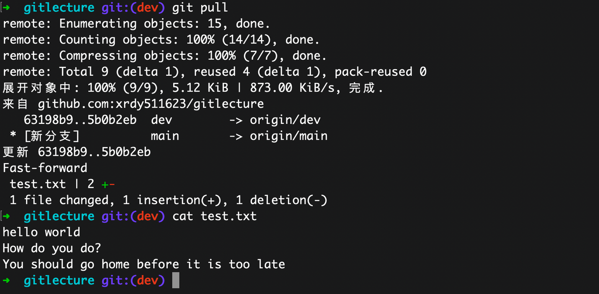

### 4.3 冲突标记解读

当冲突发生时，Git 会在文件中插入标记：

```
<<<<<<< HEAD
你当前分支的内容
=======
对方分支的内容
>>>>>>> feature-branch
```

- `<<<<<<< HEAD` 到 `=======` 之间是**当前分支**（HEAD）的内容
- `=======` 到 `>>>>>>> feature-branch` 之间是**合入分支**的内容
- 解决冲突 = 删除标记行，保留最终需要的内容（可以是任意一方，也可以手动合并两方）

### 4.4 使用工具辅助解决冲突

手动编辑冲突标记容易遗漏，推荐借助工具：

```bash
# 调用配置好的合并工具
git mergetool

# 配置默认合并工具（以 vimdiff 为例）
git config --global merge.tool vimdiff
```

**IDE 内置支持**：
- **VS Code**：冲突文件会高亮标记，提供 Accept Current / Accept Incoming / Accept Both 按钮
- **GoLand / IntelliJ**：三栏合并视图，左侧本地、右侧远程、中间为合并结果

---

## 5 Rebase 详解

### 5.1 rebase 与 merge 的区别

`merge` 和 `rebase` 都能将两个分支的工作整合到一起，但方式不同：

- **merge**：保留分支的分叉历史，产生一个合并提交
- **rebase**：将当前分支的提交"变基"到目标分支末尾，历史变为一条直线

```
初始状态:
          D --- E  (feature)
         /
 A --- B --- C  (main)

========== merge 结果 ==========
          D --- E
         /       \
 A --- B --- C --- M  (main, merge commit)

========== rebase 结果 ==========
 A --- B --- C --- D' --- E'  (feature, 提交被重新创建)
              ↑
            main
```

rebase 后 `D'` 和 `E'` 的内容与 `D`、`E` 相同，但它们是**全新的 commit**（SHA-1 不同），因为 parent 指针改变了。

### 5.2 基本用法

```bash
# 在 feature 分支上 rebase main（将 feature 的提交搬到 main 最新提交之后）
git switch feature-login
git rebase main

# rebase 完成后，切回 main 做 fast-forward 合并
git switch main
git merge feature-login    # 此时一定是 fast-forward
```

### 5.3 处理 rebase 冲突

rebase 过程中如果遇到冲突，Git 会暂停在产生冲突的那个 commit 上：

```bash
# 1. 手动解决冲突文件
# 2. 将解决后的文件标记为已解决
git add <conflicted-file>

# 3. 继续 rebase
git rebase --continue

# 如果想放弃整个 rebase，回到 rebase 之前的状态
git rebase --abort

# 跳过当前这个 commit（该 commit 的修改将丢失）
git rebase --skip
```

> **与 merge 冲突的区别**：merge 只需解决一次冲突，而 rebase 可能需要逐个 commit 解决冲突（每个被 replay 的 commit 都可能冲突）。

### 5.4 交互式 rebase（git rebase -i）

交互式 rebase 是 Git 最强大的历史整理工具，可以对一系列 commit 进行重新排序、合并、修改、删除等操作。

**可用命令：**

| 命令 | 缩写 | 作用 |
|------|------|------|
| `pick` | `p` | 保留该 commit（默认） |
| `reword` | `r` | 保留该 commit，但修改提交信息 |
| `edit` | `e` | 暂停在该 commit，允许修改内容 |
| `squash` | `s` | 将该 commit 合并到上一个 commit，保留两者的提交信息 |
| `fixup` | `f` | 将该 commit 合并到上一个 commit，丢弃该 commit 的提交信息 |
| `drop` | `d` | 删除该 commit |

#### 合并多个 commit 实战

实际开发中经常会产生一些琐碎的中间提交，合入主分支前最好把它们合并为一个有意义的提交。

首先查看当前的提交历史：

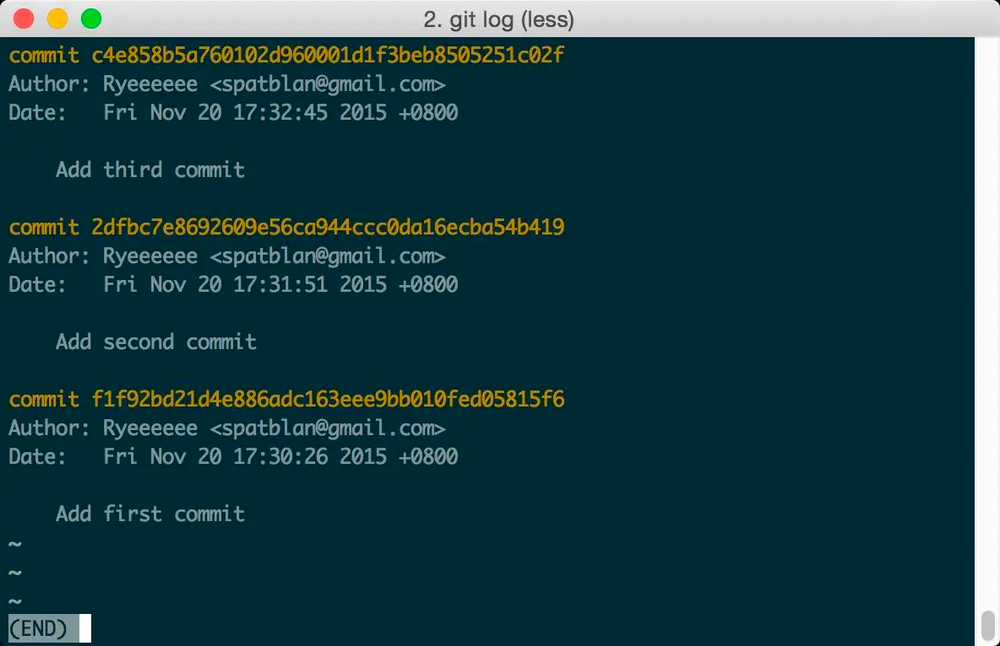

执行交互式 rebase，合并最近 2 个提交：

```bash
git rebase -i HEAD~2
# 或指定 base commit（不包含该 commit）
git rebase -i <base-commit-hash>
```

Git 会打开编辑器，列出要操作的 commit：

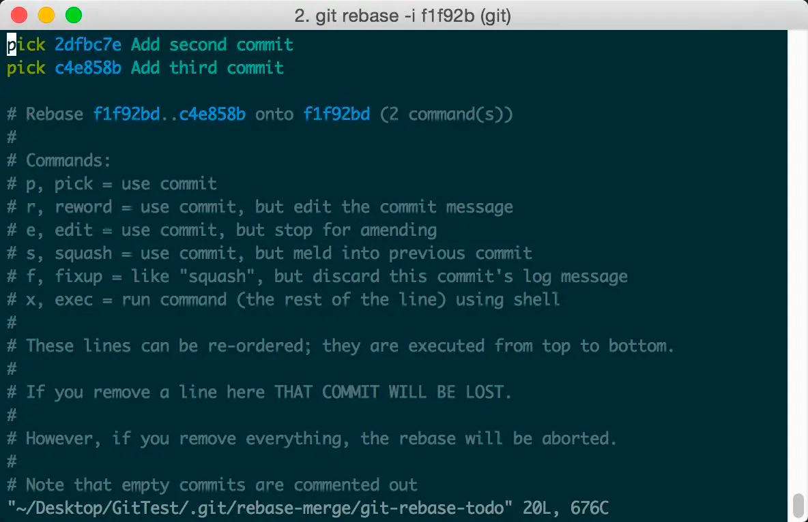

将第二个 commit 的 `pick` 改为 `squash`（或 `s`），表示将其合并到第一个 commit 中：

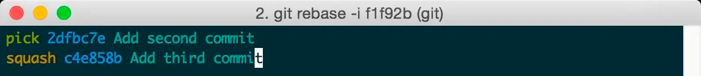

保存后进入提交信息编辑界面，修改合并后的 commit message：

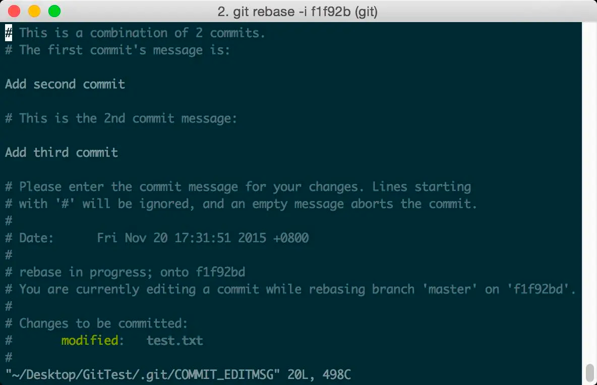

保存退出，rebase 完成：

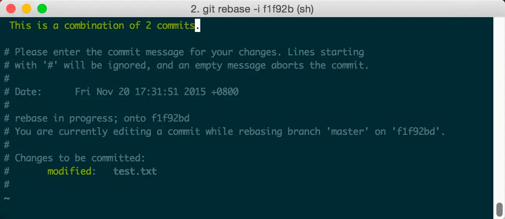

查看结果，两个 commit 已合并为一个：

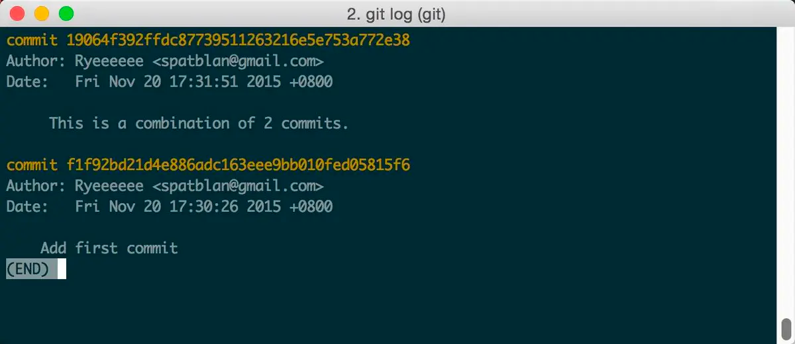

### 5.5 rebase 黄金法则

> **永远不要对已推送到远程的公共分支执行 rebase。**

这是使用 rebase 最重要的原则。原因如下：

rebase 会改写 commit 的 SHA-1 哈希值（因为 parent 变了）。如果你对已经 push 到远程的 commit 执行 rebase，那么其他协作者在 pull 时会发现本地的 commit 和远程的 commit 虽然内容相同，但 SHA-1 不同，Git 会认为它们是不同的提交，导致**大量重复提交和冲突**。

**安全使用 rebase 的场景**：
- 本地未 push 的 feature 分支，rebase 上游 main 的最新代码
- 合入主分支前，用 `rebase -i` 整理本地提交历史
- `git pull --rebase` 替代默认的 merge 拉取

---

## 6 merge vs rebase 选型指南

| 维度 | merge | rebase |
|------|-------|--------|
| 提交历史 | 保留分叉，真实反映开发过程 | 线性历史，整洁清晰 |
| 适用场景 | 公共分支合并（如 feature → main） | 个人分支同步上游变更 |
| 冲突处理 | 一次性解决所有冲突 | 可能需要逐个 commit 解决 |
| 可撤销性 | 容易（`git revert -m 1 <merge-commit>`） | 困难（commit 已被改写） |
| 合并提交 | 产生额外的 merge commit | 无额外提交，历史干净 |
| 协作安全 | 安全，不改写历史 | 对公共分支有风险 |

**推荐策略**：

```
个人 feature 分支开发过程中：
  git fetch origin
  git rebase origin/main        # 用 rebase 同步上游，保持线性

合入主分支时：
  git switch main
  git merge --no-ff feature-x   # 用 merge --no-ff 保留合并记录
```

这种 **"rebase + merge --no-ff"** 的组合策略兼顾了：
- 个人分支的线性整洁（rebase）
- 主分支的合并可追溯性（`--no-ff` 保证合并提交的存在）

---

## 7 小结

本章覆盖了 Git 分支与合并的核心知识：

1. **分支本质**：分支是指向 commit 的轻量指针，创建成本几乎为零
2. **分支操作**：推荐使用 `git switch` 替代 `git checkout` 进行分支切换
3. **合并策略**：fast-forward 简洁但丢失分支信息，三方合并保留完整历史
4. **冲突解决**：理解冲突标记，善用 IDE 工具辅助解决
5. **Rebase**：强大的历史整理工具，但必须遵守"不 rebase 公共分支"的黄金法则
6. **选型建议**：个人分支用 rebase 保持线性，合入主分支用 `merge --no-ff` 保留记录

## 8 常见问题排查

### 8.1 detached HEAD（HEAD 分离状态）

**现象**：执行 `git checkout <commit-hash>` 后，提示 `You are in 'detached HEAD' state`，此时不在任何分支上。

**原因**：HEAD 直接指向了一个 commit 而非分支引用。在此状态下的新提交不属于任何分支，切换分支后这些提交会变成"悬挂提交"。

**解决**：
```bash
# 如果你在 detached HEAD 状态下做了有价值的提交，创建一个新分支保留它们
git branch recovered-work

# 切换到该分支
git switch recovered-work
```

### 8.2 merge 后发现合并错误

**现象**：执行 `git merge` 后发现合并结果不对，想撤销。

**解决**：
```bash
# 如果还没有 commit（合并冲突解决中）
git merge --abort

# 如果已经产生了 merge commit 但还没 push
git reset --hard HEAD~1

# 如果已经 push 到远程
git revert -m 1 <merge-commit-hash>
```

### 8.3 rebase 过程中冲突太多想放弃

**现象**：执行 `git rebase` 后连续遇到多个冲突，不想继续了。

**解决**：
```bash
# 随时可以中止 rebase，回到 rebase 之前的状态
git rebase --abort

# 如果已经 rebase 完成但结果不对
git reset --hard ORIG_HEAD
```

## 9 动手练习

1. **模拟冲突并解决**：创建两个分支，在同一文件的同一行做不同修改，合并时手动解决冲突。完成后用 `git log --graph --oneline` 查看合并历史。

2. **交互式 rebase 练习**：连续提交 4 个小改动，然后用 `git rebase -i HEAD~4` 将它们合并为 2 个有意义的 commit（使用 squash/fixup）。

3. **merge vs rebase 对比**：创建一个 feature 分支，在 main 和 feature 上各提交几次。先用 `git merge` 合并查看历史图形，然后 `git reset --hard` 回退，改用 `git rebase` + `git merge --ff-only` 查看历史差异。

4. **detached HEAD 恢复**：故意 `git checkout HEAD~2` 进入 detached HEAD 状态，做一个 commit，然后用 `git branch` 保存它，验证切回正常分支后该 commit 不会丢失。

> 上一章：[02 - Git 日常操作命令详解](../02-日常操作命令/Git日常操作命令详解.md) · 下一章：[04 - Git 远程协作详解](../04-远程协作/Git远程协作详解.md)
