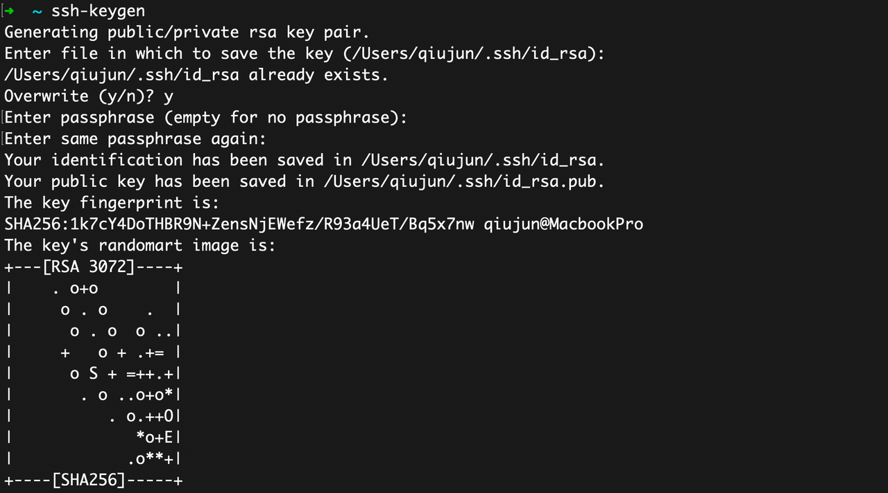
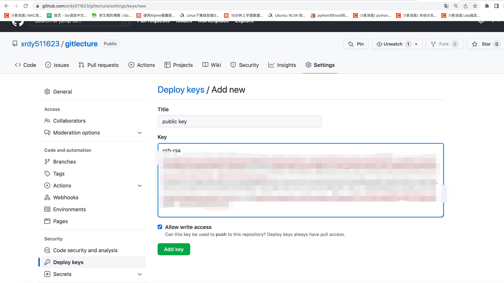
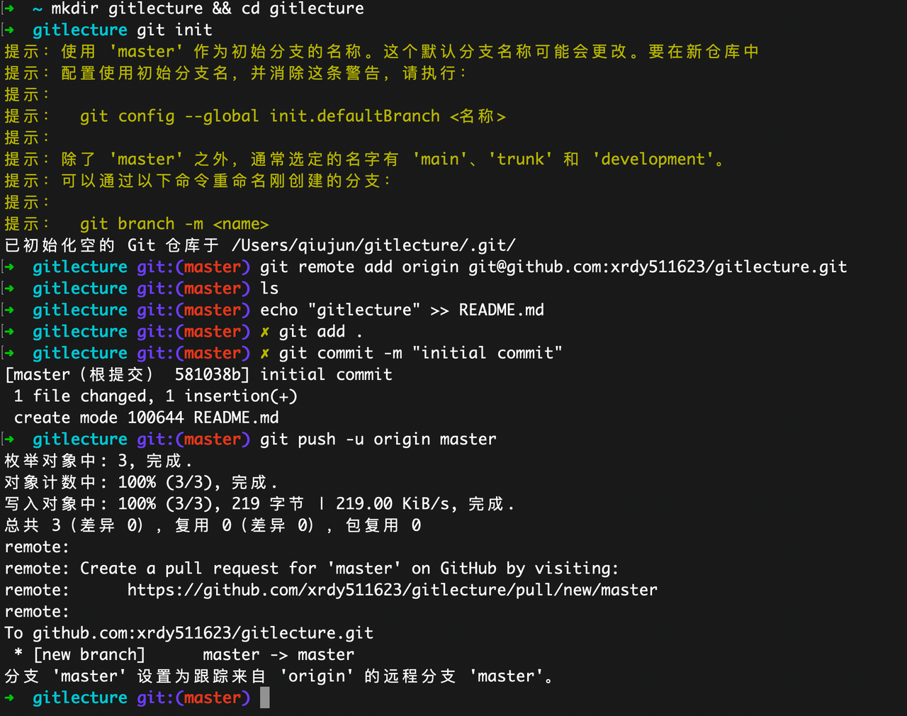
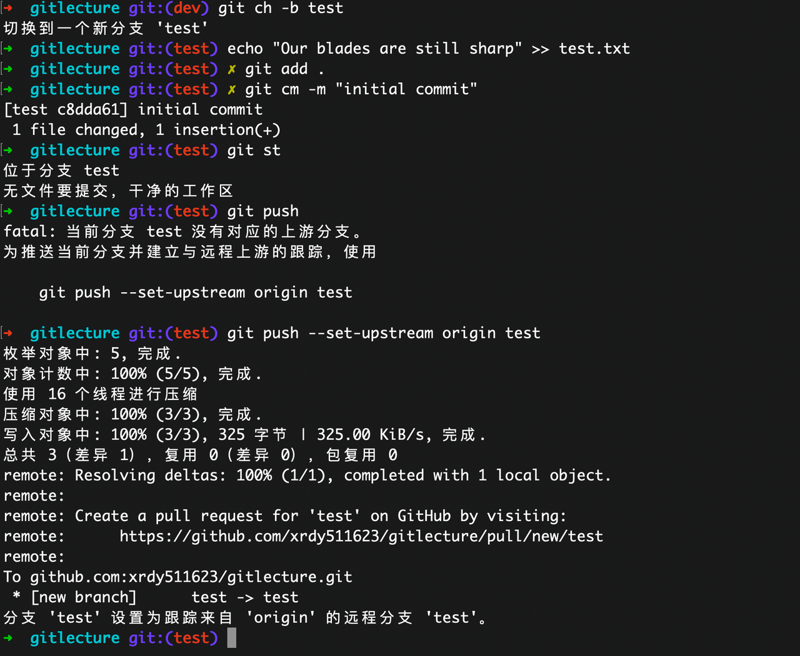
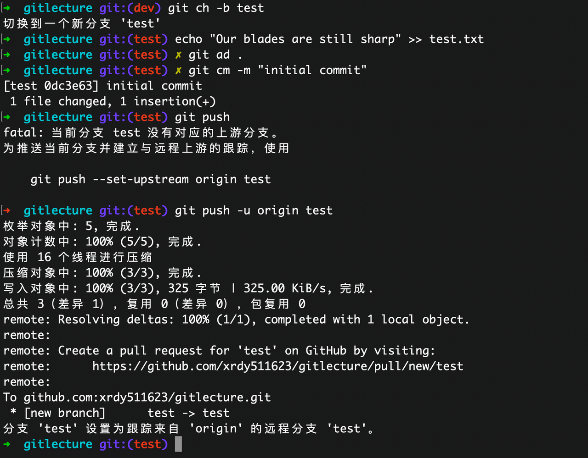
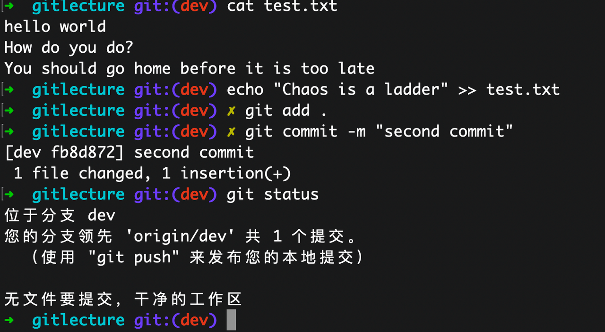
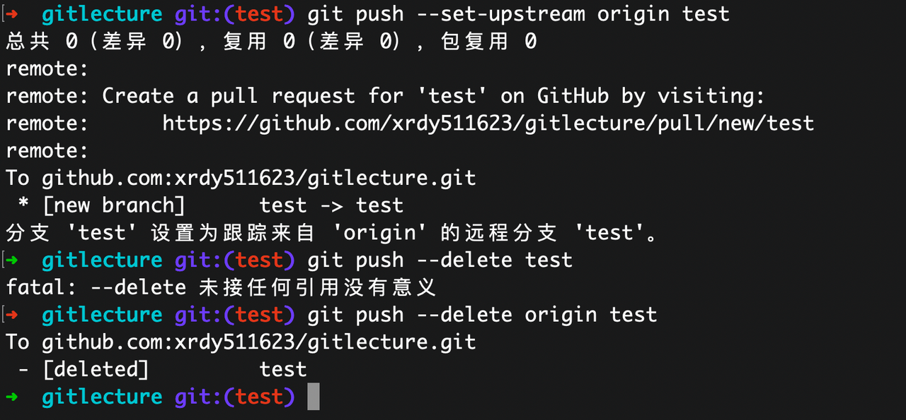
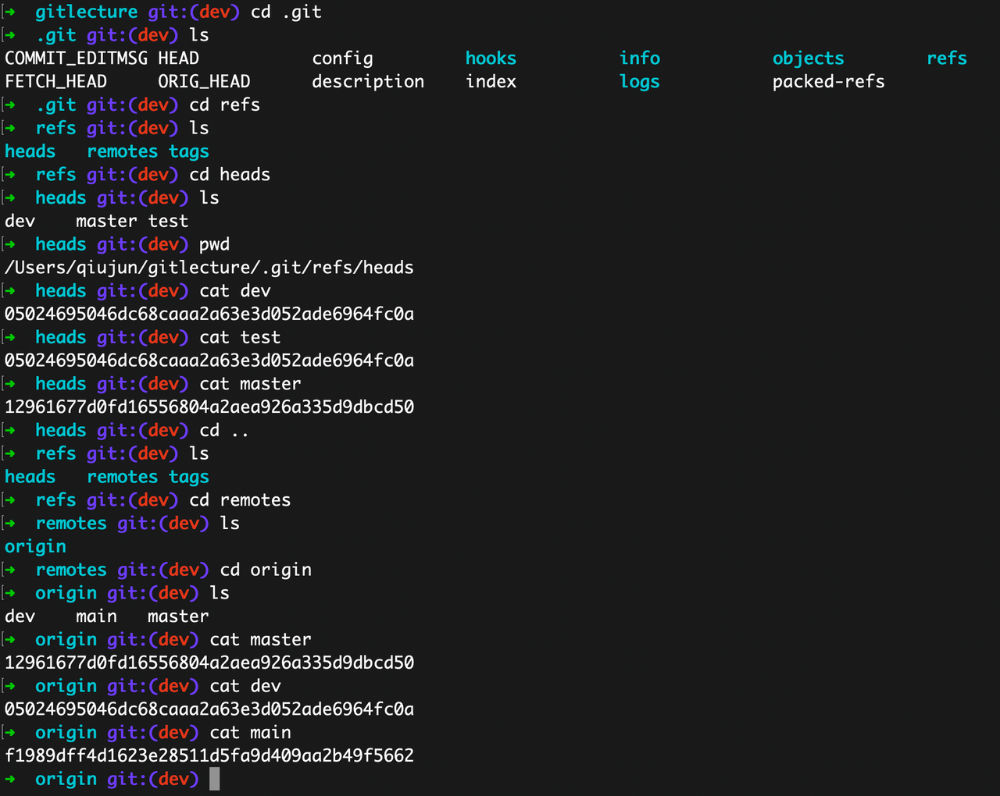
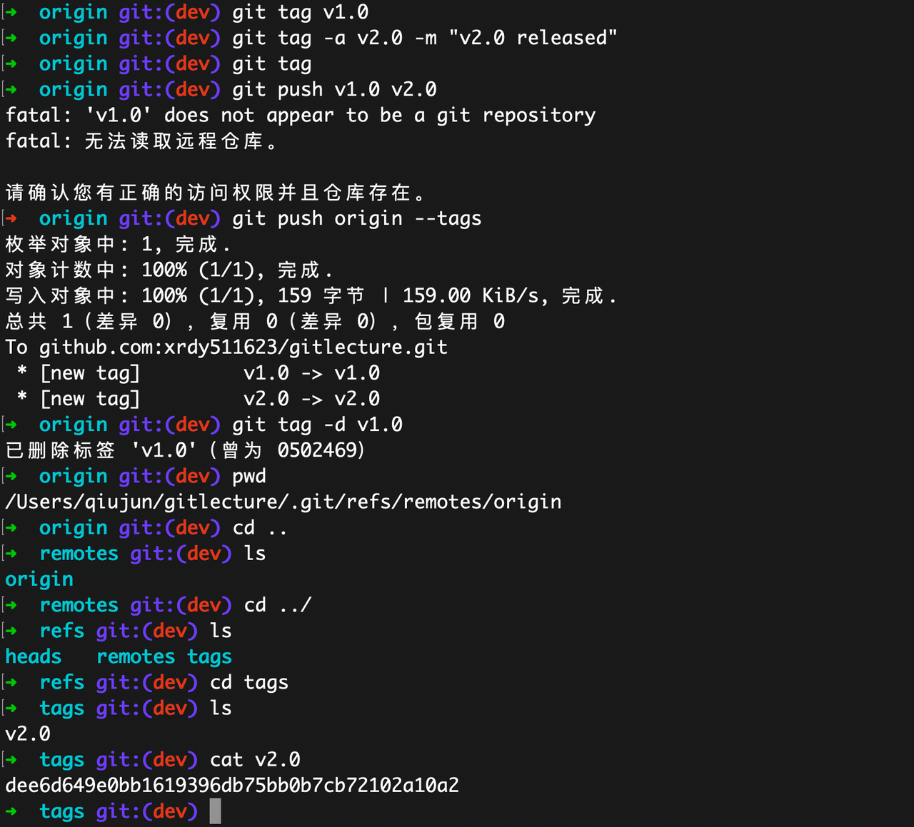

# Git 远程协作详解

> 本文是「Git 系统学习指南」系列的第 04 章，系统讲解 Git 远程协作的核心概念与实操流程——从 SSH 密钥配置、远程仓库管理到 fetch/pull/push 的数据流转，再到 Fork + PR 工作流，帮助你高效参与团队协作与开源贡献。

---

## 目录

- [1 远程仓库概念](#1-远程仓库概念)
  - [1.1 什么是远程仓库](#11-什么是远程仓库)
  - [1.2 常见远程仓库角色](#12-常见远程仓库角色)
- [2 SSH 密钥配置](#2-ssh-密钥配置)
  - [2.1 生成密钥对](#21-生成密钥对)
  - [2.2 添加公钥到 GitHub / GitLab](#22-添加公钥到-github--gitlab)
  - [2.3 验证连接](#23-验证连接)
- [3 在 GitHub 上创建仓库](#3-在-github-上创建仓库)
  - [3.1 关联本地仓库与远程](#31-关联本地仓库与远程)
  - [3.2 git remote 管理](#32-git-remote-管理)
- [4 fetch / pull / push 详解](#4-fetch--pull--push-详解)
  - [4.1 git fetch —— 安全地获取远程更新](#41-git-fetch--安全地获取远程更新)
  - [4.2 git pull —— 获取并合并](#42-git-pull--获取并合并)
  - [4.3 git push —— 将本地提交推送到远程](#43-git-push--将本地提交推送到远程)
- [5 本地分支与远程分支](#5-本地分支与远程分支)
  - [5.1 跟踪关系（Tracking）](#51-跟踪关系tracking)
  - [5.2 从远程分支创建本地分支](#52-从远程分支创建本地分支)
  - [5.3 查看推送状态](#53-查看推送状态)
- [6 删除远程分支](#6-删除远程分支)
- [7 Tag 管理](#7-tag-管理)
  - [7.1 创建 tag](#71-创建-tag)
  - [7.2 查看与删除](#72-查看与删除)
  - [7.3 推送与删除远程 tag](#73-推送与删除远程-tag)
- [8 Fork + Pull Request 工作流](#8-fork--pull-request-工作流)
  - [8.1 完整流程](#81-完整流程)
  - [8.2 保持 fork 与上游同步](#82-保持-fork-与上游同步)
- [9 小结](#9-小结)
  - [核心数据流](#核心数据流)
  - [要点回顾](#要点回顾)
- [10 常见报错排查](#10-常见报错排查)
  - [10.1 failed to push some refs](#101-failed-to-push-some-refs)
  - [10.2 refusing to merge unrelated histories](#102-refusing-to-merge-unrelated-histories)
  - [10.3 Permission denied (publickey)](#103-permission-denied-publickey)
  - [10.4 fatal: not a git repository](#104-fatal-not-a-git-repository)
- [11 动手练习](#11-动手练习)

## 1 远程仓库概念

### 1.1 什么是远程仓库

远程仓库（remote repository）是托管在网络服务器上的 Git 仓库，常见的托管平台有 GitHub、GitLab、Gitee 等。

与集中式版本控制不同，Git 中每个开发者本地都拥有完整的仓库副本，远程仓库的核心职责是作为**团队协作的同步中枢**：

- 开发者将本地的提交 **push** 到远程，供他人获取
- 其他成员通过 **fetch / pull** 拉取最新变更到本地
- 一个本地仓库可以同时关联**多个远程仓库**，实现多源协作

### 1.2 常见远程仓库角色

| 名称 | 场景 | 说明 |
|------|------|------|
| `origin` | 默认远程 | `git clone` 时自动创建，指向你克隆的仓库 |
| `upstream` | Fork 协作 | 指向原始仓库（被 fork 的源），用于同步上游更新 |
| 自定义名称 | 多团队协作 | 例如 `staging`、`production`，指向不同环境的仓库 |

一个典型的 Fork 场景下，本地仓库同时关联两个远程：

```
origin   → git@github.com:your-name/repo.git     （你的 fork）
upstream → git@github.com:original-owner/repo.git （原始仓库）
```

## 2 SSH 密钥配置

HTTPS 方式每次操作都需要输入用户名和密码（或 token），SSH 方式通过密钥对实现免密认证，是日常开发的推荐方案。

### 2.1 生成密钥对

```bash
# 推荐使用 Ed25519（更安全、更快）
ssh-keygen -t ed25519 -C "your_email@example.com"

# 如果系统不支持 Ed25519，使用 RSA
ssh-keygen -t rsa -b 4096 -C "your_email@example.com"
```

执行后会提示输入存储路径和密码短语（passphrase），一般直接回车使用默认值即可。生成结果包含两个文件：

| 文件 | 说明 |
|------|------|
| `~/.ssh/id_ed25519` | **私钥**——绝不外泄 |
| `~/.ssh/id_ed25519.pub` | **公钥**——需要添加到 GitHub/GitLab |



### 2.2 添加公钥到 GitHub / GitLab

```bash
# 查看并复制公钥内容
cat ~/.ssh/id_ed25519.pub
```

将输出内容完整复制，然后在 GitHub 上操作：**Settings → SSH and GPG keys → New SSH key**，粘贴公钥并保存。



### 2.3 验证连接

```bash
ssh -T git@github.com
```

如果配置成功，你将看到类似输出：

```
Hi your-username! You've successfully authenticated, but GitHub does not provide shell access.
```

> **提示**：如果有多个 SSH 密钥（例如同时使用 GitHub 和 GitLab），可以通过 `~/.ssh/config` 配置不同 Host 使用不同的密钥文件。

## 3 在 GitHub 上创建仓库

在 GitHub 页面点击右上角 **"+"** → **"New repository"** 创建仓库：



### 3.1 关联本地仓库与远程

如果你已有一个本地 Git 仓库，使用以下命令将其关联到远程并推送：

```bash
# 添加远程仓库（命名为 origin）
git remote add origin git@github.com:user/repo.git

# 首次推送，-u 建立上游跟踪关系
git push -u origin main
```

`-u`（`--set-upstream`）参数的作用是将本地 `main` 分支与远程 `origin/main` 建立**跟踪关系**，后续在该分支上直接执行 `git push` / `git pull` 即可，无需每次指定远程和分支名。

### 3.2 git remote 管理

```bash
# 查看所有远程仓库及其 URL
git remote -v

# 查看某个远程仓库的详细信息（跟踪分支、push/pull 配置等）
git remote show origin

# 添加远程仓库
git remote add upstream git@github.com:original/repo.git

# 重命名远程
git remote rename origin old-origin

# 删除远程
git remote remove upstream
```

`git remote show origin` 会输出该远程的 fetch/push URL、所有跟踪分支、以及本地分支与远程分支的对应关系，是排查推送问题时的利器。

## 4 fetch / pull / push 详解

这三个命令是远程协作的核心，理解它们之间的区别至关重要。

### 4.1 git fetch —— 安全地获取远程更新

`git fetch` 从远程仓库下载最新的提交、分支和标签到本地，但**不会修改工作区和当前分支**，是最安全的同步方式。

```bash
# 从默认远程（origin）获取更新
git fetch

# 从指定远程获取
git fetch upstream

# 获取所有远程仓库的更新
git fetch --all

# 获取时清理本地残留的已删除远程分支引用
git fetch --prune
```

fetch 后远程分支的最新状态保存在 `origin/main`、`origin/feature` 等远程跟踪分支中。你可以先用 `git log origin/main` 查看变更内容，再决定是否合并。

### 4.2 git pull —— 获取并合并

`git pull` 本质上是两步操作的组合：

```
git pull = git fetch + git merge
```

它拉取远程更新后自动将远程跟踪分支合并到当前分支。但默认的 merge 方式会产生额外的 merge commit，使提交历史不够线性。

**推荐使用 rebase 模式**：

```bash
# 以 rebase 方式拉取（避免多余的 merge commit）
git pull --rebase

# 全局配置默认使用 rebase
git config --global pull.rebase true
```

`git pull --rebase` 等价于 `git fetch + git rebase`，它会将你的本地提交"重放"到远程最新提交之上，保持线性的提交历史。

> **注意**：如果 rebase 过程中发生冲突，需要手动解决后执行 `git rebase --continue`；如果想放弃 rebase，执行 `git rebase --abort`。

### 4.3 git push —— 将本地提交推送到远程

```bash
# 推送到指定远程的指定分支
git push origin main

# 首次推送新分支并建立上游跟踪
git push -u origin feature

# 安全的强制推送（检查远程是否有你尚未拉取的新提交）
git push --force-with-lease

# 危险的强制推送（直接覆盖远程历史，慎用！）
git push --force
```

**关于强制推送的选择**：

| 命令 | 安全性 | 说明 |
|------|--------|------|
| `git push` | 安全 | 远程有新提交时拒绝推送 |
| `git push --force-with-lease` | 较安全 | 仅在远程分支未被他人更新时才允许覆盖 |
| `git push --force` | 危险 | 无条件覆盖远程历史，可能丢失他人提交 |

在执行 `rebase` 或 `commit --amend` 后需要强制推送时，**始终优先使用 `--force-with-lease`**。

## 5 本地分支与远程分支

### 5.1 跟踪关系（Tracking）

本地分支可以与远程分支建立**跟踪关系（upstream tracking）**，建立后 `git pull` / `git push` 就知道应该同步哪个远程分支。

```bash
# 查看本地分支与远程分支的关联关系
git branch -vv

# 手动设置上游跟踪分支
git branch --set-upstream-to=origin/main main

# 推送时同时建立跟踪（最常用的方式）
git push -u origin feature
```



`git branch -vv` 的输出会在分支名后的方括号中显示跟踪的远程分支，以及领先（ahead）或落后（behind）的提交数。



### 5.2 从远程分支创建本地分支

当团队成员在远程创建了新分支，你需要在本地基于它开始工作：

```bash
# 先获取所有远程分支的最新信息
git fetch --all

# 创建本地分支并自动跟踪远程分支（推荐）
git switch -c feature origin/feature

# 传统方式（效果相同）
git checkout --track origin/feature

# 如果本地分支名与远程相同，可以简写
git switch feature
```

`git switch feature` 的简写生效前提是：本地不存在 `feature` 分支，但远程恰好有且仅有一个名为 `feature` 的分支——Git 会自动建立跟踪关系。

### 5.3 查看推送状态

执行 `git status` 可以直观地看到本地分支与远程分支的同步状态：



常见的状态提示：

```
Your branch is ahead of 'origin/main' by 2 commits.      ← 本地领先，需要 push
Your branch is behind 'origin/main' by 3 commits.         ← 本地落后，需要 pull
Your branch and 'origin/main' have diverged.               ← 双方都有新提交，需要合并
```

## 6 删除远程分支

当功能分支已经合并到主分支，应及时清理远程分支，保持仓库整洁：

```bash
# 方法一：直接删除远程分支
git push origin --delete feature

# 方法二：推送空分支到远程（等效于删除）
git push origin :feature
```



删除远程分支后，其他成员本地仍会保留对该远程分支的引用（`origin/feature`）。需要各自清理：

```bash
# 清理本地残留的已删除远程分支引用
git fetch --prune

# 或者仅清理指定远程
git remote prune origin
```

> **建议**：可以全局配置自动清理：`git config --global fetch.prune true`，这样每次 `git fetch` 都会自动移除已失效的远程分支引用。

## 7 Tag 管理

Tag 用于标记特定的 commit，通常用于版本发布（如 `v1.0.0`、`v2.3.1`）。与分支不同，tag 是**固定指针**，不会随后续提交而移动。

### 7.1 创建 tag

```bash
# 轻量级标签（仅创建指向 commit 的引用）
git tag v1.0.0

# 带注解的标签（推荐：包含创建者、日期、说明等元信息）
git tag -a v1.0.0 -m "Release v1.0.0: 首个正式版本"

# 给历史 commit 打 tag
git tag -a v0.9.0 <commit-hash> -m "Beta release"
```

**推荐使用带注解的标签（annotated tag）**——它在 Git 对象库中以独立对象存储，包含完整的元信息，并可以被 GPG 签名。

### 7.2 查看与删除

```bash
# 查看所有 tag
git tag

# 按模式过滤
git tag -l "v1.*"

# 查看 tag 详情（注解、对应 commit 等）
git show v1.0.0

# 删除本地 tag
git tag -d v1.0.0
```



### 7.3 推送与删除远程 tag

Tag 默认不会被 `git push` 推送到远程，需要显式操作：

```bash
# 推送单个 tag
git push origin v1.0.0

# 推送所有本地 tag
git push origin --tags

# 删除远程 tag
git push origin --delete tag v1.0.0
# 或
git push origin :refs/tags/v1.0.0
```



> **版本号约定**：推荐遵循 [Semantic Versioning](https://semver.org/)（语义化版本）规范——`MAJOR.MINOR.PATCH`，分别对应不兼容变更、向后兼容的功能新增、向后兼容的缺陷修复。

## 8 Fork + Pull Request 工作流

Fork + PR 是参与开源项目的标准工作流，也被很多团队用于内部代码审查。

### 8.1 完整流程

```
1. Fork ──────────── 在 GitHub 上 fork 目标仓库到自己的账号
2. Clone ─────────── git clone git@github.com:your-name/repo.git
3. 添加 upstream ──── git remote add upstream git@github.com:original/repo.git
4. 创建功能分支 ───── git switch -c feature-xxx
5. 开发并提交 ────── git add . && git commit -m "feat: xxx"
6. Push 到 fork ───── git push -u origin feature-xxx
7. 创建 PR ────────── 在 GitHub 上向原始仓库发起 Pull Request
8. Code Review ────── 维护者审查代码，可能要求修改
9. 合并 ──────────── 审查通过后由维护者合并 PR
```

### 8.2 保持 fork 与上游同步

长期维护的 fork 需要定期同步原始仓库的更新，否则分支会严重分叉：

```bash
# 拉取上游仓库的最新变更
git fetch upstream

# 切换到主分支
git switch main

# 将上游的 main 合并到本地
git merge upstream/main

# 推送到自己的 fork，使其保持最新
git push origin main
```

如果你在 fork 的 `main` 上没有本地提交，也可以使用 `git rebase` 保持更干净的历史：

```bash
git fetch upstream
git switch main
git rebase upstream/main
git push origin main
```

## 9 小结

### 核心数据流

理解下面这张图，就掌握了 Git 远程协作的全貌：

```
  ┌──────────┐  git push   ┌──────────┐  git commit  ┌──────────┐  git add   ┌──────────┐
  │          │ <─────────── │          │ <─────────── │          │ <──────── │          │
  │ 远程仓库  │              │ 本地仓库  │              │  暂存区   │           │  工作区   │
  │ Remote   │              │  Local   │              │ Staging  │           │ Working  │
  │          │ ───────────> │          │ ───────────> │          │ ────────> │          │
  └──────────┘  git fetch   └──────────┘ git checkout └──────────┘ git restore└──────────┘
                git pull                 git restore
```

### 要点回顾

1. **远程仓库**是团队协作的同步中枢，`origin` 和 `upstream` 是最常见的远程名称
2. **SSH 密钥**是推荐的认证方式——生成密钥对，将公钥添加到 GitHub，用 `ssh -T` 验证
3. **git fetch** 是最安全的同步方式，只拉取数据不修改工作区
4. **git pull --rebase** 优于默认的 merge 方式，保持线性提交历史
5. **git push -u** 首次推送时建立上游跟踪，后续操作更便捷
6. **--force-with-lease** 比 --force 更安全，强制推送时应优先使用
7. **tag** 用于版本发布标记，需要显式推送到远程
8. **Fork + PR** 是开源协作的标准流程，定期同步 upstream 避免分叉

## 10 常见报错排查

### 10.1 failed to push some refs

**报错信息**：
```
! [rejected]        main -> main (fetch first)
error: failed to push some refs to 'origin'
hint: Updates were rejected because the remote contains work that you do not have locally.
```

**原因**：远程分支有你本地没有的新提交（别人先 push 了）。

**解决**：
```bash
# 推荐：用 rebase 拉取远程更新后再 push
git pull --rebase
git push

# 或者用 merge
git pull
git push
```

### 10.2 refusing to merge unrelated histories

**报错信息**：
```
fatal: refusing to merge unrelated histories
```

**原因**：两个没有共同祖先的分支尝试合并，常见于本地 `git init` 后关联了一个已有内容的远程仓库。

**解决**：
```bash
git pull origin main --allow-unrelated-histories
```

> ⚠️ 仅在你确认两边内容应该合并时使用此选项。合并后注意解决可能的冲突。

### 10.3 Permission denied (publickey)

**报错信息**：
```
git@github.com: Permission denied (publickey).
fatal: Could not read from remote repository.
```

**原因**：SSH 密钥未配置或未添加到 GitHub。

**排查步骤**：
```bash
# 1. 检查密钥是否存在
ls ~/.ssh/id_ed25519.pub  # 或 id_rsa.pub

# 2. 测试 SSH 连接
ssh -T git@github.com

# 3. 确认 ssh-agent 已加载密钥
ssh-add -l
# 如果为空，手动添加
ssh-add ~/.ssh/id_ed25519

# 4. 确认公钥已添加到 GitHub Settings → SSH Keys
```

### 10.4 fatal: not a git repository

**报错信息**：
```
fatal: not a git repository (or any of the parent directories): .git
```

**原因**：当前目录不在任何 Git 仓库中。

**解决**：确认你在正确的目录下，或执行 `git init` 初始化仓库。

## 11 动手练习

1. **完整的远程协作流程**：Fork 一个 GitHub 仓库 → clone 到本地 → 添加 upstream → 创建 feature 分支 → 做一些修改 → push 到自己的 fork → 验证 `git remote -v` 显示 origin 和 upstream。

2. **Tag 生命周期**：创建一个带注解的 tag `v0.1.0`，push 到远程，然后在本地和远程都删除它。用 `git ls-remote --tags origin` 验证远程已无该 tag。

3. **理解 fetch vs pull**：在远程做一个修改（可通过 GitHub 网页编辑），然后在本地先执行 `git fetch`，用 `git log HEAD..origin/main` 查看远程领先的提交，最后执行 `git merge origin/main` 完成合并。体会 fetch + merge 的两步过程。

4. **force-with-lease 实验**：在本地 amend 一个已 push 的 commit，尝试 `git push`（会被拒绝），然后用 `git push --force-with-lease` 推送。思考：如果此时有同事也 push 了新代码，`--force-with-lease` 会如何表现？

> 上一章：[03 - Git 分支与合并详解](../03-分支与合并/Git分支与合并详解.md) · 下一章：[05 - Git 历史操控详解](../05-历史操控/Git历史操控详解.md)
