# 如何提高搜索效率（谷歌搜索篇）

**你想做的事情，99.99%别人都做过，而且做得比你好，你只需要搜到它，然后改良它。**

> **配套阅读**：本文讲的是"用语法把搜索引擎榨干"。AI 时代的另一半能力在 [如何提高搜索效率（AI搜索篇）](AI搜索.md)——什么时候该敲语法、什么时候该直接问 AI，见 [1.2 先分流](#12-先分流该用搜索语法还是直接问-ai)。
>
> **时效说明**：本文最后更新于 2026-09。文中截图与示例数据采集自 2023—2026 年的不同时期，搜索引擎的界面样式、结果条数、甚至个别操作符的可用性都会随时间变化。**请以语法本身和你自己的实测为准，不要依赖截图里的具体数字。**

---

## 目录

- [1 明确你的搜索需求](#1-明确你的搜索需求)
  - [1.1 你为什么要搜索？](#11-你为什么要搜索)
  - [1.2 先分流：该用搜索语法，还是直接问 AI？](#12-先分流该用搜索语法还是直接问-ai)
- [2 信息资讯的搜索](#2-信息资讯的搜索)
  - [2.1 搜索引擎横向对比](#21-搜索引擎横向对比)
  - [2.2 基础搜索语法](#22-基础搜索语法)
    - [2.2.1 精确匹配 `""`](#221-精确匹配-)
    - [2.2.2 限定标题 `intitle:`](#222-限定标题-intitle)
    - [2.2.3 限定标题多关键词 `allintitle:`](#223-限定标题多关键词-allintitle)
    - [2.2.4 限定正文 `intext:` 与 `allintext:`](#224-限定正文-intext-与-allintext)
    - [2.2.5 用 intext 搜索个人信息](#225-用-intext-搜索个人信息)
    - [2.2.6 限定网址 `inurl:` 与 `allinurl:`](#226-限定网址-inurl-与-allinurl)
    - [2.2.7 限定网站来源 `site:`](#227-限定网站来源-site)
    - [2.2.8 限定图片尺寸 `imagesize:`](#228-限定图片尺寸-imagesize)
    - [2.2.9 限定文件格式 `filetype:` / `ext:`](#229-限定文件格式-filetype--ext)
    - [2.2.10 直奔信息源头](#2210-直奔信息源头)
    - [2.2.11 排除关键词 `-`](#2211-排除关键词--)
    - [2.2.12 逻辑或 `OR` / `|`](#2212-逻辑或-or--)
    - [2.2.13 通配符 `*`](#2213-通配符-)
    - [2.2.14 邻近搜索 `AROUND(N)`](#2214-邻近搜索-aroundn)
    - [2.2.15 限定时间范围 `before:` / `after:`](#2215-限定时间范围-before--after)
    - [2.2.16 查找相似网站 `related:`](#2216-查找相似网站-related)
    - [2.2.17 快速查看定义 `define:`](#2217-快速查看定义-define)
    - [2.2.18 不用记语法：搜索工具栏与 Verbatim](#2218-不用记语法搜索工具栏与-verbatim)
- [3 知识技能的搜索](#3-知识技能的搜索)
  - [3.1 知识资源的三种类型](#31-知识资源的三种类型)
  - [3.2 按载体选渠道：知识附着在哪？](#32-按载体选渠道知识附着在哪)
  - [3.3 按目的选渠道：你搜了要干什么？](#33-按目的选渠道你搜了要干什么)
  - [3.4 搜索资料的品味](#34-搜索资料的品味)
- [4 素材文件的搜索](#4-素材文件的搜索视频音频图片文件)
  - [4.1 影视资源](#41-影视资源)
  - [4.2 创作素材：音视频和图片](#42-创作素材音视频和图片)
  - [4.3 GIF动图、图标和PPT模板](#43-gif动图图标和ppt模板)
  - [4.4 以图搜图：反向图片搜索与 Google Lens](#44-以图搜图反向图片搜索与-google-lens)
- [5 工具软件的搜索](#5-工具软件的搜索)
  - [5.1 搜索优先级](#51-搜索优先级在线工具--下载软件--安装插件)
  - [5.2 发现新工具的方法](#52-发现新工具的方法)
  - [5.3 浏览器和软件插件](#53-浏览器和软件插件)
- [6 程序员搜索技巧](#6-程序员搜索技巧)
  - [6.1 搜索错误信息](#61-搜索错误信息)
  - [6.2 搜索官方文档](#62-搜索官方文档)
  - [6.3 GitHub 代码搜索](#63-github-代码搜索)
  - [6.4 Stack Overflow 高效搜索](#64-stack-overflow-高效搜索)
  - [6.5 搜索 RFC 和技术标准](#65-搜索-rfc-和技术标准)
  - [6.6 搜索性能基准测试](#66-搜索性能基准测试)
- [7 搜索语法速查表](#7-搜索语法速查表)
  - [7.1 Google 搜索语法](#71-google-搜索语法)
  - [7.2 GitHub 站内代码搜索语法](#72-github-站内代码搜索语法)
  - [7.3 Stack Overflow 站内搜索语法](#73-stack-overflow-站内搜索语法)
  - [7.4 组合示例](#74-组合示例)

---

## 1 明确你的搜索需求

搜索需求大致可以分为以下四大类，本文第 2—5 章分别对应其中一类：

| 需求类型 | 对应章节 | 典型例子 |
|---|---|---|
| **信息资讯** | [第 2 章](#2-信息资讯的搜索) | 某个数据、某条新闻、某个事实 |
| **知识技能** | [第 3 章](#3-知识技能的搜索) | 系统学一门技术、读论文、找电子书 |
| **素材文件** | [第 4 章](#4-素材文件的搜索视频音频图片文件) | 视频、音频、图片、PDF 报告 |
| **工具软件** | [第 5 章](#5-工具软件的搜索) | 在线工具、App、浏览器插件 |

在具体讲怎么搜之前，先明确两件事：**你为什么要搜**，以及**这次该用语法搜索还是直接问 AI**。

### 1.1 你为什么要搜索？

也就是你搜完后要干什么，基本上可以归纳为以下四个目的：

> **知道（know sth）** 譬如你想知道杭州亚运会上中国得了多少块金牌，谁是 Taylor Swift 的最新男友等等。
>
> **学习（learn sth）** 比如你想学习视频剪辑。
>
> **创作（create sth）** 比如你要设计一个海报，写一篇文章等等。
>
> **完成任务（have sth done）** 完成某个特定任务，譬如压缩文件、转换格式、抠除背景、生成二维码和翻译等等。

想清楚目的之后，接下来要解决的就是三个问题：

> **要搜索啥？**
> **去哪里搜？**
> **怎么搜？**

### 1.2 先分流：该用搜索语法，还是直接问 AI？

2023 年之后，"搜索"这件事被劈成了两半。**先做分流，再动手，能省掉大量无效操作**——很多人今天仍然在用语法硬啃一个本该三十秒问完 AI 的问题，反过来也有人拿 AI 去找一份本该 `filetype:pdf` 一把命中的报告。

判断标准很简单：**你要的是"一个被组织好的答案"，还是"一份具体的、可验证的原件"？**

| 你的需求 | 该用什么 | 为什么 |
|---|---|---|
| 快速搞懂一个陌生概念 / 领域概览 | **AI** | 直接给结构化答案，还能追问 |
| 比较几个技术方案的优劣 | **AI** | 结构化对比是 AI 的强项 |
| 报错了，不知道从哪查起 | **先 AI 后 Google** | AI 给排查思路，Google 找具体 issue |
| **找一份具体的文件**（PDF 报告、论文、安装包） | **Google 语法** | `filetype:` 一步到位，AI 给不了文件 |
| **在某个特定站点里翻东西** | **Google 语法** | `site:` 精确圈定范围 |
| **要最新的、刚发生的事** | **Google 语法** | 用 `after:` 卡时间，AI 有知识截止日期 |
| **核对一个精确的数字 / 引用原文** | **Google 语法** | AI 会幻觉，必须回到一手来源 |
| **以图搜图 / 找图片出处** | **Google 语法** | 见 [4.4](#44-以图搜图反向图片搜索与-google-lens) |
| 验证 AI 刚给你的答案 | **Google 语法** | 用 `""` 精确匹配它给的原话，看是否真实存在 |

一条实用的经验：**AI 负责"收敛"，语法负责"定位"。** 你可以让 AI 先帮你把模糊的问题翻译成精确的搜索词——比如"帮我生成 3 个用于 Google 搜索的英文关键词组合，要求带 site: 和 filetype: 语法"——然后拿这些词去 Google 拿一手原件。这套组合拳比单用任何一边都强。

AI 搜索工具的选型、Deep Research 的用法、以及如何识别和验证 AI 幻觉，见 [AI搜索篇](AI搜索.md)。

## 2 信息资讯的搜索

### 2.1 搜索引擎横向对比

**从搜索资讯的效率上来说，是谷歌 > 微信公众号 > 短视频 > 百度**

下面我们举一个案例加以说明，比如你想知道抖音上万粉创作者数量是多少。

微信搜一搜的结果是这样的：

可以看到显示结果是 320 万，有高亮显示，这个还可以。

搜狗搜索的结果是：

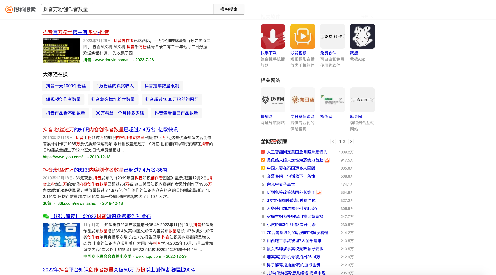

可以看到并没有给出我们想要的答案。再看百度：

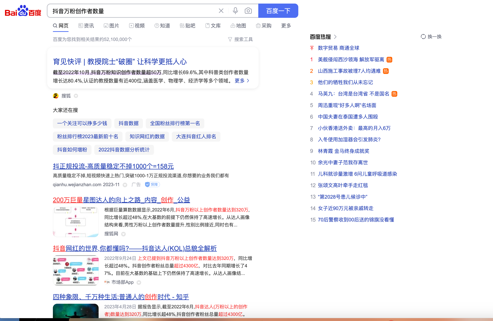

有答案，也做了高亮展示，同时还标明了数据来源，但可惜排序不是第一位，前面两条都是不相干的广告。

最后看谷歌：

直接在第一条就给了我们想要的答案，有高亮展示，同时还标明了数据来源，明显体验是最优的。

**公众号的搜索结果比短视频强，是因为很多视频博主做视频，只管博眼球，不管准确度。**

前面谷歌、微信公众号还有百度给的数据统计时间都是 2022 年 6 月，这个视频博主却说是 2023 年最新统计数据，明显不准确。

那为什么说短视频的搜索结果强于百度呢？
因为最近十年是移动互联网崛起的十年，主要的内容生态基本都沉淀在抖音和腾讯里面，百度知道和百度百科都是十年前的事情了。

**谷歌是最强的，这个是全球公认的，因为它会尽可能地直接给你最准确的答案。**
**谷歌已经很强了，但是如果你掌握了一些基础搜索语法，那么搜索信息资讯会更快更准。**

### 2.2 基础搜索语法

> **先说一个方法论上的提醒：不要把"结果条数"当成硬指标。**
>
> 下文多处会出现"2510 万条 → 不到 900 条"这类对比。这些数字能直观说明语法的收窄效果，但你必须知道：**Google 结果页顶部的条数是一个估算值**，会随时间、地区、登录状态、甚至同一次会话的翻页行为而剧烈变化，你复现时大概率对不上。
>
> **判断语法有没有生效，真正该看的是前 3 条结果的相关性，而不是总数掉了几个数量级。** 下文每一节都会用文字写清"加了语法之后，结果发生了什么质变"，截图只是佐证。

#### 2.2.1 精确匹配 `""`

**在要搜的关键词左右两边加上英文双引号**，Google 会要求这几个字**完整、连续、按原顺序**出现，不做同义词扩展、不拆词。

这是所有语法里使用频率最高、收益也最直接的一个。它解决的核心问题是：**你的关键词被搜索引擎"善意地理解"成了别的东西。**

**场景一：同音不同名，被热门词淹没**

搜索一个叫"易阳千喜"的人，不加引号时结果高达 2510 万条，且首页几乎全部是同音不同名的明星"易烊千玺"——搜索引擎认为你打错字了，主动帮你纠正。加上引号变成 `"易阳千喜"` 之后，结果收缩到不足 900 条，**且首页全部是真正指向这个名字的页面**，纠错行为被彻底关闭。

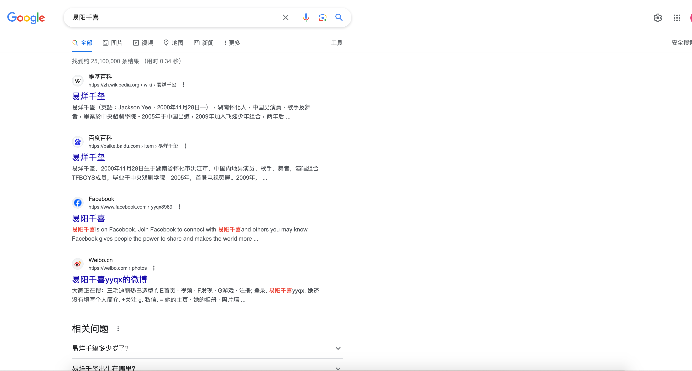

**所以，限定关键词能大幅提高你的搜索效率。**

**场景二：长词组被拆散，匹配到不相干的页面**

搜"国际移民按性别统计"这类报告标题，不加引号时是 2460 万条，Google 把它拆成"国际""移民""性别""统计"几个词分别匹配，首页翻来翻去都是零散的相关页面，**没有一条是完整包含这个短语的**。加上引号后结果只剩不到 10 条，**但每一条都是真正含有这个完整表述的原始文档**——这就是从"大致相关"到"精确命中"的质变。

点击第一条搜索结果进去，发现是一个 PDF 文档，那么怎么找到你想要的信息呢？很简单，`Ctrl+F`（Windows）或 `Command+F`（Mac）输入你的关键字，就能在这份 PDF 文档中迅速定位到你想要的信息，如下图所示，而且这份 PDF 文档也是可以下载的。

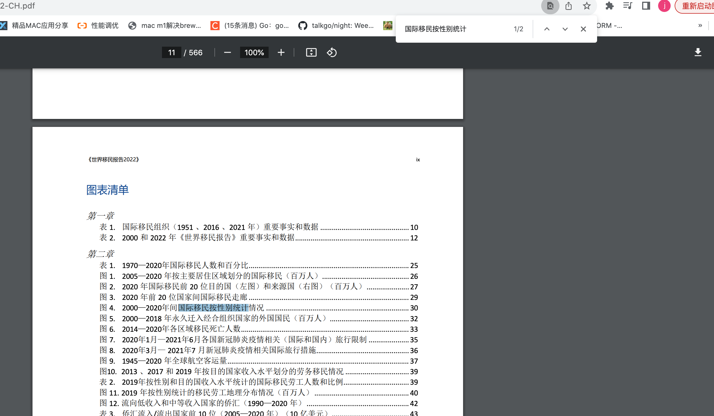

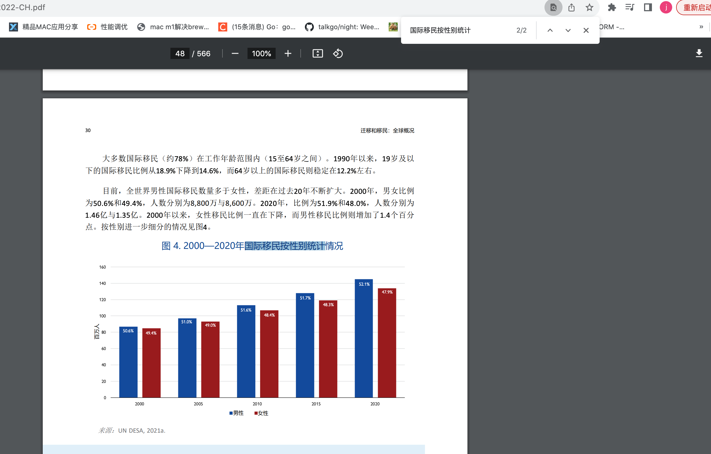

**对程序员尤其重要的用法**：报错信息一定要加引号搜。`"fatal error: concurrent map writes"` 和不加引号的搜索，结果质量完全是两个世界——详见 [6.1](#61-搜索错误信息)。

#### 2.2.2 限定标题 `intitle:`

`intitle:关键词`（英文冒号，冒号后不要加空格）要求**网页标题中必须出现该关键词**。

它的价值在于过滤"顺带提了一嘴"的页面。一篇文章正文里出现某个词，可能只是举例带过；但**如果作者把它写进了标题，说明整篇文章就是围绕它展开的**——这是一个极强的相关性信号。

以 `iPhone15摄像头进灰` 为例：直接搜返回 2240 万条，里面混杂了大量只是提到 iPhone15 或只是讨论摄像头的页面。加上 `intitle:` 之后结果只剩 7 条，**而这 7 条的共同点是标题里都出现了这个关键词，也就是说每一条都在专门讨论这个问题**，没有一条是蹭词的。

**语法可以相互组合，这是搜索技巧真正的威力所在。** 把限定标题和精确匹配叠加使用——`intitle:"iPhone15摄像头进灰"`——结果进一步收敛到 2 条。这时的约束是双重的：标题里必须有这个词，**并且**这几个字必须完整连续地出现（而不是标题里分散地出现"iPhone15"和"摄像头"）。

**程序员常用组合**：`intitle:"go" intitle:"memory leak"`、`intitle:入门 Kubernetes -intitle:培训`。

#### 2.2.3 限定标题多关键词 `allintitle:`

如果你希望标题里同时出现两个、三个甚至更多关键词，逐个写 `intitle:` 很啰嗦，可以用 `allintitle:`——**它后面跟的所有词都必须出现在标题里**。

对比很直接：不加语法时结果高达 1910 万条，用 `allintitle:` 要求标题必须同时出现这两个关键词后，只剩 82 条，**筛掉的全部是"只满足其中一个词"的页面**。

> **⚠️ 一个必须知道的坑**：`allintitle:` 会**接管整条查询**——它后面的所有内容都被当作标题约束，因此它**不能和 `site:`、`filetype:` 等其他操作符混用**（混用时其他操作符会失效或整个查询行为异常）。
>
> 需要组合时，请改用多个 `intitle:`：
> - ❌ `allintitle:Redis 持久化 site:zhihu.com`
> - ✅ `intitle:Redis intitle:持久化 site:zhihu.com`
>
> 同样的规则适用于后面会讲到的 `allintext:` 和 `allinurl:`。

#### 2.2.4 限定正文 `intext:` 与 `allintext:`

`intext:` 要求**网页正文**中包含指定内容。它和 `intitle:` 的分工是：`intitle:` 判断"这篇文章是不是在讲它"，`intext:` 判断"这篇文章里到底有没有提到它"。

> **⚠️ 这里有一个几乎所有中文教程都写错的地方，务必注意：**
>
> **`intext:` 只作用于紧跟它之后的那一个词或一个引号短语。**
>
> 也就是说，`intext:"key1" "key2" "key3"` 里，**只有 key1 受 `intext:` 约束**，key2 和 key3 会退化成普通的精确匹配关键词（它们可能出现在标题、URL 或正文的任意位置）。
>
> **如果你要求"多个词全部出现在正文里"，必须用 `allintext:`：**
> - ❌ `intext:"连接池" "超时" "重试"` —— 只有"连接池"被限定在正文
> - ✅ `allintext:连接池 超时 重试` —— 三个词都必须出现在正文
>
> 代价是 `allintext:` 同样会接管整条查询，不能与 `site:`、`filetype:` 等混用；需要组合时就写多个 `intext:`：
> - ✅ `intext:连接池 intext:超时 site:go.dev`

譬如我们想要搜索标题里有 `ELON MUSK` 关键词，同时正文里包含 `Spacex Starship Update` 的关键词，那我们就可以组合使用 `intitle:` 和 `intext:` 语法提高搜索效率：

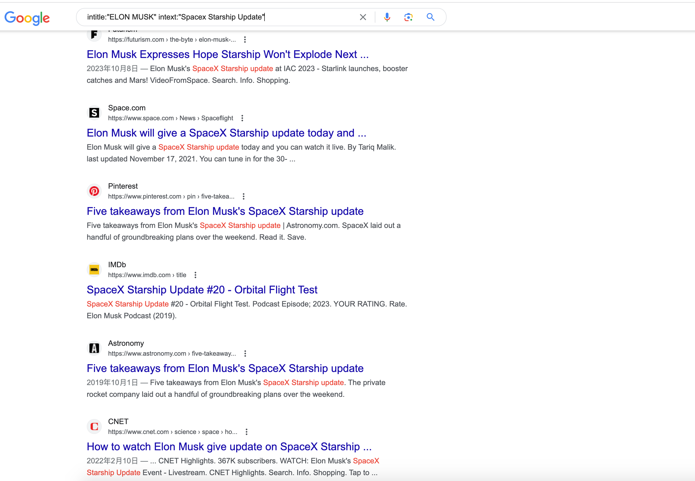

搜索结果 2700 条，**每一条都同时满足两个条件**：标题必须包含 ELON MUSK，且正文里包含完整的 `Spacex Starship Update`。谷歌还会给命中的关键词加高亮，方便你一眼确认是否命中，如此搜索准确度就很高了。

#### 2.2.5 用 intext 搜索个人信息

用 `intext` 语法去搜索个人的相关信息，效率是非常高的。

譬如，我们使用该语法搜索 `"池晨晨" "浙江大学"`

从第一条搜索结果可以看到，此人本科是重庆大学环境工程专业的，考研到了浙江大学，其硕士研究生复试成绩也能看到；往下翻，第六条则告诉我们，有一个来自浙江大学的环境科学硕士叫池晨晨的在 2018 年去了温州市留学人员服务中心工作。

那么第一条和第六条搜索结果里的两个人是同一个人吗？这个只需要简单的交叉比对即可得出结论。点击第一条搜索结果进去，`Command+F` 搜索发现浙江大学 2013 年环境科学硕士研究生复试成绩和拟录取名单只有一个池晨晨，没有重名的。然后点击第六条搜索结果进去查看，这里的池晨晨硕士毕业学校和学历学位都与第一条搜索结果完全吻合。至此，经过简单的交叉比对，我们可以得出结论：这两条搜索结果里的池晨晨是同一个人。

首页的搜索结果里还有一些池晨晨读研期间发表的一些论文。

然后如果我们想要知道她在 2018 年去温州工作后的职业发展情况，我们可以继续使用 `intext` 语法，限定关键词为 `"池晨晨" "温州市"`，以下是搜索结果：

我们可以看到第一条就是有关她的任职通知，点击进去参看，好像没看到她的名字，别着急，使用 `Command+F` 搜一下可以看到左下方有下一篇：中共温州市人力资源和社会保障局党组关于池晨晨等同志任职的通知，点击进去查看，发现她在 2020 年 6 月 8 号已经升职为温州市职业介绍服务指导中心副主任。

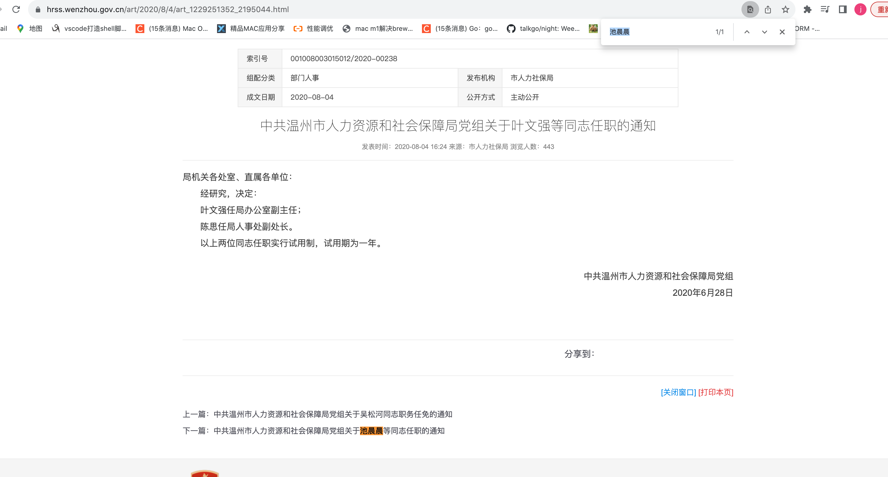

如果我们还想要知道她在温州市职业介绍服务指导中心的工作情况，我们可以继续使用 `intext` 语法，同样的，只需要把第二个关键词替换为温州市职业介绍服务指导中心即可，以下是搜索结果：

可以看到她的具体工作表现，其是温州市地方标准《家政服务溯源管理规范》的主要执笔人，也参与了起草家政便民服务点建设与运营规范和家政服务溯源管理规范等政策文件，这些算是她的政绩，主要活动有就温州"零工市场"官方平台上线接受记者采访报道，参与组织了温州市育婴员职业技能大赛，是组委会办公室副主任等等。

以上都是公开的社会信息，不涉及个人隐私。可以看到，使用 `intext` 语法来搜索个人信息资料还是非常高效的。

#### 2.2.6 限定网址 `inurl:` 与 `allinurl:`

`inurl:关键词` 要求 **URL 中包含该关键词**。

它和 `site:` 的区别值得说清楚：`site:` 需要你**准确知道域名**（`site:cctv.com`），而 `inurl:` 只需要你知道 URL 里可能出现的**一个片段**，它会匹配所有域名或路径里含这个片段的站点。当你不确定确切域名、或者想一网打尽某个机构的所有子站时，`inurl:` 更灵活。

比如你想要搜索央视新闻对李子柒的一些报道，就可以输入 `李子柒 inurl:cctv`：

返回的就全都是央视对李子柒的新闻报道，**每一条搜索结果上边的网址链接都是央视相关的，必定包含 cctv**——包括 news.cctv.com、tv.cctv.com 等各个子站，这是 `site:` 单写一个域名做不到的。

同时还可以组合使用 `intext` 语法，查看更具体的信息，比如央视对李子柒油管粉丝的报道，你可以输入：
`李子柒 inurl:cctv intext:youtube`

`inurl:` 另一个高频用途是**按 URL 结构特征捞资源**，因为很多网站的路径命名是有规律的：
- `inurl:download 年报 filetype:pdf` —— 路径里带 download 的下载页
- `inurl:blog Go 内存模型` —— 只看博客类页面
- `inurl:report 行业研究` —— 见 [3.3](#33-按目的选渠道你搜了要干什么) 用它配合 SimilarSites 聚合垂类站点

如果要求 URL 里**同时**出现多个词，用 `allinurl:`（同样接管整条查询，不能与其他操作符混用）：`allinurl:golang benchmark`。

#### 2.2.7 限定网站来源 `site:`

使用 `site:` 语法可以将搜索结果限定在某个特定网站或域名范围内。它是**信噪比提升最快**的一个语法——因为它把"这个来源可不可信"的判断前置了：你不是在全网捞一遍再挑可信的，而是一开始就只在可信来源里搜。

常用场景：
- 只想看某个权威媒体的报道：`华为 site:reuters.com`
- 只搜索教育机构网站：`人工智能 site:edu.cn`
- 在某个论坛内搜索：`Go内存泄漏 site:stackoverflow.com`
- 搜索某类顶级域名：`机器学习教程 site:edu`（所有 .edu 网站）
- **反向排除**：`Go并发编程 -site:csdn.net`（配合 [2.2.11](#2211-排除关键词--) 的减号，屏蔽你不想看的站）

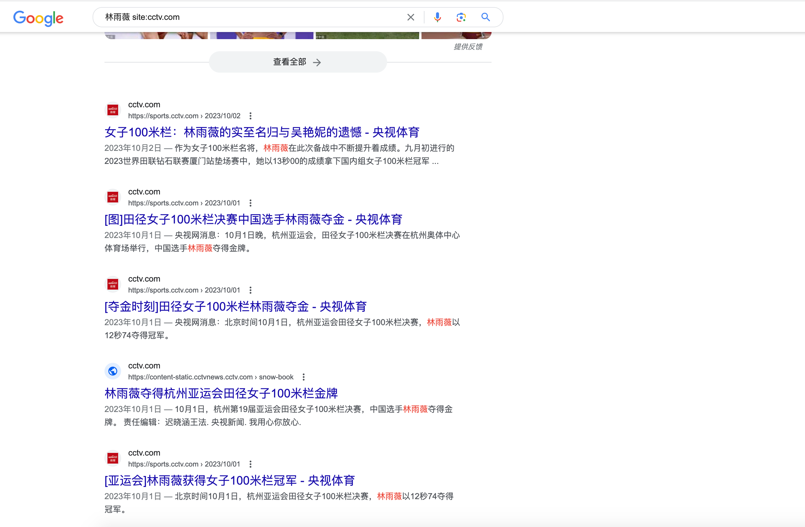

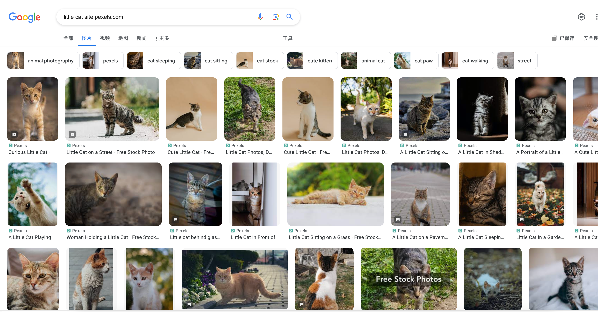

对程序员来说，`site:` 最大的价值是**直接钻进官方文档**，绕开所有二手翻译和过时博客——详见 [6.2](#62-搜索官方文档)。

#### 2.2.8 限定图片尺寸 `imagesize:`

当你需要特定尺寸的图片时（比如做 PPT 需要 1920x1080 的背景图，或者做手机壁纸需要 1080x2400 的图片），可以使用 `imagesize:宽x高` 来精确搜索。例如：`风景壁纸 imagesize:3840x2160` 可以直接搜到 4K 分辨率的风景壁纸。

**注意两点**：
1. 这个语法**只在"图片"标签页下生效**，在网页搜索标签下无效；
2. 它是**精确匹配**尺寸，不是"大于等于"。如果结果太少，改用图片搜索页的 `工具 → 尺寸 → 大于…` 做范围筛选。

#### 2.2.9 限定文件格式 `filetype:` / `ext:`

`filetype:pdf` 把结果限定为某种文件格式。`ext:` 是它的等价别名，两者可以互换。

> **⚠️ 需要纠正一个常见误传**：网上流传的 `关键词:pdf` 这种写法（比如 `权力的游戏:torrent`）**不是 Google 的合法语法**，冒号在这里只会被当成普通字符处理，起不到任何过滤作用。**只有 `filetype:` 和 `ext:` 这两种写法有效。**
>
> 另外，`filetype:` 只能匹配 Google **实际抓取并索引过的文件类型**——主要是 pdf、doc/docx、xls/xlsx、ppt/pptx、txt、csv、rtf、ps、swf 等文档格式。**torrent、exe、zip、mp4 这类不属于可索引文档，写了也搜不到。** 找影视资源请走 PT 站或专门的资源站，不要指望这个语法。

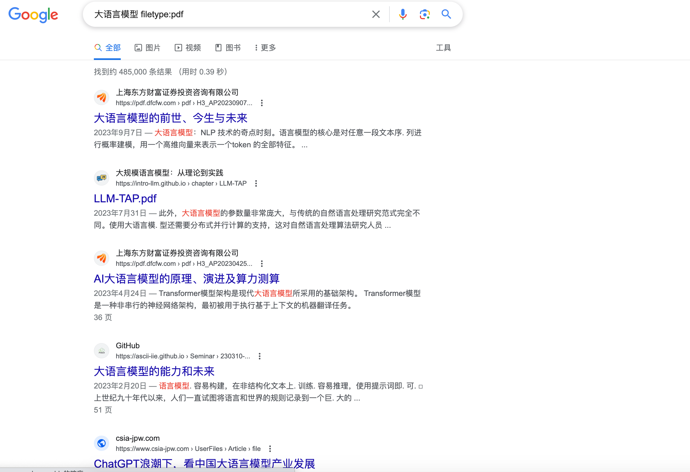

**最高价值的用法：找行业研究报告。**

证券研究所和咨询公司的研究报告是非常好的扫盲材料。当你需要快速了解某个行业的时候，就先搜某个行业的研究报告，可以通过直接搜索 `关键词 filetype:pdf` 的方式找到相关的研究报告，有助于你快速地了解这个行业的概况、现状以及未来可能的发展趋势。

这类报告的好处在于：**它们通常由专业机构撰写、有数据来源、有完整的行业框架**，一份 50 页的券商报告顶得上你读二十篇公众号文章，而且不用担心被自媒体二次加工时夹带私货。

**图片格式要在图片标签页下搜。**

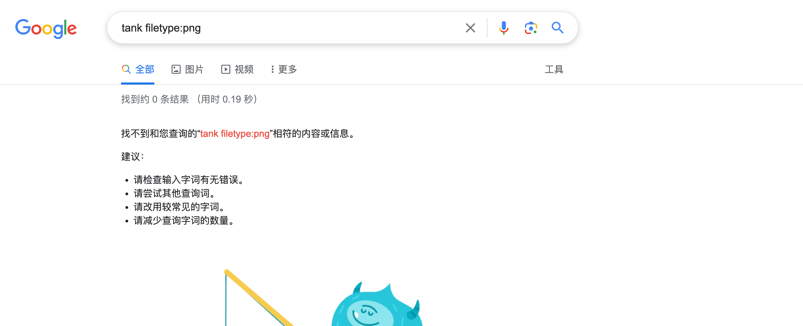

直接在网页搜索里搜 png 是没有结果的（png 不是可索引的文档类型），**点击"全部"右边的"图片"标签就有结果了**：

点击 png 文件可以发现你可以选择任意格式图片进行搜索：

#### 2.2.10 直奔信息源头

这个需要你有一定的网络常识。比如你想要知道 ChatGPT 最新的资讯，那你首先要知道开发它的公司是 OpenAI，这样你可以去推特上找到并关注它，便可获取其相关的最新资讯。

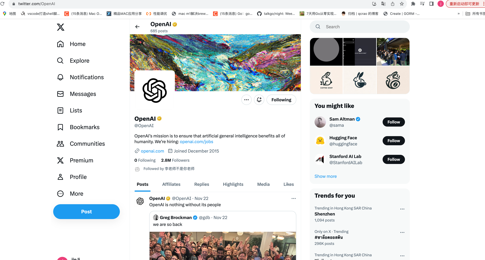

再比如你是做电子产品测评的博主，想剪辑一小段苹果新品发布会视频作为素材，去哪找？很简单，你可以去油管的苹果官方频道：

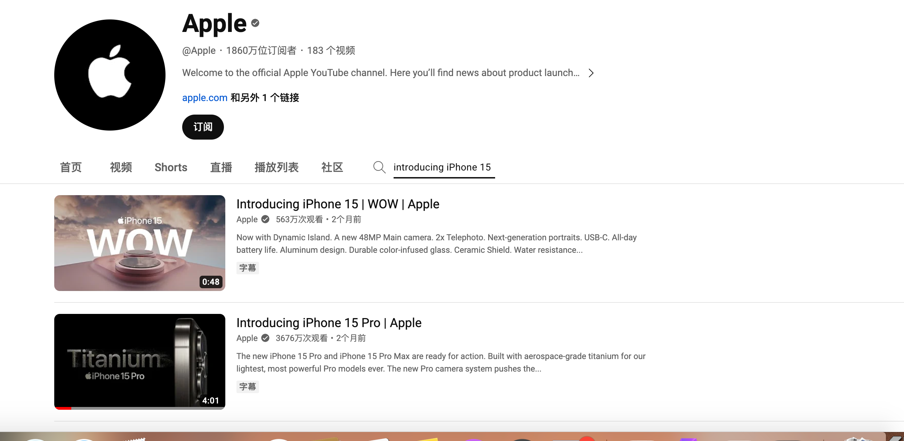

判断信息准确度要看信息源，要看出处，**越是一手源头的信息越准确可信**，张口就来或者说转了 18 次手的信息一般不可信。

这条原则在 AI 时代反而更重要了：AI 给你的答案本质上是"转了 N 手"的压缩产物，**关键结论必须回到一手源头核对**。

**学习差距 = 信息差 x 时间投入**
**而信息差很大程度上取决于你的搜索技术的强弱。**

#### 2.2.11 排除关键词 `-`

这可能是日常搜索中使用频率最高的技巧之一。在关键词前加上 `-`（减号）可以排除包含该词的结果，帮你快速过滤掉不想要的噪音。

**注意：减号前面要有空格，减号后面紧跟要排除的关键词，中间不能有空格。**

常用场景：
- `苹果 -水果 -食谱` → 排除水果相关结果，只搜 Apple 公司的信息
- `Go教程 -菜鸟教程` → 排除某个你不想看的网站的内容
- `Python爬虫 -培训 -广告` → 排除培训广告，只看技术内容
- `免费图片素材 -付费 -VIP` → 只找真正免费的素材

减号可以作用在**任何操作符**上，不只是普通关键词，这才是它真正好用的地方：
- `Go并发编程 -site:csdn.net` → 排除某个站点
- `Kubernetes 教程 -intitle:培训` → 排除标题带"培训"的页面
- `机器学习 入门 -filetype:pdf` → 排除 PDF，只看网页

#### 2.2.12 逻辑或 `OR` / `|`

默认情况下，搜索引擎会查找同时包含所有关键词的结果。使用 `OR`（**必须大写**，小写的 or 会被当成普通词）可以搜索包含任意一个关键词的结果，相当于扩大搜索范围。竖线 `|` 是 `OR` 的等价简写，敲起来更快。

- `(教程 OR tutorial) Go语言` → 同时搜中文"教程"和英文"tutorial"
- `(Redis OR Memcached) 缓存方案` → 同时搜两种缓存中间件的方案
- `(kafka OR rocketmq OR pulsar) 消息队列对比` → 一次搜三种消息队列
- `Go (性能优化 | 调优 | profiling)` → 用 `|` 简写，效果相同

`OR` 在你不确定对方使用哪个词来描述同一件事时特别有用。**它也可以和其他操作符组合**，这是很多人不知道的：

- `context 取消 (site:go.dev | site:github.com)` → 在两个站点里同时搜
- `Go 最佳实践 (filetype:pdf | filetype:ppt)` → 同时找两种格式

用括号显式分组是个好习惯——不加括号时 Google 对优先级的处理并不总是符合直觉。

#### 2.2.13 通配符 `*`

星号 `*` 可以作为通配符，代替一个未知的词。当你记不全完整的短语或想探索不同表达时非常有用。

**它必须写在双引号内才可靠生效**——引号外的 `*` 通常会被忽略。

- `"最好的 * 编程语言"` → 搜索"最好的 xxx 编程语言"的各种说法
- `"Go * 最佳实践"` → 匹配"Go 并发最佳实践""Go 错误处理最佳实践"等
- `"how to * in Go"` → 搜索各种 Go 语言的 how-to 指南
- `"Go 1.* 泛型"` → 不确定具体是哪个小版本时

一个实用技巧：**当你只记得一句话的开头和结尾时**，用 `*` 补中间，往往能一把捞出原文——`"过早优化是 * 根源"`。

#### 2.2.14 邻近搜索 `AROUND(N)`

`AROUND(N)` 要求两个关键词之间**相隔不超过 N 个词**。它填补了一个真实存在的空白：

- 双引号太严——要求一字不差地连续出现；
- 空格分隔太松——两个词可能一个在开头、一个在结尾，八竿子打不着。

`AROUND(N)` 卡在中间：**两个词必须挨得足够近，近到它们大概率在讲同一件事。**

写法上 `AROUND` 必须大写，括号里是数字，两边留空格：

- `Go AROUND(3) 内存泄漏` → 两个词相距 3 个词以内，能捞到"Go 服务内存泄漏""Go 程序的内存泄漏排查"等各种表述
- `"connection pool" AROUND(5) "timeout"` → 连接池和超时被放在一起讨论的段落
- `goroutine AROUND(4) leak` → 比 `"goroutine leak"` 宽松，比 `goroutine leak` 精确

这个操作符 Google 从未正式写进文档，但一直可用。**中文技术检索里它的价值尤其高**，因为中文表述的变体太多（"内存泄漏""内存泄露""内存溢出"前面还可能插入各种定语），双引号经常因为差一个字就全部落空，而 `AROUND(N)` 能容忍这种变化。

#### 2.2.15 限定时间范围 `before:` / `after:`

搜索技术相关内容时，时效性至关重要。2019 年的 Go 教程和 2026 年的 Go 教程差别可能很大。使用 `before:` 和 `after:` 可以限定搜索结果的时间范围（格式为 `YYYY-MM-DD`，也支持只写 `YYYY` 或 `YYYY-MM`）。

- `Go 1.24 新特性 after:2025-01-01` → 只搜 2025 年之后的内容
- `Docker最佳实践 after:2024-01-01 before:2025-12-31` → 限定在某个时间段内
- `React vs Vue after:2025-06-01` → 只看最近的对比文章

**这个语法对程序员来说尤其重要——技术文章过时很快，用时间范围能有效避免踩到过时信息的坑。**

**反过来用同样有价值**：`before:` 可以帮你找"当年的原始讨论"。比如排查一个老框架的历史设计决策，`某框架 设计 before:2018` 能过滤掉后来所有的二次解读，直接看到当时的一手争论。

> **一个注意点**：Google 判定的是它抓取到的**页面日期**，而很多站点会在内容不变的情况下刷新这个日期（尤其是内容农场），所以 `after:` 并不能百分之百保证内容是新的，只能大幅提高概率。真正确认时效性还是要看正文里的版本号和示例代码。

#### 2.2.16 查找相似网站 `related:`

当你找到一个好用的网站，想发现类似的网站时，可以使用 `related:` 语法。

- `related:github.com` → 找到类似 GitHub 的代码托管/开源平台
- `related:stackoverflow.com` → 找到类似 Stack Overflow 的技术问答社区
- `related:medium.com` → 找到类似 Medium 的博客平台

> **⚠️ 实际可用性提醒**：Google 近几年大幅收缩了 `related:` 的覆盖面，**目前它基本只对流量很大的知名站点有结果，对中小站点和绝大多数中文站点会直接返回空**。上面三个例子是能出结果的，但换成一个小众站点大概率什么都搜不到。
>
> 把它当成"能用就赚到"的补充手段即可。需要稳定、可批量的相似站点发现，用 **SimilarSites** 这类专门工具更可靠——[3.3](#33-按目的选渠道你搜了要干什么) 里会讲怎么把它和 `inurl:` 配合起来聚合一个垂类的所有头部网站。

#### 2.2.17 快速查看定义 `define:`

快速查看某个词的定义，无需点击任何搜索结果。

- `define:idempotent` → 直接显示"幂等"的定义

> **⚠️ 实际可用性提醒**：`define:` 走的是 Google 内置的**词典**，因此它**只对词典里收录的单词可靠**，主要是英文单词。
>
> 像 `define:CAP theorem`、`define:eventual consistency` 这类**多词专业术语，通常不会触发定义卡片**，而是退化成普通搜索。
>
> 查专业术语更实际的两个办法：
> - 直接搜 `CAP theorem 是什么` 或 `what is eventual consistency`，Google 的摘要卡片覆盖面比 `define:` 广得多；
> - 直接问 AI（见 [AI搜索篇](AI搜索.md)），概念解释本来就是 AI 最擅长的场景之一。

#### 2.2.18 不用记语法：搜索工具栏与 Verbatim

前面讲了十几个操作符，但有一个事实值得单独说：**日常最常用的两个能力，其实不用记语法，点两下鼠标就行。**

在 Google 搜索结果页，关键词框下方有一个「**工具**」按钮，点开后有两个下拉框：

**1）时间筛选**——"时间不限 / 过去一小时 / 过去 24 小时 / 过去一周 / 过去一个月 / 过去一年 / **自定义范围**"。

这等价于 `before:` / `after:`，但胜在**可以快速试错**：先看过去一年，太少就放宽到五年，不用反复改查询串。排查技术问题时我用它的频率远高于 `after:`。

**2）Verbatim（完全一致）**——在"所有结果"下拉框里选择"**完全一致**"。

这个开关的作用是：**关闭 Google 所有的智能改写行为**——不做同义词扩展、不做拼写纠正、不做词干还原、不擅自忽略你输入的某个词。

它和双引号的区别很关键：
- **双引号**要求这几个字**连续出现**；
- **Verbatim** 不要求连续，但要求**你输入的每一个词都必须原样出现**。

什么时候必须用它？**当你搜一个很生僻的报错、一个内部代号、一个罕见的函数名，Google 却"好心"把它纠正成了别的词时。** 你会看到结果页顶部写着"改为显示 xxx 的搜索结果"——这时候开 Verbatim，就能拿到真正基于你原始输入的结果。

**经验法则**：先用工具栏快速探路，确定方向后再用语法精确表达和保存复用。语法的真正优势不是"更强"，而是**可以写下来、可以分享、可以做成书签反复用**。

## 3 知识技能的搜索

### 3.1 知识资源的三种类型

> **免费全公开的**

这种资料，一般去谷歌就能搜到。

> **免费私域的**

一般是某个微信公众号、知乎专栏等等。

> **收费私域的**

譬如得到 app、极客时间上的付费课程、知识星球以及知乎 live 等等。

国内的互联网生态随着内容电商和自媒体的兴起，零成本抄袭和零碎的交付大行其道，导致到处充斥着同质化严重、低质量、十八手零碎的知识垃圾，基本上没救了，B 站和得到 app 算是最后的希望。

从时间线上来看，15 年前互联网上的知识技能主要沉淀在百度知道和百度贴吧以及一些论坛网站里；10 年前则转移到知乎和微信公众号；5 年前逐步转移到音视频网站，比如抖音、快手、B 站、得到 app，小红书等等。

**呈现出两个明显的变化趋势：**
**从电脑端转向移动端；**
**从文字转向视频**

**同时，音频交付兴起，以适应碎片化的学习**

如果你想要搜索国外的知识技能的话，就认准 Google 和 YouTube 即可。不懂英文没关系，谷歌翻译帮你搞定，如果不满意谷歌翻译，可以使用 ChatGPT 等通用模型帮你解决。

### 3.2 按载体选渠道：知识附着在哪？

这么多渠道，到底应该去哪里搜呢？第一个判断角度是**看你要的知识最有可能附着在哪类载体上**。

比如你作为程序员，想要学习消息中间件 Kafka，这种教程可以去极客时间上找相关的付费专栏或视频课程来学习；如果你毕业了还想搜国内比如说知网的论文，那你去万能的淘宝买个账号去下载就好了；如果是国外的学术论文 PDF 文档，那你可以使用谷歌学术找到论文的标题，然后拿着论文标题去 **Sci-hub** 去搜索下载论文。

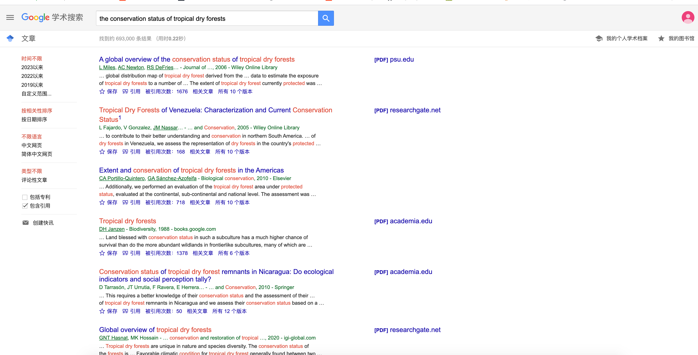

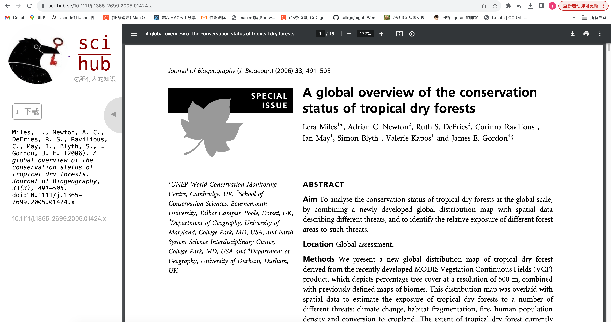

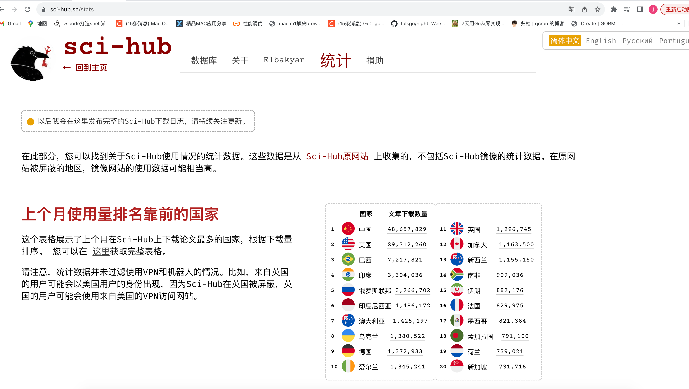

可以看到，在 sci-hub 上白嫖论文最多的就是中国的科研人员。

**谷歌学术自己也有一套检索语法**，比普通 Google 搜索更适合找论文，值得单独记一下：

| 语法 | 作用 | 示例 |
|---|---|---|
| `author:"姓名"` | 按作者检索 | `author:"Rob Pike"` |
| `source:"期刊名"` | 限定发表的期刊或会议 | `source:"Communications of the ACM"` |
| `intitle:` | 论文标题包含关键词 | `intitle:"consistent hashing"` |
| `""` / `-` / `OR` | 与普通 Google 搜索一致 | `"raft consensus" -blockchain` |

再配合左侧栏的**年份筛选**和**按被引用次数排序**，基本能覆盖找论文的大部分需求。判断一篇论文值不值得读，最快的信号就是**被引用次数**——点进"被引用次数 xxx"还能反查后续引用它的工作，顺着这条线可以快速摸清一个方向的脉络。

如果你要搜索电子书，中文的就用鸠摩搜书，英文书直接 Google 搜索 `best free ebook download sites`：

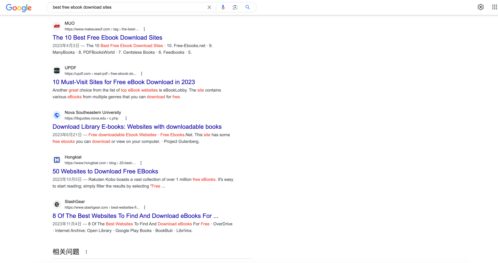

还有一些人乐于分享，将资源打包上传到了百度网盘，这时候你就需要网盘搜索引擎了。

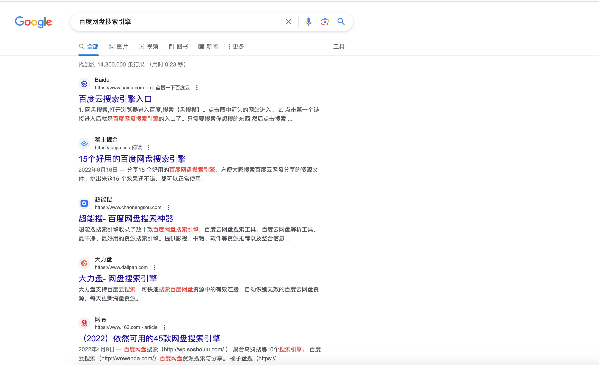

### 3.3 按目的选渠道：你搜了要干什么？

第二个判断角度是**看你搜索知识技能是为了什么**。

如果你是想要 know sth，那谷歌搜索是最强的，但是国内腾讯的互联网生态比较封闭，谷歌搜索不到微信公众号里的文章，这时候你可以使用微信的搜一搜或者搜狗搜索。

另外，一些垂类社群和聚合网址，也沉淀了大量有用的知识经验。譬如以程序员为例，海外的 GitHub、Stack Overflow 还有国内的 CSDN、博客园、简书、51CTO 等等。还有针对产品经理、设计师等行业的垂类网址，比如产品经理导航网址、设计师导航网址、新媒体导航网址等垂类导航网址。

那么，具体要怎么找到这些垂类网站呢？很简单，谷歌搜索即可，譬如 `xx行业/xx岗位必逛的网站` 或者 `xxx行业的导航网址`，就可以得到你想要的结果。

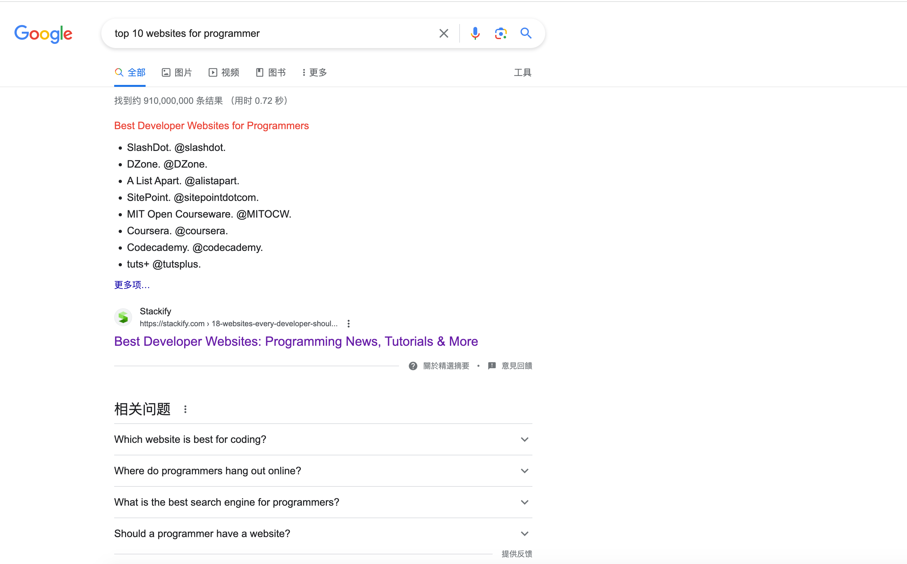

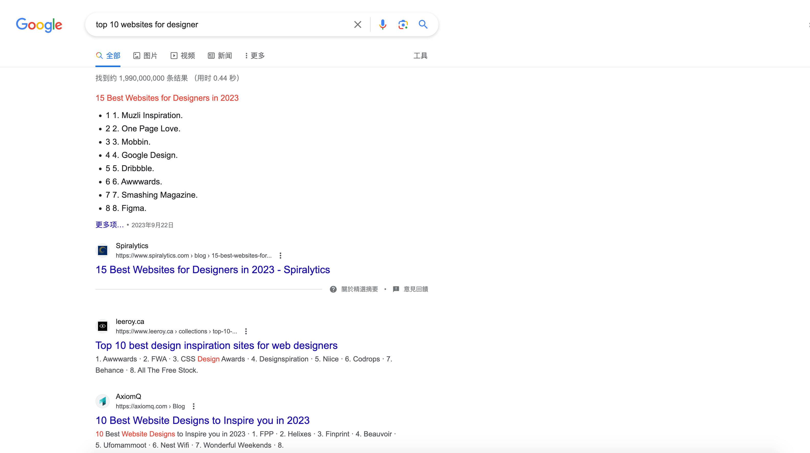

如果要搜索文档，可以使用 `filetype:` 语法快速找到证券公司、咨询公司、非营利机构还有大厂发布的研究报告。还有一个方法是去垂类的网站上去找，那么怎么找到这些垂类网站呢？

> 可以使用 `inurl:` 语法找到几个网站，然后使用 **SimilarSites** 去搜索相似的网站为你所用。

例如：

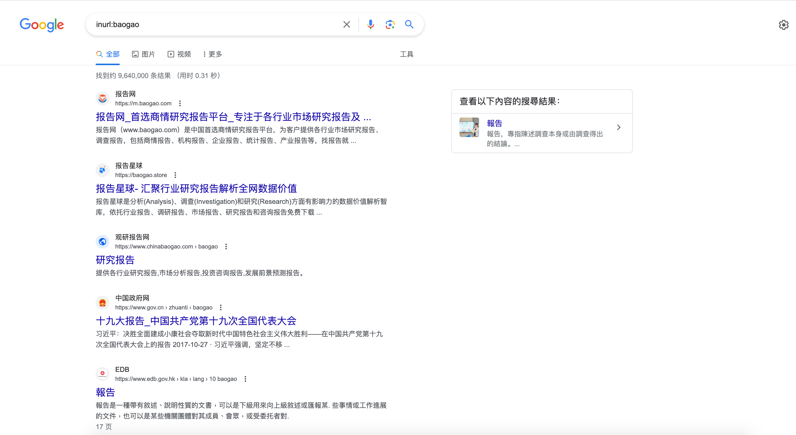

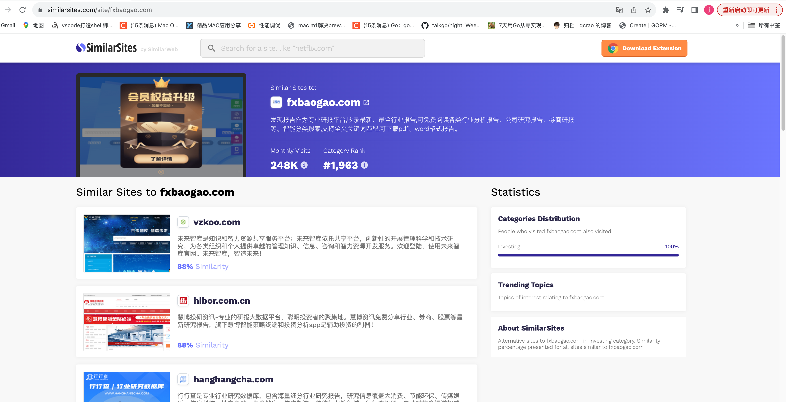

因此，使用 `inurl:` 语法和 SimilarSites 可以帮助你轻松聚合某个垂类所有的头部网站，然后你可以建一个书签把这些网站都收集到一块儿以便使用。

（Google 自带的 [`related:`](#2216-查找相似网站-related) 是这套打法的轻量替代，不用装工具，但覆盖面窄很多，只对知名大站有效。）

### 3.4 搜索资料的品味

如果你是要 learn sth 或 create sth，那就需要高质量的学习资源或资料文档，这时候找第一手的学术论文和书籍就很重要了。搜索资料，你得有自己的品味，注意挑选高质量的资料，譬如视频教程，就找播放量或销量最高的；学术论文综合考量下相关度和被引用次数等等，否则你学到的知识都是别人喂给你的知识垃圾，这种垃圾，短视频里最多。

作为成年人，尤其是职场人，千万不要遇到一丁点儿问题就张嘴问别人要资料要答案要工具。要知道在职场，没有经过搜索就直接问人是极其不礼貌的，搜索后还没找到答案，或者自己实践操作遇到问题，此时结合搜索结果带着自己的思考或者说理解再去请教别人才会更愿意教你，毕竟，这时候别人可以很明显地看出来你是下过功夫的。

## 4 素材文件的搜索（视频、音频、图片、文件）

### 4.1 影视资源

影视剧的话，有钱就直接充视频网站的会员，比如国内的爱优腾、B 站和芒果 TV，海外的比如奈飞、HBO 等等。不想花钱的话就去搜免费在线观看的资源，但是垃圾广告比较多，画质一般，影响观看体验；如果网速还可以的话，建议弄几个 PT 站的会员，里面各种高清资源多的是，但是有分享率的要求，就是下载多了，对上传量也有一定要求。

### 4.2 创作素材：音视频和图片

从创作者的角度，这里分享一些免费的高质量音视频和图片素材网站：
- pexels
- pixabay
- videvo
- mixkit

当然，也可以直接去谷歌搜索，一般都会有人总结这方面的网站。

**视频下载**

YouTube 上的视频也是可以下载的，这里推荐两个 app。

**BGM 和音频**

BGM 和音频也是类似的思路：比如你可以去 Google 搜索 `best sites for free bgm`

**图片下载**

有版权的也可以下载，你可以复制图片文件的 url 去 imageDownloader 下载。

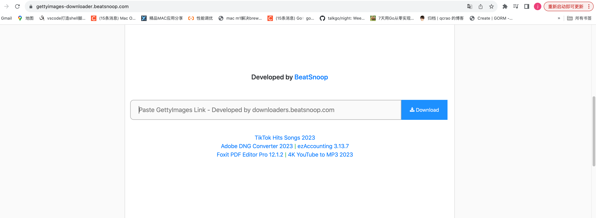

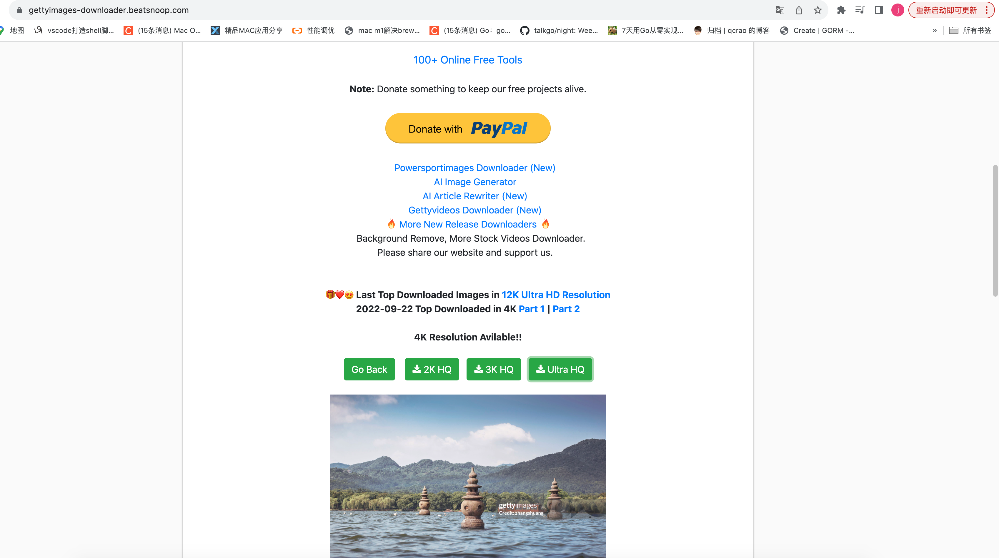

即便是有版权的图片，只要你下载不是用作商业用途，一般也不会有什么麻烦。

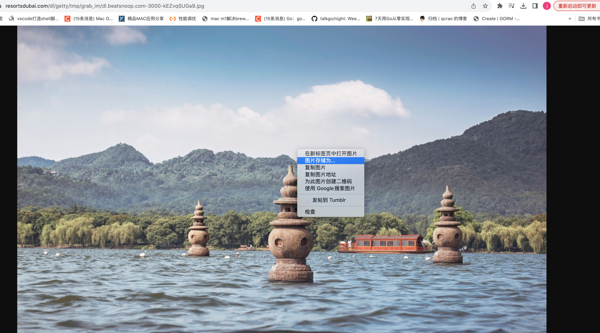

### 4.3 GIF动图、图标和PPT模板

GIF 动图也是一样的，你可以直接去 Google 搜索 `best gif sites`，找到一个网站，点击进去搜索你感兴趣的下载。

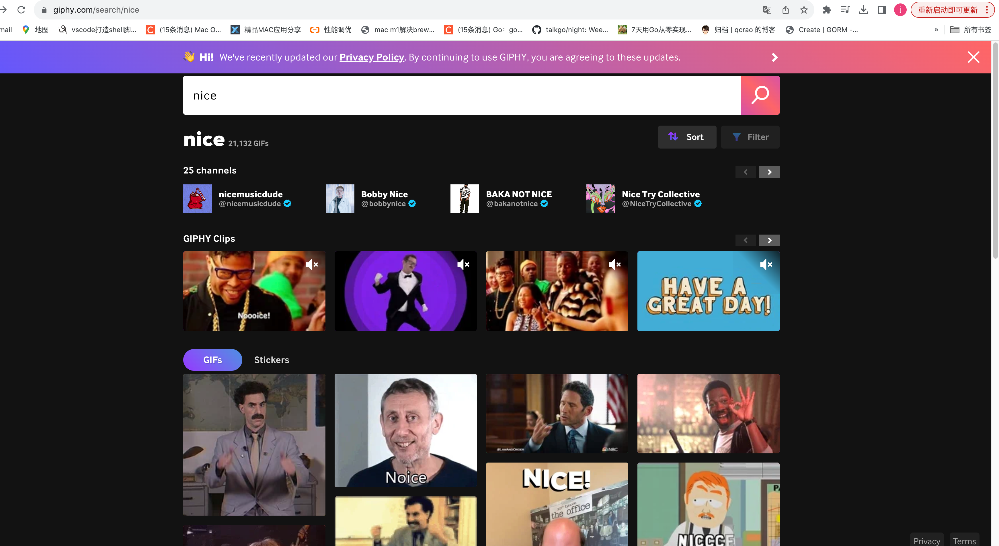

icon 图标的话，搜索 `关键词 icon filetype:png`

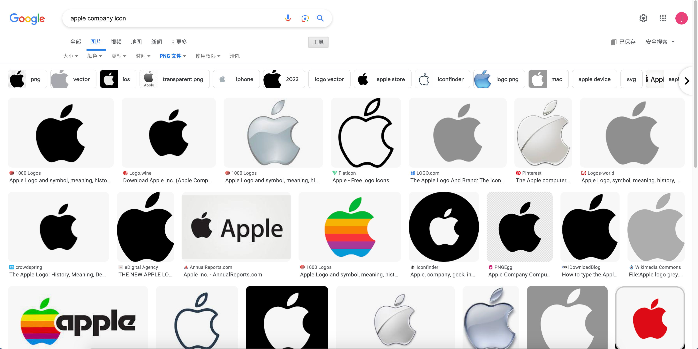

PPT 模板，有两个地方值得推荐，一是 iSlide 插件，还有就是在线设计网站 canva。

### 4.4 以图搜图：反向图片搜索与 Google Lens

前面讲的都是"用文字找图"，但还有一个方向同样重要：**用图找信息**。这是纯文字搜索完全覆盖不到的一块，也是目前 AI 对话工具还替代不了的能力。

**三种入口**：
1. 打开 [images.google.com](https://images.google.com)，点搜索框里的**相机图标**，上传图片或粘贴图片 URL；
2. 在 Chrome 里对着任意图片**右键 → "使用 Google 搜索图片"**，这是日常最快的方式；
3. 手机上用 **Google Lens**，可以直接拍照搜。

**它能解决什么问题**：

| 场景 | 用法 |
|---|---|
| **找原图 / 更高清的版本** | 上传低清图，Lens 会列出各种尺寸，直接挑最大的那张 |
| **查图片出处和版权方** | 做自媒体时确认一张图能不能用，先反查它最早出现在哪 |
| **验证一张图是不是被挪用** | 新闻配图、朋友圈"现场照"，反查一下常能发现是几年前的旧图 |
| **辨别 AI 生成图** | 真实照片通常能找到多个来源和拍摄背景，AI 图往往只在一两个平台出现过 |
| **识别物品 / 植物 / 建筑** | 不知道叫什么，就没法用文字搜——这时候只能以图搜图 |
| **找同款商品** | 截个图，Lens 直接给出购买链接 |

**Lens 还能框选局部**：上传整张图后拖动选框，只搜其中一个物体，准确率比整图搜高很多。

这个能力和 [2.2.10 直奔信息源头](#2210-直奔信息源头) 是一脉相承的——**反向图片搜索本质上就是给图片做溯源**。在 AI 生成内容泛滥之后，这一步的重要性只会越来越高。

## 5 工具软件的搜索

工具软件有四种形态：
- mac/windows 电脑软件
- android/ios app
- edge/chrome 浏览器插件
- plugin 电脑软件插件

### 5.1 搜索优先级：在线工具 > 下载软件 > 安装插件

这些生产力工具都是很多的，使用它们其实是有优先级顺序的，首先考虑在线工具，然后是下载软件，最后才考虑给软件安装插件。

现在 SaaS 服务和云计算其实已经很成熟了，直接通过网页端就能够实现我们大部分需求。像 Midjourney 和 ChatGPT 这种非常吃算力的服务，都是通过网页端实现的。不管多么神奇古怪的需求，都能找到对应的神奇工具。

去 Google 搜索 `xxx需求 online` 即可。

常用的在线工具举例：

| 需求 | 推荐工具 |
|------|---------|
| 设计海报 | canva |
| 在线抠图 | remove.bg |
| 文字转语音 | 腾讯智影、Azure |
| 脑图/概念图 | miro、canva |
| 找台词 | 找台词网 |
| 在线剪辑视频 | Clipchamp、Flexclip |
| 测网速 | fast.com |
| 检测陌生链接安全性 | virustotal.com |

### 5.2 发现新工具的方法

对于电脑端和手机端哪些是常用的生产力工具，我们一般自己心里都有数，但是也要时不时地去谷歌或 YouTube 搜一搜，比如 `top 10 best mac apps productivity` 或者 `best apps 2026` 等等，也许会有惊喜。

还有一个很不错的思路是去 **alternativeto.net** 这个网站寻找一些你平时可能不知道的新奇软件。它主要是帮你找某个软件的替代软件。

### 5.3 浏览器和软件插件

浏览器有很多好用的插件，尤其是 Chrome 浏览器。

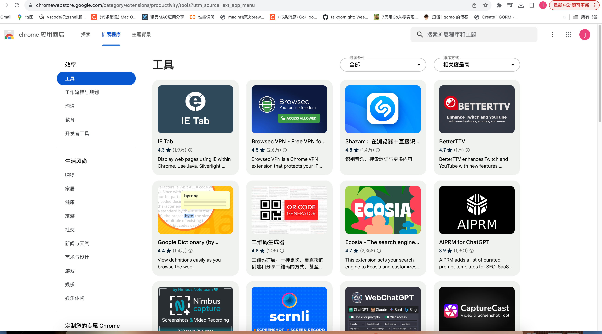

我们也可以去 Google 搜索有哪些好用的插件：

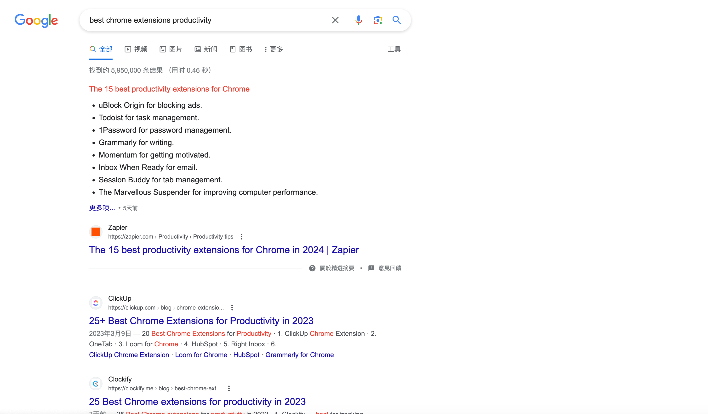

同样的对于软件的插件，我们也可以去谷歌搜索，譬如：
`best plugins for powerpoint`

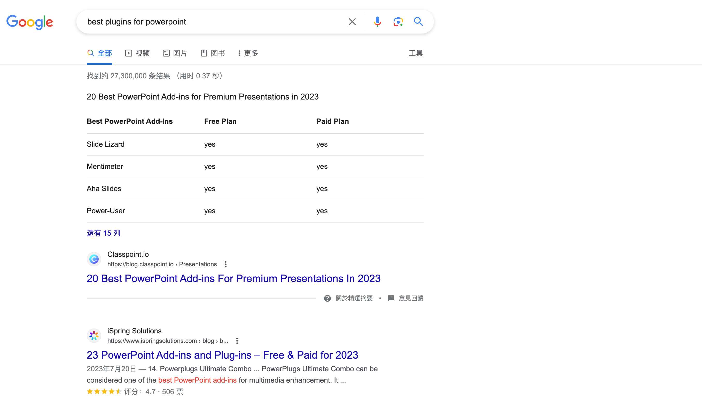

## 6 程序员搜索技巧

作为程序员，搜索是日常工作中最高频的技能之一。以下是一些专门面向开发者的搜索技巧。

> **⚠️ 贯穿本章的一条规则：站内语法和 Google 语法不能混用。**
>
> GitHub 的 `language:` / `path:` / `stars:`、Stack Overflow 的 `[tag]` / `is:answer` / `score:`，都是**这些站点自己的搜索框里才生效的语法**。把它们写进 Google，只会被当成普通字符串，起不到任何过滤作用；反过来把 Google 的 `site:` 写进 GitHub 搜索框也一样无效。
>
> **先决定"我要在哪个搜索框里敲"，再选语法。** 三套语法分别整理在 [7.1](#71-google-搜索语法) / [7.2](#72-github-站内代码搜索语法) / [7.3](#73-stack-overflow-站内搜索语法)。

### 6.1 搜索错误信息

遇到报错时，**直接复制错误信息加双引号搜索**是最高效的方法。但需要注意：
- 去掉错误信息中的文件路径、变量名、端口号、UUID 等**个性化部分**，只保留通用的错误描述——这些独一无二的片段会让搜索结果直接归零
- 保留错误码（如 HTTP 429、Exit Code 137 等）

例如：
- `"fatal error: concurrent map writes"` → Go 并发写 map 的错误
- `"connection refused" MySQL Go` → Go 连接 MySQL 被拒绝
- `"context deadline exceeded" gRPC` → gRPC 调用超时

如果英文错误信息搜不到好结果，可以加上编程语言名称来缩小范围：
`"slice bounds out of range" Go`

**如果加了引号反而搜不到**，试试这两招：
- 打开 **Verbatim**（见 [2.2.18](#2218-不用记语法搜索工具栏与-verbatim)），防止 Google 把生僻的报错词纠正掉；
- 用 `AROUND(N)`（见 [2.2.14](#2214-邻近搜索-aroundn)）替代双引号，容忍版本间的措辞差异：`"connection reset" AROUND(5) godror`。

### 6.2 搜索官方文档

用 `site:` 语法直接在官方文档中搜索，比通过搜索引擎搜到的第三方教程更准确：

- `site:go.dev context WithTimeout` → 在 Go 官方文档中搜 context 用法
- `site:redis.io CLUSTER` → 在 Redis 官方文档中搜集群相关内容
- `site:dev.mysql.com InnoDB lock` → 在 MySQL 官方文档中搜 InnoDB 锁机制
- `site:kafka.apache.org consumer group` → 在 Kafka 官方文档中搜消费者组

配合 `after:` 可以避开被搜索引擎缓存的旧版本文档页：
`site:go.dev 泛型 类型约束 after:2024-01-01`

### 6.3 GitHub 代码搜索

**以下语法只在 GitHub 自己的搜索框里生效**（github.com/search），不能写进 Google。

- `language:go "sync.Pool"` → 搜索 Go 项目中使用 sync.Pool 的真实代码
- `language:go "errgroup" stars:>100` → 搜索 star 数大于 100 的 Go 项目中 errgroup 的用法
- `path:go.mod "go-redis"` → 搜索使用 go-redis 库的项目
- `path:Makefile "golangci-lint"` → 搜索 Makefile 中配置 golangci-lint 的项目

> **注意 `filename:` 已经是旧写法。** GitHub 在 2023 年上线的新版代码搜索统一改用 `path:`——`path:go.mod` 既能匹配文件名也能匹配路径。老教程里的 `filename:go.mod` 应当替换为 `path:go.mod`。

这比看教程更有价值——你能看到**生产级项目中真实的代码组织和用法**。

如果你想用 **Google** 去搜 GitHub（比如想搜 README 和 Issue 而不是代码），那就得换成 Google 语法：
`Go 限流器 实现 site:github.com`

### 6.4 Stack Overflow 高效搜索

这里必须区分两个搜索框，很多教程把它们混为一谈：

**（1）在 Stack Overflow 站内搜索框里**，可以用它自己的语法：

- `[go] goroutine leak` → go 标签下关于 goroutine 泄漏的问答
- `[mysql] deadlock InnoDB` → mysql 标签下关于 InnoDB 死锁的问答
- `[go] context is:answer score:10` → 只看高分答案
- `[go] channel answers:0` → 找还没人回答的问题

**（2）在 Google 里搜 Stack Overflow**，只能用 Google 语法，`[tag]` 在这里是无效的：

- `goroutine leak site:stackoverflow.com` ✅
- `~~[go] goroutine leak site:stackoverflow.com~~` ❌ —— `[go]` 只是普通字符
- 想近似实现标签过滤，可以用 URL 特征：`goroutine leak inurl:questions/tagged/go`

实际经验是：**先用 Google 搜（覆盖面广、排序好），确定问题所在后再回 Stack Overflow 站内用标签和分数精筛。**

### 6.5 搜索 RFC 和技术标准

当你需要了解某个协议或标准的权威定义时，最可靠的是直接去官方站点，而不是靠 `filetype:` 碰运气——RFC 的官方发布格式是 txt 和 html，PDF 只是少数镜像站的二次产物。

- `site:rfc-editor.org 9110` → RFC 官方仓库，最权威
- `site:datatracker.ietf.org WebSocket protocol` → IETF 的标准跟踪系统，能看到草案演进过程
- `"RFC 9110" HTTP semantics` → 搜最新的 HTTP 语义标准及其解读文章
- `site:w3.org fetch spec` → W3C 的 Web 标准

一个小技巧：**直接访问 `https://www.rfc-editor.org/rfc/rfc9110.html` 这种可预测的 URL，比搜索更快。** 知道编号就不用搜。

### 6.6 搜索性能基准测试

做技术选型时，性能数据是关键参考：

- `benchmark Go HTTP framework after:2025-01-01` → 搜索最新的 Go HTTP 框架性能对比
- `"TechEmpower" Go framework benchmark` → 搜索权威的 Web 框架性能排行
- `Redis vs Memcached benchmark filetype:pdf` → 搜索缓存中间件的性能对比报告

**基准测试的时效性比一般技术文章还要苛刻**，一定要卡 `after:`——两年前的框架性能对比，结论很可能已经完全反转了。同时留意跑分的硬件环境和版本号，脱离这两个前提的数字没有意义。

## 7 搜索语法速查表

三套语法分属三个不同的搜索框，**不能互相混用**。

### 7.1 Google 搜索语法

| 语法 | 作用 | 示例 |
|------|------|------|
| `"关键词"` | 精确匹配，关键词必须完整连续出现 | `"Go语言并发模型"` |
| `intitle:xxx` | 标题必须包含关键词 | `intitle:性能优化` |
| `allintitle:x y` | 标题必须包含多个关键词（独占，不可与其他操作符混用） | `allintitle:Redis 持久化` |
| `intext:xxx` | 正文必须包含关键词（**只作用于紧跟其后的一个词/短语**） | `intext:"连接池调优"` |
| `allintext:x y` | 正文必须包含多个关键词（独占，不可混用） | `allintext:连接池 超时 重试` |
| `inurl:xxx` | URL 必须包含关键词 | `inurl:github` |
| `allinurl:x y` | URL 必须包含多个关键词（独占，不可混用） | `allinurl:golang benchmark` |
| `site:xxx.com` | 限定搜索结果来自某个网站或顶级域名 | `site:stackoverflow.com` |
| `filetype:pdf` / `ext:pdf` | 限定为某种**可索引文档**格式（pdf/doc/xls/ppt/txt 等） | `Go最佳实践 filetype:pdf` |
| `imagesize:WxH` | 限定图片尺寸（**仅图片标签页生效**，精确匹配） | `壁纸 imagesize:3840x2160` |
| `-关键词` | 排除包含该词的结果，可作用于任何操作符 | `苹果 -水果`、`-site:csdn.net` |
| `OR` / `\|` | 逻辑或，匹配任一关键词（OR 必须大写） | `(教程 OR tutorial) Go` |
| `*` | 通配符，代替未知的词（**需写在引号内**） | `"最好的 * 编程语言"` |
| `AROUND(N)` | 两词相距不超过 N 个词（大写，非官方文档但可用） | `Go AROUND(3) 内存泄漏` |
| `before:YYYY-MM-DD` | 限定结果发布时间的上限 | `before:2026-01-01` |
| `after:YYYY-MM-DD` | 限定结果发布时间的下限 | `after:2025-06-01` |
| `related:xxx.com` | 查找相似网站（**仅对知名大站有效**） | `related:github.com` |
| `define:xxx` | 查看单词定义（**仅对词典收录的英文单词可靠**） | `define:idempotent` |

**不用记语法的等价操作**（结果页「工具」按钮）：时间筛选 ≈ `before:`/`after:`；「完全一致 / Verbatim」= 关闭同义词扩展与拼写纠正。

### 7.2 GitHub 站内代码搜索语法

**仅在 github.com/search 生效，写进 Google 无效。**

| 语法 | 作用 | 示例 |
|------|------|------|
| `language:go` | 限定编程语言 | `language:go "sync.Pool"` |
| `path:xxx` | 限定文件名或路径（**取代旧的 `filename:`**） | `path:go.mod "go-redis"` |
| `stars:>100` | 限定仓库 star 数 | `language:go errgroup stars:>100` |
| `repo:owner/name` | 限定单个仓库 | `repo:golang/go context` |
| `org:xxx` | 限定组织 | `org:kubernetes informer` |
| `in:file` / `in:path` | 限定匹配位置 | `ratelimit in:path` |

### 7.3 Stack Overflow 站内搜索语法

**仅在 stackoverflow.com 搜索框生效，写进 Google 无效。**

| 语法 | 作用 | 示例 |
|------|------|------|
| `[tag]` | 限定标签 | `[go] goroutine leak` |
| `score:N` | 最低分数 | `[go] context score:10` |
| `is:answer` / `is:question` | 限定内容类型 | `[go] channel is:answer` |
| `answers:0` | 无人回答的问题 | `[go] pprof answers:0` |
| `user:N` | 限定作者 | `[go] user:1234` |

在 Google 里想达到近似效果，用 `site:stackoverflow.com` 或 `inurl:questions/tagged/go`。

### 7.4 组合示例

**Google 语法之间的组合**（这些都能直接用）：

- 搜索 2025 年之后知乎上关于 Go 性能优化的文章：
  `Go性能优化 site:zhihu.com after:2025-01-01`
- 搜索排除广告的 Redis 教程 PDF：
  `Redis教程 filetype:pdf -培训 -广告`
- 搜索标题含 MySQL、正文含 deadlock 的 Stack Overflow 问答：
  `intitle:MySQL intext:deadlock site:stackoverflow.com`
- 在 Go 官方文档和 GitHub 里同时搜连接池：
  `"connection pool" (site:go.dev | site:github.com)`
- 找近两年的 Go 连接池实践，排除培训站：
  `Go "连接池" AROUND(5) 最佳实践 after:2024-01-01 -site:csdn.net`

**跨站语法不能这样写**：

- ❌ `language:go "connection pool" stars:>50 site:github.com`
  —— `language:`/`stars:` 是 GitHub 语法，`site:` 是 Google 语法，两者放在一起**哪边都跑不通**。
- ✅ 想在 GitHub 搜代码，去 GitHub 搜索框：`language:go "connection pool" stars:>50`
- ✅ 想用 Google 搜 GitHub 页面，用 Google 语法：`"connection pool" Go site:github.com`
