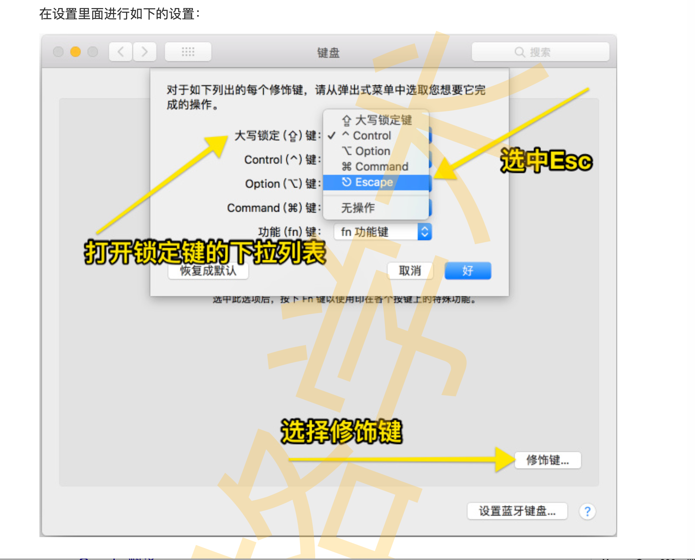
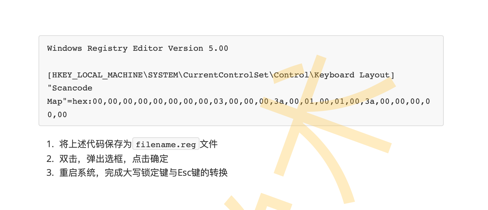
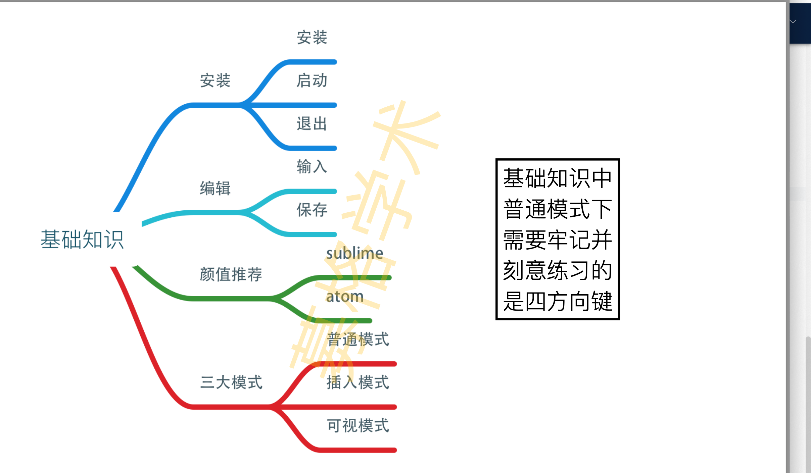
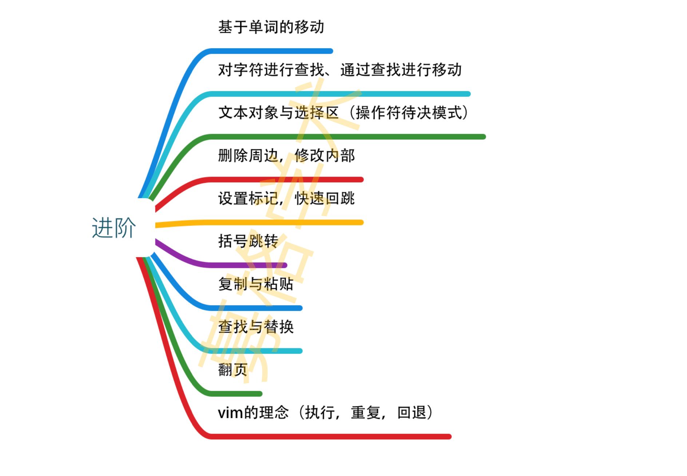
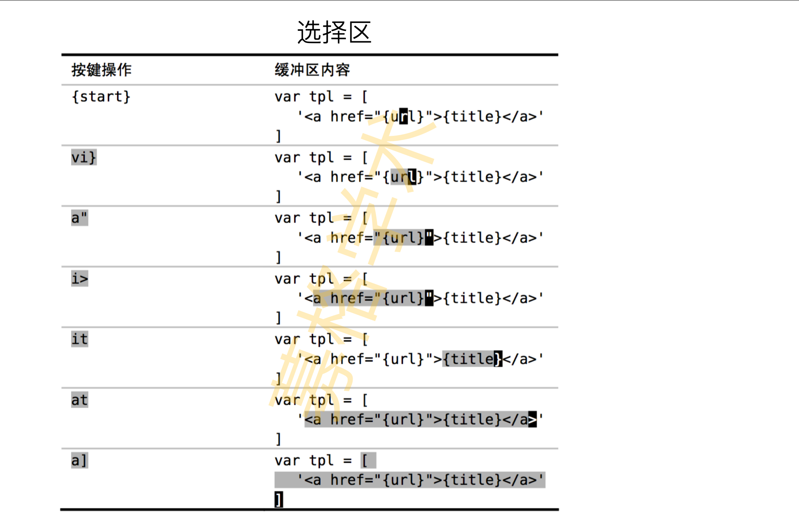
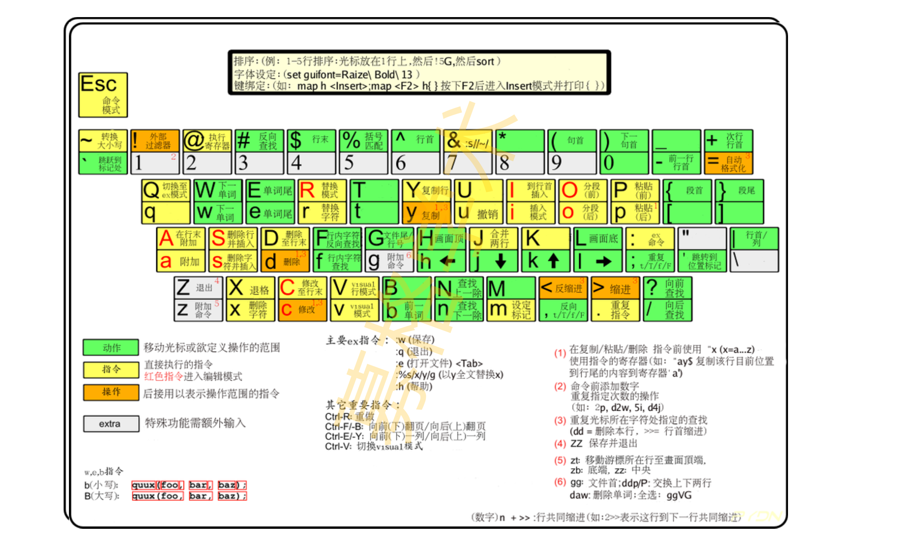

# Vim 从入门到精通

**Vim 的效率不来自背下几百个快捷键，而来自一条语法：`[次数] 操作符 {动作}`。** 十来个操作符配上二三十个动作，就能组合出上千种编辑动作——记的是语法，不是词汇表。本文按这条主线组织：先跑起来，再学语法，最后填词汇。

> **配套阅读**：[配置好终端，提高编码效率](../config-terminal/配置终端提高编码效率.md) · [配置 GoLand 提高编码效率](../config-goland/配置goland提高编码效率.md)

## 目录

- [1 开始之前](#1-开始之前)
  - [1.1 三个前提](#11-三个前提)
  - [1.2 把 Caps Lock 映射成 Esc](#12-把-caps-lock-映射成-esc)
- [2 五分钟跑起来](#2-五分钟跑起来)
  - [2.1 安装](#21-安装)
  - [2.2 启动与退出](#22-启动与退出)
  - [2.3 三种模式](#23-三种模式)
- [3 核心语法：操作符 × 动作](#3-核心语法操作符--动作)
  - [3.1 组合公式](#31-组合公式)
  - [3.2 计数前缀](#32-计数前缀)
- [4 动作：把光标送到目标](#4-动作把光标送到目标)
  - [4.1 行内移动](#41-行内移动)
  - [4.2 单词移动](#42-单词移动)
  - [4.3 字符查找移动](#43-字符查找移动)
  - [4.4 文件级移动与翻页](#44-文件级移动与翻页)
  - [4.5 括号跳转与标记](#45-括号跳转与标记)
- [5 文本对象：不用管光标在哪](#5-文本对象不用管光标在哪)
  - [5.1 i 与 a 的区别](#51-i-与-a-的区别)
  - [5.2 分隔符文本对象](#52-分隔符文本对象)
  - [5.3 范围文本对象](#53-范围文本对象)
- [6 编辑与撤销](#6-编辑与撤销)
  - [6.1 复制、粘贴、删除](#61-复制粘贴删除)
  - [6.2 撤销与重做](#62-撤销与重做)
  - [6.3 点命令：Vim 最高杠杆的一个键](#63-点命令vim-最高杠杆的一个键)
  - [6.4 查找与替换](#64-查找与替换)
- [7 进阶](#7-进阶)
  - [7.1 可视模式](#71-可视模式)
  - [7.2 宏：把一串操作录下来重放](#72-宏把一串操作录下来重放)
- [8 在 IDE 里用 Vim 键位](#8-在-ide-里用-vim-键位)
- [9 练习路径](#9-练习路径)
- [10 速查表](#10-速查表)

---

## 1 开始之前

### 1.1 三个前提

| 前提 | 说明 |
|---|---|
| **二八定则** | 用 20% 的时间学最常用的 80% 功能。本文覆盖的就是这 20% |
| **不用鼠标** | 手离开主键区去摸鼠标是最大的速度损失。练习期间强制自己不用 |
| **刻意练习** | 得不到重复的技能一定会遗忘。学完立刻在真实项目里用，别只在教程里练 |

**终极目标**：编辑速度跟上思考速度——想到"把这个函数参数换掉"的同时手已经敲完 `ci(`。

### 1.2 把 Caps Lock 映射成 Esc

Vim 里 `Esc` 是回到普通模式的唯一出路，是全键盘按得最频繁的键之一，但它在键盘左上角，够起来很别扭。**把几乎用不到的 `Caps Lock` 映射成 `Esc`，是投入产出比最高的一次性配置**——不改变你其他任何使用习惯。

**macOS**：`系统设置 → 键盘 → 键盘快捷键 → 修饰键`，把 `Caps Lock` 改为 `Escape`。



**Windows**：用 PowerToys 的 Keyboard Manager 重映射，或改注册表。



> 另一个不改系统配置的办法：在普通模式下 `Ctrl+[` 等价于 `Esc`，这是终端时代留下的等价键，任何平台都可用。

---

## 2 五分钟跑起来

### 2.1 安装

| 平台 | 命令 / 方式 |
|---|---|
| macOS | `brew install vim`（终端版）或 `brew install --cask macvim`（GUI 版） |
| Ubuntu / Debian | `sudo apt install vim` |
| CentOS / RHEL | `sudo yum install vim` |
| Windows | 从 [vim.org](https://www.vim.org/download.php) 下载安装包，或 `winget install vim.vim` |

macOS 和多数 Linux 自带 `vi`（功能受限的老版本），装 `vim` 才有本文用到的完整功能。验证：

```bash
vim --version | head -1
# VIM - Vi IMproved 9.1 ...
```

### 2.2 启动与退出

```bash
vim file.txt        # 打开文件（不存在则新建）
vim +42 file.txt    # 打开并跳到第 42 行
vim                 # 空启动
```

**退出必须先回到普通模式**（按 `Esc`），再输入以下命令之一。新手最常见的卡死就是在插入模式里敲 `:wq`，结果把它当文本输入了。

| 命令 | 作用 |
|---|---|
| `:w` | 保存，不退出 |
| `:q` | 退出（**有未保存改动时会拒绝**） |
| `:wq` 或 `:x` | 保存并退出 |
| `:q!` | **丢弃改动**强制退出 |
| `ZZ` | 等价于 `:wq`，普通模式直接按，不用输冒号 |

> macOS 上用 Homebrew 装的 vim 需要在终端里敲命令启动；MacVim 和 Windows 版可以双击图标打开。

### 2.3 三种模式

**模式是 Vim 与其他编辑器最根本的区别**：同一个按键在不同模式下含义完全不同。`j` 在插入模式是输入字母 j，在普通模式是光标下移。

| 模式 | 怎么进入 | 用来做什么 |
|---|---|---|
| **普通模式** | `Esc`（任何模式下） | 移动、删除、复制——**默认停留的模式** |
| **插入模式** | `i` `a` `o` `c` 等 | 输入文本 |
| **可视模式** | `v` / `V` / `Ctrl+V` | 选中一块区域再操作 |

进入插入模式的键不止一个，选对了能省一次移动：

| 键 | 进入插入模式并… |
|---|---|
| `i` / `a` | 在光标**前** / **后**插入 |
| `I` / `A` | 跳到**行首非空字符** / **行尾**再插入 |
| `o` / `O` | 在**下方** / **上方**新开一行 |

> **可视模式的三个变体**：`v` 字符可视、`V` 行可视、`Ctrl+V` 块可视。块可视用于多行同列编辑（如给连续几行统一加前缀）。注意是 `Ctrl+V`，不是 `Cmd+V`；Windows 上若 `Ctrl+V` 被"粘贴"占用，改用 `Ctrl+Q`。



---

## 3 核心语法：操作符 × 动作

### 3.1 组合公式

**这一节是全文的核心。** Vim 的编辑命令不是一个个孤立的快捷键，而是一门语法：

```text
[次数] 操作符 {动作或文本对象}
   3       d          w        →  删除 3 个单词
```

**操作符**（做什么）：

| 操作符 | 含义 | 作用于整行的双写形式 |
|---|---|---|
| `d` | 删除（delete） | `dd` 删一行 |
| `c` | 修改（change）——删除后进入插入模式 | `cc` 改一行 |
| `y` | 复制（yank） | `yy` 复制一行 |
| `>` / `<` | 增加 / 减少缩进 | `>>` / `<<` |
| `v` | 选中（进入可视模式） | — |

**动作**（作用到哪）：就是第 4 章的移动命令和第 5 章的文本对象。

任意操作符 × 任意动作都能组合，这才是 Vim 的威力所在。以下组合均在 Vim 9.1 上实测：

| 你想做的事 | 按键 | 效果 |
|---|---|---|
| 改掉光标所在的单词 | `ciw` | `alpha beta` → `NEW beta` |
| 改掉引号里的内容 | `ci"` | `say "hello" now` → `say "NEW" now` |
| 删掉括号连同括号本身 | `da)` | `f(a, b) end` → `f end` |
| 复制花括号内的内容 | `yi{` | 复制 `{...}` 里的正文 |
| 删到行尾 | `D`（= `d$`） | `hello world` → 空行 |
| 删除两个单词 | `d2w` | `one two three` → `three` |

**不用背这张表**——记住 `d`/`c`/`y` 三个操作符，再记住第 4、5 章的动作，组合是自然发生的。

### 3.2 计数前缀

几乎所有命令前面都能加数字，表示"重复几次"：

| 按键 | 效果 |
|---|---|
| `3dd` | 删除 3 行（实测 `l1 l2 l3 l4` → `l4`） |
| `2w` | 向前跳 2 个单词 |
| `5j` | 下移 5 行 |
| `d2w` | 删除 2 个单词 |



---

## 4 动作：把光标送到目标

### 4.1 行内移动

| 命令 | 光标动作 |
|---|---|
| `0` | 跳到**第 0 列**（含行首空白） |
| `^` | 跳到**第一个非空白字符** |
| `$` | 跳到行尾 |

`0` 和 `^` 的区别在有缩进时才显现：对 `   hello`（前面三个空格），`0` 停在第一个空格上，`^` 停在 `h` 上。写代码时基本只用 `^`。

### 4.2 单词移动

| 命令 | 光标动作 |
|---|---|
| `w` | 正向移动到下一单词的开头 |
| `b` | 反向移动到当前/上一单词的开头 |
| `e` | 正向移动到当前/下一单词的结尾 |
| `ge` | 反向移动到上一单词的结尾 |

大写形式 `W` `B` `E` 按**空格分隔**的字串移动，忽略标点。`foo.bar` 用 `w` 要跳 3 次（`foo`、`.`、`bar`），用 `W` 一次跳过。

### 4.3 字符查找移动

| 命令 | 用途 |
|---|---|
| `f{char}` | 正向移动到下一个 `{char}` **所在之处** |
| `F{char}` | 反向移动到上一个 `{char}` 所在之处 |
| `t{char}` | 正向移动到下一个 `{char}` **的前一个字符** |
| `T{char}` | 反向移动到上一个 `{char}` 的后一个字符 |
| `;` | 重复上次的字符查找 |
| `,` | 反向重复上次的字符查找 |

`f` 和 `t` 的差别在配合操作符时最明显（实测，原文 `foo bar boo`）：

| 按键 | 结果 | 说明 |
|---|---|---|
| `dfo` | `o bar boo` | 删到 `o` **并包含**它 |
| `dto` | `oo bar boo` | 删到 `o` **之前**停住 |

### 4.4 文件级移动与翻页

| 命令 | 光标动作 |
|---|---|
| `gg` | 跳到文件第一行 |
| `G` | 跳到文件最后一行 |
| `{n}G` 或 `:{n}` | 跳到第 n 行 |
| `Ctrl+F` / `Ctrl+B` | 下翻 / 上翻一页 |
| `Ctrl+D` / `Ctrl+U` | 下翻 / 上翻半页 |

### 4.5 括号跳转与标记

`%` 在配对的括号之间跳转，支持 `()` `[]` `{}`。它同样能配合操作符——实测 `d%` 对 `(abc)def` 的结果是 `def`，整对括号连同内容一起删掉。读代码时用它确认一个块从哪到哪最快。

**标记**用于在文件里打点后快速跳回：

| 命令 | 作用 |
|---|---|
| `m{a-z}` | 在当前位置设一个标记（如 `ma`） |
| `` `{mark} `` | 跳回标记的**精确位置** |
| `'{mark}` | 跳回标记所在**行的行首** |
| `` `` `` | 跳回上一次跳转前的位置 |

---

## 5 文本对象：不用管光标在哪

普通动作是"从光标到某处"，**文本对象是"这一整块"**——光标只要在块内任意位置就行，不必先移到边界。这是 Vim 比其他编辑器省操作的关键。

### 5.1 i 与 a 的区别

- **`i`** = **in**ner，符号**内部**的内容，不含符号本身
- **`a`** = **a**round，**包含**符号（括号、引号等）在内

对 `f(a, b)`，光标在括号内任意处：`di(` 得到 `f()`，`da(` 得到 `f`。



### 5.2 分隔符文本对象

| 符号 | 内部（`i`） | 包含符号（`a`） |
|---|---|---|
| 圆括号 `()` | `i)` 或 `ib` | `a)` 或 `ab` |
| 花括号 `{}` | `i}` 或 `iB` | `a}` 或 `aB` |
| 方括号 `[]` | `i]` | `a]` |
| 尖括号 `<>` | `i>` | `a>` |
| 单引号 `'` | `i'` | `a'` |
| 双引号 `"` | `i"` | `a"` |
| 反引号 `` ` `` | ``i` `` | ``a` `` |
| XML/HTML 标签 | `it` | `at` |

### 5.3 范围文本对象

| 命令 | 选择范围 |
|---|---|
| `iw` | 当前单词 |
| `aw` | 当前单词及一个空格 |
| `iW` | 当前字串（空格分隔，忽略标点） |
| `aW` | 当前字串及一个空格 |
| `is` / `as` | 当前句子 / 句子及一个空格 |
| `ip` | 当前段落 |
| `ap` | 当前段落及一个空行 |

> 实测对照：对 `alpha beta\n\ngamma delta`，`dap` 删掉整段连同空行只剩 `gamma delta`；`diw` 只删掉 `alpha` 一个单词。

---

## 6 编辑与撤销

### 6.1 复制、粘贴、删除

| 命令 | 作用 |
|---|---|
| `y{motion}` | 复制 |
| `yy` | 复制当前行 |
| `p` / `P` | 粘贴到光标**后** / **前** |
| `d{motion}` | 删除（内容进入寄存器，等同"剪切"） |
| `x` | 删除光标处一个字符 |
| `D` | 删到行尾（= `d$`） |

> Vim 的"删除"其实是剪切——`dd` 之后可以直接 `p` 粘出来。真正的黑洞删除要用 `"_d`。

### 6.2 撤销与重做

| 命令 | 作用 |
|---|---|
| `u` | 撤销上一次修改 |
| `Ctrl+R` | 重做（撤销"撤销"） |
| `U` | 撤销对当前行的所有修改 |

### 6.3 点命令：Vim 最高杠杆的一个键

**`.` 重复上一次修改。** 这是 Vim 里性价比最高的单个按键，也是最容易被教程漏掉的。

实测：对 `abcdef` 按 `x..`（删一个字符，再重复两次）得到 `def`。

真正的用法是配合查找形成"改一处 → 找下一处 → 一键重复"的节奏：

```text
ciwNEW <Esc>     改掉当前单词
n                跳到下一个匹配
.                原样再改一次
```

这套组合能替代大部分"批量替换但要逐个确认"的场景，而且比 `:%s` 更灵活——你随时可以跳过某一处。

### 6.4 查找与替换

**查找**：

| 命令 | 作用 |
|---|---|
| `/{pattern}` | 正向查找 |
| `?{pattern}` | 反向查找 |
| `n` / `N` | 跳到下一个 / 上一个匹配 |
| `*` | 查找光标下的单词 |

**替换**用的是 Ex 命令，**以冒号开头**：

```vim
:%s/old/new/g       " 全文替换所有匹配
:%s/old/new/gc      " 加 c 标志，逐个确认
:s/old/new/g        " 只替换当前行
:10,20s/old/new/g   " 只替换 10 到 20 行
```

| 部件 | 含义 |
|---|---|
| `%` | 范围：整个文件（省略则只作用于当前行） |
| `s` | substitute |
| `g` | 标志：一行内替换**所有**匹配（不加则每行只换第一个） |
| `c` | 标志：每处替换前**要求确认** |

实测：对 `foo foo` 执行 `:%s/foo/bar/g` 得到 `bar bar`；不加 `g` 只得到 `bar foo`。

> ⚠️ 开头是**冒号 `:`** 不是斜杠。写成 `/%s/old/new/g` 会变成"查找字面量 `%s/old/new/g`"，什么也替换不了。

---

## 7 进阶

### 7.1 可视模式

先选中、再操作，适合"边界不好用动作描述"的场景。

| 命令 | 作用 |
|---|---|
| `v` | 字符可视模式 |
| `V` | 行可视模式 |
| `Ctrl+V` | 块可视模式（多行同列） |
| `gv` | 重新选中上次的选区 |

选中后可直接接 `d` `y` `c` `>` `<` 等操作符。

**块可视模式的典型用法**——给连续多行统一加注释前缀：`Ctrl+V` 选中多行的第一列 → `I` → 输入 `// ` → `Esc`，前缀会出现在所有选中行上。

### 7.2 宏：把一串操作录下来重放

当一个改动要在多个地方重复、而 `.` 不够用（改动包含多步）时，用宏。

| 命令 | 作用 |
|---|---|
| `q{a-z}` | 开始录制到寄存器（如 `qa`） |
| `q` | 停止录制 |
| `@{a-z}` | 回放（如 `@a`） |
| `@@` | 重放上一次回放的宏 |
| `{n}@{a-z}` | 回放 n 次（如 `10@a`） |

录制时的关键是**让宏结束在"可以直接对下一个目标重放"的位置上**——通常最后一步是 `j` 或 `n`。

---

## 8 在 IDE 里用 Vim 键位

日常写代码不一定要用 Vim 本体。主流 IDE 都有成熟的 Vim 模拟插件，能在保留 IDE 的补全、调试、重构能力的同时用上 Vim 的编辑语法：

| 环境 | 插件 | 说明 |
|---|---|---|
| JetBrains 系（GoLand / IDEA） | **IdeaVim** | 官方维护，支持 `.ideavimrc`。配置见 [配置 GoLand 提高编码效率](../config-goland/配置goland提高编码效率.md) |
| VS Code | **VSCodeVim** | 支持文本对象、宏、多数 Ex 命令 |
| 终端里的命令行编辑 | zsh 的 vi 模式 | `bindkey -v`。但终端行编辑用 Emacs 键位（默认）通常更顺手，见 [终端配置 §3.1](../config-terminal/配置终端提高编码效率.md#31-行编辑快捷键) |

**建议的过渡路径**：先在 IDE 里开 Vim 模拟插件，用真实项目练本文的语法；等手指形成肌肉记忆后，再决定要不要转向 Vim 本体。直接从本体开始的劝退率很高。

---

## 9 练习路径

Vim 的学习曲线集中在头两周，过了就是净赚。建议按下面的顺序推进，**每个阶段都在真实文件里练，不要只在教程里练**。

| 阶段 | 目标 | 判断标准 |
|---|---|---|
| 第 1 天 | 模式切换 + 退出 | 不再需要搜"怎么退出 vim" |
| 第 2–3 天 | `h j k l` 和 `w b e`，**禁用方向键** | 手不离开主键区 |
| 第 1 周 | 操作符 × 动作组合、`ciw` / `ci"` / `da)` | 遇到"改这个单词"时下意识按 `ciw` |
| 第 2 周 | `.` 命令、`f` / `t` / `;`、`/` 查找 | 开始用"改一处 + `n` + `.`"的节奏 |
| 第 1 个月 | 标记、宏、可视块 | 遇到重复劳动会想到录宏 |

系统自带的交互式教程是最好的起点，30 分钟走一遍：

```bash
vimtutor        # 英文
vimtutor zh     # 中文（部分系统需另装语言包）
```



---

## 10 速查表

**移动**

| 键 | 作用 | 键 | 作用 |
|---|---|---|---|
| `h` `j` `k` `l` | 左 下 上 右 | `gg` / `G` | 文件首 / 尾 |
| `0` / `^` / `$` | 行首 / 首个非空 / 行尾 | `Ctrl+F` / `Ctrl+B` | 翻页 |
| `w` / `b` / `e` | 词首 / 词尾反向 / 词尾 | `Ctrl+D` / `Ctrl+U` | 翻半页 |
| `f{c}` / `t{c}` | 跳到 / 跳到前一个字符 | `%` | 括号配对跳转 |
| `;` / `,` | 重复 / 反向重复查找 | `` m{a} `` / `` `{a} `` | 设标记 / 回标记 |

**编辑**

| 键 | 作用 | 键 | 作用 |
|---|---|---|---|
| `i` `a` `o` | 进入插入模式 | `u` / `Ctrl+R` | 撤销 / 重做 |
| `I` `A` `O` | 行首 / 行尾 / 上方插入 | `.` | **重复上次修改** |
| `d` `c` `y` | 删除 / 修改 / 复制 | `p` / `P` | 粘贴到后 / 前 |
| `dd` `cc` `yy` | 作用于整行 | `x` / `D` | 删字符 / 删到行尾 |

**文本对象**（配合 `d` `c` `y` `v` 使用）

| 键 | 范围 | 键 | 范围 |
|---|---|---|---|
| `iw` / `aw` | 单词 / 单词加空格 | `i(` / `a(` | 圆括号内 / 含括号 |
| `ip` / `ap` | 段落 / 段落加空行 | `i"` / `a"` | 双引号内 / 含引号 |
| `it` / `at` | 标签内 / 含标签 | `i{` / `a{` | 花括号内 / 含括号 |

**Ex 命令**

| 命令 | 作用 |
|---|---|
| `:w` / `:wq` / `:q!` | 保存 / 保存退出 / 强制退出 |
| `:%s/old/new/g` | 全文替换 |
| `:%s/old/new/gc` | 全文替换，逐个确认 |
| `:{n}` | 跳到第 n 行 |

---

> **维护约定**：每半年复查一次；Vim 大版本升级、IDE 插件更名或停止维护、有人反馈"照做失败"时及时更新。

<details>
<summary><b>校验记录</b>（逐条列出结论的取证方式与未实测项，供维护者核对）</summary>

**2026-09-09 全文重写**。原文为无标题、无表格语法的速记稿，含 4 处事实错误。本次重写在本机 **Vim 9.1（2024 Jan 02, 编译于 Oct 30 2025）** 上实测了以下行为，均以 `vim -Es -c 'normal! …' -c 'wq'` 非交互执行后比对文件内容：

- 操作符 × 文本对象：`ciw`（`alpha beta` → `NEW beta`）、`ci"`（`say "hello" now` → `say "NEW" now`）、`da)`（`f(a, b) end` → `f end`）、`yi{P`（`{body}` → `{bodybody}`）。
- 计数前缀：`gg3dd`（`l1 l2 l3 l4` → `l4`）、`d2w`（`one two three` → `three`）、`Gdd`（删末行）。
- 行内定位：`$x`、`^x`、`0x` 在 `   hello` 上的差异确认 `0` 与 `^` 不等价；`D` 删到行尾。
- 字符查找：`dfo`（`foo bar boo` → `o bar boo`）与 `dto`（→ `oo bar boo`）确认 f/t 的包含差异。
- 括号跳转：`d%`（`(abc)def` → `def`）。
- 范围文本对象：`dap` 删段落连同空行；`diw` 只删单词——据此修正了原文将 `iw` 标为"当前段落及一个空行"的错误（正确为 `ap`）。
- 替换命令：`:%s/foo/bar/g` 得 `bar bar`，去掉 `g` 只得 `bar foo`——据此修正原文的 `/%s/{pattern}/{string}/g`（斜杠开头是查找，不是替换）。
- 点命令：`x..` 对 `abcdef` 得 `def`。
- 标记：`ma` 设标记、`` `a `` 回跳，配合 `G dd P` 验证位置正确。

**未实测项**：宏的录制与回放（`qa…q` / `@a`）在 `vim -Es` 的 `normal!` 上下文中无法可靠复现（寄存器在同一次 `normal!` 内不生效），第 7.2 节内容依据 Vim 官方文档撰写，未经本机脚本验证；`u` / `Ctrl+R` 同理（`normal!` 将整次调用视为单个撤销块）。各平台安装命令、IDE 插件行为、`vimtutor zh` 的语言包可用性均未逐项实测。

**其他修正**：`command+v 进入块可视模式` 改为 `Ctrl+V`（并补充 Windows 上 `Ctrl+Q` 的替代）；"一个方法：可以联系"改为"刻意练习"。原第 151–176 行的 Sublime Text 章节已移除并替换为第 8 章——原内容指向 Sublime Text 3 下载页（4 已于 2021 年发布）、推荐 Atom（GitHub 已于 2022 年 12 月停止维护），且与本文主题不符。图片路径由 URL 编码的 `images%2F` 改为 `images/`，并补齐 alt 文本。

</details>

> **相关阅读**：[配置好终端，提高编码效率](../config-terminal/配置终端提高编码效率.md) · [配置 GoLand 提高编码效率](../config-goland/配置goland提高编码效率.md)
